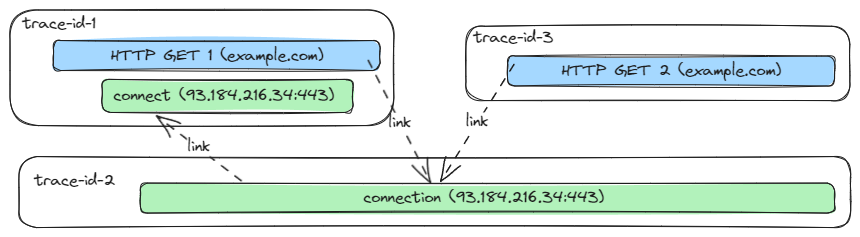

<!--- Hugo front matter used to generate the website version of this page:
linkTitle: Connection Spans
--->

# Semantic Conventions for Connection Spans

This document defines semantic conventions to apply when instrumenting client side of socket connections with spans.

**Status**: [Experimental][DocumentStatus]

<!-- Re-generate TOC with `markdown-toc --no-first-h1 -i` -->

<!-- toc -->

- [Span name](#span-name)
- [Attributes](#attributes)
- [Examples](#examples)
  * [Successful connection](#successful-connection)
  * [Successful connect, but connection terminates with an error](#successful-connect-but-connection-terminates-with-an-error)
  * [Can't establish connection](#cant-establish-connection)
  * [Relationship with application protocols such as HTTP](#relationship-with-application-protocols-such-as-http)
  * [Connection retry example](#connection-retry-example)

<!-- tocstop -->

this convention defines two types of spans:

- `connect` span: describes the process of establishing a connection. It corresponds to `connect` function ([Linux or other POSIX systems](https://man7.org/linux/man-pages/man2/connect.2.html) /
[Windows](https://docs.microsoft.com/windows/win32/api/winsock2/nf-winsock2-connect)).
- `connection` span: describes the connection lifetime: it starts right after the connection is successfully established and ends when connection terminates.

If `connect` spans ends with an error (connection cannot be established), `connection` span SHOULD NOT be created.

If connection can be reused in multiple independent operations, instrumentation SHOULD create `connection` span as a root span in a new trace. The `connection` span should link to the `connect` span. This allows to avoid associating long-lived connection span with a trace which coincidentally started it.

Both spans SHOULD be of a `CLIENT` kind.

## Span name

The **span names** SHOULD match `connect` or `connection` depending on the span type.

## Attributes

The `connect` and `connection` span share the same list of attributes:

<!-- semconv span_attributes.connection.client(full) -->
| Attribute  | Type | Description  | Examples  | Requirement Level |
|---|---|---|---|---|
| [`error.type`](../attributes-registry/error.md) | string | Describes a class of error the operation ended with. [1] | `econnreset`; `econnrefused`; `address_family_not_supported`; `java.net.SocketException` | Conditionally Required: [2] |
| [`network.local.port`](../attributes-registry/network.md) | int | Local port number of the network connection. | `65123` | Recommended |
| [`network.peer.address`](../attributes-registry/network.md) | string | Peer address of the network connection - IP address or Unix domain socket name. | `10.1.2.80`; `/tmp/my.sock` | Required |
| [`network.peer.port`](../attributes-registry/network.md) | int | Peer port number of the network connection. | `65123` | Conditionally Required: when applicable |
| [`network.transport`](../attributes-registry/network.md) | string | [OSI transport layer](https://osi-model.com/transport-layer/) or [inter-process communication method](https://wikipedia.org/wiki/Inter-process_communication). [3] | `tcp`; `udp` | Recommended |
| [`network.type`](../attributes-registry/network.md) | string | [OSI network layer](https://osi-model.com/network-layer/) or non-OSI equivalent. [4] | `ipv4`; `ipv6` | Recommended |
| [`server.address`](../attributes-registry/server.md) | string | Server domain name if available without reverse DNS lookup; otherwise, IP address or Unix domain socket name. [5] | `example.com`; `10.1.2.80`; `/tmp/my.sock` | Conditionally Required: if available without reverse DNS lookup |

**[1]:** It's REQUIRED to document error types instrumentation produces. It's RECOMMENDED to use error codes provided by the socket library, runtime, or the OS (such as `connect` method error codes on [Linux or other POSIX systems](https://man7.org/linux/man-pages/man2/connect.2.html#ERRORS) or [Windows](https://docs.microsoft.com/windows/win32/api/winsock2/nf-winsock2-connect#return-value)).

**[2]:** If and only if a connection (attempt) ended with an error.

**[3]:** The value SHOULD be normalized to lowercase.

Consider always setting the transport when setting a port number, since
a port number is ambiguous without knowing the transport. For example
different processes could be listening on TCP port 12345 and UDP port 12345.

**[4]:** The value SHOULD be normalized to lowercase.

**[5]:** When observed from the client side, and when communicating through an intermediary, `server.address` SHOULD represent the server address behind any intermediaries, for example proxies, if it's available.

`error.type` has the following list of well-known values. If one of them applies, then the respective value MUST be used, otherwise a custom value MAY be used.

| Value  | Description |
|---|---|
| `_OTHER` | A fallback error value to be used when the instrumentation doesn't define a custom value. |

`network.transport` has the following list of well-known values. If one of them applies, then the respective value MUST be used, otherwise a custom value MAY be used.

| Value  | Description |
|---|---|
| `tcp` | TCP |
| `udp` | UDP |
| `pipe` | Named or anonymous pipe. |
| `unix` | Unix domain socket |

`network.type` has the following list of well-known values. If one of them applies, then the respective value MUST be used, otherwise a custom value MAY be used.

| Value  | Description |
|---|---|
| `ipv4` | IPv4 |
| `ipv6` | IPv6 |
<!-- endsemconv -->

## Examples

### Successful connection

Successful connection attempt to `"/tmp/my.sock"` results in the following span:

|   Attribute name       |         Value       |
| :--------------------- | :-------------------|
| name                   | `"connect"`         |
| `network.peer.address` | `"/tmp/my.sock"`    |
| `network.transport`    | `"unix"`            |

Once corresponding connection is gracefully closed, another span is reported:

|   Attribute name       |         Value       |
| :--------------------- | :-------------------|
| name                   | `"connection"`      |
| `network.peer.address` | `"/tmp/my.sock"`    |
| `network.transport`    | `"unix"`            |

### Successful connect, but connection terminates with an error

Successful connection attempt to `example.com` results in the following span:
> Note: DNS lookup is outside of the scope of this semantic convention

|   Attribute name       |         Value       |
| :--------------------- | :-------------------|
| name                   | `"connect"`         |
| `server.address`       | `"example.com"`     |
| `network.peer.address` | `"93.184.216.34"`   |
| `network.peer.port`    | `443`               |
| `network.transport`    | `"tcp"`             |
| `network.transport`    | `"ipv4"`            |

But then after some packet exchange, the connection is reset:

|   Attribute name       |         Value       |
| :--------------------- | :-------------------|
| name                   | `"connection"`      |
| `server.address`       | `"example.com"`     |
| `network.peer.address` | `"93.184.216.34"`   |
| `network.peer.port`    | `443`               |
| `network.transport`    | `"tcp"`             |
| `network.transport`    | `"ipv4"`            |
| `error.type`           | `econnreset`        |

### Attempt to establish connection ends with `econnrefused` error

An attempt to establish connection to `127.0.0.1:8080` without any application
listening on this port results in the following span:

|   Attribute name       |         Value       |
| :--------------------- | :-------------------|
| name                   | `"connect"`         |
| `network.peer.address` | `"127.0.0.1"`   |
| `network.peer.port`    | `8080`               |
| `network.transport`    | `"tcp"`             |
| `network.type`         | `"ipv4"`            |
| `error.type`           | `econnrefused`      |

### Relationship with application protocols such as HTTP

It could be impossible to record any relationships between HTTP spans and connection-level spans when connections are pooled and reused.

The following picture demonstrates an ideal example when recording such relationships (via span links) is possible.



### Connection retry example

Example of retries when attempting to connect

```
HTTP request attempt 1 (trace=t1, span=s1)
  |
  -- domain name resolution (not covered here)
  |
  -- connect(127.0.0.1:8080) - timeout (trace=t1, span=s2, error.type=timeout)
  |
HTTP request attempt 2 (trace=t1, span=s3)
  |
  -- connect(127.0.0.1:8080) - (trace=t1, span=s3)

connection(127.0.0.1:8080) - (trace=t2, span=s4, link=t1:s3)
```

[DocumentStatus]: https://github.com/open-telemetry/opentelemetry-specification/tree/v1.26.0/specification/document-status.md
