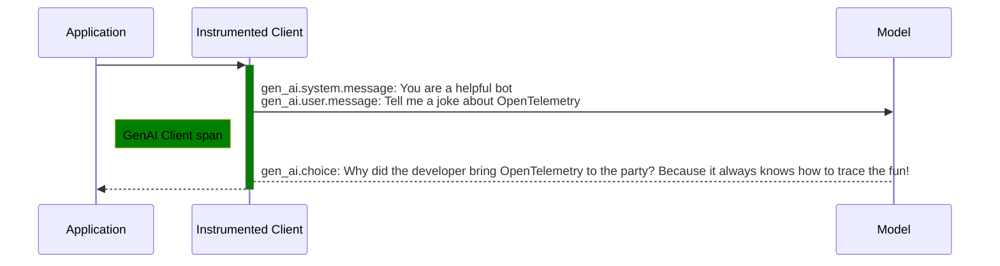
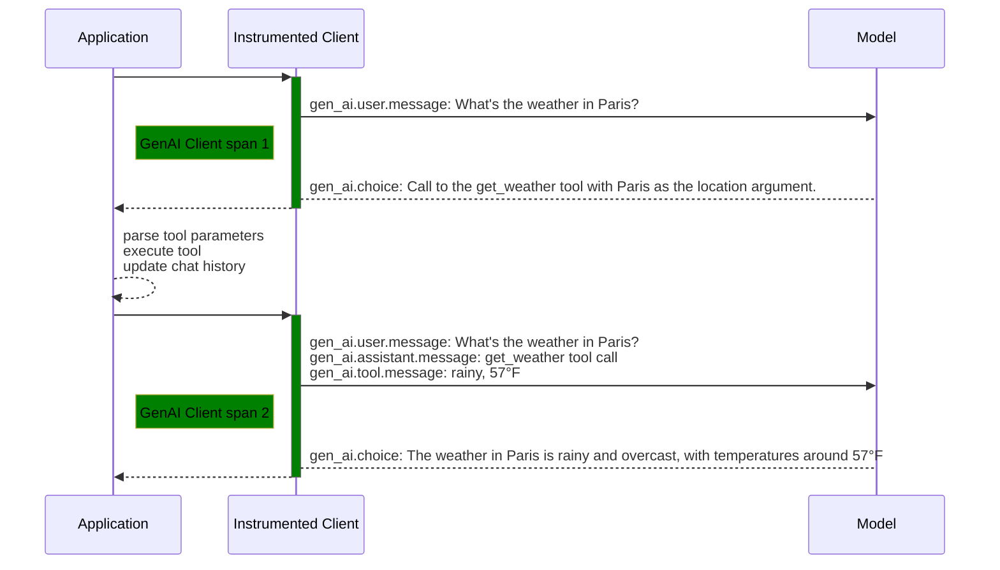
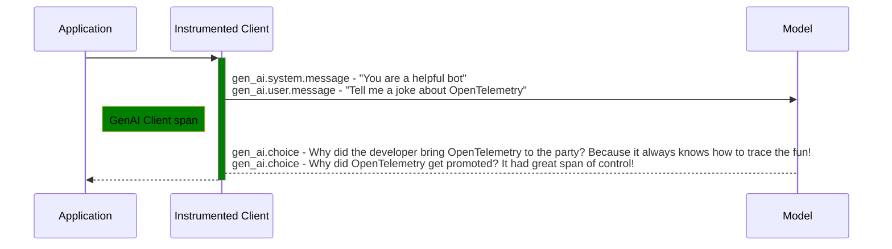

<!--- Hugo front matter used to generate the website version of this page:
linkTitle: Events
--->

# Semantic conventions for Generative AI events

**Status**: [Development][DocumentStatus]

<!-- toc -->

<<<<<<< HEAD
- [Event: `gen_ai.system.message`](#event-gen_aisystemmessage)
- [Event: `gen_ai.user.message`](#event-gen_aiusermessage)
- [Event: `gen_ai.assistant.message`](#event-gen_aiassistantmessage)
- [Event: `gen_ai.tool.message`](#event-gen_aitoolmessage)
- [Event: `gen_ai.choice`](#event-gen_aichoice)
- [Event: `gen_ai.evaluation.result`](#event-gen_aievaluationresult)
- [Custom events](#custom-events)
- [Examples](#examples)
  - [Chat completion](#chat-completion)
  - [Tools](#tools)
  - [Chat completion with multiple choices](#chat-completion-with-multiple-choices)
=======
- [Event: `event.gen_ai.client.inference.operation.details`](#event-eventgen_aiclientinferenceoperationdetails)
>>>>>>> origin/main

<!-- tocstop -->

> [!Warning]
>
> Existing GenAI instrumentations that are using
> [v1.36.0 of this document](https://github.com/open-telemetry/semantic-conventions/blob/v1.36.0/docs/gen-ai/README.md)
> (or prior):
>
> * SHOULD NOT change the version of the GenAI conventions that they emit by default.
>   Conventions include, but are not limited to, attributes, metric, span and event names,
>   span kind and unit of measure.
> * SHOULD introduce an environment variable `OTEL_SEMCONV_STABILITY_OPT_IN`
>   as a comma-separated list of category-specific values. The list of values
>   includes:
>   * `gen_ai_latest_experimental` - emit the latest experimental version of
>     GenAI conventions (supported by the instrumentation) and do not emit the
>     old one (v1.36.0 or prior).
>   * The default behavior is to continue emitting whatever version of the GenAI
>     conventions the instrumentation was emitting (1.36.0 or prior).
>
> This transition plan will be updated to include stable version before the
> GenAI conventions are marked as stable.

GenAI instrumentations MAY capture user inputs sent to the model and responses received from it as [events](https://github.com/open-telemetry/opentelemetry-specification/tree/v1.48.0/specification/logs/data-model.md#events).

> Note:
> Events are in-development and not yet available in some languages. Check [spec-compliance matrix](https://github.com/open-telemetry/opentelemetry-specification/tree/v1.48.0/spec-compliance-matrix.md#logs) to see the implementation status in corresponding language.

## Event: `event.gen_ai.client.inference.operation.details`

<!-- semconv event.gen_ai.client.inference.operation.details -->
<!-- NOTE: THIS TEXT IS AUTOGENERATED. DO NOT EDIT BY HAND. -->
<!-- see templates/registry/markdown/snippet.md.j2 -->
<!-- prettier-ignore-start -->
<!-- markdownlint-capture -->
<!-- markdownlint-disable -->

**Status:** 

The event name MUST be `gen_ai.client.inference.operation.details`.

Describes the details of a GenAI completion request including chat history and parameters.

This event is opt-in and could be used to store input and output details independently from traces.

| Attribute  | Type | Description  | Examples  | [Requirement Level](https://opentelemetry.io/docs/specs/semconv/general/attribute-requirement-level/) | Stability |
|---|---|---|---|---|---|
| [`gen_ai.operation.name`](/docs/registry/attributes/gen-ai.md) | string | The name of the operation being performed. [1] | `chat`; `generate_content`; `text_completion` | `Required` |  |
| [`error.type`](/docs/registry/attributes/error.md) | string | Describes a class of error the operation ended with. [2] | `timeout`; `java.net.UnknownHostException`; `server_certificate_invalid`; `500` | `Conditionally Required` if the operation ended in an error |  |
| [`gen_ai.conversation.id`](/docs/registry/attributes/gen-ai.md) | string | The unique identifier for a conversation (session, thread), used to store and correlate messages within this conversation. [3] | `conv_5j66UpCpwteGg4YSxUnt7lPY` | `Conditionally Required` when available |  |
| [`gen_ai.output.type`](/docs/registry/attributes/gen-ai.md) | string | Represents the content type requested by the client. [4] | `text`; `json`; `image` | `Conditionally Required` [5] |  |
| [`gen_ai.request.choice.count`](/docs/registry/attributes/gen-ai.md) | int | The target number of candidate completions to return. | `3` | `Conditionally Required` if available, in the request, and !=1 |  |
| [`gen_ai.request.model`](/docs/registry/attributes/gen-ai.md) | string | The name of the GenAI model a request is being made to. [6] | `gpt-4` | `Conditionally Required` If available. |  |
| [`gen_ai.request.seed`](/docs/registry/attributes/gen-ai.md) | int | Requests with same seed value more likely to return same result. | `100` | `Conditionally Required` if applicable and if the request includes a seed |  |
| [`server.port`](/docs/registry/attributes/server.md) | int | GenAI server port. [7] | `80`; `8080`; `443` | `Conditionally Required` If `server.address` is set. |  |
| [`gen_ai.request.frequency_penalty`](/docs/registry/attributes/gen-ai.md) | double | The frequency penalty setting for the GenAI request. | `0.1` | `Recommended` |  |
| [`gen_ai.request.max_tokens`](/docs/registry/attributes/gen-ai.md) | int | The maximum number of tokens the model generates for a request. | `100` | `Recommended` |  |
| [`gen_ai.request.presence_penalty`](/docs/registry/attributes/gen-ai.md) | double | The presence penalty setting for the GenAI request. | `0.1` | `Recommended` |  |
| [`gen_ai.request.stop_sequences`](/docs/registry/attributes/gen-ai.md) | string[] | List of sequences that the model will use to stop generating further tokens. | `["forest", "lived"]` | `Recommended` |  |
| [`gen_ai.request.temperature`](/docs/registry/attributes/gen-ai.md) | double | The temperature setting for the GenAI request. | `0.0` | `Recommended` |  |
| [`gen_ai.request.top_p`](/docs/registry/attributes/gen-ai.md) | double | The top_p sampling setting for the GenAI request. | `1.0` | `Recommended` |  |
| [`gen_ai.response.finish_reasons`](/docs/registry/attributes/gen-ai.md) | string[] | Array of reasons the model stopped generating tokens, corresponding to each generation received. | `["stop"]`; `["stop", "length"]` | `Recommended` |  |
| [`gen_ai.response.id`](/docs/registry/attributes/gen-ai.md) | string | The unique identifier for the completion. | `chatcmpl-123` | `Recommended` |  |
| [`gen_ai.response.model`](/docs/registry/attributes/gen-ai.md) | string | The name of the model that generated the response. [8] | `gpt-4-0613` | `Recommended` |  |
| [`gen_ai.usage.input_tokens`](/docs/registry/attributes/gen-ai.md) | int | The number of tokens used in the GenAI input (prompt). | `100` | `Recommended` |  |
| [`gen_ai.usage.output_tokens`](/docs/registry/attributes/gen-ai.md) | int | The number of tokens used in the GenAI response (completion). | `180` | `Recommended` |  |
| [`server.address`](/docs/registry/attributes/server.md) | string | GenAI server address. [9] | `example.com`; `10.1.2.80`; `/tmp/my.sock` | `Recommended` |  |
| [`gen_ai.input.messages`](/docs/registry/attributes/gen-ai.md) | any | The chat history provided to the model as an input. [10] | [ &nbsp;&nbsp;{ &nbsp;&nbsp;&nbsp;&nbsp;"role": "user", &nbsp;&nbsp;&nbsp;&nbsp;"parts": [ &nbsp;&nbsp;&nbsp;&nbsp;&nbsp;&nbsp;{ &nbsp;&nbsp;&nbsp;&nbsp;&nbsp;&nbsp;&nbsp;&nbsp;"type": "text", &nbsp;&nbsp;&nbsp;&nbsp;&nbsp;&nbsp;&nbsp;&nbsp;"content": "Weather in Paris?" &nbsp;&nbsp;&nbsp;&nbsp;&nbsp;&nbsp;} &nbsp;&nbsp;&nbsp;&nbsp;] &nbsp;&nbsp;}, &nbsp;&nbsp;{ &nbsp;&nbsp;&nbsp;&nbsp;"role": "assistant", &nbsp;&nbsp;&nbsp;&nbsp;"parts": [ &nbsp;&nbsp;&nbsp;&nbsp;&nbsp;&nbsp;{ &nbsp;&nbsp;&nbsp;&nbsp;&nbsp;&nbsp;&nbsp;&nbsp;"type": "tool_call", &nbsp;&nbsp;&nbsp;&nbsp;&nbsp;&nbsp;&nbsp;&nbsp;"id": "call_VSPygqKTWdrhaFErNvMV18Yl", &nbsp;&nbsp;&nbsp;&nbsp;&nbsp;&nbsp;&nbsp;&nbsp;"name": "get_weather", &nbsp;&nbsp;&nbsp;&nbsp;&nbsp;&nbsp;&nbsp;&nbsp;"arguments": { &nbsp;&nbsp;&nbsp;&nbsp;&nbsp;&nbsp;&nbsp;&nbsp;&nbsp;&nbsp;"location": "Paris" &nbsp;&nbsp;&nbsp;&nbsp;&nbsp;&nbsp;&nbsp;&nbsp;} &nbsp;&nbsp;&nbsp;&nbsp;&nbsp;&nbsp;} &nbsp;&nbsp;&nbsp;&nbsp;] &nbsp;&nbsp;}, &nbsp;&nbsp;{ &nbsp;&nbsp;&nbsp;&nbsp;"role": "tool", &nbsp;&nbsp;&nbsp;&nbsp;"parts": [ &nbsp;&nbsp;&nbsp;&nbsp;&nbsp;&nbsp;{ &nbsp;&nbsp;&nbsp;&nbsp;&nbsp;&nbsp;&nbsp;&nbsp;"type": "tool_call_response", &nbsp;&nbsp;&nbsp;&nbsp;&nbsp;&nbsp;&nbsp;&nbsp;"id": " call_VSPygqKTWdrhaFErNvMV18Yl", &nbsp;&nbsp;&nbsp;&nbsp;&nbsp;&nbsp;&nbsp;&nbsp;"result": "rainy, 57°F" &nbsp;&nbsp;&nbsp;&nbsp;&nbsp;&nbsp;} &nbsp;&nbsp;&nbsp;&nbsp;] &nbsp;&nbsp;} ] | `Opt-In` |  |
| [`gen_ai.output.messages`](/docs/registry/attributes/gen-ai.md) | any | Messages returned by the model where each message represents a specific model response (choice, candidate). [11] | [ &nbsp;&nbsp;{ &nbsp;&nbsp;&nbsp;&nbsp;"role": "assistant", &nbsp;&nbsp;&nbsp;&nbsp;"parts": [ &nbsp;&nbsp;&nbsp;&nbsp;&nbsp;&nbsp;{ &nbsp;&nbsp;&nbsp;&nbsp;&nbsp;&nbsp;&nbsp;&nbsp;"type": "text", &nbsp;&nbsp;&nbsp;&nbsp;&nbsp;&nbsp;&nbsp;&nbsp;"content": "The weather in Paris is currently rainy with a temperature of 57°F." &nbsp;&nbsp;&nbsp;&nbsp;&nbsp;&nbsp;} &nbsp;&nbsp;&nbsp;&nbsp;], &nbsp;&nbsp;&nbsp;&nbsp;"finish_reason": "stop" &nbsp;&nbsp;} ] | `Opt-In` |  |
| [`gen_ai.system_instructions`](/docs/registry/attributes/gen-ai.md) | any | The system message or instructions provided to the GenAI model separately from the chat history. [12] | [ &nbsp;&nbsp;{ &nbsp;&nbsp;&nbsp;&nbsp;"type": "text", &nbsp;&nbsp;&nbsp;&nbsp;"content": "You are an Agent that greet users, always use greetings tool to respond" &nbsp;&nbsp;} ]; [ &nbsp;&nbsp;{ &nbsp;&nbsp;&nbsp;&nbsp;"type": "text", &nbsp;&nbsp;&nbsp;&nbsp;"content": "You are a language translator." &nbsp;&nbsp;}, &nbsp;&nbsp;{ &nbsp;&nbsp;&nbsp;&nbsp;"type": "text", &nbsp;&nbsp;&nbsp;&nbsp;"content": "Your mission is to translate text in English to French." &nbsp;&nbsp;} ] | `Opt-In` |  |

**[1] `gen_ai.operation.name`:** If one of the predefined values applies, but specific system uses a different name it's RECOMMENDED to document it in the semantic conventions for specific GenAI system and use system-specific name in the instrumentation. If a different name is not documented, instrumentation libraries SHOULD use applicable predefined value.

**[2] `error.type`:** The `error.type` SHOULD match the error code returned by the Generative AI provider or the client library,
the canonical name of exception that occurred, or another low-cardinality error identifier.
Instrumentations SHOULD document the list of errors they report.

**[3] `gen_ai.conversation.id`:** Instrumentations SHOULD populate conversation id when they have it readily available
for a given operation, for example:

-  when client framework being instrumented manages conversation history
(see [LlamaIndex chat store](https://docs.llamaindex.ai/en/stable/module_guides/storing/chat_stores/))

- when instrumenting GenAI client libraries that maintain conversation on the backend side
(see [AWS Bedrock agent sessions](https://docs.aws.amazon.com/bedrock/latest/userguide/agents-session-state.html),
[OpenAI Assistant threads](https://platform.openai.com/docs/api-reference/threads))

Application developers that manage conversation history MAY add conversation id to GenAI and other
spans or logs using custom span or log record processors or hooks provided by instrumentation
libraries.

**[4] `gen_ai.output.type`:** This attribute SHOULD be used when the client requests output of a specific type. The model may return zero or more outputs of this type.
This attribute specifies the output modality and not the actual output format. For example, if an image is requested, the actual output could be a URL pointing to an image file.
Additional output format details may be recorded in the future in the `gen_ai.output.{type}.*` attributes.

**[5] `gen_ai.output.type`:** when applicable and if the request includes an output format.

**[6] `gen_ai.request.model`:** The name of the GenAI model a request is being made to. If the model is supplied by a vendor, then the value must be the exact name of the model requested. If the model is a fine-tuned custom model, the value should have a more specific name than the base model that's been fine-tuned.

**[7] `server.port`:** When observed from the client side, and when communicating through an intermediary, `server.port` SHOULD represent the server port behind any intermediaries, for example proxies, if it's available.

**[8] `gen_ai.response.model`:** If available. The name of the GenAI model that provided the response. If the model is supplied by a vendor, then the value must be the exact name of the model actually used. If the model is a fine-tuned custom model, the value should have a more specific name than the base model that's been fine-tuned.

**[9] `server.address`:** When observed from the client side, and when communicating through an intermediary, `server.address` SHOULD represent the server address behind any intermediaries, for example proxies, if it's available.

**[10] `gen_ai.input.messages`:** Instrumentations MUST follow [Input messages JSON schema](/docs/gen-ai/gen-ai-input-messages.json).
When the attribute is recorded on events, it MUST be recorded in structured
form. When recorded on spans, it MAY be recorded as a JSON string if structured
format is not supported and SHOULD be recorded in structured form otherwise.

Messages MUST be provided in the order they were sent to the model.
Instrumentations MAY provide a way for users to filter or truncate
input messages.

> [!Warning]
> This attribute is likely to contain sensitive information including user/PII data.

See [Recording content on attributes](/docs/gen-ai/gen-ai-spans.md#recording-content-on-attributes)
section for more details.

**[11] `gen_ai.output.messages`:** Instrumentations MUST follow [Output messages JSON schema](/docs/gen-ai/gen-ai-output-messages.json)

Each message represents a single output choice/candidate generated by
the model. Each message corresponds to exactly one generation
(choice/candidate) and vice versa - one choice cannot be split across
multiple messages or one message cannot contain parts from multiple choices.

When the attribute is recorded on events, it MUST be recorded in structured
form. When recorded on spans, it MAY be recorded as a JSON string if structured
format is not supported and SHOULD be recorded in structured form otherwise.

Instrumentations MAY provide a way for users to filter or truncate
output messages.

> [!Warning]
> This attribute is likely to contain sensitive information including user/PII data.

See [Recording content on attributes](/docs/gen-ai/gen-ai-spans.md#recording-content-on-attributes)
section for more details.

**[12] `gen_ai.system_instructions`:** This attribute SHOULD be used when the corresponding provider or API
allows to provide system instructions or messages separately from the
chat history.

Instructions that are part of the chat history SHOULD be recorded in
`gen_ai.input.messages` attribute instead.

Instrumentations MUST follow [System instructions JSON schema](/docs/gen-ai/gen-ai-system-instructions.json).

When recorded on spans, it MAY be recorded as a JSON string if structured
format is not supported and SHOULD be recorded in structured form otherwise.

Instrumentations MAY provide a way for users to filter or truncate
system instructions.

> [!Warning]
> This attribute may contain sensitive information.

See [Recording content on attributes](/docs/gen-ai/gen-ai-spans.md#recording-content-on-attributes)
section for more details.

---

`error.type` has the following list of well-known values. If one of them applies, then the respective value MUST be used; otherwise, a custom value MAY be used.

| Value  | Description | Stability |
|---|---|---|
| `_OTHER` | A fallback error value to be used when the instrumentation doesn't define a custom value. |  |

---

`gen_ai.operation.name` has the following list of well-known values. If one of them applies, then the respective value MUST be used; otherwise, a custom value MAY be used.

| Value  | Description | Stability |
|---|---|---|
| `chat` | Chat completion operation such as [OpenAI Chat API](https://platform.openai.com/docs/api-reference/chat) |  |
| `create_agent` | Create GenAI agent |  |
| `embeddings` | Embeddings operation such as [OpenAI Create embeddings API](https://platform.openai.com/docs/api-reference/embeddings/create) |  |
| `execute_tool` | Execute a tool |  |
| `generate_content` | Multimodal content generation operation such as [Gemini Generate Content](https://ai.google.dev/api/generate-content) |  |
| `invoke_agent` | Invoke GenAI agent |  |
| `text_completion` | Text completions operation such as [OpenAI Completions API (Legacy)](https://platform.openai.com/docs/api-reference/completions) |  |

---

`gen_ai.output.type` has the following list of well-known values. If one of them applies, then the respective value MUST be used; otherwise, a custom value MAY be used.

| Value  | Description | Stability |
|---|---|---|
| `image` | Image |  |
| `json` | JSON object with known or unknown schema |  |
| `speech` | Speech |  |
| `text` | Plain text |  |

<!-- markdownlint-restore -->
<!-- prettier-ignore-end -->
<!-- END AUTOGENERATED TEXT -->
<!-- endsemconv -->

<<<<<<< HEAD
## Event: `gen_ai.user.message`

<!-- semconv event.gen_ai.user.message -->
<!-- NOTE: THIS TEXT IS AUTOGENERATED. DO NOT EDIT BY HAND. -->
<!-- see templates/registry/markdown/snippet.md.j2 -->
<!-- prettier-ignore-start -->
<!-- markdownlint-capture -->
<!-- markdownlint-disable -->

**Status:** 

The event name MUST be `gen_ai.user.message`.

This event describes the user message passed to the GenAI model.

| Attribute  | Type | Description  | Examples  | [Requirement Level](https://opentelemetry.io/docs/specs/semconv/general/attribute-requirement-level/) | Stability |
|---|---|---|---|---|---|
| [`gen_ai.provider.name`](/docs/registry/attributes/gen-ai.md) | string | The Generative AI provider as identified by the client or server instrumentation. [1] | `openai`; `gcp.gen_ai`; `gcp.vertex_ai` | `Recommended` |  |

**[1] `gen_ai.provider.name`:** The attribute SHOULD be set based on the instrumentation's best
knowledge and may differ from the actual model provider.

Multiple providers, including Azure OpenAI, Gemini, and AI hosting platforms
are accessible using the OpenAI REST API and corresponding client libraries,
but may proxy or host models from different providers.

The `gen_ai.request.model`, `gen_ai.response.model`, and `server.address`
attributes may help identify the actual system in use.

The `gen_ai.provider.name` attribute acts as a discriminator that
identifies the GenAI telemetry format flavor specific to that provider
within GenAI semantic conventions.
It SHOULD be set consistently with provider-specific attributes and signals.
For example, GenAI spans, metrics, and events related to AWS Bedrock
should have the `gen_ai.provider.name` set to `aws.bedrock` and include
applicable `aws.bedrock.*` attributes and are not expected to include
`openai.*` attributes.

---

`gen_ai.provider.name` has the following list of well-known values. If one of them applies, then the respective value MUST be used; otherwise, a custom value MAY be used.

| Value  | Description | Stability |
|---|---|---|
| `anthropic` | [Anthropic](https://www.anthropic.com/) |  |
| `aws.bedrock` | [AWS Bedrock](https://aws.amazon.com/bedrock) |  |
| `azure.ai.inference` | Azure AI Inference |  |
| `azure.ai.openai` | [Azure OpenAI](https://azure.microsoft.com/products/ai-services/openai-service/) |  |
| `cohere` | [Cohere](https://cohere.com/) |  |
| `deepseek` | [DeepSeek](https://www.deepseek.com/) |  |
| `gcp.gemini` | [Gemini](https://cloud.google.com/products/gemini) [2] |  |
| `gcp.gen_ai` | Any Google generative AI endpoint [3] |  |
| `gcp.vertex_ai` | [Vertex AI](https://cloud.google.com/vertex-ai) [4] |  |
| `groq` | [Groq](https://groq.com/) |  |
| `ibm.watsonx.ai` | [IBM Watsonx AI](https://www.ibm.com/products/watsonx-ai) |  |
| `mistral_ai` | [Mistral AI](https://mistral.ai/) |  |
| `openai` | [OpenAI](https://openai.com/) |  |
| `perplexity` | [Perplexity](https://www.perplexity.ai/) |  |
| `x_ai` | [xAI](https://x.ai/) |  |

**[2]:** Used when accessing the 'generativelanguage.googleapis.com' endpoint. Also known as the AI Studio API.

**[3]:** May be used when specific backend is unknown.

**[4]:** Used when accessing the 'aiplatform.googleapis.com' endpoint.

**Body fields:**

:warning: Body fields will be moved to complex attributes once the
semantic convention tooling supports complex attributes
(see [#1870](https://github.com/open-telemetry/semantic-conventions/issues/1870)).

| Body Field  | Type | Description  | Examples  | [Requirement Level](https://opentelemetry.io/docs/specs/semconv/general/attribute-requirement-level/) | Stability |
|---|---|---|---|---|---|
| `content` | undefined | The contents of the user message. | `What's the weather in Paris?` | `Opt-In` |  |
| `role` | string | The actual role of the message author as passed in the message. | `user`; `customer` | `Conditionally Required` if available and not equal to `user`. |  |

<!-- markdownlint-restore -->
<!-- prettier-ignore-end -->
<!-- END AUTOGENERATED TEXT -->
<!-- endsemconv -->

## Event: `gen_ai.assistant.message`

<!-- semconv event.gen_ai.assistant.message -->
<!-- NOTE: THIS TEXT IS AUTOGENERATED. DO NOT EDIT BY HAND. -->
<!-- see templates/registry/markdown/snippet.md.j2 -->
<!-- prettier-ignore-start -->
<!-- markdownlint-capture -->
<!-- markdownlint-disable -->

**Status:** 

The event name MUST be `gen_ai.assistant.message`.

This event describes the assistant message passed to GenAI system.

| Attribute  | Type | Description  | Examples  | [Requirement Level](https://opentelemetry.io/docs/specs/semconv/general/attribute-requirement-level/) | Stability |
|---|---|---|---|---|---|
| [`gen_ai.provider.name`](/docs/registry/attributes/gen-ai.md) | string | The Generative AI provider as identified by the client or server instrumentation. [1] | `openai`; `gcp.gen_ai`; `gcp.vertex_ai` | `Recommended` |  |

**[1] `gen_ai.provider.name`:** The attribute SHOULD be set based on the instrumentation's best
knowledge and may differ from the actual model provider.

Multiple providers, including Azure OpenAI, Gemini, and AI hosting platforms
are accessible using the OpenAI REST API and corresponding client libraries,
but may proxy or host models from different providers.

The `gen_ai.request.model`, `gen_ai.response.model`, and `server.address`
attributes may help identify the actual system in use.

The `gen_ai.provider.name` attribute acts as a discriminator that
identifies the GenAI telemetry format flavor specific to that provider
within GenAI semantic conventions.
It SHOULD be set consistently with provider-specific attributes and signals.
For example, GenAI spans, metrics, and events related to AWS Bedrock
should have the `gen_ai.provider.name` set to `aws.bedrock` and include
applicable `aws.bedrock.*` attributes and are not expected to include
`openai.*` attributes.

---

`gen_ai.provider.name` has the following list of well-known values. If one of them applies, then the respective value MUST be used; otherwise, a custom value MAY be used.

| Value  | Description | Stability |
|---|---|---|
| `anthropic` | [Anthropic](https://www.anthropic.com/) |  |
| `aws.bedrock` | [AWS Bedrock](https://aws.amazon.com/bedrock) |  |
| `azure.ai.inference` | Azure AI Inference |  |
| `azure.ai.openai` | [Azure OpenAI](https://azure.microsoft.com/products/ai-services/openai-service/) |  |
| `cohere` | [Cohere](https://cohere.com/) |  |
| `deepseek` | [DeepSeek](https://www.deepseek.com/) |  |
| `gcp.gemini` | [Gemini](https://cloud.google.com/products/gemini) [2] |  |
| `gcp.gen_ai` | Any Google generative AI endpoint [3] |  |
| `gcp.vertex_ai` | [Vertex AI](https://cloud.google.com/vertex-ai) [4] |  |
| `groq` | [Groq](https://groq.com/) |  |
| `ibm.watsonx.ai` | [IBM Watsonx AI](https://www.ibm.com/products/watsonx-ai) |  |
| `mistral_ai` | [Mistral AI](https://mistral.ai/) |  |
| `openai` | [OpenAI](https://openai.com/) |  |
| `perplexity` | [Perplexity](https://www.perplexity.ai/) |  |
| `x_ai` | [xAI](https://x.ai/) |  |

**[2]:** Used when accessing the 'generativelanguage.googleapis.com' endpoint. Also known as the AI Studio API.

**[3]:** May be used when specific backend is unknown.

**[4]:** Used when accessing the 'aiplatform.googleapis.com' endpoint.

**Body fields:**

:warning: Body fields will be moved to complex attributes once the
semantic convention tooling supports complex attributes
(see [#1870](https://github.com/open-telemetry/semantic-conventions/issues/1870)).

| Body Field  | Type | Description  | Examples  | [Requirement Level](https://opentelemetry.io/docs/specs/semconv/general/attribute-requirement-level/) | Stability |
|---|---|---|---|---|---|
| `content` | undefined | The contents of the tool message. | `The weather in Paris is rainy and overcast, with temperatures around 57°F` | `Opt-In` |  |
| `role` | string | The actual role of the message author as passed in the message. | `assistant`; `bot` | `Conditionally Required` if available and not equal to `assistant`. |  |
| `tool_calls`: | map[] | The tool calls generated by the model, such as function calls. |  | `Conditionally Required` if available |  |
| &nbsp;&nbsp;`function`: | map | The function call. |  | `Required` |  |
| &nbsp;&nbsp;&nbsp;&nbsp;`arguments` | undefined | The arguments of the function as provided in the LLM response. [1] | `{\"location\": \"Paris\"}` | `Opt-In` |  |
| &nbsp;&nbsp;&nbsp;&nbsp;`name` | string | The name of the function. | `get_weather` | `Required` |  |
| &nbsp;&nbsp;`id` | string | The id of the tool call. | `call_mszuSIzqtI65i1wAUOE8w5H4` | `Required` |  |
| &nbsp;&nbsp;`type` | enum | The type of the tool. | `function` | `Required` |  |

**[1]:** Models usually return arguments as a JSON string. In this case, it's RECOMMENDED to provide arguments as is without attempting to deserialize them.
Semantic conventions for individual systems MAY specify a different type for arguments field.

`type` has the following list of well-known values. If one of them applies, then the respective value MUST be used; otherwise, a custom value MAY be used.

| Value  | Description | Stability |
|---|---|---|
| `function` | Function |  |

<!-- markdownlint-restore -->
<!-- prettier-ignore-end -->
<!-- END AUTOGENERATED TEXT -->
<!-- endsemconv -->

## Event: `gen_ai.tool.message`

<!-- semconv event.gen_ai.tool.message -->
<!-- NOTE: THIS TEXT IS AUTOGENERATED. DO NOT EDIT BY HAND. -->
<!-- see templates/registry/markdown/snippet.md.j2 -->
<!-- prettier-ignore-start -->
<!-- markdownlint-capture -->
<!-- markdownlint-disable -->

**Status:** 

The event name MUST be `gen_ai.tool.message`.

This event describes the response from a tool or function call passed to the GenAI model.

| Attribute  | Type | Description  | Examples  | [Requirement Level](https://opentelemetry.io/docs/specs/semconv/general/attribute-requirement-level/) | Stability |
|---|---|---|---|---|---|
| [`gen_ai.provider.name`](/docs/registry/attributes/gen-ai.md) | string | The Generative AI provider as identified by the client or server instrumentation. [1] | `openai`; `gcp.gen_ai`; `gcp.vertex_ai` | `Recommended` |  |

**[1] `gen_ai.provider.name`:** The attribute SHOULD be set based on the instrumentation's best
knowledge and may differ from the actual model provider.

Multiple providers, including Azure OpenAI, Gemini, and AI hosting platforms
are accessible using the OpenAI REST API and corresponding client libraries,
but may proxy or host models from different providers.

The `gen_ai.request.model`, `gen_ai.response.model`, and `server.address`
attributes may help identify the actual system in use.

The `gen_ai.provider.name` attribute acts as a discriminator that
identifies the GenAI telemetry format flavor specific to that provider
within GenAI semantic conventions.
It SHOULD be set consistently with provider-specific attributes and signals.
For example, GenAI spans, metrics, and events related to AWS Bedrock
should have the `gen_ai.provider.name` set to `aws.bedrock` and include
applicable `aws.bedrock.*` attributes and are not expected to include
`openai.*` attributes.

---

`gen_ai.provider.name` has the following list of well-known values. If one of them applies, then the respective value MUST be used; otherwise, a custom value MAY be used.

| Value  | Description | Stability |
|---|---|---|
| `anthropic` | [Anthropic](https://www.anthropic.com/) |  |
| `aws.bedrock` | [AWS Bedrock](https://aws.amazon.com/bedrock) |  |
| `azure.ai.inference` | Azure AI Inference |  |
| `azure.ai.openai` | [Azure OpenAI](https://azure.microsoft.com/products/ai-services/openai-service/) |  |
| `cohere` | [Cohere](https://cohere.com/) |  |
| `deepseek` | [DeepSeek](https://www.deepseek.com/) |  |
| `gcp.gemini` | [Gemini](https://cloud.google.com/products/gemini) [2] |  |
| `gcp.gen_ai` | Any Google generative AI endpoint [3] |  |
| `gcp.vertex_ai` | [Vertex AI](https://cloud.google.com/vertex-ai) [4] |  |
| `groq` | [Groq](https://groq.com/) |  |
| `ibm.watsonx.ai` | [IBM Watsonx AI](https://www.ibm.com/products/watsonx-ai) |  |
| `mistral_ai` | [Mistral AI](https://mistral.ai/) |  |
| `openai` | [OpenAI](https://openai.com/) |  |
| `perplexity` | [Perplexity](https://www.perplexity.ai/) |  |
| `x_ai` | [xAI](https://x.ai/) |  |

**[2]:** Used when accessing the 'generativelanguage.googleapis.com' endpoint. Also known as the AI Studio API.

**[3]:** May be used when specific backend is unknown.

**[4]:** Used when accessing the 'aiplatform.googleapis.com' endpoint.

**Body fields:**

:warning: Body fields will be moved to complex attributes once the
semantic convention tooling supports complex attributes
(see [#1870](https://github.com/open-telemetry/semantic-conventions/issues/1870)).

| Body Field  | Type | Description  | Examples  | [Requirement Level](https://opentelemetry.io/docs/specs/semconv/general/attribute-requirement-level/) | Stability |
|---|---|---|---|---|---|
| `content` | undefined | The contents of the tool message. | `rainy, 57°F` | `Opt-In` |  |
| `id` | string | Tool call id that this message is responding to. | `call_mszuSIzqtI65i1wAUOE8w5H4` | `Required` |  |
| `role` | string | The actual role of the message author as passed in the message. | `tool`; `function` | `Conditionally Required` if available and not equal to `tool`. |  |

<!-- markdownlint-restore -->
<!-- prettier-ignore-end -->
<!-- END AUTOGENERATED TEXT -->
<!-- endsemconv -->

## Event: `gen_ai.choice`

<!-- semconv event.gen_ai.choice -->
<!-- NOTE: THIS TEXT IS AUTOGENERATED. DO NOT EDIT BY HAND. -->
<!-- see templates/registry/markdown/snippet.md.j2 -->
<!-- prettier-ignore-start -->
<!-- markdownlint-capture -->
<!-- markdownlint-disable -->

**Status:** 

The event name MUST be `gen_ai.choice`.

This event describes the Gen AI response message.

| Attribute  | Type | Description  | Examples  | [Requirement Level](https://opentelemetry.io/docs/specs/semconv/general/attribute-requirement-level/) | Stability |
|---|---|---|---|---|---|
| [`gen_ai.provider.name`](/docs/registry/attributes/gen-ai.md) | string | The Generative AI provider as identified by the client or server instrumentation. [1] | `openai`; `gcp.gen_ai`; `gcp.vertex_ai` | `Recommended` |  |

**[1] `gen_ai.provider.name`:** The attribute SHOULD be set based on the instrumentation's best
knowledge and may differ from the actual model provider.

Multiple providers, including Azure OpenAI, Gemini, and AI hosting platforms
are accessible using the OpenAI REST API and corresponding client libraries,
but may proxy or host models from different providers.

The `gen_ai.request.model`, `gen_ai.response.model`, and `server.address`
attributes may help identify the actual system in use.

The `gen_ai.provider.name` attribute acts as a discriminator that
identifies the GenAI telemetry format flavor specific to that provider
within GenAI semantic conventions.
It SHOULD be set consistently with provider-specific attributes and signals.
For example, GenAI spans, metrics, and events related to AWS Bedrock
should have the `gen_ai.provider.name` set to `aws.bedrock` and include
applicable `aws.bedrock.*` attributes and are not expected to include
`openai.*` attributes.

---

`gen_ai.provider.name` has the following list of well-known values. If one of them applies, then the respective value MUST be used; otherwise, a custom value MAY be used.

| Value  | Description | Stability |
|---|---|---|
| `anthropic` | [Anthropic](https://www.anthropic.com/) |  |
| `aws.bedrock` | [AWS Bedrock](https://aws.amazon.com/bedrock) |  |
| `azure.ai.inference` | Azure AI Inference |  |
| `azure.ai.openai` | [Azure OpenAI](https://azure.microsoft.com/products/ai-services/openai-service/) |  |
| `cohere` | [Cohere](https://cohere.com/) |  |
| `deepseek` | [DeepSeek](https://www.deepseek.com/) |  |
| `gcp.gemini` | [Gemini](https://cloud.google.com/products/gemini) [2] |  |
| `gcp.gen_ai` | Any Google generative AI endpoint [3] |  |
| `gcp.vertex_ai` | [Vertex AI](https://cloud.google.com/vertex-ai) [4] |  |
| `groq` | [Groq](https://groq.com/) |  |
| `ibm.watsonx.ai` | [IBM Watsonx AI](https://www.ibm.com/products/watsonx-ai) |  |
| `mistral_ai` | [Mistral AI](https://mistral.ai/) |  |
| `openai` | [OpenAI](https://openai.com/) |  |
| `perplexity` | [Perplexity](https://www.perplexity.ai/) |  |
| `x_ai` | [xAI](https://x.ai/) |  |

**[2]:** Used when accessing the 'generativelanguage.googleapis.com' endpoint. Also known as the AI Studio API.

**[3]:** May be used when specific backend is unknown.

**[4]:** Used when accessing the 'aiplatform.googleapis.com' endpoint.

**Body fields:**

:warning: Body fields will be moved to complex attributes once the
semantic convention tooling supports complex attributes
(see [#1870](https://github.com/open-telemetry/semantic-conventions/issues/1870)).

| Body Field  | Type | Description  | Examples  | [Requirement Level](https://opentelemetry.io/docs/specs/semconv/general/attribute-requirement-level/) | Stability |
|---|---|---|---|---|---|
| `finish_reason` | enum | The reason the model stopped generating tokens. | `stop`; `tool_calls`; `content_filter` | `Required` |  |
| `index` | int | The index of the choice in the list of choices. | `0`; `1` | `Required` |  |
| `message`: | map | GenAI response message. |  | `Recommended` |  |
| &nbsp;&nbsp;`content` | undefined | The contents of the assistant message. | `The weather in Paris is rainy and overcast, with temperatures around 57°F` | `Opt-In` |  |
| &nbsp;&nbsp;`role` | string | The actual role of the message author as passed in the message. | `assistant`; `bot` | `Conditionally Required` if available and not equal to `assistant`. |  |
| `tool_calls`: | map[] | The tool calls generated by the model, such as function calls. |  | `Conditionally Required` if available |  |
| &nbsp;&nbsp;`function`: | map | The function that the model called. |  | `Required` |  |
| &nbsp;&nbsp;&nbsp;&nbsp;`arguments` | undefined | The arguments of the function as provided in the LLM response. [1] | `{\"location\": \"Paris\"}` | `Opt-In` |  |
| &nbsp;&nbsp;&nbsp;&nbsp;`name` | string | The name of the function. | `get_weather` | `Required` |  |
| &nbsp;&nbsp;`id` | string | The id of the tool call. | `call_mszuSIzqtI65i1wAUOE8w5H4` | `Required` |  |
| &nbsp;&nbsp;`type` | enum | The type of the tool. | `function` | `Required` |  |

**[1]:** Models usually return arguments as a JSON string. In this case, it's RECOMMENDED to provide arguments as is without attempting to deserialize them.
Semantic conventions for individual systems MAY specify a different type for arguments field.

`finish_reason` has the following list of well-known values. If one of them applies, then the respective value MUST be used; otherwise, a custom value MAY be used.

| Value  | Description | Stability |
|---|---|---|
| `content_filter` | Content Filter |  |
| `error` | Error |  |
| `length` | Length |  |
| `stop` | Stop |  |
| `tool_calls` | Tool Calls |  |

`type` has the following list of well-known values. If one of them applies, then the respective value MUST be used; otherwise, a custom value MAY be used.

| Value  | Description | Stability |
|---|---|---|
| `function` | Function |  |

<!-- markdownlint-restore -->
<!-- prettier-ignore-end -->
<!-- END AUTOGENERATED TEXT -->
<!-- endsemconv -->

## Event: `gen_ai.evaluation.result`

<!-- semconv event.gen_ai.evaluation.result -->
<!-- NOTE: THIS TEXT IS AUTOGENERATED. DO NOT EDIT BY HAND. -->
<!-- see templates/registry/markdown/snippet.md.j2 -->
<!-- prettier-ignore-start -->
<!-- markdownlint-capture -->
<!-- markdownlint-disable -->

**Status:** 

The event name MUST be `gen_ai.evaluation.result`.

This event captures the result of evaluating GenAI output for quality, accuracy, or other characteristics and are parented to GenAI operation span being evaluated.

| Attribute  | Type | Description  | Examples  | [Requirement Level](https://opentelemetry.io/docs/specs/semconv/general/attribute-requirement-level/) | Stability |
|---|---|---|---|---|---|
| [`gen_ai.evaluation.name`](/docs/registry/attributes/gen-ai.md) | string | The name of the evaluation used for the GenAI response. | `Relevance`; `IntentResolution` | `Required` |  |
| [`error.type`](/docs/registry/attributes/error.md) | string | Describes a class of error the operation ended with. [1] | `timeout`; `java.net.UnknownHostException`; `server_certificate_invalid`; `500` | `Conditionally Required` if the operation ended in an error |  |
| [`gen_ai.evaluation.reasoning`](/docs/registry/attributes/gen-ai.md) | string | A free-form reasoning for the assigned score provided by the evaluator. | `The response is factually accurate but lacks sufficient detail to fully address the question.` | `Recommended` |  |
| [`gen_ai.evaluation.score.label`](/docs/registry/attributes/gen-ai.md) | string | Human readable label for evaluation. | `relevant`; `not_relevant`; `correct`; `incorrect`; `pass`; `fail` | `Recommended` |  |
| [`gen_ai.evaluation.score.value`](/docs/registry/attributes/gen-ai.md) | double | The evaluation score returned by the evaluator. | `4.0` | `Recommended` |  |
| [`gen_ai.provider.name`](/docs/registry/attributes/gen-ai.md) | string | The Generative AI provider as identified by the client or server instrumentation. [2] | `openai`; `gcp.gen_ai`; `gcp.vertex_ai` | `Recommended` |  |
| [`gen_ai.usage.input_tokens`](/docs/registry/attributes/gen-ai.md) | int | The number of tokens used in the GenAI input (prompt). [3] | `100` | `Recommended` if evaluation was performed by a model |  |
| [`gen_ai.usage.output_tokens`](/docs/registry/attributes/gen-ai.md) | int | The number of tokens used in the GenAI response (completion). [4] | `180` | `Recommended` if evaluation was performed by a model |  |

**[1] `error.type`:** The `error.type` SHOULD match the error code returned by the Generative AI Evaluation provider or the client library,
the canonical name of exception that occurred, or another low-cardinality error identifier.
Instrumentations SHOULD document the list of errors they report.

**[2] `gen_ai.provider.name`:** The attribute SHOULD be set based on the instrumentation's best
knowledge and may differ from the actual model provider.

Multiple providers, including Azure OpenAI, Gemini, and AI hosting platforms
are accessible using the OpenAI REST API and corresponding client libraries,
but may proxy or host models from different providers.

The `gen_ai.request.model`, `gen_ai.response.model`, and `server.address`
attributes may help identify the actual system in use.

The `gen_ai.provider.name` attribute acts as a discriminator that
identifies the GenAI telemetry format flavor specific to that provider
within GenAI semantic conventions.
It SHOULD be set consistently with provider-specific attributes and signals.
For example, GenAI spans, metrics, and events related to AWS Bedrock
should have the `gen_ai.provider.name` set to `aws.bedrock` and include
applicable `aws.bedrock.*` attributes and are not expected to include
`openai.*` attributes.

**[3] `gen_ai.usage.input_tokens`:** The total number of input tokens used by the model during the evaluation.

**[4] `gen_ai.usage.output_tokens`:** The total number of output tokens used by the model during the evaluation.

---

`error.type` has the following list of well-known values. If one of them applies, then the respective value MUST be used; otherwise, a custom value MAY be used.

| Value  | Description | Stability |
|---|---|---|
| `_OTHER` | A fallback error value to be used when the instrumentation doesn't define a custom value. |  |

---

`gen_ai.provider.name` has the following list of well-known values. If one of them applies, then the respective value MUST be used; otherwise, a custom value MAY be used.

| Value  | Description | Stability |
|---|---|---|
| `anthropic` | [Anthropic](https://www.anthropic.com/) |  |
| `aws.bedrock` | [AWS Bedrock](https://aws.amazon.com/bedrock) |  |
| `azure.ai.inference` | Azure AI Inference |  |
| `azure.ai.openai` | [Azure OpenAI](https://azure.microsoft.com/products/ai-services/openai-service/) |  |
| `cohere` | [Cohere](https://cohere.com/) |  |
| `deepseek` | [DeepSeek](https://www.deepseek.com/) |  |
| `gcp.gemini` | [Gemini](https://cloud.google.com/products/gemini) [5] |  |
| `gcp.gen_ai` | Any Google generative AI endpoint [6] |  |
| `gcp.vertex_ai` | [Vertex AI](https://cloud.google.com/vertex-ai) [7] |  |
| `groq` | [Groq](https://groq.com/) |  |
| `ibm.watsonx.ai` | [IBM Watsonx AI](https://www.ibm.com/products/watsonx-ai) |  |
| `mistral_ai` | [Mistral AI](https://mistral.ai/) |  |
| `openai` | [OpenAI](https://openai.com/) |  |
| `perplexity` | [Perplexity](https://www.perplexity.ai/) |  |
| `x_ai` | [xAI](https://x.ai/) |  |

**[5]:** Used when accessing the 'generativelanguage.googleapis.com' endpoint. Also known as the AI Studio API.

**[6]:** May be used when specific backend is unknown.

**[7]:** Used when accessing the 'aiplatform.googleapis.com' endpoint.

<!-- markdownlint-restore -->
<!-- prettier-ignore-end -->
<!-- END AUTOGENERATED TEXT -->
<!-- endsemconv -->

## Custom events

System-specific events that are not covered in this document SHOULD be documented in corresponding Semantic Conventions extensions and
SHOULD follow `{gen_ai.provider.name}.*` naming pattern.

## Examples

### Chat completion

This is an example of telemetry generated for a chat completion call with system and user messages.

**GenAI Client span:**

|   Attribute name                |                     Value                  |
|---------------------------------|--------------------------------------------|
| Span name                       | `"chat gpt-4"`                             |
| `gen_ai.provider.name`            | `"openai"`                                 |
| `gen_ai.request.model`          | `"gpt-4"`                                  |
| `gen_ai.request.max_tokens`     | `200`                                      |
| `gen_ai.request.top_p`          | `1.0`                                      |
| `gen_ai.response.id`            | `"chatcmpl-9J3uIL87gldCFtiIbyaOvTeYBRA3l"` |
| `gen_ai.response.model`         | `"gpt-4-0613"`                             |
| `gen_ai.usage.output_tokens`    | `47`                                       |
| `gen_ai.usage.input_tokens`     | `52`                                       |
| `gen_ai.response.finish_reasons`| `["stop"]`                                 |

**Events:**

1. `gen_ai.system.message`

   |   Property          |                     Value                             |
   |---------------------|-------------------------------------------------------|
   | `gen_ai.provider.name`| `"openai"`                                            |
   | Event body (with content enabled) | `{"content": "You're a helpful bot"}` |

2. `gen_ai.user.message`

   |   Property          |                     Value                             |
   |---------------------|-------------------------------------------------------|
   | `gen_ai.provider.name`| `"openai"`                                            |
   | Event body (with content enabled) | `{"content":"Tell me a joke about OpenTelemetry"}` |

3. `gen_ai.choice`

   |   Property          |                     Value                             |
   |---------------------|-------------------------------------------------------|
   | `gen_ai.provider.name`| `"openai"`                                            |
   | Event body (with content enabled) | `{"index":0,"finish_reason":"stop","message":{"content":"Why did the developer bring OpenTelemetry to the party? Because it always knows how to trace the fun!"}}` |
   | Event body (without content) | `{"index":0,"finish_reason":"stop","message":{}}` |

### Tools

This is an example of telemetry generated for a chat completion call with user message and function definition
that results in a model requesting application to call provided function. Application executes a function and
requests another completion now with the tool response.

Here's the telemetry generated for each step in this scenario:

**GenAI Client span 1:**

|   Attribute name    |                     Value                             |
|---------------------|-------------------------------------------------------|
| Span name           | `"chat gpt-4"`                             |
| `gen_ai.provider.name`| `"openai"`                                            |
| `gen_ai.request.model`| `"gpt-4"`                                           |
| `gen_ai.request.max_tokens`| `200`                                          |
| `gen_ai.request.top_p`| `1.0`                                               |
| `gen_ai.response.id`| `"chatcmpl-9J3uIL87gldCFtiIbyaOvTeYBRA3l"`            |
| `gen_ai.response.model`| `"gpt-4-0613"`                                     |
| `gen_ai.usage.output_tokens`| `17`                                          |
| `gen_ai.usage.input_tokens`| `47`                                           |
| `gen_ai.response.finish_reasons`| `["tool_calls"]`                          |

  **Events**:

  All the following events are parented to the **GenAI chat span 1**.

  1. `gen_ai.user.message` (not reported when capturing content is disabled)

     |   Property          |                     Value                             |
     |---------------------|-------------------------------------------------------|
     | `gen_ai.provider.name`| `"openai"`                                            |
     | Event body          | `{"content":"What's the weather in Paris?"}` |

  2. `gen_ai.choice`

     |   Property          |                     Value                             |
     |---------------------|-------------------------------------------------------|
     | `gen_ai.provider.name`| `"openai"`                                            |
     | Event body (with content)    | `{"index":0,"finish_reason":"tool_calls","message":{"tool_calls":[{"id":"call_VSPygqKTWdrhaFErNvMV18Yl","function":{"name":"get_weather","arguments":"{\"location\":\"Paris\"}"},"type":"function"}]}` |
     | Event body (without content) | `{"index":0,"finish_reason":"tool_calls","message":{"tool_calls":[{"id":"call_VSPygqKTWdrhaFErNvMV18Yl","function":{"name":"get_weather"},"type":"function"}]}` |

**GenAI Client span 2:**

   |   Attribute name                |                     Value                             |
   |---------------------------------|-------------------------------------------------------|
   | Span name                       | `"chat gpt-4"`                                        |
   | `gen_ai.provider.name`            | `"openai"`                                            |
   | `gen_ai.request.model`          | `"gpt-4"`                                             |
   | `gen_ai.request.max_tokens`     | `200`                                                 |
   | `gen_ai.request.top_p`          | `1.0`                                                 |
   | `gen_ai.response.id`            | `"chatcmpl-call_VSPygqKTWdrhaFErNvMV18Yl"`            |
   | `gen_ai.response.model`         | `"gpt-4-0613"`                                        |
   | `gen_ai.usage.output_tokens`    | `52`                                                  |
   | `gen_ai.usage.input_tokens`     | `47`                                                  |
   | `gen_ai.response.finish_reasons`| `["stop"]`                                            |

  **Events**:

  All the following events are parented to the **GenAI chat span 2**.

  In this example, the event content matches the original messages, but applications may also drop messages or change their content.

  1. `gen_ai.user.message`

     |   Property                       |                     Value                                  |
     |----------------------------------|------------------------------------------------------------|
     | `gen_ai.provider.name`             | `"openai"`                                                 |
     | Event body                       | `{"content":"What's the weather in Paris?"}` |

  2. `gen_ai.assistant.message`

     |   Property                       |                     Value                                                                                                                  |
     |----------------------------------|--------------------------------------------------------------------------------------------------------------------------------------------|
     | `gen_ai.provider.name`             | `"openai"`                                                                                                                                 |
     | Event body (content enabled)     | `{"tool_calls":[{"id":"call_VSPygqKTWdrhaFErNvMV18Yl","function":{"name":"get_weather","arguments":"{\"location\":\"Paris\"}"},"type":"function"}]}` |
     | Event body (content not enabled) | `{"tool_calls":[{"id":"call_VSPygqKTWdrhaFErNvMV18Yl","function":{"name":"get_weather"},"type":"function"}]}`                 |

  3. `gen_ai.tool.message`

     |   Property                       |                     Value                                                                      |
     |----------------------------------|------------------------------------------------------------------------------------------------|
     | `gen_ai.provider.name`             | `"openai"`                                                                                     |
     | Event body (content enabled)     | `{"content":"rainy, 57°F","id":"call_VSPygqKTWdrhaFErNvMV18Yl"}` |
     | Event body (content not enabled) | `{"id":"call_VSPygqKTWdrhaFErNvMV18Yl"}`                                             |

  4. `gen_ai.choice`

     |   Property                       |                     Value                                                                                                     |
     |----------------------------------|-------------------------------------------------------------------------------------------------------------------------------|
     | `gen_ai.provider.name`             | `"openai"`                                                                                                                    |
     | Event body (content enabled)     | `{"index":0,"finish_reason":"stop","message":{"content":"The weather in Paris is rainy and overcast, with temperatures around 57°F"}}` |
     | Event body (content not enabled) | `{"index":0,"finish_reason":"stop","message":{}}` |

### Chat completion with multiple choices

This example covers the scenario when user requests model to generate two completions for the same prompt :

**GenAI Client Span**:

|   Attribute name    |                     Value                  |
|---------------------|--------------------------------------------|
| Span name           | `"chat gpt-4"`                             |
| `gen_ai.provider.name`| `"openai"`                                 |
| `gen_ai.request.model`| `"gpt-4"`                                |
| `gen_ai.request.max_tokens`| `200`                               |
| `gen_ai.request.top_p`| `1.0`                                    |
| `gen_ai.response.id`| `"chatcmpl-9J3uIL87gldCFtiIbyaOvTeYBRA3l"` |
| `gen_ai.response.model`| `"gpt-4-0613"`                          |
| `gen_ai.usage.output_tokens`| `77`                               |
| `gen_ai.usage.input_tokens`| `52`                                |
| `gen_ai.response.finish_reasons`| `["stop", "stop"]`             |

**Events**:

All events are parented to the GenAI chat span above.

1. `gen_ai.system.message`: the same as in the [Chat Completion](#chat-completion) example
2. `gen_ai.user.message`: the same as in the [Chat Completion](#chat-completion) example
3. `gen_ai.choice`

   |   Property                   |                     Value                             |
   |------------------------------|-------------------------------------------------------|
   | `gen_ai.provider.name`         | `"openai"`                                            |
   | Event body (content enabled) | `{"index":0,"finish_reason":"stop","message":{"content":"Why did the developer bring OpenTelemetry to the party? Because it always knows how to trace the fun!"}}` |

4. `gen_ai.choice`

   |   Property                   |                     Value                             |
   |------------------------------|-------------------------------------------------------|
   | `gen_ai.provider.name`         | `"openai"`                                            |
   | Event body (content enabled) | `{"index":1,"finish_reason":"stop","message":{"content":"Why did OpenTelemetry get promoted? It had great span of control!"}}` |

=======
>>>>>>> origin/main
[DocumentStatus]: https://opentelemetry.io/docs/specs/otel/document-status
