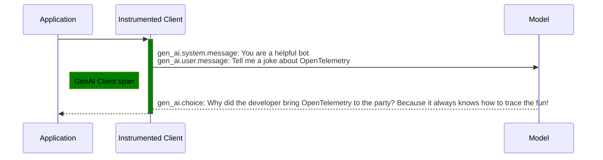
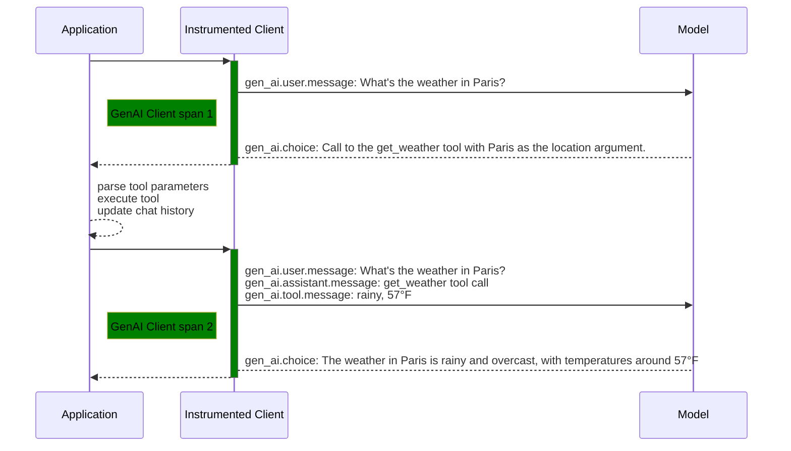
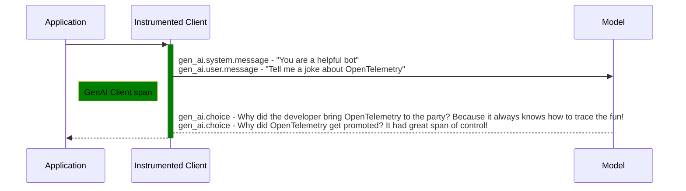

<!--- Hugo front matter used to generate the website version of this page:
linkTitle: Events
--->

# Semantic conventions for generative AI events

**Status**: [Development][DocumentStatus]

<!-- toc -->

- [Event: `gen_ai.system.message`](#event-gen_aisystemmessage)
- [Event: `gen_ai.user.message`](#event-gen_aiusermessage)
- [Event: `gen_ai.assistant.message`](#event-gen_aiassistantmessage)
- [Event: `gen_ai.tool.message`](#event-gen_aitoolmessage)
- [Event: `gen_ai.choice`](#event-gen_aichoice)
- [Custom events](#custom-events)
- [Examples](#examples)
  - [Chat completion](#chat-completion)
  - [Tools](#tools)
  - [Chat completion with multiple choices](#chat-completion-with-multiple-choices)

<!-- tocstop -->

GenAI instrumentations MAY capture user inputs sent to the model and responses received from it as [events](https://github.com/open-telemetry/opentelemetry-specification/blob/v1.41.0/specification/logs/data-model.md#events).

> Note:
> Events are in-development and not yet available in some languages. Check [spec-compliance matrix](https://github.com/open-telemetry/opentelemetry-specification/tree/v1.41.0/spec-compliance-matrix.md#logs) to see the implementation status in corresponding language.

Instrumentations MAY capture inputs and outputs if and only if application has enabled the collection of this data.
This is for three primary reasons:

1. Data privacy concerns. End users of GenAI applications may input sensitive information or personally identifiable information (PII) that they do not wish to be sent to a telemetry backend.
2. Data size concerns. Although there is no specified limit to sizes, there are practical limitations in programming languages and telemetry systems. Some GenAI systems allow for extremely large context windows that end users may take full advantage of.
3. Performance concerns. Sending large amounts of data to a telemetry backend may cause performance issues for the application.

Body fields that contain user input, model output, or other potentially sensitive and verbose data
SHOULD NOT be captured by default.

Semantic conventions for individual systems which extend content events SHOULD document all additional body fields and specify whether they
should be captured by default or need application to opt into capturing them.

Telemetry consumers SHOULD expect to receive unknown body fields.

Instrumentations SHOULD NOT capture undocumented body fields and MUST follow the documented defaults for known fields.
Instrumentations MAY offer configuration options allowing to disable events or allowing to capture all fields.

## Event: `gen_ai.system.message`

<!-- semconv event.gen_ai.system.message -->
<!-- NOTE: THIS TEXT IS AUTOGENERATED. DO NOT EDIT BY HAND. -->
<!-- see templates/registry/markdown/snippet.md.j2 -->
<!-- prettier-ignore-start -->
<!-- markdownlint-capture -->
<!-- markdownlint-disable -->

**Status:** 

The event name MUST be `gen_ai.system.message`.

This event describes the system instructions passed to the GenAI model.

| Attribute  | Type | Description  | Examples  | [Requirement Level](https://opentelemetry.io/docs/specs/semconv/general/attribute-requirement-level/) | Stability |
|---|---|---|---|---|---|
| [`gen_ai.system`](/docs/attributes-registry/gen-ai.md) | string | The Generative AI product as identified by the client or server instrumentation. [1] | `openai` | `Recommended` |  |

**[1] `gen_ai.system`:** The `gen_ai.system` describes a family of GenAI models with specific model identified
by `gen_ai.request.model` and `gen_ai.response.model` attributes.

The actual GenAI product may differ from the one identified by the client.
Multiple systems, including Azure OpenAI and Gemini, are accessible by OpenAI client
libraries. In such cases, the `gen_ai.system` is set to `openai` based on the
instrumentation's best knowledge, instead of the actual system. The `server.address`
attribute may help identify the actual system in use for `openai`.

For custom model, a custom friendly name SHOULD be used.
If none of these options apply, the `gen_ai.system` SHOULD be set to `_OTHER`.

---

`gen_ai.system` has the following list of well-known values. If one of them applies, then the respective value MUST be used; otherwise, a custom value MAY be used.

| Value  | Description | Stability |
|---|---|---|
| `anthropic` | Anthropic |  |
| `aws.bedrock` | AWS Bedrock |  |
| `az.ai.inference` | Azure AI Inference |  |
| `az.ai.openai` | Azure OpenAI |  |
| `cohere` | Cohere |  |
| `deepseek` | DeepSeek |  |
| `gemini` | Gemini |  |
| `groq` | Groq |  |
| `ibm.watsonx.ai` | IBM Watsonx AI |  |
| `mistral_ai` | Mistral AI |  |
| `openai` | OpenAI |  |
| `perplexity` | Perplexity |  |
| `vertex_ai` | Vertex AI |  |
| `xai` | xAI |  |

**Body fields:**

| Body Field  | Type | Description  | Examples  | [Requirement Level](https://opentelemetry.io/docs/specs/semconv/general/attribute-requirement-level/) | Stability |
|---|---|---|---|---|---|
| `content` | undefined | The contents of the system message. | `You're a helpful bot` | `Opt-In` |  |
| `role` | string | The actual role of the message author as passed in the message. | `system`; `instruction` | `Conditionally Required` if available and not equal to `system`. |  |

<!-- markdownlint-restore -->
<!-- prettier-ignore-end -->
<!-- END AUTOGENERATED TEXT -->
<!-- endsemconv -->

## Event: `gen_ai.user.message`

<!-- semconv event.gen_ai.user.message -->
<!-- NOTE: THIS TEXT IS AUTOGENERATED. DO NOT EDIT BY HAND. -->
<!-- see templates/registry/markdown/snippet.md.j2 -->
<!-- prettier-ignore-start -->
<!-- markdownlint-capture -->
<!-- markdownlint-disable -->

**Status:** 

The event name MUST be `gen_ai.user.message`.

This event describes the user message passed to the GenAI model.

| Attribute  | Type | Description  | Examples  | [Requirement Level](https://opentelemetry.io/docs/specs/semconv/general/attribute-requirement-level/) | Stability |
|---|---|---|---|---|---|
| [`gen_ai.system`](/docs/attributes-registry/gen-ai.md) | string | The Generative AI product as identified by the client or server instrumentation. [1] | `openai` | `Recommended` |  |

**[1] `gen_ai.system`:** The `gen_ai.system` describes a family of GenAI models with specific model identified
by `gen_ai.request.model` and `gen_ai.response.model` attributes.

The actual GenAI product may differ from the one identified by the client.
Multiple systems, including Azure OpenAI and Gemini, are accessible by OpenAI client
libraries. In such cases, the `gen_ai.system` is set to `openai` based on the
instrumentation's best knowledge, instead of the actual system. The `server.address`
attribute may help identify the actual system in use for `openai`.

For custom model, a custom friendly name SHOULD be used.
If none of these options apply, the `gen_ai.system` SHOULD be set to `_OTHER`.

---

`gen_ai.system` has the following list of well-known values. If one of them applies, then the respective value MUST be used; otherwise, a custom value MAY be used.

| Value  | Description | Stability |
|---|---|---|
| `anthropic` | Anthropic |  |
| `aws.bedrock` | AWS Bedrock |  |
| `az.ai.inference` | Azure AI Inference |  |
| `az.ai.openai` | Azure OpenAI |  |
| `cohere` | Cohere |  |
| `deepseek` | DeepSeek |  |
| `gemini` | Gemini |  |
| `groq` | Groq |  |
| `ibm.watsonx.ai` | IBM Watsonx AI |  |
| `mistral_ai` | Mistral AI |  |
| `openai` | OpenAI |  |
| `perplexity` | Perplexity |  |
| `vertex_ai` | Vertex AI |  |
| `xai` | xAI |  |

**Body fields:**

| Body Field  | Type | Description  | Examples  | [Requirement Level](https://opentelemetry.io/docs/specs/semconv/general/attribute-requirement-level/) | Stability |
|---|---|---|---|---|---|
| `content` | undefined | The contents of the user message. | `What's the weather in Paris?` | `Opt-In` |  |
| `role` | string | The actual role of the message author as passed in the message. | `user`; `customer` | `Conditionally Required` if available and not equal to `user`. |  |

<!-- markdownlint-restore -->
<!-- prettier-ignore-end -->
<!-- END AUTOGENERATED TEXT -->
<!-- endsemconv -->

## Event: `gen_ai.assistant.message`

<!-- semconv event.gen_ai.assistant.message -->
<!-- NOTE: THIS TEXT IS AUTOGENERATED. DO NOT EDIT BY HAND. -->
<!-- see templates/registry/markdown/snippet.md.j2 -->
<!-- prettier-ignore-start -->
<!-- markdownlint-capture -->
<!-- markdownlint-disable -->

**Status:** 

The event name MUST be `gen_ai.assistant.message`.

This event describes the assistant message passed to GenAI system.

| Attribute  | Type | Description  | Examples  | [Requirement Level](https://opentelemetry.io/docs/specs/semconv/general/attribute-requirement-level/) | Stability |
|---|---|---|---|---|---|
| [`gen_ai.system`](/docs/attributes-registry/gen-ai.md) | string | The Generative AI product as identified by the client or server instrumentation. [1] | `openai` | `Recommended` |  |

**[1] `gen_ai.system`:** The `gen_ai.system` describes a family of GenAI models with specific model identified
by `gen_ai.request.model` and `gen_ai.response.model` attributes.

The actual GenAI product may differ from the one identified by the client.
Multiple systems, including Azure OpenAI and Gemini, are accessible by OpenAI client
libraries. In such cases, the `gen_ai.system` is set to `openai` based on the
instrumentation's best knowledge, instead of the actual system. The `server.address`
attribute may help identify the actual system in use for `openai`.

For custom model, a custom friendly name SHOULD be used.
If none of these options apply, the `gen_ai.system` SHOULD be set to `_OTHER`.

---

`gen_ai.system` has the following list of well-known values. If one of them applies, then the respective value MUST be used; otherwise, a custom value MAY be used.

| Value  | Description | Stability |
|---|---|---|
| `anthropic` | Anthropic |  |
| `aws.bedrock` | AWS Bedrock |  |
| `az.ai.inference` | Azure AI Inference |  |
| `az.ai.openai` | Azure OpenAI |  |
| `cohere` | Cohere |  |
| `deepseek` | DeepSeek |  |
| `gemini` | Gemini |  |
| `groq` | Groq |  |
| `ibm.watsonx.ai` | IBM Watsonx AI |  |
| `mistral_ai` | Mistral AI |  |
| `openai` | OpenAI |  |
| `perplexity` | Perplexity |  |
| `vertex_ai` | Vertex AI |  |
| `xai` | xAI |  |

**Body fields:**

| Body Field  | Type | Description  | Examples  | [Requirement Level](https://opentelemetry.io/docs/specs/semconv/general/attribute-requirement-level/) | Stability |
|---|---|---|---|---|---|
| `content` | undefined | The contents of the tool message. | `The weather in Paris is rainy and overcast, with temperatures around 57°F` | `Opt-In` |  |
| `role` | string | The actual role of the message author as passed in the message. | `assistant`; `bot` | `Conditionally Required` if available and not equal to `assistant`. |  |
| `tool_calls`: | map[] | The tool calls generated by the model, such as function calls. |  | `Conditionally Required` if available |  |
| &nbsp;&nbsp;`function`: | map | The function call. |  | `Required` |  |
| &nbsp;&nbsp;&nbsp;&nbsp;`arguments` | undefined | The arguments of the function as provided in the LLM response. [1] | `{\"location\": \"Paris\"}` | `Opt-In` |  |
| &nbsp;&nbsp;&nbsp;&nbsp;`name` | string | The name of the function. | `get_weather` | `Required` |  |
| &nbsp;&nbsp;`id` | string | The id of the tool call. | `call_mszuSIzqtI65i1wAUOE8w5H4` | `Required` |  |
| &nbsp;&nbsp;`type` | enum | The type of the tool. | `function` | `Required` |  |

**[1]:** Models usually return arguments as a JSON string. In this case, it's RECOMMENDED to provide arguments as is without attempting to deserialize them.
Semantic conventions for individual systems MAY specify a different type for arguments field.

`type` has the following list of well-known values. If one of them applies, then the respective value MUST be used; otherwise, a custom value MAY be used.

| Value  | Description | Stability |
|---|---|---|
| `function` | Function |  |

<!-- markdownlint-restore -->
<!-- prettier-ignore-end -->
<!-- END AUTOGENERATED TEXT -->
<!-- endsemconv -->

## Event: `gen_ai.tool.message`

<!-- semconv event.gen_ai.tool.message -->
<!-- NOTE: THIS TEXT IS AUTOGENERATED. DO NOT EDIT BY HAND. -->
<!-- see templates/registry/markdown/snippet.md.j2 -->
<!-- prettier-ignore-start -->
<!-- markdownlint-capture -->
<!-- markdownlint-disable -->

**Status:** 

The event name MUST be `gen_ai.tool.message`.

This event describes the response from a tool or function call passed to the GenAI model.

| Attribute  | Type | Description  | Examples  | [Requirement Level](https://opentelemetry.io/docs/specs/semconv/general/attribute-requirement-level/) | Stability |
|---|---|---|---|---|---|
| [`gen_ai.system`](/docs/attributes-registry/gen-ai.md) | string | The Generative AI product as identified by the client or server instrumentation. [1] | `openai` | `Recommended` |  |

**[1] `gen_ai.system`:** The `gen_ai.system` describes a family of GenAI models with specific model identified
by `gen_ai.request.model` and `gen_ai.response.model` attributes.

The actual GenAI product may differ from the one identified by the client.
Multiple systems, including Azure OpenAI and Gemini, are accessible by OpenAI client
libraries. In such cases, the `gen_ai.system` is set to `openai` based on the
instrumentation's best knowledge, instead of the actual system. The `server.address`
attribute may help identify the actual system in use for `openai`.

For custom model, a custom friendly name SHOULD be used.
If none of these options apply, the `gen_ai.system` SHOULD be set to `_OTHER`.

---

`gen_ai.system` has the following list of well-known values. If one of them applies, then the respective value MUST be used; otherwise, a custom value MAY be used.

| Value  | Description | Stability |
|---|---|---|
| `anthropic` | Anthropic |  |
| `aws.bedrock` | AWS Bedrock |  |
| `az.ai.inference` | Azure AI Inference |  |
| `az.ai.openai` | Azure OpenAI |  |
| `cohere` | Cohere |  |
| `deepseek` | DeepSeek |  |
| `gemini` | Gemini |  |
| `groq` | Groq |  |
| `ibm.watsonx.ai` | IBM Watsonx AI |  |
| `mistral_ai` | Mistral AI |  |
| `openai` | OpenAI |  |
| `perplexity` | Perplexity |  |
| `vertex_ai` | Vertex AI |  |
| `xai` | xAI |  |

**Body fields:**

| Body Field  | Type | Description  | Examples  | [Requirement Level](https://opentelemetry.io/docs/specs/semconv/general/attribute-requirement-level/) | Stability |
|---|---|---|---|---|---|
| `content` | undefined | The contents of the tool message. | `rainy, 57°F` | `Opt-In` |  |
| `id` | string | Tool call id that this message is responding to. | `call_mszuSIzqtI65i1wAUOE8w5H4` | `Required` |  |
| `role` | string | The actual role of the message author as passed in the message. | `tool`; `function` | `Conditionally Required` if available and not equal to `tool`. |  |

<!-- markdownlint-restore -->
<!-- prettier-ignore-end -->
<!-- END AUTOGENERATED TEXT -->
<!-- endsemconv -->

## Event: `gen_ai.choice`

<!-- semconv event.gen_ai.choice -->
<!-- NOTE: THIS TEXT IS AUTOGENERATED. DO NOT EDIT BY HAND. -->
<!-- see templates/registry/markdown/snippet.md.j2 -->
<!-- prettier-ignore-start -->
<!-- markdownlint-capture -->
<!-- markdownlint-disable -->

**Status:** 

The event name MUST be `gen_ai.choice`.

This event describes the Gen AI response message.

| Attribute  | Type | Description  | Examples  | [Requirement Level](https://opentelemetry.io/docs/specs/semconv/general/attribute-requirement-level/) | Stability |
|---|---|---|---|---|---|
| [`gen_ai.system`](/docs/attributes-registry/gen-ai.md) | string | The Generative AI product as identified by the client or server instrumentation. [1] | `openai` | `Recommended` |  |

**[1] `gen_ai.system`:** The `gen_ai.system` describes a family of GenAI models with specific model identified
by `gen_ai.request.model` and `gen_ai.response.model` attributes.

The actual GenAI product may differ from the one identified by the client.
Multiple systems, including Azure OpenAI and Gemini, are accessible by OpenAI client
libraries. In such cases, the `gen_ai.system` is set to `openai` based on the
instrumentation's best knowledge, instead of the actual system. The `server.address`
attribute may help identify the actual system in use for `openai`.

For custom model, a custom friendly name SHOULD be used.
If none of these options apply, the `gen_ai.system` SHOULD be set to `_OTHER`.

---

`gen_ai.system` has the following list of well-known values. If one of them applies, then the respective value MUST be used; otherwise, a custom value MAY be used.

| Value  | Description | Stability |
|---|---|---|
| `anthropic` | Anthropic |  |
| `aws.bedrock` | AWS Bedrock |  |
| `az.ai.inference` | Azure AI Inference |  |
| `az.ai.openai` | Azure OpenAI |  |
| `cohere` | Cohere |  |
| `deepseek` | DeepSeek |  |
| `gemini` | Gemini |  |
| `groq` | Groq |  |
| `ibm.watsonx.ai` | IBM Watsonx AI |  |
| `mistral_ai` | Mistral AI |  |
| `openai` | OpenAI |  |
| `perplexity` | Perplexity |  |
| `vertex_ai` | Vertex AI |  |
| `xai` | xAI |  |

**Body fields:**

| Body Field  | Type | Description  | Examples  | [Requirement Level](https://opentelemetry.io/docs/specs/semconv/general/attribute-requirement-level/) | Stability |
|---|---|---|---|---|---|
| `finish_reason` | enum | The reason the model stopped generating tokens. | `stop`; `tool_calls`; `content_filter` | `Required` |  |
| `index` | int | The index of the choice in the list of choices. | `0`; `1` | `Required` |  |
| `message`: | map | GenAI response message. |  | `Recommended` |  |
| &nbsp;&nbsp;`content` | undefined | The contents of the assistant message. | `The weather in Paris is rainy and overcast, with temperatures around 57°F` | `Opt-In` |  |
| &nbsp;&nbsp;`role` | string | The actual role of the message author as passed in the message. | `assistant`; `bot` | `Conditionally Required` if available and not equal to `assistant`. |  |
| `tool_calls`: | map[] | The tool calls generated by the model, such as function calls. |  | `Conditionally Required` if available |  |
| &nbsp;&nbsp;`function`: | map | The function that the model called. |  | `Required` |  |
| &nbsp;&nbsp;&nbsp;&nbsp;`arguments` | undefined | The arguments of the function as provided in the LLM response. [1] | `{\"location\": \"Paris\"}` | `Opt-In` |  |
| &nbsp;&nbsp;&nbsp;&nbsp;`name` | string | The name of the function. | `get_weather` | `Required` |  |
| &nbsp;&nbsp;`id` | string | The id of the tool call. | `call_mszuSIzqtI65i1wAUOE8w5H4` | `Required` |  |
| &nbsp;&nbsp;`type` | enum | The type of the tool. | `function` | `Required` |  |

**[1]:** Models usually return arguments as a JSON string. In this case, it's RECOMMENDED to provide arguments as is without attempting to deserialize them.
Semantic conventions for individual systems MAY specify a different type for arguments field.

`finish_reason` has the following list of well-known values. If one of them applies, then the respective value MUST be used; otherwise, a custom value MAY be used.

| Value  | Description | Stability |
|---|---|---|
| `content_filter` | Content Filter |  |
| `error` | Error |  |
| `length` | Length |  |
| `stop` | Stop |  |
| `tool_calls` | Tool Calls |  |

`type` has the following list of well-known values. If one of them applies, then the respective value MUST be used; otherwise, a custom value MAY be used.

| Value  | Description | Stability |
|---|---|---|
| `function` | Function |  |

<!-- markdownlint-restore -->
<!-- prettier-ignore-end -->
<!-- END AUTOGENERATED TEXT -->
<!-- endsemconv -->

## Custom events

System-specific events that are not covered in this document SHOULD be documented in corresponding Semantic Conventions extensions and
SHOULD follow `gen_ai.{gen_ai.system}.*` naming pattern for system-specific events.

## Examples

### Chat completion

This is an example of telemetry generated for a chat completion call with system and user messages.

**GenAI Client span:**

|   Attribute name                |                     Value                  |
|---------------------------------|--------------------------------------------|
| Span name                       | `"chat gpt-4"`                             |
| `gen_ai.system`                 | `"openai"`                                 |
| `gen_ai.request.model`          | `"gpt-4"`                                  |
| `gen_ai.request.max_tokens`     | `200`                                      |
| `gen_ai.request.top_p`          | `1.0`                                      |
| `gen_ai.response.id`            | `"chatcmpl-9J3uIL87gldCFtiIbyaOvTeYBRA3l"` |
| `gen_ai.response.model`         | `"gpt-4-0613"`                             |
| `gen_ai.usage.output_tokens`    | `47`                                       |
| `gen_ai.usage.input_tokens`     | `52`                                       |
| `gen_ai.response.finish_reasons`| `["stop"]`                                 |

**Events:**

1. `gen_ai.system.message`

   |   Property          |                     Value                             |
   |---------------------|-------------------------------------------------------|
   | `gen_ai.system`     | `"openai"`                                            |
   | Event body (with content enabled) | `{"content": "You're a helpful bot"}` |

2. `gen_ai.user.message`

   |   Property          |                     Value                             |
   |---------------------|-------------------------------------------------------|
   | `gen_ai.system`     | `"openai"`                                            |
   | Event body (with content enabled) | `{"content":"Tell me a joke about OpenTelemetry"}` |

3. `gen_ai.choice`

   |   Property          |                     Value                             |
   |---------------------|-------------------------------------------------------|
   | `gen_ai.system`     | `"openai"`                                            |
   | Event body (with content enabled) | `{"index":0,"finish_reason":"stop","message":{"content":"Why did the developer bring OpenTelemetry to the party? Because it always knows how to trace the fun!"}}` |
   | Event body (without content) | `{"index":0,"finish_reason":"stop","message":{}}` |

### Tools

This is an example of telemetry generated for a chat completion call with user message and function definition
that results in a model requesting application to call provided function. Application executes a function and
requests another completion now with the tool response.

Here's the telemetry generated for each step in this scenario:

**GenAI Client span 1:**

|   Attribute name    |                     Value                             |
|---------------------|-------------------------------------------------------|
| Span name           | `"chat gpt-4"`                             |
| `gen_ai.system`     | `"openai"`                                            |
| `gen_ai.request.model`| `"gpt-4"`                                           |
| `gen_ai.request.max_tokens`| `200`                                          |
| `gen_ai.request.top_p`| `1.0`                                               |
| `gen_ai.response.id`| `"chatcmpl-9J3uIL87gldCFtiIbyaOvTeYBRA3l"`            |
| `gen_ai.response.model`| `"gpt-4-0613"`                                     |
| `gen_ai.usage.output_tokens`| `17`                                          |
| `gen_ai.usage.input_tokens`| `47`                                           |
| `gen_ai.response.finish_reasons`| `["tool_calls"]`                          |

  **Events**:

  All the following events are parented to the **GenAI chat span 1**.

  1. `gen_ai.user.message` (not reported when capturing content is disabled)

     |   Property          |                     Value                             |
     |---------------------|-------------------------------------------------------|
     | `gen_ai.system`     | `"openai"`                                            |
     | Event body          | `{"content":"What's the weather in Paris?"}` |

  2. `gen_ai.choice`

     |   Property          |                     Value                             |
     |---------------------|-------------------------------------------------------|
     | `gen_ai.system`     | `"openai"`                                            |
     | Event body (with content)    | `{"index":0,"finish_reason":"tool_calls","message":{"tool_calls":[{"id":"call_VSPygqKTWdrhaFErNvMV18Yl","function":{"name":"get_weather","arguments":"{\"location\":\"Paris\"}"},"type":"function"}]}` |
     | Event body (without content) | `{"index":0,"finish_reason":"tool_calls","message":{"tool_calls":[{"id":"call_VSPygqKTWdrhaFErNvMV18Yl","function":{"name":"get_weather"},"type":"function"}]}` |

**GenAI Client span 2:**

   |   Attribute name                |                     Value                             |
   |---------------------------------|-------------------------------------------------------|
   | Span name                       | `"chat gpt-4"`                                        |
   | `gen_ai.system`                 | `"openai"`                                            |
   | `gen_ai.request.model`          | `"gpt-4"`                                             |
   | `gen_ai.request.max_tokens`     | `200`                                                 |
   | `gen_ai.request.top_p`          | `1.0`                                                 |
   | `gen_ai.response.id`            | `"chatcmpl-call_VSPygqKTWdrhaFErNvMV18Yl"`            |
   | `gen_ai.response.model`         | `"gpt-4-0613"`                                        |
   | `gen_ai.usage.output_tokens`    | `52`                                                  |
   | `gen_ai.usage.input_tokens`     | `47`                                                  |
   | `gen_ai.response.finish_reasons`| `["stop"]`                                            |

  **Events**:

  All the following events are parented to the **GenAI chat span 2**.

  In this example, the event content matches the original messages, but applications may also drop messages or change their content.

  1. `gen_ai.user.message`

     |   Property                       |                     Value                                  |
     |----------------------------------|------------------------------------------------------------|
     | `gen_ai.system`                  | `"openai"`                                                 |
     | Event body                       | `{"content":"What's the weather in Paris?"}` |

  2. `gen_ai.assistant.message`

     |   Property                       |                     Value                                                                                                                  |
     |----------------------------------|--------------------------------------------------------------------------------------------------------------------------------------------|
     | `gen_ai.system`                  | `"openai"`                                                                                                                                 |
     | Event body (content enabled)     | `{"tool_calls":[{"id":"call_VSPygqKTWdrhaFErNvMV18Yl","function":{"name":"get_weather","arguments":"{\"location\":\"Paris\"}"},"type":"function"}]}` |
     | Event body (content not enabled) | `{"tool_calls":[{"id":"call_VSPygqKTWdrhaFErNvMV18Yl","function":{"name":"get_weather"},"type":"function"}]}`                 |

  3. `gen_ai.tool.message`

     |   Property                       |                     Value                                                                      |
     |----------------------------------|------------------------------------------------------------------------------------------------|
     | `gen_ai.system`                  | `"openai"`                                                                                     |
     | Event body (content enabled)     | `{"content":"rainy, 57°F","id":"call_VSPygqKTWdrhaFErNvMV18Yl"}` |
     | Event body (content not enabled) | `{"id":"call_VSPygqKTWdrhaFErNvMV18Yl"}`                                             |

  4. `gen_ai.choice`

     |   Property                       |                     Value                                                                                                     |
     |----------------------------------|-------------------------------------------------------------------------------------------------------------------------------|
     | `gen_ai.system`                  | `"openai"`                                                                                                                    |
     | Event body (content enabled)     | `{"index":0,"finish_reason":"stop","message":{"content":"The weather in Paris is rainy and overcast, with temperatures around 57°F"}}` |
     | Event body (content not enabled) | `{"index":0,"finish_reason":"stop","message":{}}` |

### Chat completion with multiple choices

This example covers the scenario when user requests model to generate two completions for the same prompt :

**GenAI Client Span**:

|   Attribute name    |                     Value                  |
|---------------------|--------------------------------------------|
| Span name           | `"chat gpt-4"`                             |
| `gen_ai.system`     | `"openai"`                                 |
| `gen_ai.request.model`| `"gpt-4"`                                |
| `gen_ai.request.max_tokens`| `200`                               |
| `gen_ai.request.top_p`| `1.0`                                    |
| `gen_ai.response.id`| `"chatcmpl-9J3uIL87gldCFtiIbyaOvTeYBRA3l"` |
| `gen_ai.response.model`| `"gpt-4-0613"`                          |
| `gen_ai.usage.output_tokens`| `77`                               |
| `gen_ai.usage.input_tokens`| `52`                                |
| `gen_ai.response.finish_reasons`| `["stop", "stop"]`             |

**Events**:

All events are parented to the GenAI chat span above.

1. `gen_ai.system.message`: the same as in the [Chat Completion](#chat-completion) example
2. `gen_ai.user.message`: the same as in the [Chat Completion](#chat-completion) example
3. `gen_ai.choice`

   |   Property                   |                     Value                             |
   |------------------------------|-------------------------------------------------------|
   | `gen_ai.system`              | `"openai"`                                            |
   | Event body (content enabled) | `{"index":0,"finish_reason":"stop","message":{"content":"Why did the developer bring OpenTelemetry to the party? Because it always knows how to trace the fun!"}}` |

4. `gen_ai.choice`

   |   Property                   |                     Value                             |
   |------------------------------|-------------------------------------------------------|
   | `gen_ai.system`              | `"openai"`                                            |
   | Event body (content enabled) | `{"index":1,"finish_reason":"stop","message":{"content":"Why did OpenTelemetry get promoted? It had great span of control!"}}` |

[DocumentStatus]: https://opentelemetry.io/docs/specs/otel/document-status
