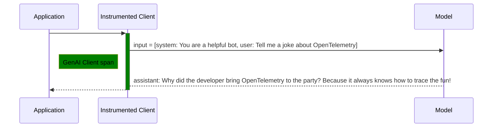
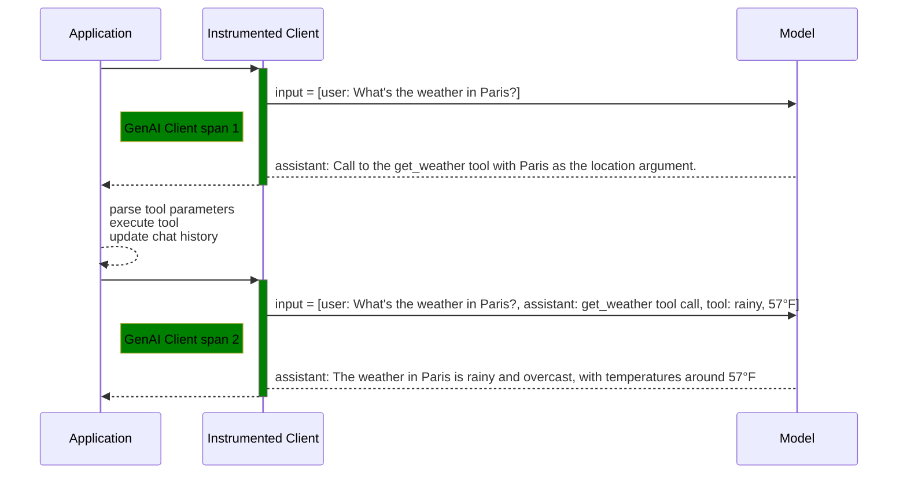
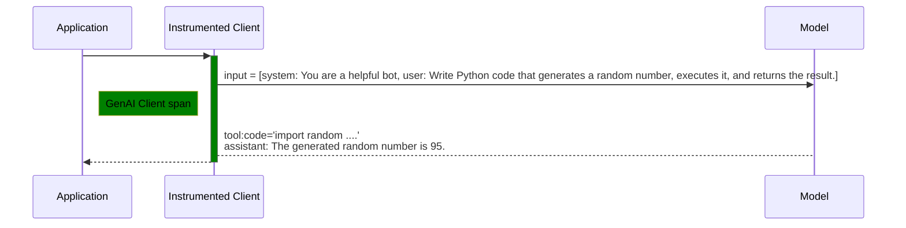
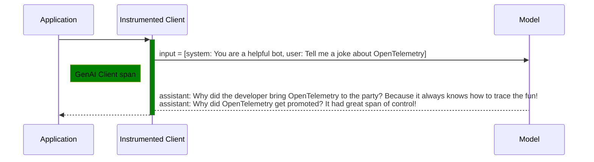

# LLM call examples

<!-- toc -->

- [Simple chat completion](#simple-chat-completion)
  - [GenAI client span when content capturing is disabled](#genai-client-span-when-content-capturing-is-disabled)
  - [GenAI client span when content capturing is enabled on span attributes](#genai-client-span-when-content-capturing-is-enabled-on-span-attributes)
  - [GenAI telemetry when content capturing is enabled on event attributes](#genai-telemetry-when-content-capturing-is-enabled-on-event-attributes)
- [Multimodal chat completion](#multimodal-chat-completion)
  - [Multimodal inputs example](#multimodal-inputs-example)
  - [Multimodal output example](#multimodal-output-example)
- [Tool calls (functions)](#tool-calls-functions)
  - [GenAI client spans when content capturing is disabled](#genai-client-spans-when-content-capturing-is-disabled)
  - [GenAI client spans when content capturing is enabled on span attributes](#genai-client-spans-when-content-capturing-is-enabled-on-span-attributes)
- [System instructions along with chat history (content enabled)](#system-instructions-along-with-chat-history-content-enabled)
- [Chat completion with reasoning (content enabled)](#chat-completion-with-reasoning-content-enabled)
- [Tool calls (built-in)](#tool-calls-built-in)
- [Chat completion with multiple choices](#chat-completion-with-multiple-choices)
  - [GenAI client span when content capturing is enabled on span attributes](#genai-client-span-when-content-capturing-is-enabled-on-span-attributes-1)

<!-- tocstop -->

## Simple chat completion

This is an example of telemetry generated for a chat completion call with
system and user messages.



### GenAI client span when content capturing is disabled

| Property                         | Value                                      |
| -------------------------------- | ------------------------------------------ |
| Span name                        | `"chat gpt-4"`                             |
| Trace id                         | `"4bf92f3577b34da6a3ce929d0e0e4736"`       |
| Span id                          | `"00f067aa0ba902b7"`                       |
| `gen_ai.provider.name`           | `"openai"`                                 |
| `gen_ai.operation.name`          | `"chat"`                                   |
| `gen_ai.request.model`           | `"gpt-4"`                                  |
| `gen_ai.request.max_tokens`      | `200`                                      |
| `gen_ai.request.top_p`           | `1.0`                                      |
| `gen_ai.response.id`             | `"chatcmpl-9J3uIL87gldCFtiIbyaOvTeYBRA3l"` |
| `gen_ai.response.model`          | `"gpt-4-0613"`                             |
| `gen_ai.usage.output_tokens`     | `47`                                       |
| `gen_ai.usage.input_tokens`      | `52`                                       |
| `gen_ai.response.finish_reasons` | `["stop"]`                                 |

### GenAI client span when content capturing is enabled on span attributes

| Property                         | Value                                                      |
| -------------------------------- | ---------------------------------------------------------- |
| Span name                        | `"chat gpt-4"`                                             |
| Trace id                         | `"4bf92f3577b34da6a3ce929d0e0e4736"`                       |
| Span id                          | `"00f067aa0ba902b7"`                                       |
| `gen_ai.provider.name`           | `"openai"`                                                 |
| `gen_ai.operation.name`          | `"chat"`                                                   |
| `gen_ai.request.model`           | `"gpt-4"`                                                  |
| `gen_ai.request.max_tokens`      | `200`                                                      |
| `gen_ai.request.top_p`           | `1.0`                                                      |
| `gen_ai.response.id`             | `"chatcmpl-9J3uIL87gldCFtiIbyaOvTeYBRA3l"`                 |
| `gen_ai.response.model`          | `"gpt-4-0613"`                                             |
| `gen_ai.usage.output_tokens`     | `47`                                                       |
| `gen_ai.usage.input_tokens`      | `52`                                                       |
| `gen_ai.response.finish_reasons` | `["stop"]`                                                 |
| `gen_ai.input.messages`          | [`gen_ai.input.messages`](#gen-ai-input-messages-simple)   |
| `gen_ai.output.messages`         | [`gen_ai.output.messages`](#gen-ai-output-messages-simple) |

<span id="gen-ai-input-messages-simple">`gen_ai.input.messages` value</span>

```json
[
  {
    "role": "system",
    "parts": [
      {
        "type": "text",
        "content": "You are a helpful bot"
      }
    ]
  },
  {
    "role": "user",
    "parts": [
      {
        "type": "text",
        "content": "Tell me a joke about OpenTelemetry"
      }
    ]
  }
]
```

<span id="gen-ai-output-messages-simple">`gen_ai.output.messages` value</span>

```json
[
  {
    "role": "assistant",
    "parts": [
      {
        "type": "text",
        "content": " Why did the developer bring OpenTelemetry to the party? Because it always knows how to trace the fun!"
      }
    ],
    "finish_reason": "stop"
  }
]
```

### GenAI telemetry when content capturing is enabled on event attributes

Span:

| Property                         | Value                                      |
| -------------------------------- | ------------------------------------------ |
| Span name                        | `"chat gpt-4"`                             |
| Trace id                         | `"4bf92f3577b34da6a3ce929d0e0e4736"`       |
| Span id                          | `"00f067aa0ba902b7"`                       |
| `gen_ai.provider.name`           | `"openai"`                                 |
| `gen_ai.operation.name`          | `"chat"`                                   |
| `gen_ai.request.model`           | `"gpt-4"`                                  |
| `gen_ai.request.max_tokens`      | `200`                                      |
| `gen_ai.request.top_p`           | `1.0`                                      |
| `gen_ai.response.id`             | `"chatcmpl-9J3uIL87gldCFtiIbyaOvTeYBRA3l"` |
| `gen_ai.response.model`          | `"gpt-4-0613"`                             |
| `gen_ai.usage.output_tokens`     | `47`                                       |
| `gen_ai.usage.input_tokens`      | `52`                                       |
| `gen_ai.response.finish_reasons` | `["stop"]`                                 |

Event:

| Property                         | Value                                                     |
| -------------------------------- | --------------------------------------------------------- |
| Trace id                         | `"4bf92f3577b34da6a3ce929d0e0e4736"`                      |
| Span id                          | `"00f067aa0ba902b7"`                                      |
| `gen_ai.provider.name`           | `"openai"`                                                |
| `gen_ai.operation.name`          | `"chat"`                                                  |
| `gen_ai.request.model`           | `"gpt-4"`                                                 |
| `gen_ai.request.max_tokens`      | `200`                                                     |
| `gen_ai.request.top_p`           | `1.0`                                                     |
| `gen_ai.response.id`             | `"chatcmpl-9J3uIL87gldCFtiIbyaOvTeYBRA3l"`                |
| `gen_ai.response.model`          | `"gpt-4-0613"`                                            |
| `gen_ai.usage.output_tokens`     | `47`                                                      |
| `gen_ai.usage.input_tokens`      | `52`                                                      |
| `gen_ai.response.finish_reasons` | `["stop"]`                                                |
| `gen_ai.input.messages`          | [`gen_ai.input.messages`](#gen-ai-input-messages-event)   |
| `gen_ai.output.messages`         | [`gen_ai.output.messages`](#gen-ai-output-messages-event) |

<span id="gen-ai-input-messages-event">`gen_ai.input.messages` value</span>

```json
[
  {
    "role": "system",
    "parts": [
      {
        "type": "text",
        "content": "You are a helpful bot"
      }
    ]
  },
  {
    "role": "user",
    "parts": [
      {
        "type": "text",
        "content": "Tell me a joke about OpenTelemetry"
      }
    ]
  }
]
```

<span id="gen-ai-output-messages-event">`gen_ai.output.messages` value</span>

```json
[
  {
    "role": "assistant",
    "parts": [
      {
        "type": "text",
        "content": " Why did the developer bring OpenTelemetry to the party? Because it always knows how to trace the fun!"
      }
    ],
    "finish_reason": "stop"
  }
]
```

## Multimodal chat completion

Multimodal chat completions follow the same sequence and telemetry structure as [simple chat
completion](#simple-chat-completion) above, but contain additional types of Parts in the
`gen_ai.input.messages` and `gen_ai.output.messages` span/event attributes:

- `blob` parts, which represent data sent inline to or from the model.
- `uri` parts, which represent a reference to a remote file by URI.
- `file` parts, which represent a reference to a pre-uploaded file by ID.

These parts contain an optional `modality` field to capture the general category of the
content, and an optional `mime_type` to capture the specific [IANA media
type](https://www.iana.org/assignments/media-types/media-types.xhtml) of the content, if known.
See the [normative JSON schema](/docs/gen-ai/gen-ai-input-messages.json) for more details.

### Multimodal inputs example

```jsonc
[
  {
    "role": "user",
    "parts": [
      {
        "type": "text",
        "content": "What is in the attached data?"
      },
      // A image with a URI
      {
        "type": "uri",
        "modality": "image",
        "mime_type": "image/png",
        "uri": "https://raw.githubusercontent.com/open-telemetry/opentelemetry.io/refs/heads/main/static/img/logos/opentelemetry-horizontal-color.png"
      },
      // A video with a vendor specific URI
      {
        "type": "uri",
        "modality": "video",
        "mime_type": "video/mp4",
        "uri": "gs://my-bucket/my-video.mp4"
      },
      // An image with opaque file ID e.g. the OpenAI files api
      {
        "type": "file",
        "file_id": "provider_fileid_123"
      },
      // An image with unknown mime_type but known modality
      {
        "type": "file",
        "modality": "image",
        "file_id": "provider_fileid_123"
      },
      // An inline image
      {
        "type": "blob",
        "modality": "image",
        "mime_type": "image/png",
        "content": "aGVsbG8gd29ybGQgaW1hZ2luZSB0aGlzIGlzIGFuIGltYWdlCg=="
      },
      // Inline audio
      {
        "type": "blob",
        "modality": "audio",
        "mime_type": "audio/wav",
        "content": "aGVsbG8gd29ybGQgaW1hZ2luZSB0aGlzIGlzIGFuIGltYWdlCg=="
      }
    ]
  }
]
```

### Multimodal output example

```jsonc
[
  {
    "role": "assistant",
    "finish_reason": "stop",
    "parts": [
      // Model generated an inline image
      {
        "type": "blob",
        "modality": "image",
        "mime_type": "image/jpg",
        "content": "aGVsbG8gd29ybGQgaW1hZ2luZSB0aGlzIGlzIGFuIGltYWdlCg=="
      }
    ]
  }
]
```

## Tool calls (functions)

This is an example of telemetry generated for a chat completion call with user message and function definition that results in a model requesting application to call provided function. Application executes a function and requests another completion now with the tool response.



### GenAI client spans when content capturing is disabled

The relationship between below spans depends on how user application code is written.
They are likely to be siblings if there is an encompassing span.

**GenAI client span 1:**

| Property                         | Value                                      |
| -------------------------------- | ------------------------------------------ |
| Span name                        | `"chat gpt-4"`                             |
| `gen_ai.provider.name`           | `"openai"`                                 |
| `gen_ai.operation.name`          | `"chat"`                                   |
| `gen_ai.request.model`           | `"gpt-4"`                                  |
| `gen_ai.request.max_tokens`      | `200`                                      |
| `gen_ai.request.top_p`           | `1.0`                                      |
| `gen_ai.response.id`             | `"chatcmpl-9J3uIL87gldCFtiIbyaOvTeYBRA3l"` |
| `gen_ai.response.model`          | `"gpt-4-0613"`                             |
| `gen_ai.usage.output_tokens`     | `17`                                       |
| `gen_ai.usage.input_tokens`      | `47`                                       |
| `gen_ai.response.finish_reasons` | `["tool_calls"]`                           |

**Tool call:**

If tool call is [instrumented according to execute-tool span definition](/docs/gen-ai/gen-ai-spans.md#execute-tool-span), it may look like

| Property                | Value                             |
| ----------------------- | --------------------------------- |
| Span name               | `"execute_tool get_weather"`      |
| `gen_ai.tool.call.id`   | `"call_VSPygqKTWdrhaFErNvMV18Yl"` |
| `gen_ai.tool.name`      | `"get_weather"`                   |
| `gen_ai.operation.name` | `"execute_tool"`                  |
| `gen_ai.tool.type`      | `"function"`                      |

**GenAI client span 2:**

| Property                         | Value                                      |
| -------------------------------- | ------------------------------------------ |
| Span name                        | `"chat gpt-4"`                             |
| `gen_ai.provider.name`           | `"openai"`                                 |
| `gen_ai.request.model`           | `"gpt-4"`                                  |
| `gen_ai.request.max_tokens`      | `200`                                      |
| `gen_ai.request.top_p`           | `1.0`                                      |
| `gen_ai.response.id`             | `"chatcmpl-call_VSPygqKTWdrhaFErNvMV18Yl"` |
| `gen_ai.response.model`          | `"gpt-4-0613"`                             |
| `gen_ai.usage.output_tokens`     | `52`                                       |
| `gen_ai.usage.input_tokens`      | `97`                                       |
| `gen_ai.response.finish_reasons` | `["stop"]`                                 |

### GenAI client spans when content capturing is enabled on span attributes

The relationship between below spans depends on how user application code is written.
They are likely to be siblings if there is an encompassing span.

**GenAI client span 1:**

| Property                         | Value                                                                |
| -------------------------------- | -------------------------------------------------------------------- |
| Span name                        | `"chat gpt-4"`                                                       |
| `gen_ai.provider.name`           | `"openai"`                                                           |
| `gen_ai.operation.name`          | `"chat"`                                                             |
| `gen_ai.request.model`           | `"gpt-4"`                                                            |
| `gen_ai.request.max_tokens`      | `200`                                                                |
| `gen_ai.request.top_p`           | `1.0`                                                                |
| `gen_ai.response.id`             | `"chatcmpl-9J3uIL87gldCFtiIbyaOvTeYBRA3l"`                           |
| `gen_ai.response.model`          | `"gpt-4-0613"`                                                       |
| `gen_ai.usage.output_tokens`     | `17`                                                                 |
| `gen_ai.usage.input_tokens`      | `47`                                                                 |
| `gen_ai.response.finish_reasons` | `["tool_calls"]`                                                     |
| `gen_ai.input.messages`          | [`gen_ai.input.messages`](#gen-ai-input-messages-tool-call-span-1)   |
| `gen_ai.output.messages`         | [`gen_ai.output.messages`](#gen-ai-output-messages-tool-call-span-1) |

<span id="gen-ai-input-messages-tool-call-span-1">`gen_ai.input.messages` value</span>

```json
[
  {
    "role": "user",
    "parts": [
      {
        "type": "text",
        "content": "Weather in Paris?"
      }
    ]
  }
]
```

<span id="gen-ai-output-messages-tool-call-span-1">`gen_ai.output.messages` value</span>

```json
[
  {
    "role": "assistant",
    "parts": [
      {
        "type": "tool_call",
        "id": "call_VSPygqKTWdrhaFErNvMV18Yl",
        "name": "get_weather",
        "arguments": {
          "location": "Paris"
        }
      }
    ],
    "finish_reason": "tool_call"
  }
]
```

**Tool call:**

If tool call is [instrumented according to execute-tool span definition](/docs/gen-ai/gen-ai-spans.md#execute-tool-span), it may look like this:

| Property                | Value                             |
| ----------------------- | --------------------------------- |
| Span name               | `"execute_tool get_weather"`      |
| `gen_ai.tool.call.id`   | `"call_VSPygqKTWdrhaFErNvMV18Yl"` |
| `gen_ai.tool.name`      | `"get_weather"`                   |
| `gen_ai.operation.name` | `"execute_tool"`                  |
| `gen_ai.tool.type`      | `"function"`                      |

**GenAI client span 2:**

| Property                         | Value                                                                |
| -------------------------------- | -------------------------------------------------------------------- |
| Span name                        | `"chat gpt-4"`                                                       |
| `gen_ai.provider.name`           | `"openai"`                                                           |
| `gen_ai.request.model`           | `"gpt-4"`                                                            |
| `gen_ai.request.max_tokens`      | `200`                                                                |
| `gen_ai.request.top_p`           | `1.0`                                                                |
| `gen_ai.response.id`             | `"chatcmpl-call_VSPygqKTWdrhaFErNvMV18Yl"`                           |
| `gen_ai.response.model`          | `"gpt-4-0613"`                                                       |
| `gen_ai.usage.output_tokens`     | `52`                                                                 |
| `gen_ai.usage.input_tokens`      | `97`                                                                 |
| `gen_ai.response.finish_reasons` | `["stop"]`                                                           |
| `gen_ai.input.messages`          | [`gen_ai.input.messages`](#gen-ai-input-messages-tool-call-span-2)   |
| `gen_ai.output.messages`         | [`gen_ai.output.messages`](#gen-ai-output-messages-tool-call-span-2) |

<span id="gen-ai-input-messages-tool-call-span-2">`gen_ai.input.messages` value</span>

```json
[
  {
    "role": "user",
    "parts": [
      {
        "type": "text",
        "content": "Weather in Paris?"
      }
    ]
  },
  {
    "role": "assistant",
    "parts": [
      {
        "type": "tool_call",
        "id": "call_VSPygqKTWdrhaFErNvMV18Yl",
        "name": "get_weather",
        "arguments": {
          "location": "Paris"
        }
      }
    ]
  },
  {
    "role": "tool",
    "parts": [
      {
        "type": "tool_call_response",
        "id": " call_VSPygqKTWdrhaFErNvMV18Yl",
        "response": "rainy, 57°F"
      }
    ]
  }
]
```

<span id="gen-ai-output-messages-tool-call-span-2">`gen_ai.output.messages` value</span>

```json
[
  {
    "role": "assistant",
    "parts": [
      {
        "type": "text",
        "content": "The weather in Paris is currently rainy with a temperature of 57°F."
      }
    ],
    "finish_reason": "stop"
  }
]
```

## System instructions along with chat history (content enabled)

Some providers allow to provide instructions separately from the chat history provided in the inputs
or in addition to `system` (`developer`, etc) message provided in the input.

This example demonstrates en edge case when conflicting instructions are provided
to the OpenAI responses API. In this case instructions are recorded in the `gen_ai.system_instructions` attribute.

```py
response = openai.responses.create(
  model="gpt-4",
  instructions="You must never tell jokes",
  input=[{"role": "system", "content": "You are a helpful assistant"}, {"role": "user", "content": "Tell me a joke"}])
```

Span:

| Property                         | Value                                                            |
| -------------------------------- | ---------------------------------------------------------------- |
| Span name                        | `"chat gpt-4"`                                                   |
| `gen_ai.provider.name`           | `"openai"`                                                       |
| `gen_ai.operation.name`          | `"chat"`                                                         |
| `gen_ai.request.model`           | `"gpt-4"`                                                        |
| `gen_ai.response.id`             | `"chatcmpl-9J3uIL87gldCFtiIbyaOvTeYBRA3l"`                       |
| `gen_ai.response.model`          | `"gpt-4-0613"`                                                   |
| `gen_ai.usage.output_tokens`     | `10`                                                             |
| `gen_ai.usage.input_tokens`      | `28`                                                             |
| `gen_ai.response.finish_reasons` | `["stop"]`                                                       |
| `gen_ai.system_instructions`     | [`gen_ai.system_instructions`](#gen-ai-system-instructions)      |
| `gen_ai.input.messages`          | [`gen_ai.input.messages`](#gen-ai-input-messages-instructions)   |
| `gen_ai.output.messages`         | [`gen_ai.output.messages`](#gen-ai-output-messages-instructions) |

<span id="gen-ai-system-instructions">`gen_ai.system_instructions` value</span>

```json
[
  {
    "type": "text",
    "content": "You must never tell jokes"
  }
]
```

<span id="gen-ai-input-messages-instructions">`gen_ai.input.messages` value</span>

```json
[
  {
    "role": "system",
    "parts": [
      {
        "type": "text",
        "content": "You are a helpful bot"
      }
    ]
  },
  {
    "role": "user",
    "parts": [
      {
        "type": "text",
        "content": "Tell me a joke about OpenTelemetry"
      }
    ]
  }
]
```

<span id="gen-ai-output-messages-instructions">`gen_ai.output.messages` value</span>

```json
[
  {
    "role": "assistant",
    "parts": [
      {
        "type": "text",
        "content": "I'm sorry, but I can't assist with that"
      }
    ],
    "finish_reason": "stop"
  }
]
```

## Chat completion with reasoning (content enabled)

| Property                         | Value                                                         |
| -------------------------------- | ------------------------------------------------------------- |
| Span name                        | `"chat gpt-4"`                                                |
| Trace id                         | `"4bf92f3577b34da6a3ce929d0e0e4736"`                          |
| Span id                          | `"00f067aa0ba902b7"`                                          |
| `gen_ai.provider.name`           | `"openai"`                                                    |
| `gen_ai.operation.name`          | `"chat"`                                                      |
| `gen_ai.request.model`           | `"gpt-4"`                                                     |
| `gen_ai.request.max_tokens`      | `200`                                                         |
| `gen_ai.request.top_p`           | `1.0`                                                         |
| `gen_ai.response.id`             | `"chatcmpl-9J3uIL87gldCFtiIbyaOvTeYBRA3l"`                    |
| `gen_ai.response.model`          | `"gpt-4-0613"`                                                |
| `gen_ai.usage.output_tokens`     | `47`                                                          |
| `gen_ai.usage.input_tokens`      | `52`                                                          |
| `gen_ai.response.finish_reasons` | `["stop"]`                                                    |
| `gen_ai.input.messages`          | [`gen_ai.input.messages`](#gen-ai-input-messages-reasoning)   |
| `gen_ai.output.messages`         | [`gen_ai.output.messages`](#gen-ai-output-messages-reasoning) |

<span id="gen-ai-input-messages-reasoning">`gen_ai.input.messages` value</span>

```json
[
  {
    "role": "system",
    "parts": [
      {
        "type": "text",
        "content": "You are a helpful bot"
      }
    ]
  },
  {
    "role": "user",
    "parts": [
      {
        "type": "text",
        "content": "Tell me a joke about OpenTelemetry"
      }
    ]
  }
]
```

<span id="gen-ai-output-messages-reasoning">`gen_ai.output.messages` value</span>

```json
[
  {
    "role": "assistant",
    "parts": [
      {
        "type": "reasoning",
        "content": "Alright, the user wants a joke about OpenTelemetry… Hmm, OpenTelemetry is all about distributed tracing and metrics, right? So maybe I can play with the word \"trace.\" That's a core concept — tracing requests through systems. But how do I make that funny? What if I take \"trace\" literally and apply it to something unexpected, like a party? If I personify OpenTelemetry as a tool that \"knows where the fun is,\" I can make a pun out of tracing requests vs. tracing enjoyment. Yeah, that could work — let me put it all together."
      },
      {
        "type": "text",
        "content": " Why did the developer bring OpenTelemetry to the party? Because it always knows how to trace the fun!"
      }
    ],
    "finish_reason": "stop"
  }
]
```

## Tool calls (built-in)

> [!NOTE]
>
> The format of `gen_ai.output.messages` is not yet specified for built-in tool calls (check [#2585](https://github.com/open-telemetry/semantic-conventions/issues/2585)
> for the details).

This is an example of telemetry generated for a chat completion call with `code_interpreter` tool that results in
a model provider executing a tool and returning response along with tool call details.



**GenAI client span:**

| Property                         | Value                                                              |
| -------------------------------- | ------------------------------------------------------------------ |
| Span name                        | `"chat gpt-4"`                                                     |
| `gen_ai.provider.name`           | `"openai"`                                                         |
| `gen_ai.operation.name`          | `"chat"`                                                           |
| `gen_ai.request.model`           | `"gpt-4"`                                                          |
| `gen_ai.request.max_tokens`      | `200`                                                              |
| `gen_ai.request.top_p`           | `1.0`                                                              |
| `gen_ai.response.id`             | `"chatcmpl-9J3uIL87gldCFtiIbyaOvTeYBRA3l"`                         |
| `gen_ai.response.model`          | `"gpt-4-0613"`                                                     |
| `gen_ai.usage.output_tokens`     | `44`                                                               |
| `gen_ai.usage.input_tokens`      | `385`                                                              |
| `gen_ai.response.finish_reasons` | `["stop"]`                                                         |
| `gen_ai.input.messages`          | [`gen_ai.input.messages`](#gen-ai-input-messages-built-in-tools)   |
| `gen_ai.output.messages`         | [`gen_ai.output.messages`](#gen-ai-output-messages-built-in-tools) |

<span id="gen-ai-input-messages-built-in-tools">`gen_ai.input.messages` value</span>

TODO

<span id="gen-ai-output-messages-built-in-tools">`gen_ai.output.messages` value</span>

TODO

## Chat completion with multiple choices

This example covers the scenario when user requests model to generate two completions for the same prompt:



### GenAI client span when content capturing is enabled on span attributes

| Property                         | Value                                                       |
| -------------------------------- | ----------------------------------------------------------- |
| Span name                        | `"chat gpt-4"`                                              |
| `gen_ai.provider.name`           | `"openai"`                                                  |
| `gen_ai.operation.name`          | `"chat"`                                                    |
| `gen_ai.request.model`           | `"gpt-4"`                                                   |
| `gen_ai.request.max_tokens`      | `200`                                                       |
| `gen_ai.request.top_p`           | `1.0`                                                       |
| `gen_ai.response.id`             | `"chatcmpl-9J3uIL87gldCFtiIbyaOvTeYBRA3l"`                  |
| `gen_ai.response.model`          | `"gpt-4-0613"`                                              |
| `gen_ai.usage.output_tokens`     | `77`                                                        |
| `gen_ai.usage.input_tokens`      | `52`                                                        |
| `gen_ai.response.finish_reasons` | `["stop", "stop"]`                                          |
| `gen_ai.input.messages`          | [`gen_ai.input.messages`](#gen-ai-input-messages-choices)   |
| `gen_ai.output.messages`         | [`gen_ai.output.messages`](#gen-ai-output-messages-choices) |

<span id="gen-ai-input-messages-choices">`gen_ai.input.messages` value</span>

```json
[
  {
    "role": "system",
    "parts": [
      {
        "type": "text",
        "content": "You are a helpful bot"
      }
    ]
  },
  {
    "role": "user",
    "parts": [
      {
        "type": "text",
        "content": "Tell me a joke about OpenTelemetry"
      }
    ]
  }
]
```

<span id="gen-ai-output-messages-choices">`gen_ai.output.messages` value</span>

```json
[
  {
    "role": "assistant",
    "parts": [
      {
        "type": "text",
        "content": " Why did the developer bring OpenTelemetry to the party? Because it always knows how to trace the fun!"
      }
    ],
    "finish_reason": "stop"
  },
  {
    "role": "assistant",
    "parts": [
      {
        "type": "text",
        "content": " Why did OpenTelemetry get promoted? It had great span of control!"
      }
    ],
    "finish_reason": "stop"
  }
]
```
