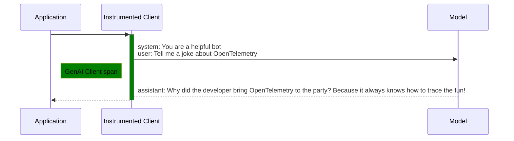
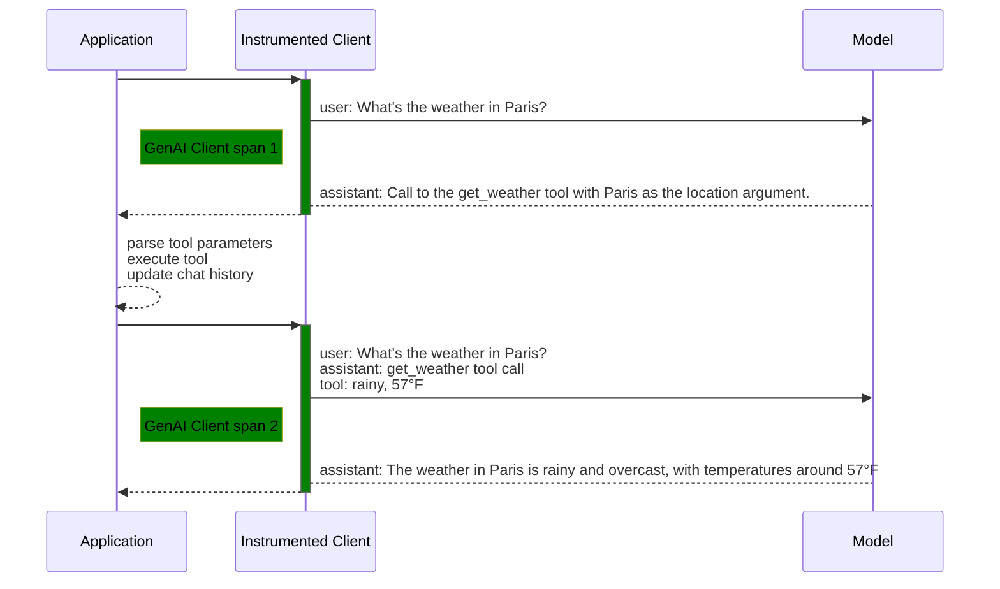
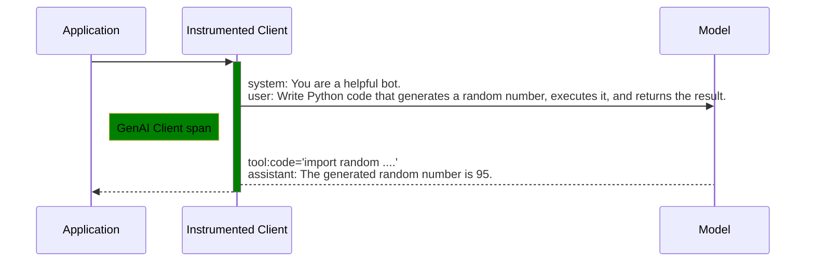
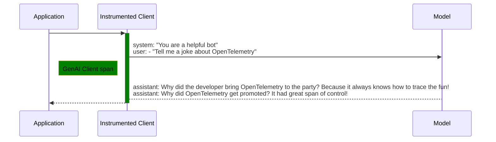

# LLM call examples

<!-- toc -->

- [Simple chat completion](#simple-chat-completion)
  - [GenAI client span when content capturing is disabled](#genai-client-span-when-content-capturing-is-disabled)
  - [GenAI client span when content capturing is enabled on span attributes](#genai-client-span-when-content-capturing-is-enabled-on-span-attributes)
  - [GenAI telemetry when content capturing is enabled on event attributes](#genai-telemetry-when-content-capturing-is-enabled-on-event-attributes)
- [Tool calls (functions)](#tool-calls-functions)
  - [GenAI client spans when content capturing is disabled](#genai-client-spans-when-content-capturing-is-disabled)
  - [GenAI client spans when content capturing is enabled on span attributes](#genai-client-spans-when-content-capturing-is-enabled-on-span-attributes)
- [Tool calls (built-in)](#tool-calls-built-in)
- [Chat completion with multiple choices](#chat-completion-with-multiple-choices)
  - [GenAI client span when content capturing is enabled on span attributes](#genai-client-span-when-content-capturing-is-enabled-on-span-attributes-1)

<!-- tocstop -->

## Simple chat completion

This is an example of telemetry generated for a chat completion call with
system and user messages.

```mermaid
%%{init:
{
  "sequence": { "messageAlign": "left", "htmlLabels":true },
  "themeVariables": { "noteBkgColor" : "green", "noteTextColor": "black", "activationBkgColor": "green", "htmlLabels":true }
}
}%%
sequenceDiagram
    participant A as Application
    participant I as Instrumented Client
    participant M as Model
    A->>+I: #U+200D
    I->>M: system: You are a helpful bot<br/>user: Tell me a joke about OpenTelemetry
    Note left of I: GenAI Client span
    I-->M: assistant: Why did the developer bring OpenTelemetry to the party? Because it always knows how to trace the fun!
    I-->>-A: #U+200D
```

### GenAI client span when content capturing is disabled

|   Property                      |                     Value                  |
|---------------------------------|--------------------------------------------|
| Span name                       | `"chat gpt-4"`                             |
| Trace id                        | `"4bf92f3577b34da6a3ce929d0e0e4736"`       |
| Span id                         | `"00f067aa0ba902b7"`                       |
| `gen_ai.provider.name`          | `"openai"`                                 |
| `gen_ai.operation.name`         | `"chat"`                                   |
| `gen_ai.request.model`          | `"gpt-4"`                                  |
| `gen_ai.request.max_tokens`     | `200`                                      |
| `gen_ai.request.top_p`          | `1.0`                                      |
| `gen_ai.response.id`            | `"chatcmpl-9J3uIL87gldCFtiIbyaOvTeYBRA3l"` |
| `gen_ai.response.model`         | `"gpt-4-0613"`                             |
| `gen_ai.usage.output_tokens`    | `47`                                       |
| `gen_ai.usage.input_tokens`     | `52`                                       |
| `gen_ai.response.finish_reasons`| `["stop"]`                                 |

### GenAI client span when content capturing is enabled on span attributes

|   Property                      |                     Value                  |
|---------------------------------|--------------------------------------------|
| Span name                       | `"chat gpt-4"`                             |
| Trace id                        | `"4bf92f3577b34da6a3ce929d0e0e4736"`       |
| Span id                         | `"00f067aa0ba902b7"`                       |
| `gen_ai.provider.name`          | `"openai"`                                 |
| `gen_ai.operation.name`         | `"chat"`                                   |
| `gen_ai.request.model`          | `"gpt-4"`                                  |
| `gen_ai.request.max_tokens`     | `200`                                      |
| `gen_ai.request.top_p`          | `1.0`                                      |
| `gen_ai.response.id`            | `"chatcmpl-9J3uIL87gldCFtiIbyaOvTeYBRA3l"` |
| `gen_ai.response.model`         | `"gpt-4-0613"`                             |
| `gen_ai.usage.output_tokens`    | `47`                                       |
| `gen_ai.usage.input_tokens`     | `52`                                       |
| `gen_ai.response.finish_reasons`| `["stop"]`                                 |
| `gen_ai.input.messages`         | `[{"role": "system", "parts": [{"type": "text", "content": "You are a helpful bot"}]}, {"role": "user", "parts": [{"type": "text", "content": "Tell me a joke about OpenTelemetry"}]}]` |
| `gen_ai.output.messages`        | `[{"role":"assistant","parts":[{"type":"text","content":" Why did the developer bring OpenTelemetry to the party? Because it always knows how to trace the fun!"}],"finish_reason":"stop"}]` |

### GenAI telemetry when content capturing is enabled on event attributes

Span:

|   Property                      |                     Value                  |
|---------------------------------|--------------------------------------------|
| Span name                       | `"chat gpt-4"`                             |
| Trace id                        | `"4bf92f3577b34da6a3ce929d0e0e4736"`       |
| Span id                         | `"00f067aa0ba902b7"`                       |
| `gen_ai.provider.name`          | `"openai"`                                 |
| `gen_ai.operation.name`         | `"chat"`                                   |
| `gen_ai.request.model`          | `"gpt-4"`                                  |
| `gen_ai.request.max_tokens`     | `200`                                      |
| `gen_ai.request.top_p`          | `1.0`                                      |
| `gen_ai.response.id`            | `"chatcmpl-9J3uIL87gldCFtiIbyaOvTeYBRA3l"` |
| `gen_ai.response.model`         | `"gpt-4-0613"`                             |
| `gen_ai.usage.output_tokens`    | `47`                                       |
| `gen_ai.usage.input_tokens`     | `52`                                       |
| `gen_ai.response.finish_reasons`| `["stop"]`                                 |

Event:

|   Property                      |                     Value                  |
|---------------------------------|--------------------------------------------|
| Trace id                        | `"4bf92f3577b34da6a3ce929d0e0e4736"`       |
| Span id                         | `"00f067aa0ba902b7"`                       |
| `gen_ai.provider.name`          | `"openai"`                                 |
| `gen_ai.operation.name`         | `"chat"`                                   |
| `gen_ai.request.model`          | `"gpt-4"`                                  |
| `gen_ai.request.max_tokens`     | `200`                                      |
| `gen_ai.request.top_p`          | `1.0`                                      |
| `gen_ai.response.id`            | `"chatcmpl-9J3uIL87gldCFtiIbyaOvTeYBRA3l"` |
| `gen_ai.response.model`         | `"gpt-4-0613"`                             |
| `gen_ai.usage.output_tokens`    | `47`                                       |
| `gen_ai.usage.input_tokens`     | `52`                                       |
| `gen_ai.response.finish_reasons`| `["stop"]`                                 |
| `gen_ai.input.messages`         | `[{"role": "system", "parts": [{"type": "text", "content": "You are a helpful bot"}]}, {"role": "user", "parts": [{"type": "text", "content": "Tell me a joke about OpenTelemetry"}]}]` |
| `gen_ai.output.messages`        | `[{"role":"assistant","parts":[{"type":"text","content":" Why did the developer bring OpenTelemetry to the party? Because it always knows how to trace the fun!"}],"finish_reason":"stop"}]` |

## Tool calls (functions)

This is an example of telemetry generated for a chat completion call with user message and function definition that results in a model requesting application to call provided function. Application executes a function and requests another completion now with the tool response.

```mermaid
%%{init:
{
  "sequence": { "messageAlign": "left", "htmlLabels":true },
  "themeVariables": { "noteBkgColor" : "green", "noteTextColor": "black", "activationBkgColor": "green", "htmlLabels":true }
}
}%%
sequenceDiagram
    participant A as Application
    participant I as Instrumented Client
    participant M as Model
    A->>+I: #U+200D
    I->>M: user: What's the weather in Paris?
    Note left of I: GenAI Client span 1
    I-->M: assistant: Call to the get_weather tool with Paris as the location argument.
    I-->>-A: #U+200D
    A -->> A: parse tool parameters<br/>execute tool<br/>update chat history
    A->>+I: #U+200D
    I->>M: user: What's the weather in Paris?<br/>assistant: get_weather tool call<br/>tool: rainy, 57°F
    Note left of I: GenAI Client span 2
    I-->M: assistant: The weather in Paris is rainy and overcast, with temperatures around 57°F
    I-->>-A: #U+200D
```

### GenAI client spans when content capturing is disabled

The relationship between below spans depends on how user application code is written.
They are likely to be siblings if there is an encompassing span.

**GenAI client span 1:**

|   Property                      |                     Value                   |
|-------------------------------- | --------------------------------------------|
| Span name                       | `"chat gpt-4"`                              |
| `gen_ai.provider.name`          | `"openai"`                                  |
| `gen_ai.operation.name`         | `"chat"`                                    |
| `gen_ai.request.model`          | `"gpt-4"`                                   |
| `gen_ai.request.max_tokens`     | `200`                                       |
| `gen_ai.request.top_p`          | `1.0`                                       |
| `gen_ai.response.id`            | `"chatcmpl-9J3uIL87gldCFtiIbyaOvTeYBRA3l"`  |
| `gen_ai.response.model`         | `"gpt-4-0613"`                              |
| `gen_ai.usage.output_tokens`    | `17`                                        |
| `gen_ai.usage.input_tokens`     | `47`                                        |
| `gen_ai.response.finish_reasons`| `["tool_calls"]`                            |

**Tool call:**

If tool call is [instrumented according to execute-tool span definition](../gen-ai-spans.md#execute-tool-span), it may look like

|   Property                      |                     Value                   |
|---------------------------------|---------------------------------------------|
| Span name                       | `"execute_tool get_weather"`                |
| `gen_ai.tool.call.id`           | `"call_VSPygqKTWdrhaFErNvMV18Yl"`           |
| `gen_ai.tool.name`              | `"get_weather"`                             |
| `gen_ai.operation.name`         | `"execute_tool"`                            |
| `gen_ai.tool.type`              | `"function"`                                |

**GenAI client span 2:**

|   Property                      |                     Value                   |
|---------------------------------|---------------------------------------------|
| Span name                       | `"chat gpt-4"`                              |
| `gen_ai.provider.name`          | `"openai"`                                  |
| `gen_ai.request.model`          | `"gpt-4"`                                   |
| `gen_ai.request.max_tokens`     | `200`                                       |
| `gen_ai.request.top_p`          | `1.0`                                       |
| `gen_ai.response.id`            | `"chatcmpl-call_VSPygqKTWdrhaFErNvMV18Yl"`  |
| `gen_ai.response.model`         | `"gpt-4-0613"`                              |
| `gen_ai.usage.output_tokens`    | `52`                                        |
| `gen_ai.usage.input_tokens`     | `97`                                        |
| `gen_ai.response.finish_reasons`| `["stop"]`                                  |

### GenAI client spans when content capturing is enabled on span attributes

The relationship between below spans depends on how user application code is written.
They are likely to be siblings if there is an encompassing span.

**GenAI client span 1:**

|   Property                      |                     Value                   |
|-------------------------------- | --------------------------------------------|
| Span name                       | `"chat gpt-4"`                              |
| `gen_ai.provider.name`          | `"openai"`                                  |
| `gen_ai.operation.name`         | `"chat"`                                    |
| `gen_ai.request.model`          | `"gpt-4"`                                   |
| `gen_ai.request.max_tokens`     | `200`                                       |
| `gen_ai.request.top_p`          | `1.0`                                       |
| `gen_ai.response.id`            | `"chatcmpl-9J3uIL87gldCFtiIbyaOvTeYBRA3l"`  |
| `gen_ai.response.model`         | `"gpt-4-0613"`                              |
| `gen_ai.usage.output_tokens`    | `17`                                        |
| `gen_ai.usage.input_tokens`     | `47`                                        |
| `gen_ai.response.finish_reasons`| `["tool_calls"]`                            |
| `gen_ai.input.messages`         | `[{"role": "user", "parts": [{"type": "text", "content": "Weather in Paris?"}]}]` |
| `gen_ai.output.messages`        | `[{"role": "assistant", "parts": [{"type": "tool_call", "id": "call_VSPygqKTWdrhaFErNvMV18Yl", "name":"get_weather", "arguments":{"location":"Paris"}}]}],"finish_reason":"stop"}]` |

**Tool call:**

If tool call is [instrumented according to execute-tool span definition](../gen-ai-spans.md#execute-tool-span), it may look like this:

|   Property                      |                     Value                   |
|---------------------------------|---------------------------------------------|
| Span name                       | `"execute_tool get_weather"`                |
| `gen_ai.tool.call.id`           | `"call_VSPygqKTWdrhaFErNvMV18Yl"`           |
| `gen_ai.tool.name`              | `"get_weather"`                             |
| `gen_ai.operation.name`         | `"execute_tool"`                            |
| `gen_ai.tool.type`              | `"function"`                                |

**GenAI client span 2:**

|   Property                      |                     Value                   |
|---------------------------------|---------------------------------------------|
| Span name                       | `"chat gpt-4"`                              |
| `gen_ai.provider.name`          | `"openai"`                                  |
| `gen_ai.request.model`          | `"gpt-4"`                                   |
| `gen_ai.request.max_tokens`     | `200`                                       |
| `gen_ai.request.top_p`          | `1.0`                                       |
| `gen_ai.response.id`            | `"chatcmpl-call_VSPygqKTWdrhaFErNvMV18Yl"`  |
| `gen_ai.response.model`         | `"gpt-4-0613"`                              |
| `gen_ai.usage.output_tokens`    | `52`                                        |
| `gen_ai.usage.input_tokens`     | `97`                                        |
| `gen_ai.response.finish_reasons`| `["stop"]`                                  |
| `gen_ai.input.messages`         | `[{"role": "user", "parts": [{"type": "text", "content": "Weather in Paris?"}]}, {"role": "assistant", "parts": [{"type": "tool_call", "id": "call_VSPygqKTWdrhaFErNvMV18Yl", "name":"get_weather", "arguments":{"location":"Paris"}}]}, {"role": "tool", "parts": [{"type": "tool_call_response", "id":" call_VSPygqKTWdrhaFErNvMV18Yl", "response":"rainy, 57°F"}]}]` |
| `gen_ai.output.messages`        | `[{"role":"assistant","parts":[{"type":"text","content":"The weather in Paris is currently rainy with a temperature of 57°F."}],"finish_reason":"stop"}]` |

## Tool calls (built-in)

This is an example of telemetry generated for a chat completion call with `code_interpreter` tool that results in
a model provider executing a tool and returning response along with tool call details.

```mermaid
%%{init:
{
  "sequence": { "messageAlign": "left", "htmlLabels":true },
  "themeVariables": { "noteBkgColor" : "green", "noteTextColor": "black", "activationBkgColor": "green", "htmlLabels":true }
}
}%%
sequenceDiagram
  participant A as Application
  participant I as Instrumented Client
  participant M as Model

  A ->>+ I:
  I ->> M: system: You are a helpful bot.<br>user: Write Python code that generates a random number, executes it, and returns the result.
  Note left of I: GenAI Client span
  I --> M: tool:code='import random ....'<br>assistant: The generated random number is 95.
  I -->>- A:
```

**GenAI client span:**

|   Property                      |                     Value                   |
|-------------------------------- | --------------------------------------------|
| Span name                       | `"chat gpt-4"`                              |
| `gen_ai.provider.name`          | `"openai"`                                  |
| `gen_ai.operation.name`         | `"chat"`                                    |
| `gen_ai.request.model`          | `"gpt-4"`                                   |
| `gen_ai.request.max_tokens`     | `200`                                       |
| `gen_ai.request.top_p`          | `1.0`                                       |
| `gen_ai.response.id`            | `"chatcmpl-9J3uIL87gldCFtiIbyaOvTeYBRA3l"`  |
| `gen_ai.response.model`         | `"gpt-4-0613"`                              |
| `gen_ai.usage.output_tokens`    | `44`                                        |
| `gen_ai.usage.input_tokens`     | `385`                                       |
| `gen_ai.response.finish_reasons`| `["stop"]`                                  |
| `gen_ai.input.messages`         | `[{"role": "system", "parts": [{"type": "text", "content": "You are a helpful bot"}]}, {"role": "user", "parts": [{"type": "text", "content": "Write Python code that generates a random number, executes it, and returns the result."}]}]` |
| `gen_ai.output.messages`        | `[{"role":"tool","parts":[{"type":"tool_call_response","id":" ci_6888515dea548198a1eea9","response":{"type":"code_interpreter_call","code":"import random\n\nrandom_number = random.randint(1, 100)\nrandom_number"}}]},{"role":"assistant","parts":[{"type":"text","content":"The generated random number is 95."}],"finish_reason":"stop"}]` |

## Chat completion with multiple choices

This example covers the scenario when user requests model to generate two completions for the same prompt:

```mermaid
%%{init:
{
  "sequence": { "messageAlign": "left", "htmlLabels":true },
  "themeVariables": { "noteBkgColor" : "green", "noteTextColor": "black", "activationBkgColor": "green", "htmlLabels":true }
}
}%%
sequenceDiagram
    participant A as Application
    participant I as Instrumented Client
    participant M as Model
    A->>+I: #U+200D
    I->>M: system: "You are a helpful bot"<br/>user: - "Tell me a joke about OpenTelemetry"
    Note left of I: GenAI Client span
    I-->M: assistant: Why did the developer bring OpenTelemetry to the party? Because it always knows how to trace the fun!<br/> assistant: Why did OpenTelemetry get promoted? It had great span of control!
    I-->>-A: #U+200D
```

### GenAI client span when content capturing is enabled on span attributes

|   Property                      |                     Value                  |
|---------------------------------|--------------------------------------------|
| Span name                       | `"chat gpt-4"`                             |
| `gen_ai.provider.name`          | `"openai"`                                 |
| `gen_ai.operation.name`         | `"chat"`                                   |
| `gen_ai.request.model`          | `"gpt-4"`                                  |
| `gen_ai.request.max_tokens`     | `200`                                      |
| `gen_ai.request.top_p`          | `1.0`                                      |
| `gen_ai.response.id`            | `"chatcmpl-9J3uIL87gldCFtiIbyaOvTeYBRA3l"` |
| `gen_ai.response.model`         | `"gpt-4-0613"`                             |
| `gen_ai.usage.output_tokens`    | `77`                                       |
| `gen_ai.usage.input_tokens`     | `52`                                       |
| `gen_ai.response.finish_reasons`| `["stop", "stop"]`                         |
| `gen_ai.input.messages`         | `[{"role": "system", "parts": [{"type": "text", "content": "You are a helpful bot"}]}, {"role": "user", "parts": [{"type": "text", "content": "Tell me a joke about OpenTelemetry"}]}]` |
| `gen_ai.output.messages`        | `[{"role":"assistant","parts":[{"type":"text","content":" Why did the developer bring OpenTelemetry to the party? Because it always knows how to trace the fun!"}],"finish_reason":"stop"},{"role":"assistant","parts":[{"type":"text","content":" Why did OpenTelemetry get promoted? It had great span of control!"}],"finish_reason":"stop"}]` |
