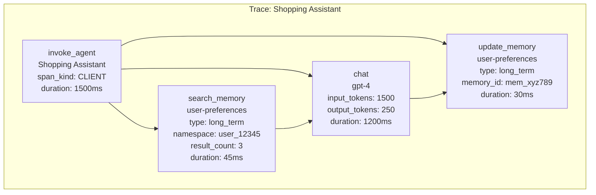
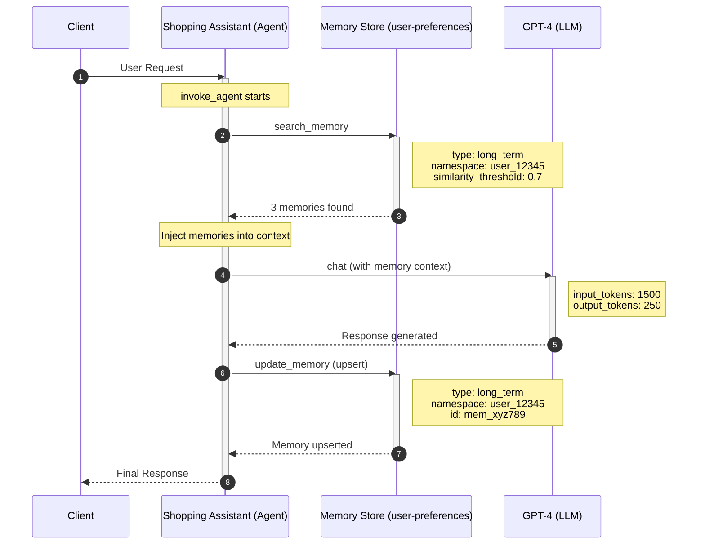
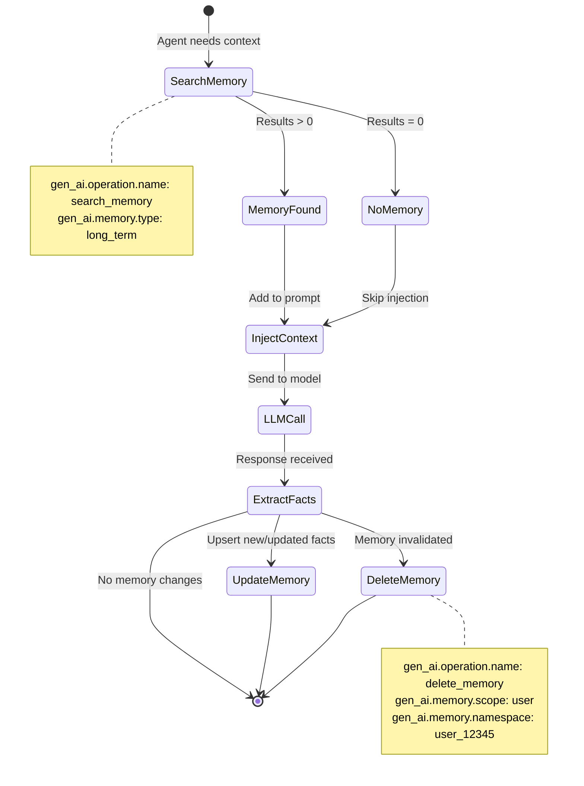

# Memory Operations for GenAI (Revised Implementation Proposal)

Why Memory Matters for Observability:

1. Debugging: Understanding what an agent "remembers" during failures is crucial for root cause analysis.
2. Performance: Memory retrieval latency directly impacts agent response times.
3. Privacy/Compliance: Tracking what’s stored helps with data retention compliance.
4. Cost Optimization: Memory storage and retrieval operations have measurable costs.

## 2. Proposed Semantic Conventions

### 2.1 Revised Operation Names

Add the following values to the `gen_ai.operation.name` enum:

```yaml
- id: search_memory
  value: "search_memory"
  brief: "Search/query memories"
  stability: development

- id: update_memory
  value: "update_memory"
  brief: "Create or update (upsert) memory items"
  stability: development

- id: delete_memory
  value: "delete_memory"
  brief: "Delete memory items (by id, or by scope+namespace)"
  stability: development

- id: create_memory_store
  value: "create_memory_store"
  brief: "Create/initialize a memory store"
  stability: development

- id: delete_memory_store
  value: "delete_memory_store"
  brief: "Delete/deprovision a memory store"
  stability: development
```

Notes:

- `store_memory` is removed; use `update_memory` for both create and update to avoid ambiguity.
- `update_memory` is an **upsert**. If the underlying system distinguishes create vs update, instrumentations MAY add a system-specific attribute to capture that outcome, but SHOULD keep `gen_ai.operation.name` as `update_memory`.

### 2.2 Revised Memory Attributes

```yaml
# Memory Store Identification
- id: gen_ai.memory.store.id
  stability: development
  type: string
  brief: The unique identifier of the memory store.
  examples: ["ms_abc123", "user-preferences-store"]

- id: gen_ai.memory.store.name
  stability: development
  type: string
  brief: Human-readable name of the memory store.
  examples: ["Customer Support Memory", "Shopping Preferences"]

# Memory Item Identification
- id: gen_ai.memory.id
  stability: development
  type: string
  brief: The unique identifier of a memory item.
  examples: ["mem_5j66UpCpwteGg4YSxUnt7lPY"]

# Memory Type (keep as string; provide examples vs hard enum)
- id: gen_ai.memory.type
  stability: development
  type: string
  brief: The type/tier of memory being operated on.
  note: >
    This is intentionally modeled as a free-form string to accommodate framework differences.
    Instrumentations SHOULD use low-cardinality values and document any custom values they emit.
  examples: ["short_term", "long_term"]

# Memory Scope (primarily defined at store creation time)
- id: gen_ai.memory.scope
  stability: development
  type:
    members:
      - id: user
        value: "user"
        brief: "Scoped to a specific user"
        stability: development
      - id: session
        value: "session"
        brief: "Scoped to a session/thread"
        stability: development
      - id: agent
        value: "agent"
        brief: "Scoped to a specific agent"
        stability: development
      - id: team
        value: "team"
        brief: "Shared across a team of agents"
        stability: development
      - id: global
        value: "global"
        brief: "Globally accessible"
        stability: development
  brief: The scope of the memory store or memory operation.
  examples: ["user", "session", "agent"]

# Memory Content (Opt-In due to sensitivity)
- id: gen_ai.memory.content
  stability: development
  type: any
  brief: The content/value of the memory item.
  note: |
    > [!WARNING]
    > This attribute may contain sensitive information including user/PII data.
    >
    > Instrumentations SHOULD NOT capture this by default.
  examples:
    - '{"preference": "dark_mode", "value": true}'

# Memory Query (Opt-In due to sensitivity)
- id: gen_ai.memory.query
  stability: development
  type: string
  brief: The search query used to retrieve memories.
  note: |
    > [!WARNING]
    > This attribute may contain sensitive information.
  examples: ["user dietary preferences", "past flight bookings"]

# Memory Namespace (for multi-tenant isolation)
- id: gen_ai.memory.namespace
  stability: development
  type: string
  brief: Namespace for memory isolation (e.g., user_id, tenant_id).
  examples: ["user_12345", "org_acme"]

# Search Results
- id: gen_ai.memory.search.result.count
  stability: development
  type: int
  brief: Number of memory items returned from a search operation.
  examples: [3, 10]

- id: gen_ai.memory.search.similarity.threshold
  stability: development
  type: double
  brief: Minimum similarity score threshold used for memory search.
  examples: [0.7, 0.85]

# Memory Metadata
- id: gen_ai.memory.expiration_date
  stability: development
  type: string
  brief: Expiration date for the memory in ISO 8601 format.
  examples: ["2025-12-31", "2026-01-15T00:00:00Z"]

- id: gen_ai.memory.importance
  stability: development
  type: double
  brief: Importance score of the memory (0.0 to 1.0).
  examples: [0.8, 0.95]

# Update Strategy
- id: gen_ai.memory.update.strategy
  stability: development
  type:
    members:
      - id: overwrite
        value: "overwrite"
        brief: "Replace existing memory entirely"
        stability: development
      - id: merge
        value: "merge"
        brief: "Merge with existing memory"
        stability: development
      - id: append
        value: "append"
        brief: "Append to existing memory"
        stability: development
  brief: Strategy used when updating memory.
  examples: ["overwrite", "merge"]
```

### 2.3 Memory Spans

#### Create Memory Store Span

```yaml
- id: span.gen_ai.create_memory_store.client
  type: span
  stability: development
  span_kind: client
  brief: >
    Describes creation/initialization of a memory store.
  note: |
    The `gen_ai.operation.name` SHOULD be `create_memory_store`.

    **Span name** SHOULD be `create_memory_store {gen_ai.memory.store.name}`
    or `create_memory_store` if store name is not available.
  attributes:
    - ref: gen_ai.operation.name
      requirement_level: required
    - ref: gen_ai.provider.name
      requirement_level: required
    - ref: gen_ai.memory.store.id
      requirement_level:
        conditionally_required: when returned by the operation
    - ref: gen_ai.memory.store.name
      requirement_level: recommended
    - ref: gen_ai.memory.scope
      requirement_level: required
    - ref: gen_ai.memory.type
      requirement_level:
        conditionally_required: when store is dedicated to a memory type
    - ref: gen_ai.memory.namespace
      requirement_level:
        conditionally_required: when store is namespaced
    - ref: error.type
      requirement_level:
        conditionally_required: if the operation ended in an error
```

#### Search Memory Span

```yaml
- id: span.gen_ai.search_memory.client
  type: span
  stability: development
  span_kind: client
  brief: >
    Describes a memory search/retrieval operation - querying a memory store
    for relevant memories.
  note: |
    The `gen_ai.operation.name` SHOULD be `search_memory`.

    **Span name** SHOULD be `search_memory {gen_ai.memory.store.name}`
    or `search_memory` if store name is not available.
  attributes:
    - ref: gen_ai.operation.name
      requirement_level: required
    - ref: gen_ai.provider.name
      requirement_level: required
    - ref: gen_ai.memory.store.id
      requirement_level:
        conditionally_required: if applicable
    - ref: gen_ai.memory.store.name
      requirement_level: recommended
    - ref: gen_ai.memory.query
      requirement_level: opt_in
    - ref: gen_ai.memory.type
      requirement_level: recommended
    - ref: gen_ai.memory.namespace
      requirement_level:
        conditionally_required: when memory is namespaced
    - ref: gen_ai.memory.search.result.count
      requirement_level: recommended
    - ref: gen_ai.memory.search.similarity.threshold
      requirement_level:
        conditionally_required: when similarity filtering is used
    - ref: gen_ai.agent.id
      requirement_level:
        conditionally_required: when searching agent-scoped memory
    - ref: gen_ai.conversation.id
      requirement_level:
        conditionally_required: when searching session-scoped memory
    - ref: error.type
      requirement_level:
        conditionally_required: if the operation ended in an error
```

#### Update Memory Span (Upsert)

```yaml
- id: span.gen_ai.update_memory.client
  type: span
  stability: development
  span_kind: client
  brief: >
    Describes a memory update operation (upsert) - creating or modifying
    memory items in a memory store.
  note: |
    The `gen_ai.operation.name` SHOULD be `update_memory`.

    This operation is an upsert to avoid ambiguity between create vs update.

    **Span name** SHOULD be `update_memory {gen_ai.memory.store.name}`
    or `update_memory` if store name is not available.
  attributes:
    - ref: gen_ai.operation.name
      requirement_level: required
    - ref: gen_ai.provider.name
      requirement_level: required
    - ref: gen_ai.memory.store.id
      requirement_level:
        conditionally_required: if applicable
    - ref: gen_ai.memory.store.name
      requirement_level: recommended
    - ref: gen_ai.memory.id
      requirement_level:
        conditionally_required: when available (provided or returned)
    - ref: gen_ai.memory.update.strategy
      requirement_level: recommended
    - ref: gen_ai.memory.type
      requirement_level: recommended
    - ref: gen_ai.memory.namespace
      requirement_level:
        conditionally_required: when memory is namespaced
    - ref: gen_ai.memory.content
      requirement_level: opt_in
    - ref: gen_ai.memory.expiration_date
      requirement_level:
        conditionally_required: if expiration is set
    - ref: gen_ai.memory.importance
      requirement_level: recommended
    - ref: gen_ai.agent.id
      requirement_level:
        conditionally_required: when operating on agent-scoped memory
    - ref: gen_ai.conversation.id
      requirement_level:
        conditionally_required: when operating on session-scoped memory
    - ref: error.type
      requirement_level:
        conditionally_required: if the operation ended in an error
```

#### Delete Memory Span

```yaml
- id: span.gen_ai.delete_memory.client
  type: span
  stability: development
  span_kind: client
  brief: >
    Describes a memory deletion operation - removing one or more memory items.
  note: |
    The `gen_ai.operation.name` SHOULD be `delete_memory`.

    **Span name** SHOULD be `delete_memory {gen_ai.memory.store.name}`
    or `delete_memory` if store name is not available.

    Deletion semantics SHOULD be interpreted as follows:

    - If `gen_ai.memory.id` is set, delete a specific memory item.
    - If `gen_ai.memory.id` is not set, delete all memory items in the specified
      `gen_ai.memory.scope` (and within `gen_ai.memory.namespace`, if applicable).
  attributes:
    - ref: gen_ai.operation.name
      requirement_level: required
    - ref: gen_ai.provider.name
      requirement_level: required
    - ref: gen_ai.memory.store.id
      requirement_level:
        conditionally_required: if applicable
    - ref: gen_ai.memory.store.name
      requirement_level: recommended
    - ref: gen_ai.memory.scope
      requirement_level: required
    - ref: gen_ai.memory.id
      requirement_level:
        conditionally_required: when deleting a specific memory item
    - ref: gen_ai.memory.type
      requirement_level:
        conditionally_required: when deleting by type
    - ref: gen_ai.memory.namespace
      requirement_level:
        conditionally_required: when memory is namespaced
    - ref: gen_ai.agent.id
      requirement_level:
        conditionally_required: when deleting agent-scoped memory
    - ref: gen_ai.conversation.id
      requirement_level:
        conditionally_required: when deleting session-scoped memory
    - ref: error.type
      requirement_level:
        conditionally_required: if the operation ended in an error
```

#### Delete Memory Store Span

```yaml
- id: span.gen_ai.delete_memory_store.client
  type: span
  stability: development
  span_kind: client
  brief: >
    Describes deletion/deprovisioning of a memory store.
  note: |
    The `gen_ai.operation.name` SHOULD be `delete_memory_store`.

    **Span name** SHOULD be `delete_memory_store {gen_ai.memory.store.name}`
    or `delete_memory_store` if store name is not available.
  attributes:
    - ref: gen_ai.operation.name
      requirement_level: required
    - ref: gen_ai.provider.name
      requirement_level: required
    - ref: gen_ai.memory.store.id
      requirement_level:
        conditionally_required: if applicable
    - ref: gen_ai.memory.store.name
      requirement_level: recommended
    - ref: gen_ai.memory.namespace
      requirement_level:
        conditionally_required: when store is namespaced
    - ref: error.type
      requirement_level:
        conditionally_required: if the operation ended in an error
```

## Example Trace

Here is an example trace for a personalized shopping agent that uses a user-scoped, long-term memory store.

```
invoke_agent "Shopping Assistant" (span_kind: CLIENT)
  ├── gen_ai.agent.name: "Shopping Assistant"
  ├── gen_ai.provider.name: "azure.ai.inference"
  │
  ├── search_memory "user-preferences" (span_kind: CLIENT)
  │   ├── gen_ai.operation.name: "search_memory"
  │   ├── gen_ai.memory.store.name: "user-preferences"
  │   ├── gen_ai.memory.type: "long_term"
  │   ├── gen_ai.memory.namespace: "user_12345"
  │   ├── gen_ai.memory.search.result.count: 3
  │   └── duration: 45ms
  │
  ├── chat gpt-4 (span_kind: CLIENT)
  │   ├── gen_ai.operation.name: "chat"
  │   ├── gen_ai.usage.input_tokens: 1500
  │   ├── gen_ai.usage.output_tokens: 250
  │   └── duration: 1200ms
  │
  └── update_memory "user-preferences" (span_kind: CLIENT)
      ├── gen_ai.operation.name: "update_memory"
      ├── gen_ai.memory.store.name: "user-preferences"
      ├── gen_ai.memory.type: "long_term"
      ├── gen_ai.memory.namespace: "user_12345"
      ├── gen_ai.memory.id: "mem_xyz789"
      └── duration: 30ms
```

## Diagrams

```mermaid
gantt
    title GenAI Agent Trace with Memory Operations
    dateFormat X
    axisFormat %L ms

    section Agent
    invoke_agent "Shopping Assistant" :0, 1500

    section Memory
    search_memory "user-preferences" :0, 45
    update_memory "user-preferences" :1470, 30

    section LLM
    chat gpt-4 :50, 1200
```









```mermaid
flowchart LR
    subgraph Client["Client Application"]
        U[User Request]
    end

    subgraph Agent["GenAI Agent"]
        direction TB
        A[Agent Orchestrator]

        subgraph ops["Memory Operations"]
            S[search_memory]
            UP[update_memory (upsert)]
            D[delete_memory]
        end

        L[LLM Call]
    end

    subgraph MemoryLayer["Memory Layer"]
        direction TB

        subgraph stores["Memory Stores"]
            MS1[(User Memory Store)]
            MS2[(Session Memory Store)]
            MS3[(Agent Memory Store)]
        end

        subgraph tiers["Memory Types (examples)"]
            T1[short_term]
            T2[long_term]
        end
    end

    U --> A
    A --> S
    A --> L
    L --> UP
    L --> D

    S <--> MS1
    S <--> MS2
    S <--> MS3

    UP --> MS1
    UP --> MS2
    UP --> MS3

    MS1 --- T2
    MS2 --- T1
    MS3 --- T2
```
