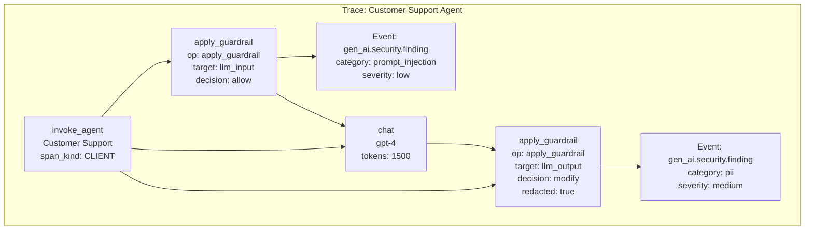
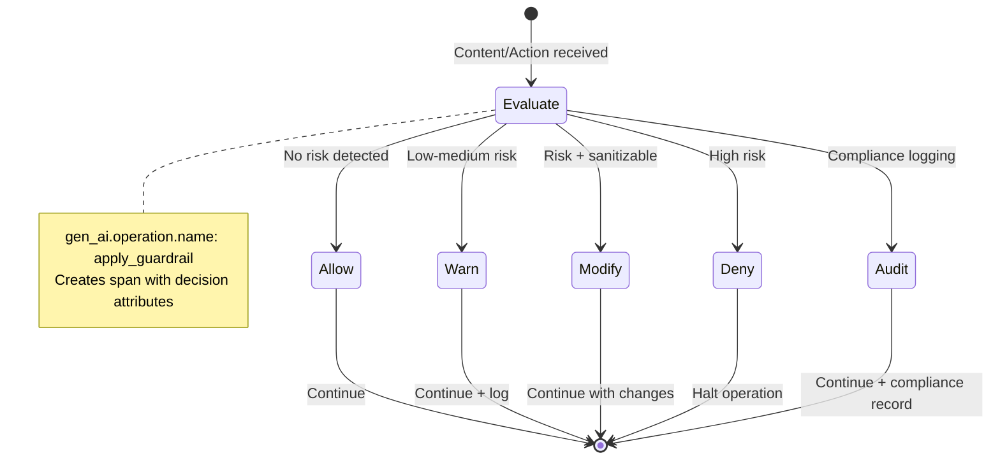
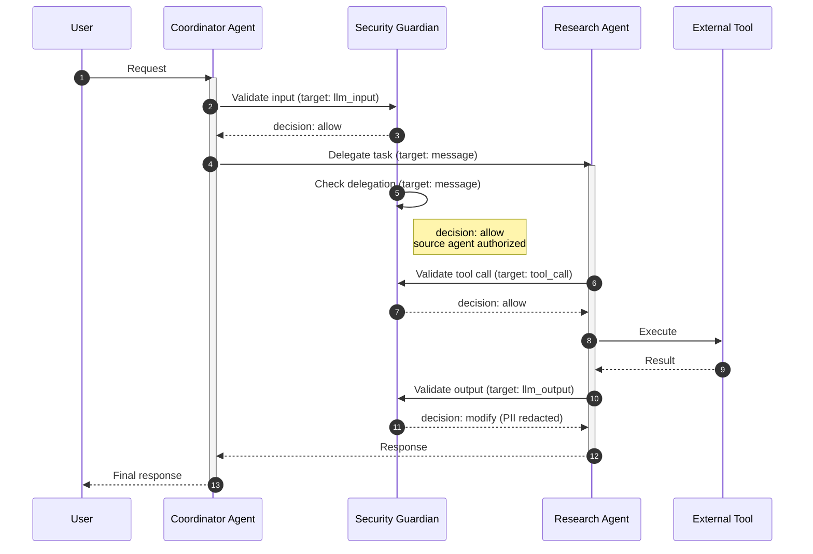
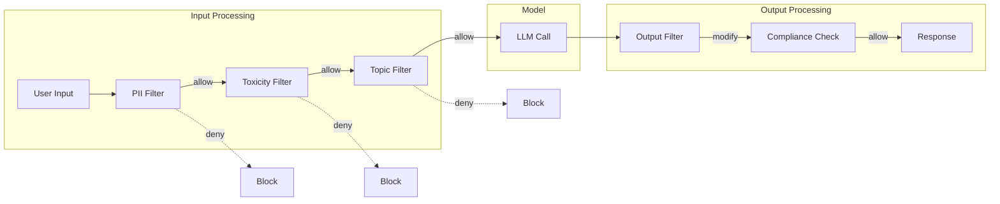

# Security Guardian Operations for GenAI (Non-Normative Implementation Guide)

This document provides implementation guidance for the GenAI security semantic conventions. It is **non-normative** and intended to help instrumentation authors and platform engineers understand the design rationale, common patterns, and practical examples.

For the normative specification, see [gen-ai-security.md](../gen-ai-security.md).

<!-- toc -->

- [1. Why Security Observability Matters for GenAI](#1-why-security-observability-matters-for-genai)
  - [1.1 The Observability Gap](#11-the-observability-gap)
  - [1.2 Key Use Cases](#12-key-use-cases)
- [2. Core Concepts](#2-core-concepts)
  - [2.1 Guardian vs Guardrail Terminology](#21-guardian-vs-guardrail-terminology)
  - [2.2 Decision Model](#22-decision-model)
  - [2.3 Target Types](#23-target-types)
- [3. Span and Event Design](#3-span-and-event-design)
  - [3.1 The `apply_guardrail` Span](#31-the-apply_guardrail-span)
  - [3.2 The `gen_ai.security.finding` Event](#32-the-gen_aisecurityfinding-event)
  - [3.3 Span Hierarchy](#33-span-hierarchy)
- [4. Attribute Deep Dive](#4-attribute-deep-dive)
  - [4.1 Guardian Identity](#41-guardian-identity)
  - [4.2 Security Decision](#42-security-decision)
  - [4.3 Target Specification](#43-target-specification)
  - [4.4 Policy Information](#44-policy-information)
  - [4.5 Risk Assessment](#45-risk-assessment)
  - [4.6 Content Capture](#46-content-capture)
- [5. Real-World Scenarios](#5-real-world-scenarios)
  - [5.1 Input/Output Content Filtering](#51-inputoutput-content-filtering)
  - [5.2 Multi-Tenant Policy Enforcement](#52-multi-tenant-policy-enforcement)
  - [5.3 Multi-Agent Security Boundaries](#53-multi-agent-security-boundaries)
  - [5.4 Conversation-Aware Threat Detection](#54-conversation-aware-threat-detection)
  - [5.5 Guardian Error Handling](#55-guardian-error-handling)
- [6. Integration Patterns](#6-integration-patterns)
  - [6.1 Framework Integration](#61-framework-integration)
  - [6.2 Provider-Specific Mapping](#62-provider-specific-mapping)
- [7. Design Rationale](#7-design-rationale)
  - [7.1 Why Separate Guardian Spans?](#71-why-separate-guardian-spans)
  - [7.2 Why Events for Findings?](#72-why-events-for-findings)
  - [7.3 Why OWASP LLM Top 10 Alignment?](#73-why-owasp-llm-top-10-alignment)
  - [7.4 Why Free-Form Risk Categories?](#74-why-free-form-risk-categories)
- [8. Diagrams](#8-diagrams)
  - [Trace Structure](#trace-structure)
  - [Decision Flow](#decision-flow)
  - [Multi-Agent Security Boundaries](#multi-agent-security-boundaries)
  - [Guardian Chain](#guardian-chain)

<!-- tocstop -->

## 1. Why Security Observability Matters for GenAI

### 1.1 The Observability Gap

GenAI systems introduce unique security challenges that traditional observability does not address:

| Challenge | Traditional Approach | GenAI Reality |
|-----------|---------------------|---------------|
| **Input validation** | Schema validation, sanitization | Prompt injection, jailbreak attempts |
| **Output control** | Response codes, error handling | PII leakage, harmful content, hallucinations |
| **Access control** | RBAC, API keys | Agent autonomy, tool permissions, data boundaries |
| **Audit trail** | Request/response logs | Multi-turn conversations, agent reasoning chains |
| **Threat detection** | WAF, IDS signatures | Semantic attacks, social engineering via prompts |

Existing GenAI semantic conventions cover model calls, agent invocations, and tool executions—but they don't capture the **security layer** that evaluates and enforces policies on these operations.

### 1.2 Key Use Cases

Security observability enables:

1. **Incident Investigation**: When a breach occurs, trace exactly which guardian evaluated what content, what decision was made, and why.

2. **Compliance Auditing**: Demonstrate that security controls were active and enforced for regulated workloads.

3. **Policy Tuning**: Analyze false positive/negative rates across guardians to optimize policies without breaking legitimate use cases.

4. **Cross-Provider Correlation**: Unify security telemetry from AWS Bedrock Guardrails, Azure Content Safety, custom guardrails, and framework-level protections.

5. **Attack Pattern Analysis**: Detect multi-turn jailbreak attempts, credential extraction, and social engineering by correlating decisions across conversations.

## 2. Core Concepts

### 2.1 Guardian vs Guardrail Terminology

The semantic conventions use **guardian** to describe the evaluating service/component and **guardrail** for the policy configuration:

| Term | Definition | Example |
|------|------------|---------|
| **Guardian** | The service or component that performs security evaluation | Azure Content Safety, Bedrock Guardrail Service, custom PII filter |
| **Guardrail/Policy** | The specific configuration or rules applied | "PII Detection Policy v2", "Financial Advice Blocklist" |

This distinction matters because:

- A single **guardian** (e.g., Azure Content Safety) can enforce multiple **policies**
- Telemetry should identify both the evaluator and the specific rules that triggered

### 2.2 Decision Model

Guardians produce one of five decision types:

| Decision | Meaning | Downstream Behavior |
|----------|---------|---------------------|
| `allow` | Content/action passes all checks | Continue without modification |
| `deny` | Content/action blocked | Halt operation, return error |
| `modify` | Content transformed (redaction, sanitization) | Continue with modified content |
| `warn` | Content flagged but permitted | Continue, log for review |
| `audit` | Content logged for compliance | Continue, no enforcement |

This model aligns with the [OWASP Agent Observability Standard](https://aos.owasp.org/spec/trace/events/) decision framework.

### 2.3 Target Types

`gen_ai.security.target.type` is a free-form string to accommodate provider-specific,
organization-specific, or emerging target types.

Suggested values include:

| Target Type | Description | When Used |
|-------------|-------------|-----------|
| `llm_input` | Prompts/messages sent to model | Input content filtering |
| `llm_output` | Responses from model | Output content filtering |
| `tool_call` | Tool execution requests | Tool permission enforcement |
| `tool_definition` | Tool schemas at registration | Capability validation |
| `message` | Inter-agent messages | Agent boundary protection |
| `memory_store` | Data written to memory | Data exfiltration prevention |
| `memory_retrieve` | Data read from memory | Access control enforcement |
| `knowledge_query` | RAG queries | Query restriction |
| `knowledge_result` | RAG results | Result filtering |

## 3. Span and Event Design

### 3.1 The `apply_guardrail` Span

The `apply_guardrail` span represents a single guardian evaluation:

```
apply_guardrail Content Filter (INTERNAL span)
├── gen_ai.operation.name: apply_guardrail
├── gen_ai.guardian.name: "Content Filter"
├── gen_ai.guardian.id: "guard_abc123"
├── gen_ai.guardian.provider.name: "azure.ai.content_safety"
├── gen_ai.security.target.type: llm_input
├── gen_ai.security.decision.type: warn
├── gen_ai.security.decision.reason: "Potential prompt injection detected, flagged for review"
└── duration: 45ms
```

**Span kind**: `INTERNAL` - Guardian evaluation is typically an internal operation within the application, not a remote call (even if it calls external services, the span represents the evaluation decision).

**Span name**: `apply_guardrail {gen_ai.guardian.name}` or `apply_guardrail {gen_ai.security.target.type}` if guardian name is unavailable.

**Note**: `gen_ai.security.decision.reason` is conditionally required when the decision is not `allow` and a reason is available. For `allow` decisions, this attribute is typically omitted.

### 3.2 The `gen_ai.security.finding` Event

Individual security findings are emitted as events under the guardian span:

```
Event: gen_ai.security.finding
├── gen_ai.security.risk.category: prompt_injection
├── gen_ai.security.risk.severity: medium
├── gen_ai.security.risk.score: 0.72
├── gen_ai.security.risk.metadata: ["pattern:ignore_instructions", "position:input[0]"]
├── gen_ai.security.policy.id: policy_injection_v2
└── gen_ai.security.policy.name: "Prompt Injection Detection"
```

**Why events?** A single guardian evaluation may detect multiple distinct risks (e.g., PII + prompt injection in the same input). Events allow capturing each finding independently while maintaining the parent relationship to the guardian span.

### 3.3 Span Hierarchy

Guardian spans SHOULD be children of the operation they protect. The following example shows the span hierarchy (some required attributes omitted for brevity—see full examples in Section 5):

```
invoke_agent Customer Support (CLIENT span)
├── gen_ai.agent.id: agent_support_v2
│
├── apply_guardrail Input Filter (INTERNAL span)
│   ├── gen_ai.operation.name: apply_guardrail
│   ├── gen_ai.security.target.type: llm_input
│   └── gen_ai.security.decision.type: allow
│
├── chat gpt-4 (CLIENT span)
│   └── gen_ai.operation.name: chat
│
├── apply_guardrail Output Filter (INTERNAL span)
│   ├── gen_ai.operation.name: apply_guardrail
│   ├── gen_ai.security.target.type: llm_output
│   └── gen_ai.security.decision.type: allow
│
└── execute_tool send_email (INTERNAL span)
    │
    └── apply_guardrail Tool Guard (INTERNAL span)
        ├── gen_ai.operation.name: apply_guardrail
        ├── gen_ai.security.target.type: tool_call
        └── gen_ai.security.decision.type: allow
```

Multiple guardians MAY be chained under a single operation (e.g., PII filter → toxicity filter → topic filter).

## 4. Attribute Deep Dive

### 4.1 Guardian Identity

| Attribute | Purpose | Example |
|-----------|---------|---------|
| `gen_ai.guardian.id` | Unique identifier of the evaluating service | `guard_abc123` |
| `gen_ai.guardian.name` | Human-readable name | `Azure Content Safety` |
| `gen_ai.guardian.version` | Service/component version | `2024-05-01` |
| `gen_ai.guardian.provider.name` | Vendor/provider | `azure.ai.content_safety` |

**Note**: `gen_ai.guardian.id` identifies the **evaluation service**, NOT the policy. For provider-specific policy IDs (like AWS Bedrock guardrail ARNs), use `gen_ai.security.policy.id`.

### 4.2 Security Decision

| Attribute | Purpose | Example |
|-----------|---------|---------|
| `gen_ai.security.decision.type` | The decision made (allow/deny/modify/warn/audit) | `modify` |
| `gen_ai.security.decision.reason` | Human-readable explanation | `PII detected, masked` |
| `gen_ai.security.decision.code` | Provider-specific numeric code | `112` |

**Requirement**: `decision.reason` is conditionally required when decision is NOT `allow` **and** a reason is available. Instrumentations should not fabricate reasons when the guardian does not provide one. The value SHOULD be low-cardinality and MUST NOT contain sensitive user content or PII.

### 4.3 Target Specification

| Attribute | Purpose | Example |
|-----------|---------|---------|
| `gen_ai.security.target.type` | What's being evaluated | `llm_input` |
| `gen_ai.security.target.id` | Specific target identifier | `call_xyz789` |

### 4.4 Policy Information

| Attribute | Purpose | Example |
|-----------|---------|---------|
| `gen_ai.security.policy.id` | Policy identifier (including provider-specific) | `arn:aws:bedrock:...:guardrail/abc` |
| `gen_ai.security.policy.name` | Human-readable policy name | `PII Protection Policy` |
| `gen_ai.security.policy.version` | Policy version | `1.0` |
| `gen_ai.security.external_event_id` | External correlation ID for SIEM/incident systems | `evt_abc123` |

### 4.5 Risk Assessment

| Attribute | Purpose | Example |
|-----------|---------|---------|
| `gen_ai.security.risk.category` | Type of risk detected | `prompt_injection` |
| `gen_ai.security.risk.severity` | Severity level (none/low/medium/high/critical) | `high` |
| `gen_ai.security.risk.score` | Numeric confidence (0.0-1.0) | `0.85` |
| `gen_ai.security.risk.metadata` | Non-content metadata | `["field:bcc", "count:2"]` |

> **WARNING**: `gen_ai.security.risk.metadata` MUST NOT contain sensitive user content, PII, or other high-risk data. Use only structural metadata like field names, pattern types, counts, or positions.

**Risk categories** are free-form strings with suggested values aligned to OWASP LLM Top 10 2025:

- `prompt_injection` (LLM01)
- `sensitive_info_disclosure` (LLM02)
- `supply_chain` (LLM03)
- `data_and_model_poisoning` (LLM04)
- `improper_output_handling` (LLM05)
- `excessive_agency` (LLM06)
- `system_prompt_leakage` (LLM07)
- `vector_and_embedding_weaknesses` (LLM08)
- `misinformation` (LLM09)
- `unbounded_consumption` (LLM10)

Instrumentations MAY use additional values: `jailbreak`, `toxicity`, `pii`, `custom:*`, `azure:*`, etc.

### 4.6 Content Capture

| Attribute | Purpose | Requirement Level | Example |
|-----------|---------|-------------------|---------|
| `gen_ai.security.content.input.value` | Raw input evaluated | Opt-In | `Send email to john@example.com` |
| `gen_ai.security.content.output.value` | Modified output | Opt-In | `Send email to [REDACTED]` |
| `gen_ai.security.content.input.hash` | Content hash for correlation | Conditionally Required (if correlation needed and available) | `sha256:a3f2b8c9...` |
| `gen_ai.security.content.redacted` | Whether content was modified | Conditionally Required (if decision is `modify`) | `true` |

> **WARNING**: `content.input.value` and `content.output.value` may contain sensitive information. Instrumentations SHOULD NOT capture these by default. Enable only via explicit opt-in configuration.

**Note**: `content.redacted` and `content.input.hash` are NOT opt-in—they are conditionally required per the spec when applicable (modify decisions and correlation scenarios, respectively). `content.input.hash` is only required when correlation is needed **and** the guardian can provide the input content to hash.

## 5. Real-World Scenarios

### 5.1 Input/Output Content Filtering

A typical pattern for protecting LLM interactions:

```
chat gpt-4 (CLIENT span)
├── gen_ai.operation.name: chat
├── gen_ai.request.model: gpt-4
│
├── apply_guardrail Input Filter (INTERNAL span) [BEFORE model call]
│   ├── gen_ai.operation.name: apply_guardrail
│   ├── gen_ai.security.target.type: llm_input
│   ├── gen_ai.security.decision.type: allow
│   └── Events:
│       └── gen_ai.security.finding
│           ├── gen_ai.security.risk.category: prompt_injection
│           ├── gen_ai.security.risk.severity: low
│           └── gen_ai.security.risk.score: 0.15
│
└── apply_guardrail Output Filter (INTERNAL span) [AFTER model call]
    ├── gen_ai.operation.name: apply_guardrail
    ├── gen_ai.security.target.type: llm_output
    ├── gen_ai.security.decision.type: modify
    ├── gen_ai.security.content.redacted: true
    └── Events:
        └── gen_ai.security.finding
            ├── gen_ai.security.risk.category: pii
            └── gen_ai.security.risk.severity: medium
```

### 5.2 Multi-Tenant Policy Enforcement

Different tenants with different security policies:

```
# Acme Corp - Strict PII policy
chat gpt-4 (tenant.id: acme_corp)
└── apply_guardrail Content Filter
    ├── gen_ai.operation.name: apply_guardrail
    ├── gen_ai.security.target.type: llm_input
    ├── gen_ai.security.policy.id: acme_pii_strict_v2
    ├── gen_ai.security.decision.type: deny
    └── gen_ai.security.decision.reason: "Financial advice prohibited for this tenant"

# TechStartup - Relaxed policy
chat gpt-4 (tenant.id: techstartup)
└── apply_guardrail Content Filter
    ├── gen_ai.operation.name: apply_guardrail
    ├── gen_ai.security.target.type: llm_input
    ├── gen_ai.security.policy.id: techstartup_permissive_v1
    └── gen_ai.security.decision.type: allow
```

### 5.3 Multi-Agent Security Boundaries

Protecting agent delegation and inter-agent communication:

```
invoke_agent Coordinator (CLIENT span)
├── gen_ai.agent.id: coordinator_v2
│
├── create_agent Research (CLIENT span)
│   │
│   └── apply_guardrail Tool Validator (INTERNAL span)
│       ├── gen_ai.operation.name: apply_guardrail
│       ├── gen_ai.security.target.type: tool_definition
│       ├── gen_ai.security.decision.type: deny
│       └── gen_ai.security.decision.reason: "shell_exec tool blocked"
│
└── invoke_agent Communication (nested CLIENT span)
    │
    ├── apply_guardrail Delegation Guard (INTERNAL span)
    │   ├── gen_ai.operation.name: apply_guardrail
    │   ├── gen_ai.security.target.type: message
    │   └── gen_ai.security.decision.type: allow
    │
    └── apply_guardrail Message Guard (INTERNAL span)
        ├── gen_ai.operation.name: apply_guardrail
        ├── gen_ai.security.target.type: message
        ├── gen_ai.security.decision.type: deny
        └── Events:
            └── gen_ai.security.finding
                ├── gen_ai.security.risk.category: prompt_injection
                └── gen_ai.security.risk.severity: high
```

### 5.4 Conversation-Aware Threat Detection

Detecting multi-turn jailbreak attacks using conversation correlation:

```
invoke_agent Security Assistant (CLIENT span)
├── gen_ai.conversation.id: conv_jailbreak_001
│
├── turn_1 (child span)
│   └── apply_guardrail Input Guard
│       ├── gen_ai.operation.name: apply_guardrail
│       ├── gen_ai.security.target.type: llm_input
│       ├── gen_ai.security.decision.type: allow
│       └── Events:
│           └── gen_ai.security.finding
│               ├── gen_ai.security.risk.category: prompt_injection
│               ├── gen_ai.security.risk.severity: low
│               └── gen_ai.security.risk.score: 0.15
│
├── turn_2 (child span)
│   └── apply_guardrail Input Guard
│       ├── gen_ai.operation.name: apply_guardrail
│       ├── gen_ai.security.target.type: llm_input
│       ├── gen_ai.security.decision.type: warn
│       └── Events:
│           └── gen_ai.security.finding
│               ├── gen_ai.security.risk.category: prompt_injection
│               ├── gen_ai.security.risk.severity: medium
│               ├── gen_ai.security.risk.score: 0.45
│               └── gen_ai.security.risk.metadata: ["cumulative_risk:0.60"]
│
└── turn_3 (child span)
    └── apply_guardrail Input Guard
        ├── gen_ai.operation.name: apply_guardrail
        ├── gen_ai.security.target.type: llm_input
        ├── gen_ai.security.decision.type: deny
        └── Events:
            └── gen_ai.security.finding
                ├── gen_ai.security.risk.category: jailbreak
                ├── gen_ai.security.risk.severity: high
                └── gen_ai.security.risk.score: 0.85
```

The `gen_ai.conversation.id` enables correlation of findings across turns to detect "slow-burn" attacks.

### 5.5 Guardian Error Handling

When the guardian service itself fails:

```
# Fail-Open Mode
apply_guardrail External Guardian
├── gen_ai.operation.name: apply_guardrail
├── gen_ai.security.target.type: llm_input
├── error.type: GuardianTimeoutError
├── gen_ai.security.decision.type: warn
├── gen_ai.security.decision.reason: "Guardian unavailable, fail-open policy applied"
└── Events:
    └── gen_ai.security.finding
        ├── gen_ai.security.risk.category: custom:guardian_unavailable
        └── gen_ai.security.risk.severity: medium

# Fail-Closed Mode
apply_guardrail External Guardian
├── gen_ai.operation.name: apply_guardrail
├── gen_ai.security.target.type: llm_input
├── error.type: GuardianTimeoutError
├── gen_ai.security.decision.type: deny
├── gen_ai.security.decision.reason: "Guardian unavailable, fail-closed policy applied"
└── Events:
    └── gen_ai.security.finding
        ├── gen_ai.security.risk.category: custom:guardian_unavailable
        └── gen_ai.security.risk.severity: high
```

## 6. Integration Patterns

### 6.1 Framework Integration

The semantic conventions can be integrated with popular agent frameworks:

| Framework | Hook Points | ID Mapping |
|-----------|-------------|------------|
| **LangChain** | Callbacks (on_llm_start, on_tool_start) | `chain_id` → `gen_ai.agent.id`, `session_id` or stable thread ID → `gen_ai.conversation.id` |
| **LangGraph** | Guard nodes, tool wrappers | `graph_id.node_id` → `gen_ai.agent.id`, `thread_id` → `gen_ai.conversation.id` |
| **Semantic Kernel** | Function filters, plugin interception | `kernel_id` → `gen_ai.agent.id`, `chat_id` → `gen_ai.conversation.id` |
| **MCP** | Tool/resource/prompt interception | `server_name` → `gen_ai.agent.id`, `session_id` → `gen_ai.conversation.id` |

**Note**: For `gen_ai.conversation.id`, prefer stable session or thread identifiers that persist across multiple turns. Avoid per-invocation IDs (like LangChain's `run_id`) which are too granular and break multi-turn correlation.

### 6.2 Provider-Specific Mapping

| Provider | Guardian ID | Policy ID |
|----------|-------------|-----------|
| **AWS Bedrock** | `bedrock_guardrail_service` | Guardrail ARN: `arn:aws:bedrock:...:guardrail/abc` |
| **Azure Content Safety** | `azure.ai.content_safety` | Blocklist ID, custom category ID |
| **Custom** | Service name/ID | Internal policy identifiers |

## 7. Design Rationale

### 7.1 Why Separate Guardian Spans?

**Alternative considered**: Expanding agent/chat spans with security attributes.

**Decision**: Separate `apply_guardrail` spans because:

1. **Multiple guardians**: A single operation may have multiple guardians (input filter + output filter + tool validator). Separate spans allow distinct timing and decision tracking.

2. **Consistent with database conventions**: OTel database conventions use separate spans per operation. Security evaluations follow this pattern.

3. **Clear ownership**: Guardian spans clearly show which component made which decision, enabling root cause analysis.

4. **Framework-agnostic**: Works whether guardian is framework-integrated, standalone service, or inline code.

### 7.2 Why Events for Findings?

**Alternative considered**: Additional span attributes or separate spans per finding.

**Decision**: Events because:

1. **One guardian, multiple findings**: A single evaluation may detect PII, toxicity, AND prompt injection. Events capture each independently.

2. **Semantic relationship**: Findings are conceptually "things that happened during evaluation", which aligns with OTel event semantics.

3. **Attribute efficiency**: Findings share the guardian span's context (target, decision) without duplication.

### 7.3 Why OWASP LLM Top 10 Alignment?

The suggested risk categories align with [OWASP LLM Top 10 2025](https://genai.owasp.org/llm-top-10/) because:

1. **Industry standard**: Widely recognized classification for LLM security risks.

2. **Compliance mapping**: Organizations can map their security findings to known vulnerability categories.

3. **Cross-vendor correlation**: Different providers can emit comparable risk categories.

### 7.4 Why Free-Form Risk Categories?

**Alternative considered**: Strict enum of risk categories.

**Decision**: Free-form string with suggested values because:

1. **Evolving threat landscape**: New attack categories emerge faster than spec updates.

2. **Provider diversity**: Azure, AWS, and custom guardians have different category taxonomies.

3. **Organization-specific**: Enterprises define custom risk categories (e.g., `custom:financial_advice_violation`).

4. **Backward compatibility**: Adding new categories doesn't break existing instrumentations.

## 8. Diagrams

### Trace Structure



### Decision Flow



### Multi-Agent Security Boundaries



### Guardian Chain


