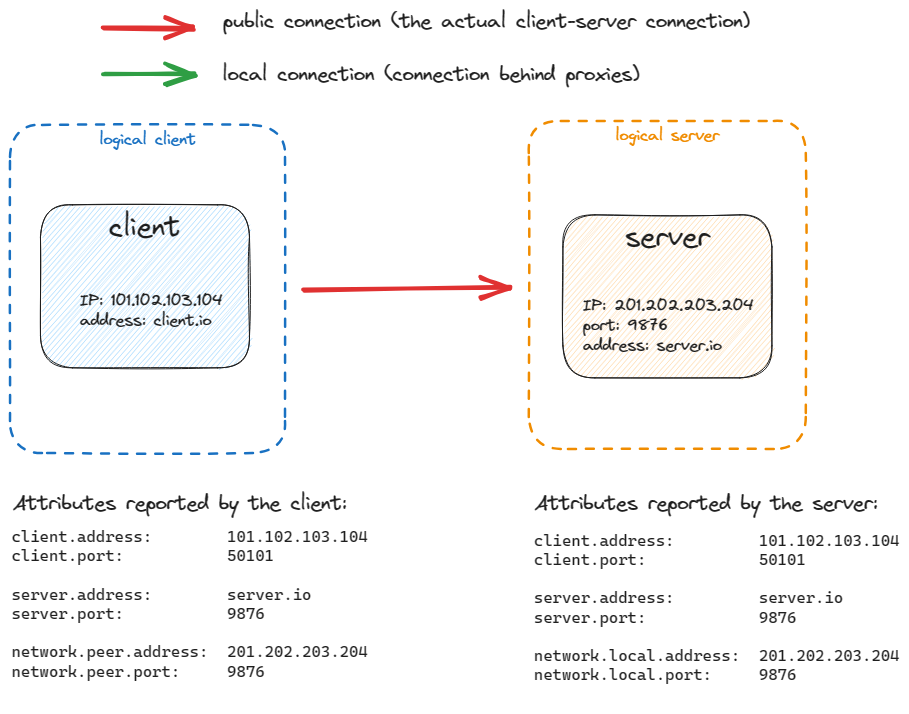
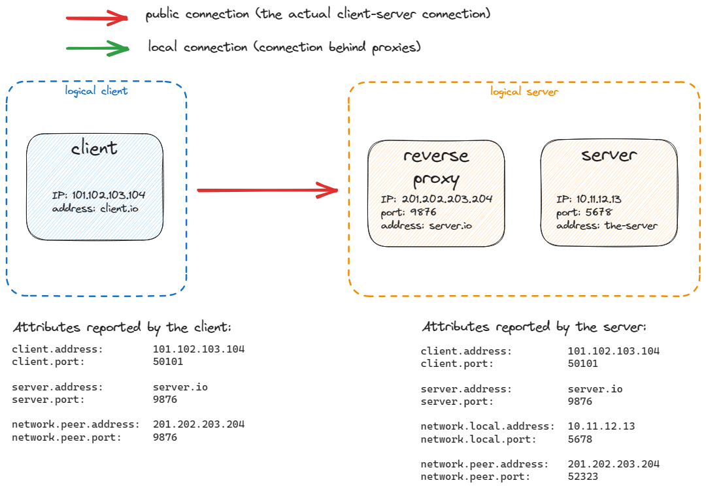
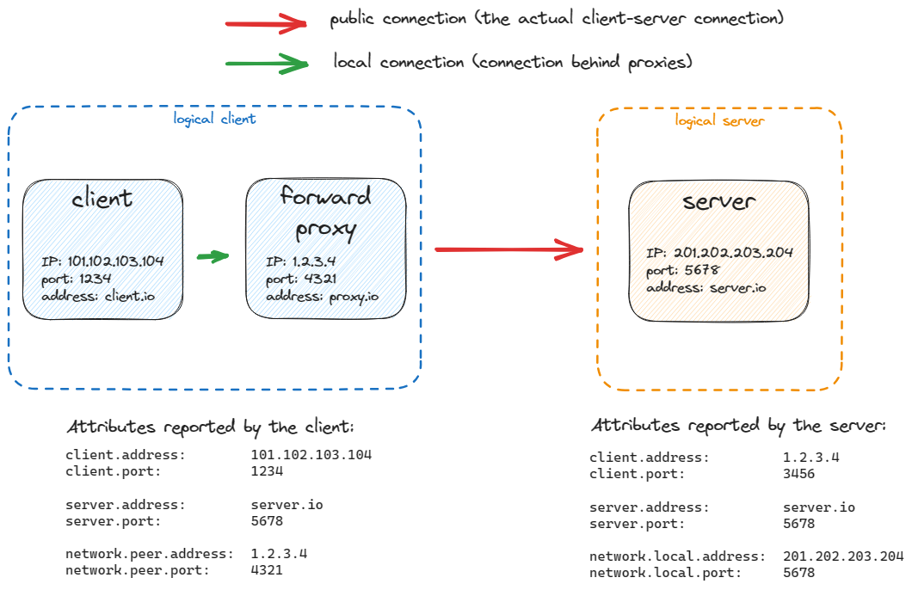

<!--- Hugo front matter used to generate the website version of this page:
linkTitle: Attributes
aliases: [general-attributes]
--->

# General attributes

**Status**: [Development][DocumentStatus]

The attributes described in this section are not specific to a particular operation but rather generic.
They may be used in any Span they apply to.
Particular operations may refer to or require some of these attributes.

<!-- START doctoc -->

- [Network communication attributes](#network-communication-attributes)
  - [Address and port attributes](#address-and-port-attributes)
  - [Choosing address and port attributes](#choosing-address-and-port-attributes)
    - [Why these pairs are not interchangeable](#why-these-pairs-are-not-interchangeable)
    - [How they coexist](#how-they-coexist)
    - [Decision guide](#decision-guide)
    - [Direction mapping](#direction-mapping)
    - [What flow exporters observe](#what-flow-exporters-observe)
    - [Open questions (draft — for SIG discussion)](#open-questions-draft--for-sig-discussion)
  - [Server attributes](#server-attributes)
    - [`server.address`](#serveraddress)
  - [Client attributes](#client-attributes)
  - [Source and destination attributes](#source-and-destination-attributes)
    - [Source](#source)
    - [Destination](#destination)
  - [Other network attributes](#other-network-attributes)
    - [`network.peer.*` and `network.local.*` attributes](#networkpeer-and-networklocal-attributes)
      - [Client/server examples using `network.peer.*`](#clientserver-examples-using-networkpeer)
        - [Simple client/server example](#simple-clientserver-example)
        - [Client/server example with reverse proxy](#clientserver-example-with-reverse-proxy)
        - [Client/server example with forward proxy](#clientserver-example-with-forward-proxy)
- [General remote service attributes](#general-remote-service-attributes)
  - [Service Peer](#service-peer)
- [General thread attributes](#general-thread-attributes)
- [Source code attributes](#source-code-attributes)

<!-- END doctoc -->

<!-- Keep old anchor IDs -->
<a id="server-and-client-attributes"></a>
<a id="server-client-and-shared-network-attributes"></a>

## Network communication attributes

Network communication attributes describe _who_ is communicating and _how_: the addresses and
ports that identify the two parties, together with the transport and protocol carrying the
exchange.

Attributing an address to a communication is harder than it first appears, because the same
exchange looks different depending on where it is observed:

- At a communicating **endpoint**, a process sees its own socket and the socket of whatever it is
  directly connected to - which may be the other party, or an intermediary.
- At an **intermediary** such as a proxy, load balancer, or NAT gateway, addresses are frequently
  rewritten, so the addresses on the inbound side differ from those on the outbound side.
- At a **pass-through observer** such as a switch or router interface, a network tap, or a flow
  exporter, there may be no socket at all - only the addresses carried in the packets crossing
  that point.

Because of this, no single address/port pair can answer every question. The address of the
_logical_ service a client intended to reach, the address _actually observed on the wire_ at a
given point, and the address of the _directly connected_ node can all differ - especially when
intermediaries are involved. OpenTelemetry therefore defines several address/port pairs, each
answering a distinct question, and more than one pair MAY apply to the same telemetry. See
[Choosing address and port attributes](#choosing-address-and-port-attributes) for how to pick the
right one(s).

### Address and port attributes

For IP-based communication, the "address" attributes hold the IP-level address, and
protocol-specific parts such as the port are split into separate "port" attributes.

### Choosing address and port attributes

OpenTelemetry defines three pairs of address/port attributes for the two sides of a network
interaction. They answer different questions and are not synonyms; more than one pair MAY apply
to the same telemetry.

| Attribute pair | Question answered | Layer | Address form | Typical source |
| --- | --- | --- | --- | --- |
| [`client.*`](/docs/registry/attributes/client.md) / [`server.*`](/docs/registry/attributes/server.md) | Who initiated vs. accepted the connection? (protocol roles) | Application (L7) | Logical / de-proxied when available (e.g. `X-Forwarded-For`, `Forwarded`, PROXY protocol) | Protocol or instrumentation library |
| [`source.*`](/docs/registry/attributes/source.md) / [`destination.*`](/docs/registry/attributes/destination.md) | Who sent vs. received this exchange? (direction) | Flow / packet (L4), or any exchange with no clear client/server role | As observed at the point of instrumentation | The 5-tuple seen on the wire or socket at the meter |
| [`network.local.*`](/docs/registry/attributes/network.md) / [`network.peer.*`](/docs/registry/attributes/network.md) | Which end is mine vs. the directly connected peer? (vantage) | Direct connection / socket | Physical socket endpoints | `getsockname` / `getpeername` |

The pairs map roughly onto observation layers:

```text
   L7  Application / protocol roles                client / server
       (HTTP, gRPC, DB wire protocols, …)          (+ network.local/peer = concrete socket node)
       symmetric peers, no clear roles             source / destination
       (gossip, BitTorrent, blockchain, WebRTC)
   ─────────────────────────────────────────────────────────────────────────────────────────────────
   L4  Transport flow / packet direction           source / destination
       (NetFlow, IPFIX, eBPF flows, pcap)          (+ network.local/peer when endpoint-observed)
   ─────────────────────────────────────────────────────────────────────────────────────────────────
   L3  Network routing / forwarding                (not covered by these pairs — see Open questions)
   L2  Link / neighbor discovery                   (not covered by these pairs — see Open questions)
```

#### Why these pairs are not interchangeable

Each pair answers a different question, and only some pin down _which_ address to record:

```text
   ROLE (who initiated?)                              [client / server]
     client ●───────────────────────────────────────────● server

   DIRECTION (who sent THIS exchange?)                [source / destination]
     source ●───────────────────────────────────────────● destination

   VANTAGE (my end vs directly wired other)           [network.local / network.peer]
     local  ●───────────────────────────────────────────● peer
```

| Pair | What the label means | Which address is recorded |
| --- | --- | --- |
| `client` / `server` | who initiated vs. accepted | Logical / de-proxied |
| `source` / `destination` | who sent vs. received this exchange | As observed at the observation point |
| `network.local` / `network.peer` | this end vs. the directly connected other | Physical (`getsockname` / `getpeername`) |

`network.peer` is not simply `source` or `destination`: on an endpoint the vantage is fixed while
packet direction flips.

```text
   Server viewpoint (network.peer = client or proxy, fixed):

     request  :  peer ──▶ local     peer plays SOURCE
     response :  local ──▶ peer     peer plays DESTINATION
```

Mid-path observers (routers, taps) often have no local socket at all, so `network.local` /
`network.peer` do not apply, while `source` / `destination` remain well-defined from packet headers.

#### How they coexist

At L7, logical role and concrete adjacency are independent dimensions. Emitting both is correct,
not redundant: emit `server.address` (logical) and `network.peer.address` (concrete node) when they
differ.

```text
   External client → reverse proxy / LB → app → DB cluster (this query → node B)

   ┌──────────┐      ┌────────────┐      ┌──────────┐      ┌─────────────────────┐
   │  CLIENT  │─────▶│ PROXY / LB │─────▶│   APP    │─────▶│  db.example.com     │
   │203.0.113 │      │  10.0.0.9  │      │10.0.0.20 │      │  ┌ A ┐ ┌ B ┐ ┌ C ┐  │
   └──────────┘      └────────────┘      └──────────┘      │  │.7 │ │.8 │ │.9 │  │
                                                           └─────────────────────┘

   On the APP's outbound DB client span:
     server.address        = db.example.com   ← logical destination
     network.peer.address  = 10.0.0.8         ← concrete node B (getpeername)
     network.local.address = 10.0.0.20        ← app's socket (often opt-in)

   On the APP's inbound HTTP server span:
     client.address        = 203.0.113.x      ← logical client (XFF), if available
     server.address        = api.example.com
     network.peer.address  = 10.0.0.9         ← concrete: the proxy's IP
     network.local.address = 10.0.0.20        ← app's accepting socket (opt-in)

   If the same path is also observed as L4 flows (eBPF / NetFlow):
     source / destination  = as-observed 5-tuple at that metering point
     (may be proxy, node, or post-NAT addresses — not the same as L7 client/server)
```

`server.address` answers "who did I intend to talk to?"; `network.peer.address` answers "which
specific box did this connection land on?". Folding the latter into the former would lose
node-level diagnosis under load balancers, connection pools, and replicas. See
[`network.peer.*` and `network.local.*` attributes](#networkpeer-and-networklocal-attributes) for
socket-level details and proxy examples.

#### Decision guide

```text
   What are you instrumenting?
   │
   ├─ L7 protocol / application API
   │   ├─ clear initiator and acceptor
   │   │     → client / server  (roles; logical / de-proxied)
   │   │     → also network.local / network.peer for the concrete socket
   │   └─ symmetric peers, no clear client/server role
   │         (gossip, BitTorrent, blockchain, WebRTC)
   │         → source / destination
   │
   ├─ L4 flow, packet, or mid-path metering (no / unknown app roles)
   │     → source / destination  (direction of this exchange, as observed)
   │     → network.local / network.peer only if you are an endpoint of the socket
   │       (router/switch NetFlow/IPFIX is mid-path: source/destination only;
   │        set local/peer only for host-based flow, e.g. host IPFIX / eBPF)
   │
   └─ L2 / L3 adjacency, routing, or neighbor discovery
         → not covered by these pairs today (see Open questions)
```

| If you know… | Prefer |
| --- | --- |
| Protocol initiator / acceptor (L7) | `client` / `server` |
| Packet or flow direction (L4) | `source` / `destination` |
| Symmetric peers with no clear client/server role | `source` / `destination` |
| Concrete socket endpoint (L4/L7; also BGP TCP) | `network.local` / `network.peer` |
| Logical service name _and_ concrete node | `server.*` **and** `network.peer.*` together |

#### Direction mapping

When an endpoint observer also records flow direction, `source` / `destination` relate to
`network.local` / `network.peer` by direction (this is a mapping, not synonymy):

```text
   transmit :  local → source        peer  → destination
   receive  :  peer  → source        local → destination
```

#### What flow exporters observe

L3/L4 observers generally cannot see behind an L7 proxy or SNAT, so in flow telemetry
`source` / `destination` hold the addresses actually present at the metering point:

| Path to backend | Typical L4 `source` at the backend |
| --- | --- |
| L7 proxy / ingress that terminates the connection | Proxy IP (real client only in `X-Forwarded-For` / PROXY protocol) |
| L4 load balancer with SNAT (e.g. k8s `externalTrafficPolicy: Cluster`) | Load balancer / node IP |
| L4 load balancer with client-IP preservation / DSR (`externalTrafficPolicy: Local`) | Real client IP |
| Pod to pod, no intermediary | Pod IP |

This is why L4 `source` / `destination` are recorded as observed and are not resolved behind
intermediaries; use `client.*` / `server.*` when the logical, de-proxied identity is needed.

#### Open questions (draft — for SIG discussion)

> [!NOTE]
> These items are unresolved and are included to seed discussion for a draft PR. They are expected
> to be resolved (and this section removed or rewritten) before the guidance is finalized.

- **L2/L3 attribute home.** Whether L2/L3 routing and neighbor telemetry (OSPF, BGP, LLDP, ARP)
  should reuse `network.local` / `network.peer`, use net-new attributes, or a hybrid, is not decided.
  `getsockname` / `getpeername` map cleanly to sockets (and BGP TCP sessions) but not to OSPF / LLDP /
  ARP neighbor tables. If net-new attributes are chosen, one candidate family is
  `network.neighbor.local.*` / `network.neighbor.peer.*` (aligning with LLDP/ARP "neighbor"
  terminology); a `network.routing.*` family could alternatively cover routing-protocol adjacencies.
  ([#3947](https://github.com/open-telemetry/semantic-conventions/issues/3947))
- **Client/server fallback heuristic.** When the initiator is not known from the protocol, whether to
  adopt a best-effort heuristic (for example, higher/ephemeral port as client, lower/well-known port
  as server) is undecided; any such heuristic would be best-effort only.
  ([#3947](https://github.com/open-telemetry/semantic-conventions/issues/3947))

### Server attributes

<!-- semconv server -->
<!-- NOTE: THIS TEXT IS AUTOGENERATED. DO NOT EDIT BY HAND. -->
<!-- see templates/registry/markdown/snippet.md.j2 -->
<!-- prettier-ignore-start -->

**Status:** 

`server.*` attributes describe the server in a connection-based network interaction: the side that accepts the connection (the client is the side that initiates it). They identify the logical server the client intended to reach, which - behind proxies or load balancers - can differ from the directly connected peer (see `network.peer.*`).

Use them for interactions with a clear initiator and acceptor. This covers all TCP interactions and connection-oriented UDP interactions such as QUIC (HTTP/3) and DNS. It does not cover peer-to-peer communication where the protocol or API exposes no clear notion of client and server (even over TCP); use `source.*` / `destination.*` there instead.

**Attributes:**

| Key | Stability | [Requirement Level](https://opentelemetry.io/docs/specs/semconv/general/attribute-requirement-level/) | Value Type | Description | Example Values |
| --- | --- | --- | --- | --- | --- |
| [`server.address`](/docs/registry/attributes/server.md) |  | `Recommended` | string | Server domain name if available without reverse DNS lookup; otherwise, IP address or UNIX domain socket name. [1] | `example.com`; `10.1.2.80`; `/tmp/my.sock` |
| [`server.port`](/docs/registry/attributes/server.md) |  | `Recommended` | int | Server port number. [2] | `80`; `8080`; `443` |

**[1] `server.address`:** When observed from the client side, and when communicating through an intermediary, `server.address` SHOULD represent the server address behind any intermediaries, for example proxies, if it's available.

**[2] `server.port`:** When observed from the client side, and when communicating through an intermediary, `server.port` SHOULD represent the server port behind any intermediaries, for example proxies, if it's available.

<!-- prettier-ignore-end -->
<!-- END AUTOGENERATED TEXT -->
<!-- endsemconv -->

`server.address` and `server.port` represent logical server name and port. Semantic conventions that refer to these attributes SHOULD
specify what these attributes mean in their context.

In an ideal situation, not accounting for proxies, multiple IP addresses or hostname,
the `server.*` attributes are the same on the client and server.

#### `server.address`

For IP-based communication, the name should be a DNS hostname of the service. On client side it matches remote service name, on server side, it represents local service name as seen externally on clients.

When connecting to a URL `https://example.com/foo`, `server.address` matches `"example.com"` on both client and server side.

On client side, it's usually passed in form of URL, connection string, hostname, etc. Sometimes hostname is only available to instrumentation as a string which may contain DNS name or IP address. `server.address` SHOULD be set to the available known hostname (e.g., `"127.0.0.1"` if connecting to a URL `https://127.0.0.1/foo`).

If only IP address is available, it should be populated on `server.address`. Reverse DNS lookup SHOULD NOT be used to obtain DNS name.

If `network.transport` is `"pipe"`, the absolute path to the file representing it should be used as `server.address`.
If there is no such file (e.g., anonymous pipe),
the name should explicitly be set to the empty string to distinguish it from the case where the name is just unknown or not covered by the instrumentation.

For UNIX domain socket, `server.address` attribute represents remote endpoint address on the client side and local endpoint address on the server side.

### Client attributes

<!-- semconv client -->
<!-- NOTE: THIS TEXT IS AUTOGENERATED. DO NOT EDIT BY HAND. -->
<!-- see templates/registry/markdown/snippet.md.j2 -->
<!-- prettier-ignore-start -->

**Status:** 

`client.*` attributes describe the client in a connection-based network interaction: the side that initiates the connection (the server is the side that accepts it). They identify the logical client, which - behind proxies or load balancers - can differ from the directly connected peer (see `network.peer.*`) and is typically recovered from headers such as `X-Forwarded-For`.

Use them for interactions with a clear initiator and acceptor. This covers all TCP interactions and connection-oriented UDP interactions such as QUIC (HTTP/3) and DNS. It does not cover peer-to-peer communication where the protocol or API exposes no clear notion of client and server (even over TCP); use `source.*` / `destination.*` there instead.

**Attributes:**

| Key | Stability | [Requirement Level](https://opentelemetry.io/docs/specs/semconv/general/attribute-requirement-level/) | Value Type | Description | Example Values |
| --- | --- | --- | --- | --- | --- |
| [`client.address`](/docs/registry/attributes/client.md) |  | `Recommended` | string | Client address - domain name if available without reverse DNS lookup; otherwise, IP address or UNIX domain socket name. [1] | `client.example.com`; `10.1.2.80`; `/tmp/my.sock` |
| [`client.port`](/docs/registry/attributes/client.md) |  | `Recommended` | int | Client port number. [2] | `65123` |

**[1] `client.address`:** When observed from the server side, and when communicating through an intermediary, `client.address` SHOULD represent the client address behind any intermediaries, for example proxies, if it's available.

**[2] `client.port`:** When observed from the server side, and when communicating through an intermediary, `client.port` SHOULD represent the client port behind any intermediaries, for example proxies, if it's available.

<!-- prettier-ignore-end -->
<!-- END AUTOGENERATED TEXT -->
<!-- endsemconv -->

### Source and destination attributes

#### Source

<!-- semconv source -->
<!-- NOTE: THIS TEXT IS AUTOGENERATED. DO NOT EDIT BY HAND. -->
<!-- see templates/registry/markdown/snippet.md.j2 -->
<!-- prettier-ignore-start -->

**Status:** 

`source.*` attributes describe the sender of a network exchange or packet, recorded as observed at the point of instrumentation rather than resolved to an identity behind intermediaries such as proxies.

Use them when there is no client/server relationship between the two sides, or when that relationship is unknown - for example low-level or packet-level telemetry (packet tracing, flow export) where you cannot tell whether a connection exists or which side initiated it, unidirectional UDP flows, and peer-to-peer protocols such as gossip, BitTorrent, or blockchain node-to-node communication. When the initiator and acceptor roles are known, prefer `client.*` / `server.*`.

**Attributes:**

| Key | Stability | [Requirement Level](https://opentelemetry.io/docs/specs/semconv/general/attribute-requirement-level/) | Value Type | Description | Example Values |
| --- | --- | --- | --- | --- | --- |
| [`source.address`](/docs/registry/attributes/source.md) |  | `Recommended` | string | Source address - domain name if available without reverse DNS lookup; otherwise, IP address or UNIX domain socket name. [1] | `source.example.com`; `10.1.2.80`; `/tmp/my.sock` |
| [`source.port`](/docs/registry/attributes/source.md) |  | `Recommended` | int | Source port number | `3389`; `2888` |

**[1] `source.address`:** `source.address` SHOULD be the sender address as observed at the point of instrumentation, for example the source of the packet, flow, or exchange seen on the wire or socket. It SHOULD NOT be resolved to an address behind intermediaries such as proxies or load balancers.

<!-- prettier-ignore-end -->
<!-- END AUTOGENERATED TEXT -->
<!-- endsemconv -->

#### Destination

<!-- semconv destination -->
<!-- NOTE: THIS TEXT IS AUTOGENERATED. DO NOT EDIT BY HAND. -->
<!-- see templates/registry/markdown/snippet.md.j2 -->
<!-- prettier-ignore-start -->

**Status:** 

`destination.*` attributes describe the receiver of a network exchange or packet, recorded as observed at the point of instrumentation rather than resolved to an identity behind intermediaries such as proxies.

Use them when there is no client/server relationship between the two sides, or when that relationship is unknown - for example low-level or packet-level telemetry (packet tracing, flow export) where you cannot tell whether a connection exists or which side initiated it, unidirectional UDP flows, and peer-to-peer protocols such as gossip, BitTorrent, or blockchain node-to-node communication. When the initiator and acceptor roles are known, prefer `client.*` / `server.*`.

**Attributes:**

| Key | Stability | [Requirement Level](https://opentelemetry.io/docs/specs/semconv/general/attribute-requirement-level/) | Value Type | Description | Example Values |
| --- | --- | --- | --- | --- | --- |
| [`destination.address`](/docs/registry/attributes/destination.md) |  | `Recommended` | string | Destination address - domain name if available without reverse DNS lookup; otherwise, IP address or UNIX domain socket name. [1] | `destination.example.com`; `10.1.2.80`; `/tmp/my.sock` |
| [`destination.port`](/docs/registry/attributes/destination.md) |  | `Recommended` | int | Destination port number | `3389`; `2888` |

**[1] `destination.address`:** `destination.address` SHOULD be the receiver address as observed at the point of instrumentation, for example the destination of the packet, flow, or exchange seen on the wire or socket. It SHOULD NOT be resolved to an address behind intermediaries such as proxies or load balancers.

<!-- prettier-ignore-end -->
<!-- END AUTOGENERATED TEXT -->
<!-- endsemconv -->

<!-- Keep old anchor IDs -->
<a id="network-attributes"></a>

### Other network attributes

> [!IMPORTANT]
> Attributes in this section are in use by the HTTP semantic conventions.
Once the HTTP semantic conventions are declared stable, changes to the attributes in this section will only be allowed
if they do not cause breaking changes to HTTP semantic conventions.

<!-- semconv network-core -->
<!-- NOTE: THIS TEXT IS AUTOGENERATED. DO NOT EDIT BY HAND. -->
<!-- see templates/registry/markdown/snippet.md.j2 -->
<!-- prettier-ignore-start -->

**Attributes:**

| Key | Stability | [Requirement Level](https://opentelemetry.io/docs/specs/semconv/general/attribute-requirement-level/) | Value Type | Description | Example Values |
| --- | --- | --- | --- | --- | --- |
| [`network.local.address`](/docs/registry/attributes/network.md) |  | `Recommended` | string | Local address of the network connection - IP address or UNIX domain socket name. | `10.1.2.80`; `/tmp/my.sock` |
| [`network.local.port`](/docs/registry/attributes/network.md) |  | `Recommended` | int | Local port number of the network connection. | `65123` |
| [`network.peer.address`](/docs/registry/attributes/network.md) |  | `Recommended` | string | Peer address of the network connection - IP address or UNIX domain socket name. | `10.1.2.80`; `/tmp/my.sock` |
| [`network.peer.port`](/docs/registry/attributes/network.md) |  | `Recommended` | int | Peer port number of the network connection. | `65123` |
| [`network.protocol.name`](/docs/registry/attributes/network.md) |  | `Recommended` | string | [OSI application layer](https://wikipedia.org/wiki/Application_layer) or non-OSI equivalent. [1] | `amqp`; `http`; `mqtt` |
| [`network.protocol.version`](/docs/registry/attributes/network.md) |  | `Recommended` | string | The actual version of the protocol used for network communication. [2] | `1.1`; `2` |
| [`network.transport`](/docs/registry/attributes/network.md) |  | `Recommended` | string | [OSI transport layer](https://wikipedia.org/wiki/Transport_layer) or [inter-process communication method](https://wikipedia.org/wiki/Inter-process_communication). [3] | `tcp`; `udp` |
| [`network.type`](/docs/registry/attributes/network.md) |  | `Recommended` | string | [OSI network layer](https://wikipedia.org/wiki/Network_layer) or non-OSI equivalent. [4] | `ipv4`; `ipv6` |

**[1] `network.protocol.name`:** The value SHOULD be normalized to lowercase.

**[2] `network.protocol.version`:** If protocol version is subject to negotiation (for example using [ALPN](https://www.rfc-editor.org/rfc/rfc7301.html)), this attribute SHOULD be set to the negotiated version. If the actual protocol version is not known, this attribute SHOULD NOT be set.

**[3] `network.transport`:** The value SHOULD be normalized to lowercase.

Consider always setting the transport when setting a port number, since
a port number is ambiguous without knowing the transport. For example
different processes could be listening on TCP port 12345 and UDP port 12345.

**[4] `network.type`:** The value SHOULD be normalized to lowercase.

---

`network.transport` has the following list of well-known values. If one of them applies, then the respective value MUST be used; otherwise, a custom value MAY be used.

| Value | Description | Stability |
| --- | --- | --- |
| `pipe` | Named or anonymous pipe. |  |
| `quic` | QUIC |  |
| `tcp` | TCP |  |
| `udp` | UDP |  |
| `unix` | UNIX domain socket |  |

---

`network.type` has the following list of well-known values. If one of them applies, then the respective value MUST be used; otherwise, a custom value MAY be used.

| Value | Description | Stability |
| --- | --- | --- |
| `ipv4` | IPv4 |  |
| `ipv6` | IPv6 |  |

<!-- prettier-ignore-end -->
<!-- END AUTOGENERATED TEXT -->
<!-- endsemconv -->

#### `network.peer.*` and `network.local.*` attributes

These attributes identify network peers that are directly connected to each other.

`network.peer.address` and `network.local.address` should be IP addresses, UNIX domain socket names, or other addresses specific to network type.

_Note: Specific structures and methods to obtain socket-level attributes are mentioned here only as examples. Instrumentations would usually use Socket API provided by their environment or sockets implementations._

When connecting using `connect(2)` ([Linux or other POSIX systems](https://man7.org/linux/man-pages/man2/connect.2.html) /
[Windows](https://docs.microsoft.com/windows/win32/api/winsock2/nf-winsock2-connect))
or `bind(2)`([Linux or other POSIX systems](https://man7.org/linux/man-pages/man2/bind.2.html) /
[Windows](https://docs.microsoft.com/windows/win32/api/winsock2/nf-winsock2-bind))
with `AF_INET` address family, `network.peer.address` and `network.peer.port` represent `sin_addr` and `sin_port` fields
of `sockaddr_in` structure.

`network.peer.address` and `network.peer.port` can be obtained by calling `getpeername` method
([Linux or other POSIX systems](https://man7.org/linux/man-pages/man2/getpeername.2.html) /
[Windows](https://docs.microsoft.com/windows/win32/api/winsock2/nf-winsock2-getpeername)).

`network.local.address` and `network.local.port` can be obtained by calling `getsockname` method
([Linux or other POSIX systems](https://man7.org/linux/man-pages/man2/getsockname.2.html) /
[Windows](https://docs.microsoft.com/windows/win32/api/winsock2/nf-winsock2-getsockname)).

##### Client/server examples using `network.peer.*`

Note that `network.local.*` attributes are not included in these examples since they are typically Opt-In.

###### Simple client/server example



###### Client/server example with reverse proxy



###### Client/server example with forward proxy



For `UNIX` and `pipe`, since the connection goes over the file system instead of being directly to a known peer, `server.address` is the only attribute that usually makes sense (see description of `server.address` above).

## General remote service attributes

### Service Peer

Attributes of the `service.peer.*` namespace may be used for any operation that accesses some remote service.
Users can define what the name of a service is based on their particular semantics in their distributed system.

<!-- semconv service.peer -->
<!-- NOTE: THIS TEXT IS AUTOGENERATED. DO NOT EDIT BY HAND. -->
<!-- see templates/registry/markdown/snippet.md.j2 -->
<!-- prettier-ignore-start -->

**Attributes:**

| Key | Stability | [Requirement Level](https://opentelemetry.io/docs/specs/semconv/general/attribute-requirement-level/) | Value Type | Description | Example Values |
| --- | --- | --- | --- | --- | --- |
| [`service.peer.name`](/docs/registry/attributes/service.md) |  | `Opt-In` | string | Logical name of the service on the other side of the connection. SHOULD be equal to the actual [`service.name`](/docs/resource/README.md#service) resource attribute of the remote service if any. | `shoppingcart` |
| [`service.peer.namespace`](/docs/registry/attributes/service.md) |  | `Opt-In` | string | Logical namespace of the service on the other side of the connection. SHOULD be equal to the actual [`service.namespace`](/docs/resource/README.md#service) resource attribute of the remote service if any. | `Shop` |

<!-- prettier-ignore-end -->
<!-- END AUTOGENERATED TEXT -->
<!-- endsemconv -->

## General thread attributes

<!-- semconv thread -->
<!-- NOTE: THIS TEXT IS AUTOGENERATED. DO NOT EDIT BY HAND. -->
<!-- see templates/registry/markdown/snippet.md.j2 -->
<!-- prettier-ignore-start -->

**Status:** 

These attributes may be used for any operation to store information about a thread that started a span.

**Attributes:**

| Key | Stability | [Requirement Level](https://opentelemetry.io/docs/specs/semconv/general/attribute-requirement-level/) | Value Type | Description | Example Values |
| --- | --- | --- | --- | --- | --- |
| [`thread.id`](/docs/registry/attributes/thread.md) |  | `Recommended` | int | Current "managed" thread ID (as opposed to OS thread ID). [1] | `42` |
| [`thread.name`](/docs/registry/attributes/thread.md) |  | `Recommended` | string | Current thread name. [2] | `main` |

**[1] `thread.id`:** Examples of where the value can be extracted from:

| Language or platform | Source |
| --- | --- |
| JVM | `Thread.currentThread().threadId()` |
| .NET | `Thread.CurrentThread.ManagedThreadId` |
| Python | `threading.current_thread().ident` |
| Ruby | `Thread.current.object_id` |
| C++ | `std::this_thread::get_id()` |
| Erlang | `erlang:self()` |

**[2] `thread.name`:** Examples of where the value can be extracted from:

| Language or platform | Source |
| --- | --- |
| JVM | `Thread.currentThread().getName()` |
| .NET | `Thread.CurrentThread.Name` |
| Python | `threading.current_thread().name` |
| Ruby | `Thread.current.name` |
| Erlang | `erlang:process_info(self(), registered_name)` |

<!-- prettier-ignore-end -->
<!-- END AUTOGENERATED TEXT -->
<!-- endsemconv -->

## Source code attributes

**Status**: [Release Candidate][DocumentStatus]

Often a span is closely tied to a certain unit of code that is logically responsible for handling
the operation that the span describes (usually the method that starts the span).
For an HTTP server span, this would be the function that handles the incoming request, for example.
The [code attributes](https://opentelemetry.io/docs/specs/semconv/registry/attributes/code/) allow to report this unit of code
and therefore to provide more context.

[DocumentStatus]: https://opentelemetry.io/docs/specs/otel/document-status/
