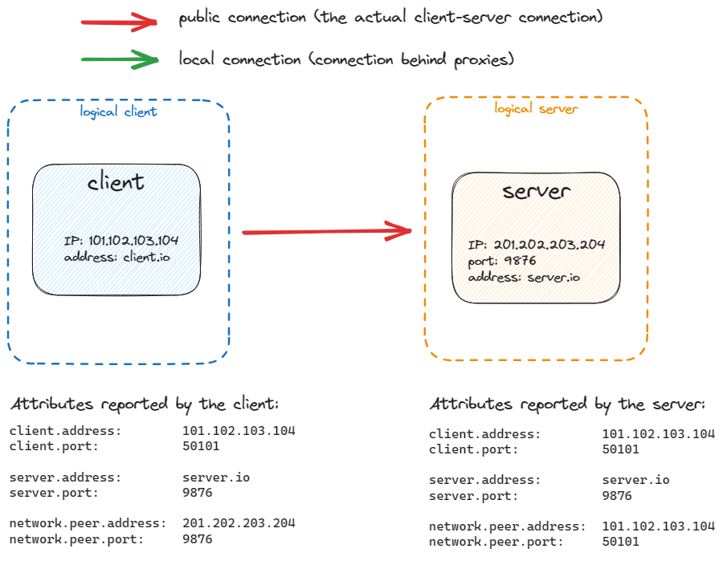
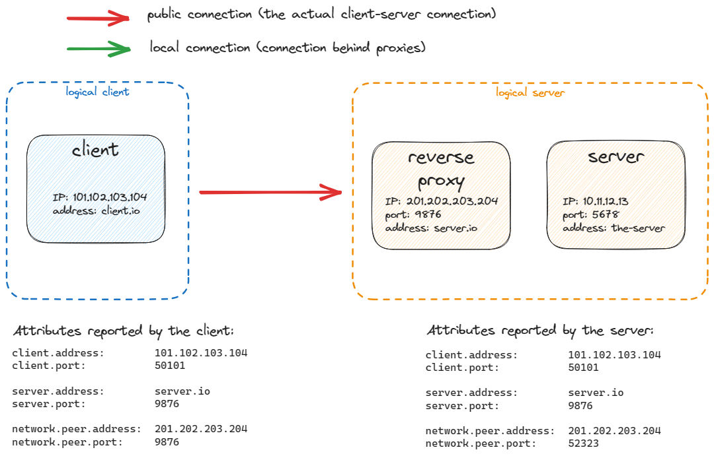

<!--- Hugo front matter used to generate the website version of this page:
linkTitle: Attributes
aliases: [docs/specs/semconv/general/general-attributes]
--->

# General Attributes

**Status**: [Experimental][DocumentStatus]

The attributes described in this section are not specific to a particular operation but rather generic.
They may be used in any Span they apply to.
Particular operations may refer to or require some of these attributes.

<!-- Re-generate TOC with `markdown-toc --no-first-h1 -i` -->

<!-- toc -->

- [Server, client and shared network attributes](#server-client-and-shared-network-attributes)
  * [Address and port attributes](#address-and-port-attributes)
  * [Server attributes](#server-attributes)
    + [`server.address`](#serveraddress)
  * [Client attributes](#client-attributes)
  * [Source and destination attributes](#source-and-destination-attributes)
    + [Source](#source)
    + [Destination](#destination)
  * [Other network attributes](#other-network-attributes)
    + [`network.peer.*` and `network.local.*` attributes](#networkpeer-and-networklocal-attributes)
      - [Client/server examples using `network.peer.*`](#clientserver-examples-using--networkpeer)
        * [Simple client/server example](#simple-clientserver-example)
        * [Client/server example with reverse proxy](#clientserver-example-with-reverse-proxy)
        * [Client/server example with forward proxy](#clientserver-example-with-forward-proxy)
    + [Network connection and carrier attributes](#network-connection-and-carrier-attributes)
- [General remote service attributes](#general-remote-service-attributes)
- [General identity attributes](#general-identity-attributes)
- [General thread attributes](#general-thread-attributes)
- [Source Code Attributes](#source-code-attributes)

<!-- tocstop -->

<!-- Keep old anchor IDs -->

## Server, client and shared network attributes

These attributes may be used to describe the client and server in a connection-based network interaction
where there is one side that initiates the connection (the client is the side that initiates the connection).
This covers all TCP network interactions since TCP is connection-based and one side initiates the
connection (an exception is made for peer-to-peer communication over TCP where the "user-facing" surface of the
protocol / API does not expose a clear notion of client and server).
This also covers UDP network interactions where one side initiates the interaction, e.g. QUIC (HTTP/3) and DNS.

In an ideal situation, not accounting for proxies, multiple IP addresses or host names,
the `server.*` attributes are the same on the client and server.

### Address and port attributes

For all IP-based protocols, the "address" should be just the IP-level address.
Protocol-specific parts of an address are split into other attributes (when applicable) such as "port" attributes for
TCP and UDP. If such transport-specific information is collected and the attribute name does not already uniquely
identify the transport, then setting [`network.transport`](#other-network-attributes) is especially encouraged.

### Server attributes

> **Warning**
> Attributes in this section are in use by the HTTP semantic conventions.
Once the HTTP semantic conventions are declared stable, changes to the attributes in this section will only be allowed
if they do not cause breaking changes to HTTP semantic conventions.

<!-- semconv server -->
| Attribute  | Type | Description  | Examples  | Requirement Level |
|---|---|---|---|---|
| `server.address` | string |  Server domain name if available without reverse DNS lookup; otherwise, IP address or Unix domain socket name. [1] | `example.com`; `10.1.2.80`; `/tmp/my.sock` | Recommended |
| `server.port` | int |  Server port number. [2] | `80`; `8080`; `443` | Recommended |

**[1]:** When observed from the client side, and when communicating through an intermediary, `server.address` SHOULD represent the server address behind any intermediaries, for example proxies, if it's available.

**[2]:** When observed from the client side, and when communicating through an intermediary, `server.port` SHOULD represent the server port behind any intermediaries, for example proxies, if it's available.
<!-- endsemconv -->

`server.address` and `server.port` represent logical server name and port. Semantic conventions that refer to these attributes SHOULD
specify what these attributes mean in their context.

#### `server.address`

For IP-based communication, the name should be a DNS host name of the service. On client side it matches remote service name, on server side, it represents local service name as seen externally on clients.

When connecting to an URL `https://example.com/foo`, `server.address` matches `"example.com"` on both client and server side.

On client side, it's usually passed in form of URL, connection string, host name, etc. Sometimes host name is only available to instrumentation as a string which may contain DNS name or IP address. `server.address` SHOULD be set to the available known hostname (e.g., `"127.0.0.1"` if connecting to an URL `https://127.0.0.1/foo`).

If only IP address is available, it should be populated on `server.address`. Reverse DNS lookup SHOULD NOT be used to obtain DNS name.

If `network.transport` is `"pipe"`, the absolute path to the file representing it should be used as `server.address`.
If there is no such file (e.g., anonymous pipe),
the name should explicitly be set to the empty string to distinguish it from the case where the name is just unknown or not covered by the instrumentation.

For Unix domain socket, `server.address` attribute represents remote endpoint address on the client side and local endpoint address on the server side.

### Client attributes

> **Warning**
> Attributes in this section are in use by the HTTP semantic conventions.
Once the HTTP semantic conventions are declared stable, changes to the attributes in this section will only be allowed
if they do not cause breaking changes to HTTP semantic conventions.

<!-- semconv client -->
| Attribute  | Type | Description  | Examples  | Requirement Level |
|---|---|---|---|---|
| `client.address` | string |  Client address - domain name if available without reverse DNS lookup; otherwise, IP address or Unix domain socket name. [1] | `client.example.com`; `10.1.2.80`; `/tmp/my.sock` | Recommended |
| `client.port` | int |  Client port number. [2] | `65123` | Recommended |

**[1]:** When observed from the server side, and when communicating through an intermediary, `client.address` SHOULD represent the client address behind any intermediaries,  for example proxies, if it's available.

**[2]:** When observed from the server side, and when communicating through an intermediary, `client.port` SHOULD represent the client port behind any intermediaries,  for example proxies, if it's available.
<!-- endsemconv -->

### Source and destination attributes

These attributes may be used to describe the sender and receiver of a network exchange/packet. These should be used
when there is no client/server relationship between the two sides, or when that relationship is unknown.
This covers low-level network interactions (e.g. packet tracing) where you don't know if
there was a connection or which side initiated it.
This also covers unidirectional UDP flows and peer-to-peer communication where the
"user-facing" surface of the protocol / API does not expose a clear notion of client and server.

#### Source

<!-- semconv source -->
| Attribute  | Type | Description  | Examples  | Requirement Level |
|---|---|---|---|---|
| `source.address` | string | Source address - domain name if available without reverse DNS lookup; otherwise, IP address or Unix domain socket name. [1] | `source.example.com`; `10.1.2.80`; `/tmp/my.sock` | Recommended |
| `source.port` | int | Source port number | `3389`; `2888` | Recommended |

**[1]:** When observed from the destination side, and when communicating through an intermediary, `source.address` SHOULD represent the source address behind any intermediaries, for example proxies, if it's available.
<!-- endsemconv -->

#### Destination

Destination fields capture details about the receiver of a network exchange/packet.

<!-- semconv destination -->
| Attribute  | Type | Description  | Examples  | Requirement Level |
|---|---|---|---|---|
| `destination.address` | string | Destination address - domain name if available without reverse DNS lookup; otherwise, IP address or Unix domain socket name. [1] | `destination.example.com`; `10.1.2.80`; `/tmp/my.sock` | Recommended |
| `destination.port` | int | Destination port number | `3389`; `2888` | Recommended |

**[1]:** When observed from the source side, and when communicating through an intermediary, `destination.address` SHOULD represent the destination address behind any intermediaries, for example proxies, if it's available.
<!-- endsemconv -->

### Other network attributes

> **Warning**
> Attributes in this section are in use by the HTTP semantic conventions.
Once the HTTP semantic conventions are declared stable, changes to the attributes in this section will only be allowed
if they do not cause breaking changes to HTTP semantic conventions.

<!-- semconv network-core(full) -->
| Attribute  | Type | Description  | Examples  | Requirement Level |
|---|---|---|---|---|
| [`network.local.address`](../attributes-registry/network.md) | string | Local address of the network connection - IP address or Unix domain socket name. | `10.1.2.80`; `/tmp/my.sock` | Recommended |
| [`network.local.port`](../attributes-registry/network.md) | int | Local port number of the network connection. | `65123` | Recommended |
| [`network.peer.address`](../attributes-registry/network.md) | string | Peer address of the network connection - IP address or Unix domain socket name. | `10.1.2.80`; `/tmp/my.sock` | Recommended |
| [`network.peer.port`](../attributes-registry/network.md) | int | Peer port number of the network connection. | `65123` | Recommended |
| [`network.protocol.name`](../attributes-registry/network.md) | string | [OSI application layer](https://osi-model.com/application-layer/) or non-OSI equivalent. [1] | `amqp`; `http`; `mqtt` | Recommended |
| [`network.protocol.version`](../attributes-registry/network.md) | string | Version of the protocol specified in `network.protocol.name`. [2] | `3.1.1` | Recommended |
| [`network.transport`](../attributes-registry/network.md) | string | [OSI transport layer](https://osi-model.com/transport-layer/) or [inter-process communication method](https://wikipedia.org/wiki/Inter-process_communication). [3] | `tcp`; `udp` | Recommended |
| [`network.type`](../attributes-registry/network.md) | string | [OSI network layer](https://osi-model.com/network-layer/) or non-OSI equivalent. [4] | `ipv4`; `ipv6` | Recommended |

**[1]:** The value SHOULD be normalized to lowercase.

**[2]:** `network.protocol.version` refers to the version of the protocol used and might be different from the protocol client's version. If the HTTP client has a version of `0.27.2`, but sends HTTP version `1.1`, this attribute should be set to `1.1`.

**[3]:** The value SHOULD be normalized to lowercase.

Consider always setting the transport when setting a port number, since
a port number is ambiguous without knowing the transport. For example
different processes could be listening on TCP port 12345 and UDP port 12345.

**[4]:** The value SHOULD be normalized to lowercase.

`network.transport` has the following list of well-known values. If one of them applies, then the respective value MUST be used, otherwise a custom value MAY be used.

| Value  | Description |
|---|---|
| `tcp` | TCP |
| `udp` | UDP |
| `pipe` | Named or anonymous pipe. |
| `unix` | Unix domain socket |

`network.type` has the following list of well-known values. If one of them applies, then the respective value MUST be used, otherwise a custom value MAY be used.

| Value  | Description |
|---|---|
| `ipv4` | IPv4 |
| `ipv6` | IPv6 |
<!-- endsemconv -->

#### `network.peer.*` and `network.local.*` attributes

These attributes identify network peers that are directly connected to each other.

`network.peer.address` and `network.local.address` should be IP addresses, Unix domain socket names, or other addresses specific to network type.

_Note: Specific structures and methods to obtain socket-level attributes are mentioned here only as examples. Instrumentations would usually use Socket API provided by their environment or sockets implementations._

When connecting using `connect(2)` ([Linux or other POSIX systems](https://man7.org/linux/man-pages/man2/connect.2.html) /
[Windows](https://docs.microsoft.com/windows/win32/api/winsock2/nf-winsock2-connect))
or `bind(2)`([Linux or other POSIX systems](https://man7.org/linux/man-pages/man2/bind.2.html) /
[Windows](https://docs.microsoft.com/windows/win32/api/winsock2/nf-winsock2-bind))
with `AF_INET` address family, `network.peer.address` and `network.peer.port` represent `sin_addr` and `sin_port` fields
of `sockaddr_in` structure.

`network.peer.address` and `network.peer.port` can be obtained by calling `getpeername` method
([Linux or other POSIX systems](https://man7.org/linux/man-pages/man2/getpeername.2.html) /
[Windows](https://docs.microsoft.com/windows/win32/api/winsock2/nf-winsock2-getpeername)).

`network.local.address` and `network.local.port` can be obtained by calling `getsockname` method
([Linux or other POSIX systems](https://man7.org/linux/man-pages/man2/getsockname.2.html) /
[Windows](https://docs.microsoft.com/windows/win32/api/winsock2/nf-winsock2-getsockname)).

##### Client/server examples using  `network.peer.*`

Note that `network.local.*` attributes are not included in these examples since they are typically Opt-In.

###### Simple client/server example

###### Client/server example with reverse proxy

###### Client/server example with forward proxy

#### Network connection and carrier attributes

<!-- semconv network-connection-and-carrier(full) -->
| Attribute  | Type | Description  | Examples  | Requirement Level |
|---|---|---|---|---|
| [`network.carrier.icc`](../attributes-registry/network.md) | string | The ISO 3166-1 alpha-2 2-character country code associated with the mobile carrier network. | `DE` | Recommended |
| [`network.carrier.mcc`](../attributes-registry/network.md) | string | The mobile carrier country code. | `310` | Recommended |
| [`network.carrier.mnc`](../attributes-registry/network.md) | string | The mobile carrier network code. | `001` | Recommended |
| [`network.carrier.name`](../attributes-registry/network.md) | string | The name of the mobile carrier. | `sprint` | Recommended |
| [`network.connection.subtype`](../attributes-registry/network.md) | string | This describes more details regarding the connection.type. It may be the type of cell technology connection, but it could be used for describing details about a wifi connection. | `LTE` | Recommended |
| [`network.connection.type`](../attributes-registry/network.md) | string | The internet connection type. | `wifi` | Recommended |

`network.connection.subtype` has the following list of well-known values. If one of them applies, then the respective value MUST be used, otherwise a custom value MAY be used.

| Value  | Description |
|---|---|
| `gprs` | GPRS |
| `edge` | EDGE |
| `umts` | UMTS |
| `cdma` | CDMA |
| `evdo_0` | EVDO Rel. 0 |
| `evdo_a` | EVDO Rev. A |
| `cdma2000_1xrtt` | CDMA2000 1XRTT |
| `hsdpa` | HSDPA |
| `hsupa` | HSUPA |
| `hspa` | HSPA |
| `iden` | IDEN |
| `evdo_b` | EVDO Rev. B |
| `lte` | LTE |
| `ehrpd` | EHRPD |
| `hspap` | HSPAP |
| `gsm` | GSM |
| `td_scdma` | TD-SCDMA |
| `iwlan` | IWLAN |
| `nr` | 5G NR (New Radio) |
| `nrnsa` | 5G NRNSA (New Radio Non-Standalone) |
| `lte_ca` | LTE CA |

`network.connection.type` has the following list of well-known values. If one of them applies, then the respective value MUST be used, otherwise a custom value MAY be used.

| Value  | Description |
|---|---|
| `wifi` | wifi |
| `wired` | wired |
| `cell` | cell |
| `unavailable` | unavailable |
| `unknown` | unknown |
<!-- endsemconv -->

For `Unix` and `pipe`, since the connection goes over the file system instead of being directly to a known peer, `server.address` is the only attribute that usually makes sense (see description of `server.address` below).

## General remote service attributes

This attribute may be used for any operation that accesses some remote service.
Users can define what the name of a service is based on their particular semantics in their distributed system.
Instrumentations SHOULD provide a way for users to configure this name.

<!-- semconv peer -->
| Attribute  | Type | Description  | Examples  | Requirement Level |
|---|---|---|---|---|
| `peer.service` | string | The [`service.name`](/docs/resource/README.md#service) of the remote service. SHOULD be equal to the actual `service.name` resource attribute of the remote service if any. | `AuthTokenCache` | Recommended |
<!-- endsemconv -->

Examples of `peer.service` that users may specify:

- A Redis cache of auth tokens as `peer.service="AuthTokenCache"`.
- A gRPC service `rpc.service="io.opentelemetry.AuthService"` may be hosted in both a gateway, `peer.service="ExternalApiService"` and a backend, `peer.service="AuthService"`.

## General identity attributes

These attributes may be used for any operation with an authenticated and/or authorized enduser.

<!-- semconv identity -->
| Attribute  | Type | Description  | Examples  | Requirement Level |
|---|---|---|---|---|
| `enduser.id` | string | Username or client_id extracted from the access token or [Authorization](https://tools.ietf.org/html/rfc7235#section-4.2) header in the inbound request from outside the system. | `username` | Recommended |
| `enduser.role` | string | Actual/assumed role the client is making the request under extracted from token or application security context. | `admin` | Recommended |
| `enduser.scope` | string | Scopes or granted authorities the client currently possesses extracted from token or application security context. The value would come from the scope associated with an [OAuth 2.0 Access Token](https://tools.ietf.org/html/rfc6749#section-3.3) or an attribute value in a [SAML 2.0 Assertion](http://docs.oasis-open.org/security/saml/Post2.0/sstc-saml-tech-overview-2.0.html). | `read:message, write:files` | Recommended |
<!-- endsemconv -->

These attributes describe the authenticated user driving the user agent making requests to the instrumented
system. It is expected this information would be propagated unchanged from node-to-node within the system
using the Baggage mechanism. These attributes should not be used to record system-to-system
authentication attributes.

Examples of where the `enduser.id` value is extracted from:

| Authentication protocol | Field or description            |
| :---------------------- | :------------------------------ |
| [HTTP Basic/Digest Authentication] | `username`               |
| [OAuth 2.0 Bearer Token] | [OAuth 2.0 Client Identifier] value from `client_id` for the [OAuth 2.0 Client Credentials Grant] flow and `subject` or `username` from get token info response for other flows using opaque tokens. |
| [OpenID Connect 1.0 IDToken] | `sub` |
| [SAML 2.0 Assertion] | `urn:oasis:names:tc:SAML:2.0:assertion:Subject` |
| [Kerberos] | `PrincipalName` |

| Framework               | Field or description            |
| :---------------------- | :------------------------------ |
| [JavaEE/JakartaEE Servlet] | `javax.servlet.http.HttpServletRequest.getUserPrincipal()` |
| [Windows Communication Foundation] | `ServiceSecurityContext.Current.PrimaryIdentity` |

[SAML 2.0 Assertion]: http://docs.oasis-open.org/security/saml/Post2.0/sstc-saml-tech-overview-2.0.html
[HTTP Basic/Digest Authentication]: https://tools.ietf.org/html/rfc2617
[OAuth 2.0 Bearer Token]: https://tools.ietf.org/html/rfc6750
[OAuth 2.0 Client Identifier]: https://tools.ietf.org/html/rfc6749#section-2.2
[OAuth 2.0 Client Credentials Grant]: https://tools.ietf.org/html/rfc6749#section-4.4
[OpenID Connect 1.0 IDToken]: https://openid.net/specs/openid-connect-core-1_0.html#IDToken
[Kerberos]: https://tools.ietf.org/html/rfc4120
[JavaEE/JakartaEE Servlet]: https://jakarta.ee/specifications/platform/8/apidocs/javax/servlet/http/HttpServletRequest.html
[Windows Communication Foundation]: https://docs.microsoft.com/dotnet/api/system.servicemodel.servicesecuritycontext?view=netframework-4.8

Given the sensitive nature of this information, SDKs and exporters SHOULD drop these attributes by
default and then provide a configuration parameter to turn on retention for use cases where the
information is required and would not violate any policies or regulations.

## General thread attributes

These attributes may be used for any operation to store information about
a thread that started a span.

<!-- semconv thread -->
| Attribute  | Type | Description  | Examples  | Requirement Level |
|---|---|---|---|---|
| [`thread.id`](../attributes-registry/thread.md) | int | Current "managed" thread ID (as opposed to OS thread ID). | `42` | Recommended |
| [`thread.name`](../attributes-registry/thread.md) | string | Current thread name. | `main` | Recommended |
<!-- endsemconv -->

Examples of where `thread.id` and `thread.name` can be extracted from:

| Language or platform | `thread.id`                            | `thread.name`                      |
|-----------------------|----------------------------------------|------------------------------------|
| JVM                   | `Thread.currentThread().getId()`       | `Thread.currentThread().getName()` |
| .NET                  | `Thread.CurrentThread.ManagedThreadId` | `Thread.CurrentThread.Name`        |
| Python                | `threading.current_thread().ident`     | `threading.current_thread().name`  |
| Ruby                  | `Thread.current.object_id`             | `Thread.current.name`              |
| C++                   | `std::this_thread::get_id()`             |                                    |
| Erlang               | `erlang:system_info(scheduler_id)` |                                  |

## Source Code Attributes

Often a span is closely tied to a certain unit of code that is logically responsible for handling
the operation that the span describes (usually the method that starts the span).
For an HTTP server span, this would be the function that handles the incoming request, for example.
The attributes listed below allow to report this unit of code and therefore to provide more context
about the span.

<!-- semconv code -->
| Attribute  | Type | Description  | Examples  | Requirement Level |
|---|---|---|---|---|
| [`code.column`](../attributes-registry/code.md) | int | The column number in `code.filepath` best representing the operation. It SHOULD point within the code unit named in `code.function`. | `16` | Recommended |
| [`code.filepath`](../attributes-registry/code.md) | string | The source code file name that identifies the code unit as uniquely as possible (preferably an absolute file path). | `/usr/local/MyApplication/content_root/app/index.php` | Recommended |
| [`code.function`](../attributes-registry/code.md) | string | The method or function name, or equivalent (usually rightmost part of the code unit's name). | `serveRequest` | Recommended |
| [`code.lineno`](../attributes-registry/code.md) | int | The line number in `code.filepath` best representing the operation. It SHOULD point within the code unit named in `code.function`. | `42` | Recommended |
| [`code.namespace`](../attributes-registry/code.md) | string | The "namespace" within which `code.function` is defined. Usually the qualified class or module name, such that `code.namespace` + some separator + `code.function` form a unique identifier for the code unit. | `com.example.MyHttpService` | Recommended |
<!-- endsemconv -->

[DocumentStatus]: https://github.com/open-telemetry/opentelemetry-specification/tree/v1.26.0/specification/document-status.md
