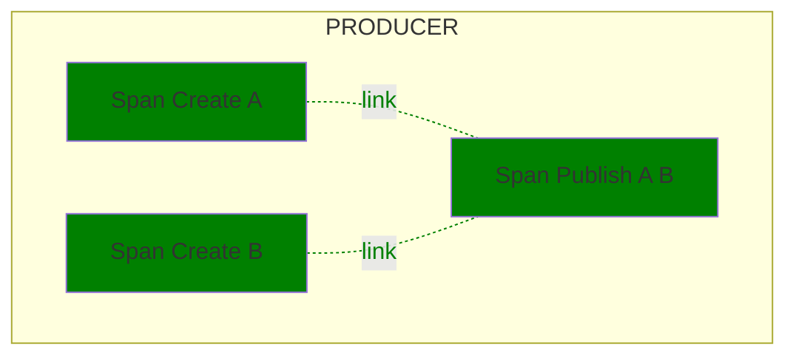

<!--- Hugo front matter used to generate the website version of this page:
linkTitle: Google Cloud Pub/Sub
--->

# Semantic Conventions for Google Cloud Pub/Sub

**Status**: [Experimental][DocumentStatus]

The Semantic Conventions for [Google Cloud Pub/Sub](https://cloud.google.com/pubsub) extend and override the [Messaging Semantic Conventions](README.md) that describe common messaging operations attributes in addition to the Semantic Conventions described on this page.

`messaging.system` MUST be set to `"gcp_pubsub"`.

## Span attributes

For Google Cloud Pub/Sub, the following additional attributes are defined:

<!-- semconv messaging.gcp_pubsub(full) -->
<!-- NOTE: THIS TEXT IS AUTOGENERATED. DO NOT EDIT BY HAND. -->
<!-- see templates/registry/markdown/snippet.md.j2 -->
<!-- prettier-ignore-start -->
<!-- markdownlint-capture -->
<!-- markdownlint-disable -->

| Attribute  | Type | Description  | Examples  | [Requirement Level](https://opentelemetry.io/docs/specs/semconv/general/attribute-requirement-level/) | Stability |
|---|---|---|---|---|---|
| [`messaging.operation.name`](/docs/attributes-registry/messaging.md) | string | The system-specific name of the messaging operation. [1] | `ack`; `nack`; `send` | `Required` |  |
| [`error.type`](/docs/attributes-registry/error.md) | string | Describes a class of error the operation ended with. [2] | `amqp:decode-error`; `KAFKA_STORAGE_ERROR`; `channel-error` | `Conditionally Required` If and only if the messaging operation has failed. |  |
| [`messaging.batch.message_count`](/docs/attributes-registry/messaging.md) | int | The number of messages sent, received, or processed in the scope of the batching operation. [3] | `0`; `1`; `2` | `Conditionally Required` [4] |  |
| [`messaging.destination.name`](/docs/attributes-registry/messaging.md) | string | The message destination name [5] | `MyQueue`; `MyTopic` | `Conditionally Required` [6] |  |
| [`messaging.gcp_pubsub.message.ordering_key`](/docs/attributes-registry/messaging.md) | string | The ordering key for a given message. If the attribute is not present, the message does not have an ordering key. | `ordering_key` | `Conditionally Required` If the message type has an ordering key set. |  |
| [`messaging.operation.type`](/docs/attributes-registry/messaging.md) | string | A string identifying the type of the messaging operation. [7] | `publish`; `create`; `receive` | `Conditionally Required` If applicable. |  |
| [`server.address`](/docs/attributes-registry/server.md) | string | Server domain name if available without reverse DNS lookup; otherwise, IP address or Unix domain socket name. [8] | `example.com`; `10.1.2.80`; `/tmp/my.sock` | `Conditionally Required` If available. |  |
| [`messaging.client.id`](/docs/attributes-registry/messaging.md) | string | A unique identifier for the client that consumes or produces a message. | `client-5`; `myhost@8742@s8083jm` | `Recommended` If a client id is available |  |
| [`messaging.gcp_pubsub.message.ack_deadline`](/docs/attributes-registry/messaging.md) | int | The ack deadline in seconds set for the modify ack deadline request. | `10` | `Recommended` |  |
| [`messaging.gcp_pubsub.message.ack_id`](/docs/attributes-registry/messaging.md) | string | The ack id for a given message. | `ack_id` | `Recommended` |  |
| [`messaging.gcp_pubsub.message.delivery_attempt`](/docs/attributes-registry/messaging.md) | int | The delivery attempt for a given message. | `2` | `Recommended` |  |
| [`messaging.message.id`](/docs/attributes-registry/messaging.md) | string | A value used by the messaging system as an identifier for the message, represented as a string. | `452a7c7c7c7048c2f887f61572b18fc2` | `Recommended` If span describes operation on a single message. |  |
| [`server.port`](/docs/attributes-registry/server.md) | int | Server port number. [9] | `80`; `8080`; `443` | `Recommended` |  |

**[1]:** The `messaging.operation.name` has the following list of well-known values in the context of Google Pub/Sub.
If one of them applies, then the respective value MUST be used; otherwise, a custom value MAY be used.

- `ack` and `nack` for settlement operations
- `send` for publishing operations
- `modack` for extending the lease for a single message or batch of messages
- `subscribe` for operations that represent the time from after the message was received to when the message is acknowledged, negatively acknowledged, or expired.
- `create` and `receive` for [common messaging operations](/docs/messaging/messaging-spans.md#common-messaging-operations)

**[2]:** The `error.type` SHOULD be predictable, and SHOULD have low cardinality.

When `error.type` is set to a type (e.g., an exception type), its
canonical class name identifying the type within the artifact SHOULD be used.

Instrumentations SHOULD document the list of errors they report.

The cardinality of `error.type` within one instrumentation library SHOULD be low.
Telemetry consumers that aggregate data from multiple instrumentation libraries and applications
should be prepared for `error.type` to have high cardinality at query time when no
additional filters are applied.

If the operation has completed successfully, instrumentations SHOULD NOT set `error.type`.

If a specific domain defines its own set of error identifiers (such as HTTP or gRPC status codes),
it's RECOMMENDED to:

* Use a domain-specific attribute
* Set `error.type` to capture all errors, regardless of whether they are defined within the domain-specific set or not.

**[3]:** Instrumentations SHOULD NOT set `messaging.batch.message_count` on spans that operate with a single message. When a messaging client library supports both batch and single-message API for the same operation, instrumentations SHOULD use `messaging.batch.message_count` for batching APIs and SHOULD NOT use it for single-message APIs.

**[4]:** If the span describes an operation on a batch of messages.

**[5]:** Destination name SHOULD uniquely identify a specific queue, topic or other entity within the broker. If
the broker doesn't have such notion, the destination name SHOULD uniquely identify the broker.

**[6]:** If span describes operation on a single message or if the value applies to all messages in the batch.

**[7]:** If a custom value is used, it MUST be of low cardinality.

**[8]:** Server domain name of the broker if available without reverse DNS lookup; otherwise, IP address or Unix domain socket name.

**[9]:** When observed from the client side, and when communicating through an intermediary, `server.port` SHOULD represent the server port behind any intermediaries, for example proxies, if it's available.

`error.type` has the following list of well-known values. If one of them applies, then the respective value MUST be used; otherwise, a custom value MAY be used.

| Value  | Description | Stability |
|---|---|---|
| `_OTHER` | A fallback error value to be used when the instrumentation doesn't define a custom value. |  |

`messaging.operation.type` has the following list of well-known values. If one of them applies, then the respective value MUST be used; otherwise, a custom value MAY be used.

| Value  | Description | Stability |
|---|---|---|
| `create` | A message is created. "Create" spans always refer to a single message and are used to provide a unique creation context for messages in batch publishing scenarios. |  |
| `process` | One or more messages are processed by a consumer. |  |
| `publish` | One or more messages are provided for publishing to an intermediary. If a single message is published, the context of the "Publish" span can be used as the creation context and no "Create" span needs to be created. |  |
| `receive` | One or more messages are requested by a consumer. This operation refers to pull-based scenarios, where consumers explicitly call methods of messaging SDKs to receive messages. |  |
| `settle` | One or more messages are settled. |  |

<!-- markdownlint-restore -->
<!-- prettier-ignore-end -->
<!-- END AUTOGENERATED TEXT -->
<!-- endsemconv -->

## Examples

### Asynchronous Batch Publish Example

Given is a process P that asynchronously publishes 2 messages in a batch to a topic T on Pub/Sub.

| Field or Attribute | Span Create A | Span Create B | Span Publish A B |
|-|-|-|-|
| Span name | `create T` | `create T` | `send T` |
| Parent |  |  |  |
| Links |  |  | Span Create A, Span Create B |
| SpanKind | `PRODUCER` | `PRODUCER` | `CLIENT` |
| Status | `Ok` | `Ok` | `Ok` |
| `messaging.batch.message_count` |  |  | 2 |
| `messaging.destination.name` | `"T"` | `"T"` | `"T"` |
| `messaging.operation.name` | `"create"` | `"create"` | `"send"` |
| `messaging.operation.type` | `"create"` | `"create"` | `"publish"` |
| `messaging.message.id` | `"a1"` | `"a2"` | |
| `messaging.message.envelope.size` | `1` | `1` | |
| `messaging.system` | `"gcp_pubsub"` | `"gcp_pubsub"` | `"gcp_pubsub"` |

### Unary Pull Example

| Field or Attribute | Span Create A | Span Publish A | Span Receive A | Span Modack A | Span Ack A |
|-|-|-|-|-|-|
| Span name | `create T` | `send T` |  `receive S` | `modack S` | `ack S` |
| Parent |  |  |  | |  |
| Links |  | Span Create A | Span Create A | Span Receive A | Span Receive A |
| SpanKind | `PRODUCER` | `PRODUCER` | `CONSUMER` |`CLIENT` |`CLIENT` |
| Status | `Ok` | `Ok` | `Ok` |`Ok` | `Ok` |
| `messaging.destination.name` | `"T"`| `"T"`| `"S"` | `"S"` |`"S"` |
| `messaging.system` | `"gcp_pubsub"` | `"gcp_pubsub"` | `"gcp_pubsub"` |  `"gcp_pubsub"` | `"gcp_pubsub"` |
| `messaging.operation.name` | `"create"` | `"send"` | `"receive"` | `"modack"` | `"ack"` |
| `messaging.operation.type` | `"create"` | `"publish"` | `"receive"` |  | `"settle"` |
| `messaging.message.id` | `"a1"` | | `"a1"` | | |
| `messaging.message.envelope.size` | `1` | `1` | `1`  | | |
| `messaging.gcp_pubsub.message.ack_id` | | |  | `"ack_id1"` |`"ack_id1"` |
| `messaging.gcp_pubsub.message.delivery_attempt` | | |  | `0` |  |
| `messaging.gcp_pubsub.message.ack_deadline` | | |  | | `0` |

[DocumentStatus]: https://opentelemetry.io/docs/specs/otel/document-status
