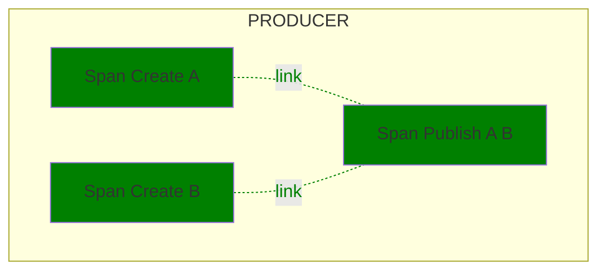

<!--- Hugo front matter used to generate the website version of this page:
linkTitle: Google Cloud Pub/Sub
--->

# Semantic Conventions for Google Cloud Pub/Sub

**Status**: [Experimental][DocumentStatus]

The Semantic Conventions for [Google Cloud Pub/Sub](https://cloud.google.com/pubsub) extend and override the [Messaging Semantic Conventions](README.md) that describe common messaging operations attributes in addition to the Semantic Conventions described on this page.

`messaging.system` MUST be set to `"gcp_pubsub"`.

## Span attributes

For Google Cloud Pub/Sub, the following additional attributes are defined:
<!-- semconv messaging.gcp_pubsub(full,tag=tech-specific-gcp-pubsub) -->
| Attribute  | Type | Description  | Examples  | Requirement Level |
|---|---|---|---|---|
| [`messaging.gcp_pubsub.message.ack_deadline`](../attributes-registry/messaging.md) | int | The ack deadline in seconds set for the modify ack deadline request. | `10` | Recommended |
| [`messaging.gcp_pubsub.message.ack_id`](../attributes-registry/messaging.md) | string | The ack id for a given message. | `ack_id` | Recommended |
| [`messaging.gcp_pubsub.message.delivery_attempt`](../attributes-registry/messaging.md) | int | The delivery attempt for a given message. | `2` | Recommended |
| [`messaging.gcp_pubsub.message.ordering_key`](../attributes-registry/messaging.md) | string | The ordering key for a given message. If the attribute is not present, the message does not have an ordering key. | `ordering_key` | Conditionally Required: If the message type has an ordering key set. |
<!-- endsemconv -->

## GCP operation names

In addition to the [Operation names](messaging-spans.md#operation-names), `messaging.operation` MUST be one of the following:

| Value  | Description |
|---|---|
| `subscribe` | Streaming pull for a single message. Represents the time from after the message was received to when the message is acknowledged, negatively acknowledged, or expires. |
| `modack` | Extends the lease for a single message or batch of messages |
| `ack` | Acknowledges (acks) a single message or batch of messages |
| `nack` | Negatively acknowledges (nacks) by sending a modack with a deadline of 0 seconds a single message or batch of messages |

## Examples

### Asynchronous Batch Publish Example

Given is a process P that asynchronously publishes 2 messages in a batch to a topic T on Pub/Sub.

| Field or Attribute | Span Create A | Span Create B | Span Publish A B |
|-|-|-|-|
| Span name | `T create` | `T create` | `publish` |
| Parent |  |  |  |
| Links |  |  | Span Create A, Span Create B |
| SpanKind | `PRODUCER` | `PRODUCER` | `CLIENT` |
| Status | `Ok` | `Ok` | `Ok` |
| `gcp.project_id` | `"P"` | `"P"` | `"P"` |
| `messaging.batch.message_count` |  |  | 2 |
| `messaging.destination.name` | `"projects/P/topics/T"` | `"projects/P/topics/T"` | `"projects/P/topics/T"` |
| `messaging.operation` | `"create"` | `"create"` | `"publish"` |
| `messaging.message.id` | `"a1"` | `"a2"` | |
| `messaging.message.envelope.size` | `1` | `1` | |
| `messaging.system` | `"gcp_pubsub"` | `"gcp_pubsub"` | `"gcp_pubsub"` |

### Unary Pull Example

| Field or Attribute | Span Create A | Span Publish A | Span Receive A | Span Modack A | Span Ack A |
|-|-|-|-|-|-|
| Span name | `T create` | `publish` |  `S receive` | `S modack` |`S ack` |
| Parent |  |  |  | |  |
| Links |  | Span Create A | Span Create A | Span Receive A | Span Receive A |
| SpanKind | `PRODUCER` | `PRODUCER` | `CONSUMER` |`CLIENT` |`CLIENT` |
| Status | `Ok` | `Ok` | `Ok` |`Ok` | `Ok` |
| `gcp.project_id` | `"P"` | `"P"` | `"P"` |  `"P"` |  `"P"` |
| `messaging.destination.name` | `"T"`| `"T"`| `"S"` | `"S"` |`"S"` |
| `messaging.system` | `"gcp_pubsub"` | `"gcp_pubsub"` | `"gcp_pubsub"` |  `"gcp_pubsub"` | `"gcp_pubsub"` |
| `messaging.operation` | `"create"` | `"publish"` | `"receive"` |  `"modack"` |  `"ack"` |
| `messaging.message.id` | `"a1"` | | `"a1"` | | |
| `messaging.message.envelope.size` | `1` | `1` | `1`  | | |
| `messaging.gcp_pubsub.message.ack_id` | | |  | `"ack_id1"` |`"ack_id1"` |
| `messaging.gcp_pubsub.message.delivery_attempt` | | |  | `0` |  |
| `messaging.gcp_pubsub.message.ack_deadline_seconds` | | |  | | `0` |

[DocumentStatus]: https://github.com/open-telemetry/opentelemetry-specification/tree/v1.26.0/specification/document-status.md
