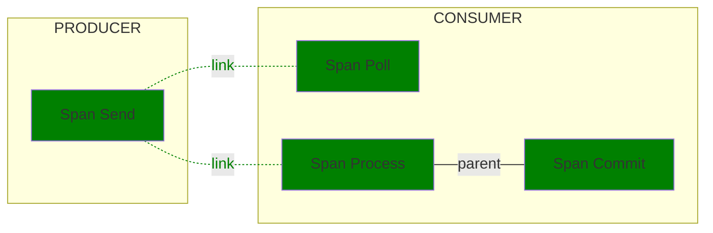

<!--- Hugo front matter used to generate the website version of this page:
linkTitle: Kafka
--->

# Semantic Conventions for Kafka

**Status**: [Experimental][DocumentStatus]

<!-- toc -->

- [Span attributes](#span-attributes)
- [Examples](#examples)
  - [Apache Kafka with Quarkus or Spring Boot Example](#apache-kafka-with-quarkus-or-spring-boot-example)

<!-- tocstop -->

The Semantic Conventions for [Apache Kafka](https://kafka.apache.org/) extend and override the [Messaging Semantic Conventions](README.md).

`messaging.system` MUST be set to `"kafka"` and SHOULD be provided **at span creation time**.

## Span attributes

For Apache Kafka, the following additional attributes are defined:

<!-- semconv messaging.kafka -->
<!-- NOTE: THIS TEXT IS AUTOGENERATED. DO NOT EDIT BY HAND. -->
<!-- see templates/registry/markdown/snippet.md.j2 -->
<!-- prettier-ignore-start -->
<!-- markdownlint-capture -->
<!-- markdownlint-disable -->

| Attribute  | Type | Description  | Examples  | [Requirement Level](https://opentelemetry.io/docs/specs/semconv/general/attribute-requirement-level/) | Stability |
|---|---|---|---|---|---|
| [`messaging.operation.name`](/docs/attributes-registry/messaging.md) | string | The system-specific name of the messaging operation. | `ack`; `nack`; `send` | `Required` |  |
| [`error.type`](/docs/attributes-registry/error.md) | string | Describes a class of error the operation ended with. [1] | `amqp:decode-error`; `KAFKA_STORAGE_ERROR`; `channel-error` | `Conditionally Required` If and only if the messaging operation has failed. |  |
| [`messaging.batch.message_count`](/docs/attributes-registry/messaging.md) | int | The number of messages sent, received, or processed in the scope of the batching operation. [2] | `0`; `1`; `2` | `Conditionally Required` [3] |  |
| [`messaging.destination.name`](/docs/attributes-registry/messaging.md) | string | The message destination name [4] | `MyQueue`; `MyTopic` | `Conditionally Required` [5] |  |
| [`messaging.kafka.message.tombstone`](/docs/attributes-registry/messaging.md) | boolean | A boolean that is true if the message is a tombstone. |  | `Conditionally Required` [6] |  |
| [`messaging.operation.type`](/docs/attributes-registry/messaging.md) | string | A string identifying the type of the messaging operation. [7] | `publish`; `create`; `receive` | `Conditionally Required` If applicable. |  |
| [`server.address`](/docs/attributes-registry/server.md) | string | Server domain name if available without reverse DNS lookup; otherwise, IP address or Unix domain socket name. [8] | `example.com`; `10.1.2.80`; `/tmp/my.sock` | `Conditionally Required` If available. |  |
| [`messaging.client.id`](/docs/attributes-registry/messaging.md) | string | A unique identifier for the client that consumes or produces a message. | `client-5`; `myhost@8742@s8083jm` | `Recommended` |  |
| [`messaging.consumer.group.name`](/docs/attributes-registry/messaging.md) | string | Kafka [consumer group id](https://docs.confluent.io/platform/current/clients/consumer.html). | `my-group`; `indexer` | `Recommended` |  |
| [`messaging.destination.partition.id`](/docs/attributes-registry/messaging.md) | string | String representation of the partition id the message (or batch) is sent to or received from. | `1` | `Recommended` |  |
| [`messaging.kafka.message.key`](/docs/attributes-registry/messaging.md) | string | Message keys in Kafka are used for grouping alike messages to ensure they're processed on the same partition. They differ from `messaging.message.id` in that they're not unique. If the key is `null`, the attribute MUST NOT be set. [9] | `myKey` | `Recommended` If span describes operation on a single message. |  |
| [`messaging.kafka.offset`](/docs/attributes-registry/messaging.md) | int | The offset of a record in the corresponding Kafka partition. | `42` | `Recommended` If span describes operation on a single message. |  |
| [`messaging.message.body.size`](/docs/attributes-registry/messaging.md) | int | The size of the message body in bytes. [10] | `1439` | `Recommended` If span describes operation on a single message. |  |
| [`messaging.message.id`](/docs/attributes-registry/messaging.md) | string | A value used by the messaging system as an identifier for the message, represented as a string. | `452a7c7c7c7048c2f887f61572b18fc2` | `Recommended` If span describes operation on a single message. |  |
| [`server.port`](/docs/attributes-registry/server.md) | int | Server port number. [11] | `80`; `8080`; `443` | `Recommended` |  |

**[1]:** The `error.type` SHOULD be predictable, and SHOULD have low cardinality.

When `error.type` is set to a type (e.g., an exception type), its
canonical class name identifying the type within the artifact SHOULD be used.

Instrumentations SHOULD document the list of errors they report.

The cardinality of `error.type` within one instrumentation library SHOULD be low.
Telemetry consumers that aggregate data from multiple instrumentation libraries and applications
should be prepared for `error.type` to have high cardinality at query time when no
additional filters are applied.

If the operation has completed successfully, instrumentations SHOULD NOT set `error.type`.

If a specific domain defines its own set of error identifiers (such as HTTP or gRPC status codes),
it's RECOMMENDED to:

* Use a domain-specific attribute
* Set `error.type` to capture all errors, regardless of whether they are defined within the domain-specific set or not.

**[2]:** Instrumentations SHOULD NOT set `messaging.batch.message_count` on spans that operate with a single message. When a messaging client library supports both batch and single-message API for the same operation, instrumentations SHOULD use `messaging.batch.message_count` for batching APIs and SHOULD NOT use it for single-message APIs.

**[3]:** If the span describes an operation on a batch of messages.

**[4]:** Destination name SHOULD uniquely identify a specific queue, topic or other entity within the broker. If
the broker doesn't have such notion, the destination name SHOULD uniquely identify the broker.

**[5]:** If span describes operation on a single message or if the value applies to all messages in the batch.

**[6]:** If value is `true`. When missing, the value is assumed to be `false`.

**[7]:** If a custom value is used, it MUST be of low cardinality.

**[8]:** Server domain name of the broker if available without reverse DNS lookup; otherwise, IP address or Unix domain socket name.

**[9]:** If the key type is not string, it's string representation has to be supplied for the attribute. If the key has no unambiguous, canonical string form, don't include its value.

**[10]:** This can refer to both the compressed or uncompressed body size. If both sizes are known, the uncompressed
body size should be used.

**[11]:** When observed from the client side, and when communicating through an intermediary, `server.port` SHOULD represent the server port behind any intermediaries, for example proxies, if it's available.

The following attributes can be important for making sampling decisions
and SHOULD be provided **at span creation time** (if provided at all):

* [`messaging.consumer.group.name`](/docs/attributes-registry/messaging.md)
* [`messaging.destination.name`](/docs/attributes-registry/messaging.md)
* [`messaging.destination.partition.id`](/docs/attributes-registry/messaging.md)
* [`messaging.operation.name`](/docs/attributes-registry/messaging.md)
* [`messaging.operation.type`](/docs/attributes-registry/messaging.md)
* [`server.address`](/docs/attributes-registry/server.md)
* [`server.port`](/docs/attributes-registry/server.md)

`error.type` has the following list of well-known values. If one of them applies, then the respective value MUST be used; otherwise, a custom value MAY be used.

| Value  | Description | Stability |
|---|---|---|
| `_OTHER` | A fallback error value to be used when the instrumentation doesn't define a custom value. |  |

`messaging.operation.type` has the following list of well-known values. If one of them applies, then the respective value MUST be used; otherwise, a custom value MAY be used.

| Value  | Description | Stability |
|---|---|---|
| `create` | A message is created. "Create" spans always refer to a single message and are used to provide a unique creation context for messages in batch publishing scenarios. |  |
| `process` | One or more messages are processed by a consumer. |  |
| `publish` | One or more messages are provided for publishing to an intermediary. If a single message is published, the context of the "Publish" span can be used as the creation context and no "Create" span needs to be created. |  |
| `receive` | One or more messages are requested by a consumer. This operation refers to pull-based scenarios, where consumers explicitly call methods of messaging SDKs to receive messages. |  |
| `settle` | One or more messages are settled. |  |

<!-- markdownlint-restore -->
<!-- prettier-ignore-end -->
<!-- END AUTOGENERATED TEXT -->
<!-- endsemconv -->

For Apache Kafka producers, [`peer.service`](/docs/general/attributes.md#general-remote-service-attributes) SHOULD be set to the name of the broker or service the message will be sent to.
The `service.name` of a Consumer's Resource SHOULD match the `peer.service` of the Producer, when the message is directly passed to another service.
If an intermediary broker is present, `service.name` and `peer.service` will not be the same.

`messaging.client.id` SHOULD be set to the client name of a consumer or producer, which is unique for each individual instance.

## Examples

### Apache Kafka with Quarkus or Spring Boot Example

In this example, the producer publishes a message to a topic T on Apache Kafka.
Consumer receives the message, processes it and commits the offset.

Frameworks such as Quarkus and Spring Boot provide integrations with Kafka allowing to
configure and instrument processing callbacks, so corresponding instrumentations should create "Process"
spans in addition to "Receive" spans created by Kafka instrumentations for polling calls.

| Field or Attribute | Span Send | Span Poll | Span Process | Span Commit T |
|-|-|-|-|-|
| Span name | `"send T"` | `"poll T"` | `"process T"` | `"commit T"` |
| Parent |  |  |  (optional) Span Send  | Span Process |
| Links |  | Span Send | Span Send |  |
| SpanKind | `PRODUCER` | `CONSUMER` | `SERVER` | `CLIENT` |
| Status | `UNSET` | `UNSET` | `UNSET` | `UNSET` |
| `messaging.system` | `"kafka"` | `"kafka"` | `"kafka"` | `"kafka"` |
| `messaging.destination.name` | `"T"` | `"T"` | `"T"` | `"T"` |
| `messaging.destination.consumer.group` |  | `"my-group"` | `"my-group"` | `"my-group"` |
| `messaging.destination.partition.id` | `"1"` | `"1"` | `"1"` | `"1"` |
| `messaging.operation.name` | `"send"` | `"poll"` | `"process"` | `"commit"` |
| `messaging.operation.type` | `"publish"`  | `"receive"` | `"process"` | `"settle"` |
| `messaging.client.id` | `"5"` | `"8"` | `"8"` | `"8"` |
| `messaging.kafka.message.key` | `"myKey"` | `"myKey"` | `"myKey"` |  |
| `messaging.kafka.message.offset` |  | `"12"` | `"12"` | `"12"` |

[DocumentStatus]: https://opentelemetry.io/docs/specs/otel/document-status
