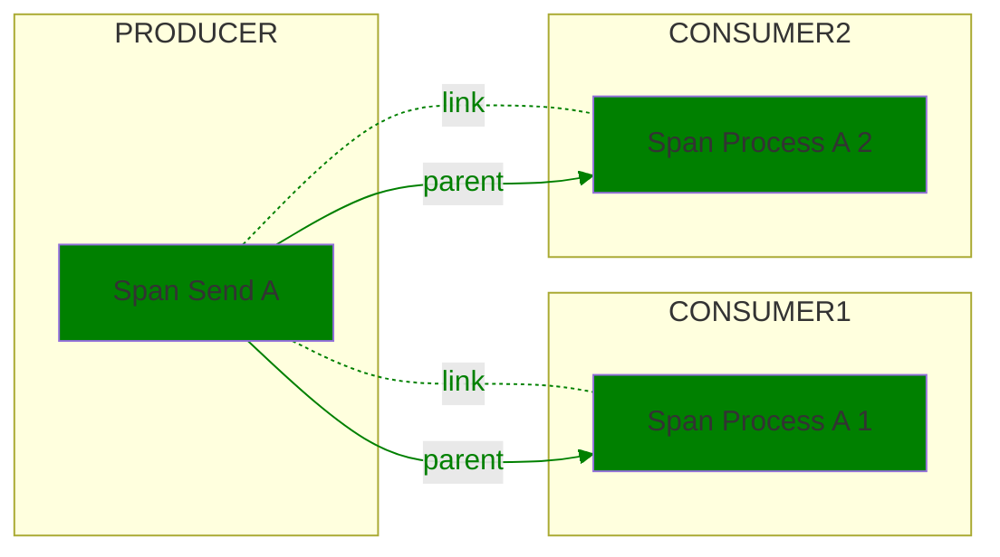
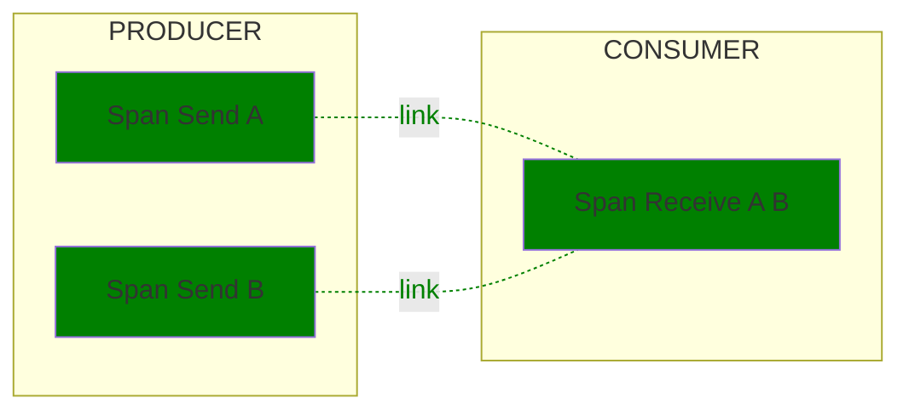
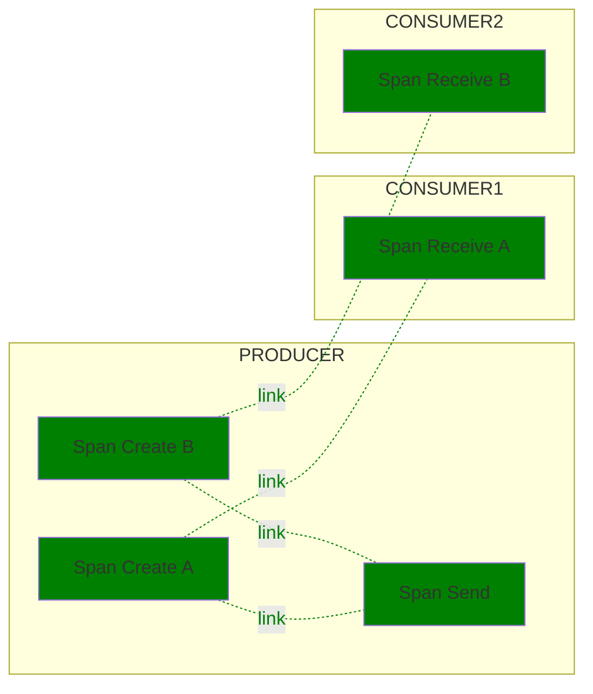
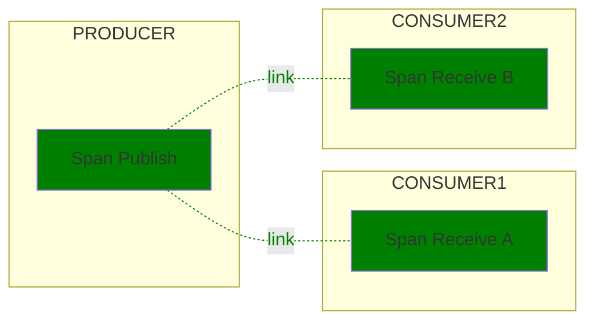

<!--- Hugo front matter used to generate the website version of this page:
linkTitle: Spans
--->

# Semantic conventions for messaging spans

**Status**: [Development][DocumentStatus]

<!-- toc -->

- [Definitions](#definitions)
  - [Message](#message)
  - [Producer](#producer)
  - [Consumer](#consumer)
  - [Intermediary](#intermediary)
  - [Destinations](#destinations)
  - [Message consumption](#message-consumption)
    - [Consumer groups](#consumer-groups)
    - [Subscriptions](#subscriptions)
  - [Conversations](#conversations)
  - [Temporary and anonymous destinations](#temporary-and-anonymous-destinations)
- [Conventions](#conventions)
  - [Context propagation](#context-propagation)
  - [Span name](#span-name)
  - [Operation types](#operation-types)
  - [Span kind](#span-kind)
  - [Span status](#span-status)
  - [Trace structure](#trace-structure)
    - [Producer spans](#producer-spans)
    - [Consumer spans](#consumer-spans)
      - [Message creation context as parent of "Process" span](#message-creation-context-as-parent-of-process-span)
- [Messaging attributes](#messaging-attributes)
  - [Recording per-message attributes on batch operations](#recording-per-message-attributes-on-batch-operations)
- [Examples](#examples)
  - [Topic with multiple consumers](#topic-with-multiple-consumers)
  - [Batch receiving](#batch-receiving)
  - [Batch publishing with "Create" spans](#batch-publishing-with-create-spans)
  - [Batch publishing without "Create" spans](#batch-publishing-without-create-spans)

<!-- tocstop -->

> [!Warning]
>
> Existing messaging instrumentations that are using
> [v1.24.0 of this document](https://github.com/open-telemetry/semantic-conventions/blob/v1.24.0/docs/messaging/messaging-spans.md)
> (or prior):
>
> * SHOULD NOT change the version of the messaging conventions that they emit by default
>   until the messaging semantic conventions are marked stable.
>   Conventions include, but are not limited to, attributes,
>   metric and span names, span kind and unit of measure.
> * SHOULD introduce an environment variable `OTEL_SEMCONV_STABILITY_OPT_IN`
>   in the existing major version which is a comma-separated list of values.
>   The list of values includes:
>   * `messaging` - emit the new, stable messaging conventions,
>     and stop emitting the old experimental messaging conventions
>     that the instrumentation emitted previously.
>   * `messaging/dup` - emit both the old and the stable messaging conventions,
>     allowing for a seamless transition.
>   * The default behavior (in the absence of one of these values) is to continue
>     emitting whatever version of the old experimental messaging conventions
>     the instrumentation was emitting previously.
>   * Note: `messaging/dup` has higher precedence than `messaging` in case both values are present
> * SHOULD maintain (security patching at a minimum) the existing major version
>   for at least six months after it starts emitting both sets of conventions.
> * SHOULD drop the environment variable in the next major version.
> * SHOULD emit the new, stable values for span name, span kind and similar "single"
> valued concepts when `messaging/dup` is present in the list.

## Definitions

### Message

Although messaging systems are not as standardized as, e.g., HTTP, it is assumed that the following definitions are applicable to most of them that have similar concepts at all (names borrowed mostly from JMS):

A *message* is an envelope with a potentially empty body.
This envelope may offer the possibility to convey additional metadata, often in key/value form.

A message is sent by a message *producer* to:

* Physically: some message *broker* (which can be e.g., a single server, or a cluster, or a local process reached via IPC). The broker handles the actual delivery, re-delivery, persistence, etc. In some messaging systems the broker may be identical or co-located with (some) message consumers.
With Apache Kafka, the physical broker a message is written to depends on the number of partitions, and which broker is the *leader* of the partition the record is written to.
* Logically: some particular message *destination*.

Messages can be delivered to 0, 1, or multiple consumers depending on the dispatching semantic of the protocol.

### Producer

The "producer" is a specific instance, process or device that creates and
sends a message. "Sending" is the process of transmitting a message or batch
of messages to the intermediary or consumer. Some intermediaries use "publishing"
as a synonym to sending.

### Consumer

A "consumer" receives the message and acts upon it. It uses the context and
data to execute some logic, which might lead to the occurrence of new events.

The consumer receives, processes, and settles a message. "Receiving" is the
process of obtaining a message from the intermediary, "processing" is the
process of acting on the information a message contains, "settling" is the
process of notifying an intermediary that a message was processed successfully.

### Intermediary

An "intermediary" receives a message to forward it to the next receiver, which
might be another intermediary or a consumer.

### Destinations

A destination represents the entity within a messaging system where
messages are sent to and consumed from.

A destination is usually uniquely identified by its name within
the messaging system instance.
Examples of a destination name would be an URL or a simple one-word identifier.

Typical examples of destinations include Kafka topics, RabbitMQ queues and topics.

### Message consumption

The consumption of a message can happen in multiple steps.
First, the lower-level receiving of a message at a consumer, and then the logical processing of the message.
Often, the waiting for a message is not particularly interesting and hidden away in a framework that only invokes some handler function to process a message once one is received
(in the same way that the listening on a TCP port for an incoming HTTP message is not particularly interesting).

#### Consumer groups

Consumer groups provide a logical grouping for the message consumers. Messaging systems use them to
load balance message consumption within the group, broadcast messages to multiple types of the consumers,
manage offset for each group independently.
As a result, different groups of consumers can receive messages at a different pace
or using different settings.

#### Subscriptions

Subscriptions represent entities within messaging systems that allow multiple consumers
to receive messages from the topic following subscription-specific consumption behavior that includes
load balancing, durability, filtering, or other system-specific capabilities.

Named subscriptions and consumers groups are semantically different mechanisms messaging systems use
for similar scenarios such as load-balancing or broadcasting.

### Conversations

In some messaging systems, a message can receive one or more reply messages that answers a particular other message that was sent earlier. All messages that are grouped together by such a reply-relationship are called a *conversation*.
The grouping usually happens through some sort of "In-Reply-To:" meta information or an explicit *conversation ID* (sometimes called *correlation ID*).
Sometimes a conversation can span multiple message destinations (e.g. initiated via a topic, continued on a temporary one-to-one queue).

### Temporary and anonymous destinations

Some messaging systems support the concept of *temporary destination* (often only temporary queues) that are established just for a particular set of communication partners (often one to one) or conversation.
Often such destinations are also unnamed (anonymous) or have an auto-generated name.

## Conventions

Given these definitions, the remainder of this section describes the semantic conventions for Spans describing interactions with messaging systems.

### Context propagation

A message may traverse many different components and layers in one or more intermediaries
when it is propagated from the producer to the consumer(s). To be able to correlate
consumer traces with producer traces using the existing context propagation mechanisms,
all components must propagate context down the chain.

Messaging systems themselves may trace messages as the messages travels from
producers to consumers. Such tracing would cover the transport layer but would
not help in correlating producers with consumers. To be able to directly
correlate producers with consumers, another context that is propagated with
the message is required.

A message *creation context* allows correlating producers with consumers
of a message and model the dependencies between them,
regardless of the underlying messaging transport mechanism and its instrumentation.

The message creation context is created by the producer and should be propagated
to the consumer(s). Consumer traces cannot be directly correlated with producer
traces if the message creation context is not attached and propagated with the message.

A producer SHOULD attach a message creation context to each message.
If possible, the message creation context SHOULD be attached
in such a way that it cannot be changed by intermediaries.

> This document does not specify the exact mechanisms on how the creation context
> is attached/extracted to/from messages. Future versions of these conventions
> will give clear recommendations, following industry standards including, but not limited to
> [Trace Context: AMQP protocol](https://w3c.github.io/trace-context-amqp/) and
> [Trace Context: MQTT protocol](https://w3c.github.io/trace-context-mqtt/)
> once those standards reach a stable state.

### Span name

Messaging spans SHOULD follow the overall [guidelines for span names](https://github.com/open-telemetry/opentelemetry-specification/tree/v1.41.0/specification/trace/api.md#span).

<!-- markdown-link-check-disable -->
<!-- HTML anchors are not supported https://github.com/tcort/markdown-link-check/issues/225-->
The **span name** SHOULD be `{messaging.operation.name} {destination}`
(see below for the exact definition of the [`{destination}`](#destination-placeholder) placeholder).
<!-- markdown-link-check-enable -->

Semantic conventions for individual messaging systems MAY specify different
span name format and then MUST document it in semantic conventions
for specific messaging technologies.

The `{destination}`
SHOULD describe the entity that the operation is performed against
and SHOULD adhere to one of the following values, provided they are accessible:

1. `messaging.destination.template` SHOULD be used when it is available.
2. `messaging.destination.name` SHOULD be used when the destination is known to be neither [temporary nor anonymous](#temporary-and-anonymous-destinations).
3. `server.address:server.port` SHOULD be used only for operations not targeting any specific destination(s).

If a (low-cardinality) corresponding `{destination}` value is not available for
a specific operation, the instrumentation SHOULD omit the `{destination}`.

Examples:

* `publish shop.orders`
* `send shop.orders`
* `subscribe shop.orders`
* `ack shop.orders`
* `nack print_jobs`
* `process topic with spaces`
* `settle AuthenticationRequest-Conversations`

### Operation types

The following operation types related to messages are defined for these semantic conventions:

| Operation type | Description |
| -------------- | ----------- |
| `create`       | A message is created or passed to a client library for sending. "Create" spans always refer to a single message and are used to provide a unique creation context for messages in batch sending scenarios. |
| `send`         | One or more messages are provided for sending to an intermediary. If a single message is sent, the context of the "Send" span can be used as the creation context and no "Create" span needs to be created. |
| `receive`      | One or more messages are requested by a consumer. This operation refers to pull-based scenarios, where consumers explicitly call methods of messaging SDKs to receive messages. |
| `process`      | One or more messages are processed by a consumer. |
| `settle`       | One or more messages are settled. |

### Span kind

Span kind SHOULD be set according to the following table, based on the operation type a span describes.

| Operation type | Span kind|
|----------------|-------------|
| `create`       | `PRODUCER`  |
| `send`         | `PRODUCER` if the context of the "Send" span is used as creation context, otherwise `CLIENT`. |
| `receive`      | `CLIENT`    |
| `process`      | `CONSUMER`  |
| `settle`       | `CLIENT`    |

Setting span kinds according to this table allows analysis tools to interpret spans
and relationships between them without the need for additional semantic hints.

### Span status

Refer to the [Recording Errors](/docs/general/recording-errors.md) document for
details on how to record span status.

### Trace structure

#### Producer spans

"Create" spans MAY be created when a message is created or passed to the client
library or other component responsible for sending.  A single "Create" span
SHOULD account only for a single message. "Send" spans SHOULD be created
for operations of sending or publishing a message to an intermediary. A single
"Send" span can account for a single message, or for multiple messages (in
the case of sending messages in batches).

If a user provides a custom creation context in a message, this context SHOULD
NOT be modified and a "Create" span SHOULD NOT be created.  Otherwise, if a
"Create" span exists for a message, its context SHOULD be injected into the
message. If no "Create" span exists and no custom creation context is injected
into the message, the context of the related "Send" span SHOULD be injected
into the message.

The "Send" span SHOULD always link to the creation context that was injected
into a message either from a "Create" span or as a custom creation context.

When instrumenting a library API that always sends a single message, it is
RECOMMENDED to create "Publish" span without "Create" span.

When instrumenting a library API that usually operate with batches, it is
RECOMMENDED to create a "Create" span for each message along with the "Publish" span.
It is also RECOMMENDED to provide a configuration option allowing to disable "Create"
span creation.

#### Consumer spans

"Receive" spans SHOULD be created for operations of passing messages to the
application when those operations are initiated by the application code
(pull-based scenarios).

"Process" spans SHOULD be created for operations of passing messages to the
application when those operations are not initiated by the application code
(push-based scenarios). Such "Process" span covers the duration of such an
operation, which is usually a callback or handler.

"Process" spans MAY be created in addition to "Receive" spans for pull-based
scenarios for operations of processing messages. Such spans could be created by
application code, or by abstraction layers built on top of messaging SDKs.

"Receive" or "Process" spans MUST NOT be created for messages that are
pre-fetched or cached by messaging libraries or SDKs until they are forwarded
to the caller.

A single "Process" or "Receive" span can account for a single message, for a
batch of messages, or for no message at all (if it is signalled that no
messages were received). For each message it accounts for, the "Process" or
"Receive" span SHOULD link to the message's creation context.

> [!IMPORTANT]
> These conventions use spans links as the default mechanism to correlate
> producers and consumer(s) because:
>
> - It is the only consistent trace structure that can be guaranteed,
> given the many different messaging systems models available.
>
> - It is the only option to correlate producer and consumer(s) in batch scenarios
> as a span can only have a single parent.
>
> - It is the only option to correlate producer and consumer(s) when message
> consumption can happen in the scope of another ambient context such as a
> HTTP server span.

"Settle" spans SHOULD be created for every manually or automatically triggered
settlement operation. A single "Settle" span can account for a single message
or for multiple messages (in case messages are passed for settling as batches).
For each message it accounts for, the "Settle" span MAY link to the creation
context of the message.

##### Message creation context as parent of "Process" span

Exclusively for single messages scenarios, the "Process" span MAY
use the message's creation context as its parent, thus achieving a direct
parent-child relationship between producer and consumer(s).
Instrumentations SHOULD document whether they use the message creation context
as a parent for "Process" spans and MAY provide configuration options
allowing users to control this behavior.

It is NOT RECOMMENDED to use the message creation context as the parent of "Process"
spans (by default) if processing happens in the scope of another span.

If instrumentation uses the message creation context as the parent for "Process"
spans in the scope of another valid ambient context, it SHOULD add the
ambient context as a link on the "Process" span to preserve the correlation
between message processing and that context.

For example, a messaging broker pushes messages over HTTP to a consumer
application which has HTTP server and messaging instrumentations enabled.

The messaging instrumentation would create the "Process" span following
one of these possible approaches:

- "Process" span is a child of the HTTP server span context and has a link
  to the message creation context. This is the default behavior.

- "Process" span is a child of the message creation context and has two links:
  one to the message creation context and another one to HTTP server span context.
  This is an opt-in behavior.

## Messaging attributes

Messaging attributes are organized into the following namespaces:

- `messaging.message`: Contains attributes that describe individual messages.
- `messaging.destination`: Contains attributes that describe the logical entity messages are sent to. See [Destinations](#destinations) for more details.
- `messaging.batch`: Contains attributes that describe batch operations.
- `messaging.consumer`: Contains attributes that describe the application instance that consumes a message. See [Consumer](#consumer) for more details.

Messaging system-specific attributes MUST be defined in the corresponding `messaging.{system}` namespace.

<!-- semconv span.messaging -->
<!-- NOTE: THIS TEXT IS AUTOGENERATED. DO NOT EDIT BY HAND. -->
<!-- see templates/registry/markdown/snippet.md.j2 -->
<!-- prettier-ignore-start -->
<!-- markdownlint-capture -->
<!-- markdownlint-disable -->

| Attribute  | Type | Description  | Examples  | [Requirement Level](https://opentelemetry.io/docs/specs/semconv/general/attribute-requirement-level/) | Stability |
|---|---|---|---|---|---|
| [`messaging.operation.name`](/docs/attributes-registry/messaging.md) | string | The system-specific name of the messaging operation. | `ack`; `nack`; `send` | `Required` |  |
| [`messaging.system`](/docs/attributes-registry/messaging.md) | string | The messaging system as identified by the client instrumentation. [1] | `activemq`; `aws_sqs`; `eventgrid` | `Required` |  |
| [`error.type`](/docs/attributes-registry/error.md) | string | Describes a class of error the operation ended with. [2] | `amqp:decode-error`; `KAFKA_STORAGE_ERROR`; `channel-error` | `Conditionally Required` If and only if the messaging operation has failed. |  |
| [`messaging.batch.message_count`](/docs/attributes-registry/messaging.md) | int | The number of messages sent, received, or processed in the scope of the batching operation. [3] | `0`; `1`; `2` | `Conditionally Required` [4] |  |
| [`messaging.consumer.group.name`](/docs/attributes-registry/messaging.md) | string | The name of the consumer group with which a consumer is associated. [5] | `my-group`; `indexer` | `Conditionally Required` If applicable. |  |
| [`messaging.destination.anonymous`](/docs/attributes-registry/messaging.md) | boolean | A boolean that is true if the message destination is anonymous (could be unnamed or have auto-generated name). |  | `Conditionally Required` [6] |  |
| [`messaging.destination.name`](/docs/attributes-registry/messaging.md) | string | The message destination name [7] | `MyQueue`; `MyTopic` | `Conditionally Required` [8] |  |
| [`messaging.destination.subscription.name`](/docs/attributes-registry/messaging.md) | string | The name of the destination subscription from which a message is consumed. [9] | `subscription-a` | `Conditionally Required` If applicable. |  |
| [`messaging.destination.template`](/docs/attributes-registry/messaging.md) | string | Low cardinality representation of the messaging destination name [10] | `/customers/{customerId}` | `Conditionally Required` [11] |  |
| [`messaging.destination.temporary`](/docs/attributes-registry/messaging.md) | boolean | A boolean that is true if the message destination is temporary and might not exist anymore after messages are processed. |  | `Conditionally Required` [12] |  |
| [`messaging.operation.type`](/docs/attributes-registry/messaging.md) | string | A string identifying the type of the messaging operation. [13] | `create`; `send`; `receive` | `Conditionally Required` If applicable. |  |
| [`server.address`](/docs/attributes-registry/server.md) | string | Server domain name if available without reverse DNS lookup; otherwise, IP address or Unix domain socket name. [14] | `example.com`; `10.1.2.80`; `/tmp/my.sock` | `Conditionally Required` If available. |  |
| [`messaging.client.id`](/docs/attributes-registry/messaging.md) | string | A unique identifier for the client that consumes or produces a message. | `client-5`; `myhost@8742@s8083jm` | `Recommended` |  |
| [`messaging.destination.partition.id`](/docs/attributes-registry/messaging.md) | string | The identifier of the partition messages are sent to or received from, unique within the `messaging.destination.name`. | `1` | `Recommended` When applicable. |  |
| [`messaging.message.conversation_id`](/docs/attributes-registry/messaging.md) | string | The conversation ID identifying the conversation to which the message belongs, represented as a string. Sometimes called "Correlation ID". | `MyConversationId` | `Recommended` |  |
| [`messaging.message.id`](/docs/attributes-registry/messaging.md) | string | A value used by the messaging system as an identifier for the message, represented as a string. | `452a7c7c7c7048c2f887f61572b18fc2` | `Recommended` If span describes operation on a single message. |  |
| [`network.peer.address`](/docs/attributes-registry/network.md) | string | Peer address of the messaging intermediary node where the operation was performed. [15] | `10.1.2.80`; `/tmp/my.sock` | `Recommended` If applicable for this messaging system. |  |
| [`network.peer.port`](/docs/attributes-registry/network.md) | int | Peer port of the messaging intermediary node where the operation was performed. | `65123` | `Recommended` if and only if `network.peer.address` is set. |  |
| [`server.port`](/docs/attributes-registry/server.md) | int | Server port number. [16] | `80`; `8080`; `443` | `Recommended` |  |
| [`messaging.message.body.size`](/docs/attributes-registry/messaging.md) | int | The size of the message body in bytes. [17] | `1439` | `Opt-In` |  |
| [`messaging.message.envelope.size`](/docs/attributes-registry/messaging.md) | int | The size of the message body and metadata in bytes. [18] | `2738` | `Opt-In` |  |

**[1] `messaging.system`:** The actual messaging system may differ from the one known by the client. For example, when using Kafka client libraries to communicate with Azure Event Hubs, the `messaging.system` is set to `kafka` based on the instrumentation's best knowledge.

**[2] `error.type`:** The `error.type` SHOULD be predictable, and SHOULD have low cardinality.

When `error.type` is set to a type (e.g., an exception type), its
canonical class name identifying the type within the artifact SHOULD be used.

Instrumentations SHOULD document the list of errors they report.

The cardinality of `error.type` within one instrumentation library SHOULD be low.
Telemetry consumers that aggregate data from multiple instrumentation libraries and applications
should be prepared for `error.type` to have high cardinality at query time when no
additional filters are applied.

If the operation has completed successfully, instrumentations SHOULD NOT set `error.type`.

If a specific domain defines its own set of error identifiers (such as HTTP or gRPC status codes),
it's RECOMMENDED to:

- Use a domain-specific attribute
- Set `error.type` to capture all errors, regardless of whether they are defined within the domain-specific set or not.

**[3] `messaging.batch.message_count`:** Instrumentations SHOULD NOT set `messaging.batch.message_count` on spans that operate with a single message. When a messaging client library supports both batch and single-message API for the same operation, instrumentations SHOULD use `messaging.batch.message_count` for batching APIs and SHOULD NOT use it for single-message APIs.

**[4] `messaging.batch.message_count`:** If the span describes an operation on a batch of messages.

**[5] `messaging.consumer.group.name`:** Semantic conventions for individual messaging systems SHOULD document whether `messaging.consumer.group.name` is applicable and what it means in the context of that system.

**[6] `messaging.destination.anonymous`:** If value is `true`. When missing, the value is assumed to be `false`.

**[7] `messaging.destination.name`:** Destination name SHOULD uniquely identify a specific queue, topic or other entity within the broker. If
the broker doesn't have such notion, the destination name SHOULD uniquely identify the broker.

**[8] `messaging.destination.name`:** If span describes operation on a single message or if the value applies to all messages in the batch.

**[9] `messaging.destination.subscription.name`:** Semantic conventions for individual messaging systems SHOULD document whether `messaging.destination.subscription.name` is applicable and what it means in the context of that system.

**[10] `messaging.destination.template`:** Destination names could be constructed from templates. An example would be a destination name involving a user name or product id. Although the destination name in this case is of high cardinality, the underlying template is of low cardinality and can be effectively used for grouping and aggregation.

**[11] `messaging.destination.template`:** If available. Instrumentations MUST NOT use `messaging.destination.name` as template unless low-cardinality of destination name is guaranteed.

**[12] `messaging.destination.temporary`:** If value is `true`. When missing, the value is assumed to be `false`.

**[13] `messaging.operation.type`:** If a custom value is used, it MUST be of low cardinality.

**[14] `server.address`:** Server domain name of the broker if available without reverse DNS lookup; otherwise, IP address or Unix domain socket name.

**[15] `network.peer.address`:** Semantic conventions for individual messaging systems SHOULD document whether `network.peer.*` attributes are applicable.
Network peer address and port are important when the application interacts with individual intermediary nodes directly,
If a messaging operation involved multiple network calls (for example retries), the address of the last contacted node SHOULD be used.

**[16] `server.port`:** When observed from the client side, and when communicating through an intermediary, `server.port` SHOULD represent the server port behind any intermediaries, for example proxies, if it's available.

**[17] `messaging.message.body.size`:** This can refer to both the compressed or uncompressed body size. If both sizes are known, the uncompressed
body size should be used.

**[18] `messaging.message.envelope.size`:** This can refer to both the compressed or uncompressed size. If both sizes are known, the uncompressed
size should be used.

The following attributes can be important for making sampling decisions
and SHOULD be provided **at span creation time** (if provided at all):

* [`messaging.consumer.group.name`](/docs/attributes-registry/messaging.md)
* [`messaging.destination.name`](/docs/attributes-registry/messaging.md)
* [`messaging.destination.partition.id`](/docs/attributes-registry/messaging.md)
* [`messaging.destination.subscription.name`](/docs/attributes-registry/messaging.md)
* [`messaging.destination.template`](/docs/attributes-registry/messaging.md)
* [`messaging.operation.name`](/docs/attributes-registry/messaging.md)
* [`messaging.operation.type`](/docs/attributes-registry/messaging.md)
* [`messaging.system`](/docs/attributes-registry/messaging.md)
* [`server.address`](/docs/attributes-registry/server.md)
* [`server.port`](/docs/attributes-registry/server.md)

---

`error.type` has the following list of well-known values. If one of them applies, then the respective value MUST be used; otherwise, a custom value MAY be used.

| Value  | Description | Stability |
|---|---|---|
| `_OTHER` | A fallback error value to be used when the instrumentation doesn't define a custom value. |  |

---

`messaging.operation.type` has the following list of well-known values. If one of them applies, then the respective value MUST be used; otherwise, a custom value MAY be used.

| Value  | Description | Stability |
|---|---|---|
| `create` | A message is created. "Create" spans always refer to a single message and are used to provide a unique creation context for messages in batch sending scenarios. |  |
| `process` | One or more messages are processed by a consumer. |  |
| `receive` | One or more messages are requested by a consumer. This operation refers to pull-based scenarios, where consumers explicitly call methods of messaging SDKs to receive messages. |  |
| `send` | One or more messages are provided for sending to an intermediary. If a single message is sent, the context of the "Send" span can be used as the creation context and no "Create" span needs to be created. |  |
| `settle` | One or more messages are settled. |  |

---

`messaging.system` has the following list of well-known values. If one of them applies, then the respective value MUST be used; otherwise, a custom value MAY be used.

| Value  | Description | Stability |
|---|---|---|
| `activemq` | Apache ActiveMQ |  |
| `aws_sqs` | Amazon Simple Queue Service (SQS) |  |
| `eventgrid` | Azure Event Grid |  |
| `eventhubs` | Azure Event Hubs |  |
| `gcp_pubsub` | Google Cloud Pub/Sub |  |
| `jms` | Java Message Service |  |
| `kafka` | Apache Kafka |  |
| `pulsar` | Apache Pulsar |  |
| `rabbitmq` | RabbitMQ |  |
| `rocketmq` | Apache RocketMQ |  |
| `servicebus` | Azure Service Bus |  |

<!-- markdownlint-restore -->
<!-- prettier-ignore-end -->
<!-- END AUTOGENERATED TEXT -->
<!-- endsemconv -->

### Recording per-message attributes on batch operations

All messaging operations (`send`, `receive`, `process`, or others not covered by this specification) can describe both single and/or batch of messages.
Attributes in the `messaging.message` or `messaging.{system}.message` namespace apply to individual messages and typically vary between messages within the same batch.

Some messaging systems such as Kafka or Azure Event Grid allow sending a batch of messages to different topics in a single operation, resulting in
different `messaging.destination.name` or other destination attributes within a single messaging operation.

If the attribute value is the same for all messages in the batch, the instrumentation SHOULD set such attribute on the span representing the batch operation.
If the attribute values vary, the instrumentation SHOULD set such attributes on links describing individual messages.

See [Batch receiving](#batch-receiving) for more information on correlation using links.

## Examples

This section contains a list of examples illustrating the use of the
conventions outlined above. Green boxes denote spans that are required to exist
in order to conform to those conventions. Other boxes denote spans that are not
required and covered by the conventions, but are hopefully helpful in
understanding how messaging spans can be integrated into an overall trace flow.
Solid arrows denote parent/child relationships, dotted arrows denote link
relationships.

> [!IMPORTANT]
> The text inside the "Span" box is only for reference and visualization purposes.
> Check the accompanying table to see the actual span name to be reported
> as well as other attributes.

### Topic with multiple consumers

Given is a publisher that publishes a message to a topic exchange "T" on RabbitMQ, and two consumers which both get the message delivered.

| Field or Attribute | Producer | Consumer 1| Consumer 2 |
|-|-|-|-|
| Span name | `publish T` | `consume T` | `consume T` |
| Parent (optional) | | `publish T` | `publish T` |
| Links |  | `publish T` | `publish T` |
| SpanKind | `PRODUCER` | `CONSUMER` | `CONSUMER` |
| `server.address` | `"ms"` | `"ms"` | `"ms"` |
| `server.port` | `1234` | `1234` | `1234` |
| `messaging.system` | `"rabbitmq"` | `"rabbitmq"` | `"rabbitmq"` |
| `messaging.destination.name` | `"T"` | `"T"` | `"T"` |
| `messaging.operation.name` | `"publish"` | `"consume"` | `"consume"` |
| `messaging.operation.type` | `"send"` | `"process"` | `"process"` |
| `messaging.message.id` | `"a"` | `"a"`| `"a"` |

### Batch receiving

Given is a producer that publishes two messages to a topic "Q" on Kafka, and a consumer which receives both messages in one batch.

| Field or Attribute | Producer Span A | Producer Span B | Consumer |
|-|-|-|-|
| Span name | `send Q` | `send Q` | `poll Q` |
| Parent |  |  |  |
| Links |  |  | Span Send A, Span Send B |
| Link attributes |  |  | Span Send A: `messaging.message.id`: `"a1"`  |
|                 |  |  | Span Send B: `messaging.message.id`: `"a2"`  |
| SpanKind | `PRODUCER` | `PRODUCER` | `CLIENT` |
| `server.address` | `"ms"` | `"ms"` | `"ms"` |
| `server.port` | `1234` | `1234` | `1234` |
| `messaging.system` | `"kafka"` | `"kafka"` | `"kafka"` |
| `messaging.destination.name` | `"Q"` | `"Q"` | `"Q"` |
| `messaging.operation.name` | `"send"` | `"send"` | `"poll"` |
| `messaging.operation.type` | `"send"` | `"send"` | `"receive"` |
| `messaging.message.id` | `"a1"` | `"a2"` | |
| `messaging.batch.message_count` |  |  | 2 |

### Batch publishing with "Create" spans

Given is a producer that publishes a batch with two messages to a topic "Q" on
Kafka, and two different consumers receiving one of the messages.

Instrumentation in this case reports "Create" span for each message and a "Publish"
span that's linked to a "Create" span.

| Field or Attribute | Producer Span Create A | Producer Span Create B | Producer Span Send | Consumer 1 | Consumer 2 |
|-|-|-|-|-|-|
| Span name | `create Q` | `create Q` | `send Q` | `poll Q` | `poll Q` |
| Parent |  | | | | |
| Links |  |  |  | Span Create A | Span Create B |
| SpanKind | `PRODUCER` | `PRODUCER` | `CLIENT` | `CLIENT` | `CLIENT` |
| `server.address` | `"ms"` | `"ms"` | `"ms"` | `"ms"` | `"ms"` |
| `server.port` | `1234` | `1234` | `1234` | `1234` | `1234` |
| `messaging.system` | `"kafka"` | `"kafka"` | `"kafka"` | `"kafka"` | `"kafka"` |
| `messaging.destination.name` | `"Q"` | `"Q"` | `"Q"` | `"Q"` | `"Q"` |
| `messaging.operation.name` | `"create"` | `"create"` | `"send"` | `"poll"` | `"poll"` |
| `messaging.operation.type` | `"create"` | `"create"` | `"send"` | `"receive"` | `"receive"` |
| `messaging.message.id` | `"a1"` | `"a2"` | | `"a1"` | `"a2"` |
| `messaging.batch.message_count` | | | 2 | | |

### Batch publishing without "Create" spans

Given is a producer that publishes a batch with two messages to a topic "Q" on
Kafka, and two different consumers receiving one of the messages.

Based on the configuration provided by user, instrumentation in this case reports
"Publish" span only. It injects "Publish" span context into both messages.

| Field or Attribute | Producer | Consumer 1 | Consumer 2 |
|-|-|-|-|
| Span name | `send Q` | `poll Q` | `poll Q` |
| Parent | | | |
| Links |  | Span Publish | Span Publish |
| SpanKind | `PRODUCER` | `CLIENT` | `CLIENT` |
| `server.address` | `"ms"` | `"ms"` | `"ms"` |
| `server.port` | `1234` | `1234` | `1234` |
| `messaging.system` | `"kafka"` | `"kafka"` | `"kafka"` |
| `messaging.destination.name` | `"Q"` | `"Q"` | `"Q"` |
| `messaging.operation.name` | `"send"` | `"poll"` | `"poll"` |
| `messaging.operation.type` | `"publish"` | `"receive"` | `"receive"` |
| `messaging.message.id` | | `"a1"` | `"a2"` |
| `messaging.batch.message_count`| 2 | | |

[DocumentStatus]: https://opentelemetry.io/docs/specs/otel/document-status
