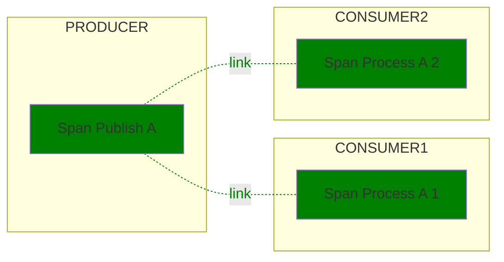
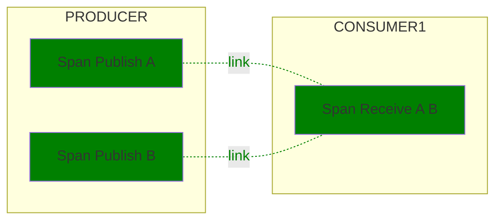
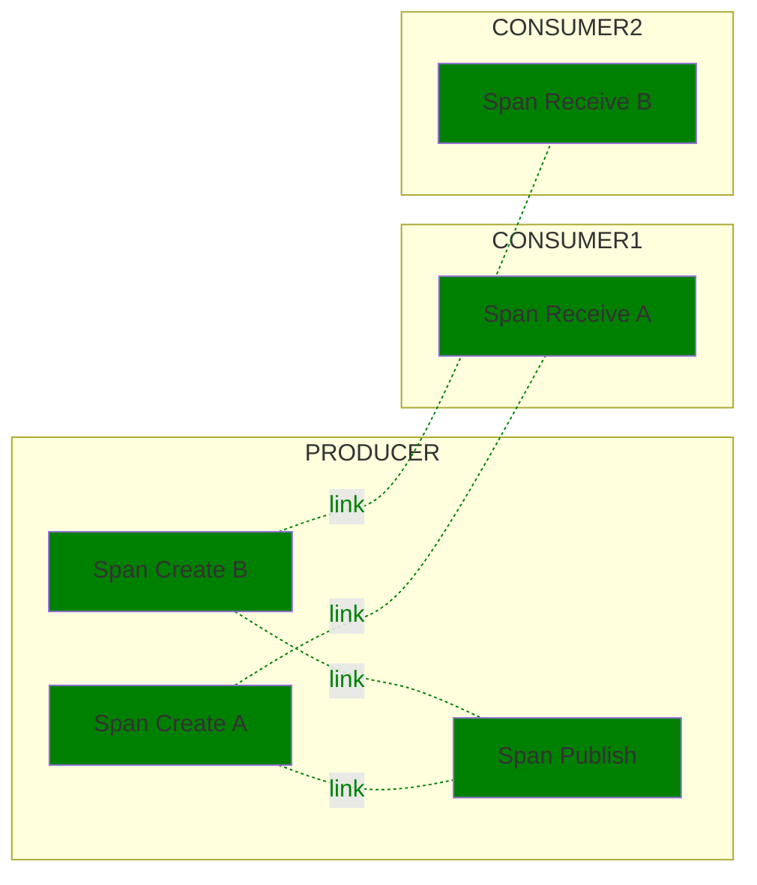

# Semantic Conventions for Messaging Spans

**Status**: [Experimental][DocumentStatus]

<!-- Re-generate TOC with `markdown-toc --no-first-h1 -i` -->

<!-- toc -->

- [Definitions](#definitions)
  - [Message](#message)
  - [Producer](#producer)
  - [Consumer](#consumer)
  - [Intermediary](#intermediary)
  - [Destinations](#destinations)
  - [Message consumption](#message-consumption)
  - [Conversations](#conversations)
  - [Temporary and anonymous destinations](#temporary-and-anonymous-destinations)
- [Conventions](#conventions)
  - [Context propagation](#context-propagation)
  - [Span name](#span-name)
  - [Operation names](#operation-names)
  - [Span kind](#span-kind)
  - [Trace structure](#trace-structure)
    - [Producer spans](#producer-spans)
    - [Consumer spans](#consumer-spans)
- [Messaging attributes](#messaging-attributes)
  - [Consumer attributes](#consumer-attributes)
  - [Per-message attributes](#per-message-attributes)
  - [Attributes specific to certain messaging systems](#attributes-specific-to-certain-messaging-systems)
- [Examples](#examples)
  - [Topic with multiple consumers](#topic-with-multiple-consumers)
  - [Batch receiving](#batch-receiving)
  - [Batch publishing](#batch-publishing)
- [Semantic Conventions for specific messaging technologies](#semantic-conventions-for-specific-messaging-technologies)

<!-- tocstop -->

> **Warning**
> Existing messaging instrumentations that are using
> [v1.24.0 of this document](https://github.com/open-telemetry/semantic-conventions/blob/v1.24.0/docs/messaging/messaging-spans.md)
> (or prior) SHOULD NOT change the version of the messaging conventions that they emit
> until a transition plan to the (future) stable semantic conventions has been published.
> Conventions include, but are not limited to, attributes, metric and span names, and unit of measure.

## Definitions

### Message

Although messaging systems are not as standardized as, e.g., HTTP, it is assumed that the following definitions are applicable to most of them that have similar concepts at all (names borrowed mostly from JMS):

A *message* is an envelope with a potentially empty body.
This envelope may offer the possibility to convey additional metadata, often in key/value form.

A message is sent by a message *producer* to:

* Physically: some message *broker* (which can be e.g., a single server, or a cluster, or a local process reached via IPC). The broker handles the actual delivery, re-delivery, persistence, etc. In some messaging systems the broker may be identical or co-located with (some) message consumers.
With Apache Kafka, the physical broker a message is written to depends on the number of partitions, and which broker is the *leader* of the partition the record is written to.
* Logically: some particular message *destination*.

Messages can be delivered to 0, 1, or multiple consumers depending on the dispatching semantic of the protocol.

### Producer

The "producer" is a specific instance, process or device that creates and
publishes a message. "Publishing" is the process of sending a message or batch
of messages to the intermediary or consumer.

### Consumer

A "consumer" receives the message and acts upon it. It uses the context and
data to execute some logic, which might lead to the occurrence of new events.

The consumer receives, processes, and settles a message. "Receiving" is the
process of obtaining a message from the intermediary, "processing" is the
process of acting on the information a message contains, "settling" is the
process of notifying an intermediary that a message was processed successfully.

### Intermediary

An "intermediary" receives a message to forward it to the next receiver, which
might be another intermediary or a consumer.

### Destinations

A destination represents the entity within a messaging system where
messages are published to and consumed from.

A destination is usually uniquely identified by its name within
the messaging system instance.
Examples of a destination name would be an URL or a simple one-word identifier.

In some use cases, messages are routed within one or multiple brokers. In such
cases, the destination the message was originally published to is different
from the destination it is being consumed from. When information about the
destination where the message was originally published to is available, consumers
can record them under the `destination_publish` namespace.

Typical examples of destinations include Kafka topics, RabbitMQ queues and topics.

### Message consumption

The consumption of a message can happen in multiple steps.
First, the lower-level receiving of a message at a consumer, and then the logical processing of the message.
Often, the waiting for a message is not particularly interesting and hidden away in a framework that only invokes some handler function to process a message once one is received
(in the same way that the listening on a TCP port for an incoming HTTP message is not particularly interesting).

### Conversations

In some messaging systems, a message can receive one or more reply messages that answers a particular other message that was sent earlier. All messages that are grouped together by such a reply-relationship are called a *conversation*.
The grouping usually happens through some sort of "In-Reply-To:" meta information or an explicit *conversation ID* (sometimes called *correlation ID*).
Sometimes a conversation can span multiple message destinations (e.g. initiated via a topic, continued on a temporary one-to-one queue).

### Temporary and anonymous destinations

Some messaging systems support the concept of *temporary destination* (often only temporary queues) that are established just for a particular set of communication partners (often one to one) or conversation.
Often such destinations are also unnamed (anonymous) or have an auto-generated name.

## Conventions

Given these definitions, the remainder of this section describes the semantic conventions for Spans describing interactions with messaging systems.

### Context propagation

A message may traverse many different components and layers in one or more intermediaries
when it is propagated from the producer to the consumer(s). To be able to correlate
consumer traces with producer traces using the existing context propagation mechanisms,
all components must propagate context down the chain.

Messaging systems themselves may trace messages as the messages travels from
producers to consumers. Such tracing would cover the transport layer but would
not help in correlating producers with consumers. To be able to directly
correlate producers with consumers, another context that is propagated with
the message is required.

A message *creation context* allows correlating producers with consumers
of a message and model the dependencies between them,
regardless of the underlying messaging transport mechanism and its instrumentation.

The message creation context is created by the producer and should be propagated
to the consumer(s). Consumer traces cannot be directly correlated with producer
traces if the message creation context is not attached and propagated with the message.

A producer SHOULD attach a message creation context to each message.
If possible, the message creation context SHOULD be attached
in such a way that it cannot be changed by intermediaries.

> This document does not specify the exact mechanisms on how the creation context
> is attached/extracted to/from messages. Future versions of these conventions
> will give clear recommendations, following industry standards including, but not limited to
> [Trace Context: AMQP protocol](https://w3c.github.io/trace-context-amqp/) and
> [Trace Context: MQTT protocol](https://w3c.github.io/trace-context-mqtt/)
> once those standards reach a stable state.

### Span name

The span name SHOULD be set to the message destination name and the operation being performed in the following format:

```
<destination name> <operation name>
```

The destination name SHOULD only be used for the span name if it is known to be of low cardinality (cf. [general span name guidelines](https://github.com/open-telemetry/opentelemetry-specification/tree/v1.26.0/specification/trace/api.md#span)).
This can be assumed if it is statically derived from application code or configuration.
Wherever possible, the real destination names after resolving logical or aliased names SHOULD be used.
If the destination name is dynamic, such as a [conversation ID](#conversations) or a value obtained from a `Reply-To` header, it SHOULD NOT be used for the span name.
In these cases, an artificial destination name that best expresses the destination, or a generic, static fallback like `"(anonymous)"` for [anonymous destinations](#temporary-and-anonymous-destinations) SHOULD be used instead.

The values allowed for `<operation name>` are defined in the section [Operation names](#operation-names) below.

Examples:

* `shop.orders publish`
* `shop.orders receive`
* `shop.orders settle`
* `print_jobs publish`
* `topic with spaces process`
* `AuthenticationRequest-Conversations settle`
* `(anonymous) publish` (`(anonymous)` being a stable identifier for an unnamed destination)

Messaging system specific adaptions to span naming MUST be documented in [semantic conventions for specific messaging technologies](#semantic-conventions-for-specific-messaging-technologies).

### Operation names

The following operations related to messages are defined for these semantic conventions:

| Operation name | Description |
| -------------- | ----------- |
| `create`       | A message is created or passed to a client library for publishing. "Create" spans always refer to a single message and are used to provide a unique creation context for messages in batch publishing scenarios. |
| `publish`      | One or more messages are provided for publishing to an intermediary. If a single message is published, the context of the "Publish" span can be used as the creation context and no "Create" span needs to be created. |
| `receive`      | One or more messages are requested by a consumer. This operation refers to pull-based scenarios, where consumers explicitly call methods of messaging SDKs to receive messages. |
| `process`      | One or more messages are delivered to or processed by a consumer. |
| `settle`       | One or more messages are settled. |

### Span kind

[Span kinds](https://github.com/open-telemetry/opentelemetry-specification/tree/v1.26.0/specification/trace/api.md#spankind)
SHOULD be set according to the following table, based on the operation a span describes.

| Operation name | Span kind|
|----------------|-------------|
| `create`       | `PRODUCER` |
| `publish`      | `PRODUCER` if the context of the "Publish" span is used as creation context. |
| `receive`      | `CONSUMER` |
| `process`      | `CONSUMER` for push-based scenarios where no `receive` span exists. |

For cases not covered by the table above, the span kind should be set according
to the [generic specification about span kinds](https://github.com/open-telemetry/opentelemetry-specification/tree/v1.26.0/specification/trace/api.md#spankind),
e. g. it should be set to CLIENT for the "Publish" span if its context is not
used as creation context and if the "Publish" span models a synchronous call to
the intermediary.

Setting span kinds according to this table ensures that span links between
consumers and producers always exist between a PRODUCER span on the producer
side and a CONSUMER span on the consumer side. This allows analysis tools to
interpret linked traces without the need for additional semantic hints.

### Trace structure

#### Producer spans

"Create" spans MAY be created when a message is created or passed to the client
library or other component responsible for publishing.  A single "Create" span
SHOULD account only for a single message. "Publish" spans SHOULD be created
for operations of sending or publishing a message to an intermediary. A single
"Publish" span can account for a single message, or for multiple messages (in
the case of sending messages in batches).

If a user provides a custom creation context in a message, this context SHOULD
NOT be modified and a "Create" span SHOULD NOT be created.  Otherwise, if a
"Create" span exists for a message, its context SHOULD be injected into the
message. If no "Create" span exists and no custom creation context is injected
into the message, the context of the related "Publish" span SHOULD be injected
into the message.

The "Publish" span SHOULD always link to the creation context that was injected
into a message either from a "Create" span or as a custom creation context.

#### Consumer spans

"Receive" spans SHOULD be created for operations of passing messages to the
application when those operations are initiated by the application code
(pull-based scenarios).

"Process" spans SHOULD be created for operations of passing messages to the
application when those operations are not initiated by the application code
(push-based scenarios). Such "Process" span covers the duration of such an
operation, which is usually a callback or handler.

"Process" spans MAY be created in addition to "Receive" spans for pull-based
scenarios for operations of processing messages. Such spans could be created by
application code, or by abstraction layers built on top of messaging SDKs.

"Receive" or "Process" spans MUST NOT be created for messages that are
pre-fetched or cached by messaging libraries or SDKs until they are forwarded
to the caller.

A single "Process" or "Receive" span can account for a single message, for a
batch of messages, or for no message at all (if it is signalled that no
messages were received). For each message it accounts for, the "Process" or
"Receive" span SHOULD link to the message's creation context.

"Settle" spans SHOULD be created for every manually or automatically triggered
settlement operation. A single "Settle" span can account for a single message
or for multiple messages (in case messages are passed for settling as batches).
For each message it accounts for, the "Settle" span MAY link to the creation
context of the message.

## Messaging attributes

Messaging attributes are organized into the following namespaces:

- `messaging.message`: Contains [per-message attributes](#per-message-attributes) that describe individual messages. Those attributes are relevant only for spans or links that represent a single message.
- `messaging.destination`: Contains attributes that describe the logical entity messages are published to. See [Destinations](#destinations) for more details.
- `messaging.destination_publish`: Contains attributes that describe the logical entity messages were originally published to. See [Destinations](#destinations) for more details.
- `messaging.batch`: Contains attributes that describe batch operations.
- `messaging.consumer`: Contains [consumer attributes](#consumer-attributes) that describe the application instance that consumes a message. See [consumer](#consumer) for more details.

The communication with the intermediary is described with general [network attributes].

Messaging system-specific attributes MUST be defined in the corresponding `messaging.{system}` namespace
as described in [Attributes specific to certain messaging systems](#attributes-specific-to-certain-messaging-systems).

<!-- semconv messaging(full) -->
| Attribute  | Type | Description  | Examples  | Requirement Level |
|---|---|---|---|---|
| [`error.type`](../attributes-registry/error.md) | string | Describes a class of error the operation ended with. [1] | `amqp:decode-error`; `KAFKA_STORAGE_ERROR`; `channel-error` | Conditionally Required: [2] |
| [`messaging.batch.message_count`](../attributes-registry/messaging.md) | int | The number of messages sent, received, or processed in the scope of the batching operation. [3] | `0`; `1`; `2` | Conditionally Required: [4] |
| [`messaging.client_id`](../attributes-registry/messaging.md) | string | A unique identifier for the client that consumes or produces a message. | `client-5`; `myhost@8742@s8083jm` | Recommended: If a client id is available |
| [`messaging.destination.anonymous`](../attributes-registry/messaging.md) | boolean | A boolean that is true if the message destination is anonymous (could be unnamed or have auto-generated name). |  | Conditionally Required: [5] |
| [`messaging.destination.name`](../attributes-registry/messaging.md) | string | The message destination name [6] | `MyQueue`; `MyTopic` | Conditionally Required: [7] |
| [`messaging.destination.template`](../attributes-registry/messaging.md) | string | Low cardinality representation of the messaging destination name [8] | `/customers/{customerId}` | Conditionally Required: [9] |
| [`messaging.destination.temporary`](../attributes-registry/messaging.md) | boolean | A boolean that is true if the message destination is temporary and might not exist anymore after messages are processed. |  | Conditionally Required: [10] |
| [`messaging.message.body.size`](../attributes-registry/messaging.md) | int | The size of the message body in bytes. [11] | `1439` | Recommended |
| [`messaging.message.conversation_id`](../attributes-registry/messaging.md) | string | The conversation ID identifying the conversation to which the message belongs, represented as a string. Sometimes called "Correlation ID". | `MyConversationId` | Recommended |
| [`messaging.message.envelope.size`](../attributes-registry/messaging.md) | int | The size of the message body and metadata in bytes. [12] | `2738` | Recommended |
| [`messaging.message.id`](../attributes-registry/messaging.md) | string | A value used by the messaging system as an identifier for the message, represented as a string. | `452a7c7c7c7048c2f887f61572b18fc2` | Recommended |
| [`messaging.operation`](../attributes-registry/messaging.md) | string | A string identifying the kind of messaging operation. [13] | `publish` | Required |
| [`messaging.system`](../attributes-registry/messaging.md) | string | An identifier for the messaging system being used. See below for a list of well-known identifiers. | `activemq` | Required |
| [`network.peer.address`](../attributes-registry/network.md) | string | Peer address of the network connection - IP address or Unix domain socket name. | `10.1.2.80`; `/tmp/my.sock` | Recommended |
| [`network.peer.port`](../attributes-registry/network.md) | int | Peer port number of the network connection. | `65123` | Recommended: If `network.peer.address` is set. |
| [`network.protocol.name`](../attributes-registry/network.md) | string | [OSI application layer](https://osi-model.com/application-layer/) or non-OSI equivalent. [14] | `amqp`; `mqtt` | Conditionally Required: [15] |
| [`network.protocol.version`](../attributes-registry/network.md) | string | Version of the protocol specified in `network.protocol.name`. [16] | `3.1.1` | Recommended |
| [`network.transport`](../attributes-registry/network.md) | string | [OSI transport layer](https://osi-model.com/transport-layer/) or [inter-process communication method](https://wikipedia.org/wiki/Inter-process_communication). [17] | `tcp`; `udp` | Recommended |
| [`network.type`](../attributes-registry/network.md) | string | [OSI network layer](https://osi-model.com/network-layer/) or non-OSI equivalent. [18] | `ipv4`; `ipv6` | Recommended |
| [`server.address`](../attributes-registry/server.md) | string | Server domain name if available without reverse DNS lookup; otherwise, IP address or Unix domain socket name. [19] | `example.com`; `10.1.2.80`; `/tmp/my.sock` | Conditionally Required: If available. |
| [`server.port`](../attributes-registry/server.md) | int | Server port number. [20] | `80`; `8080`; `443` | Recommended |

**[1]:** The `error.type` SHOULD be predictable and SHOULD have low cardinality.
Instrumentations SHOULD document the list of errors they report.

The cardinality of `error.type` within one instrumentation library SHOULD be low.
Telemetry consumers that aggregate data from multiple instrumentation libraries and applications
should be prepared for `error.type` to have high cardinality at query time when no
additional filters are applied.

If the operation has completed successfully, instrumentations SHOULD NOT set `error.type`.

If a specific domain defines its own set of error identifiers (such as HTTP or gRPC status codes),
it's RECOMMENDED to:

* Use a domain-specific attribute
* Set `error.type` to capture all errors, regardless of whether they are defined within the domain-specific set or not.

**[2]:** If and only if the messaging operation has failed.

**[3]:** Instrumentations SHOULD NOT set `messaging.batch.message_count` on spans that operate with a single message. When a messaging client library supports both batch and single-message API for the same operation, instrumentations SHOULD use `messaging.batch.message_count` for batching APIs and SHOULD NOT use it for single-message APIs.

**[4]:** If the span describes an operation on a batch of messages.

**[5]:** If value is `true`. When missing, the value is assumed to be `false`.

**[6]:** Destination name SHOULD uniquely identify a specific queue, topic or other entity within the broker. If
the broker doesn't have such notion, the destination name SHOULD uniquely identify the broker.

**[7]:** If span describes operation on a single message or if the value applies to all messages in the batch.

**[8]:** Destination names could be constructed from templates. An example would be a destination name involving a user name or product id. Although the destination name in this case is of high cardinality, the underlying template is of low cardinality and can be effectively used for grouping and aggregation.

**[9]:** If available. Instrumentations MUST NOT use `messaging.destination.name` as template unless low-cardinality of destination name is guaranteed.

**[10]:** If value is `true`. When missing, the value is assumed to be `false`.

**[11]:** This can refer to both the compressed or uncompressed body size. If both sizes are known, the uncompressed
body size should be used.

**[12]:** This can refer to both the compressed or uncompressed size. If both sizes are known, the uncompressed
size should be used.

**[13]:** If a custom value is used, it MUST be of low cardinality.

**[14]:** The value SHOULD be normalized to lowercase.

**[15]:** Only for messaging systems and frameworks that support more than one protocol.

**[16]:** `network.protocol.version` refers to the version of the protocol used and might be different from the protocol client's version. If the HTTP client has a version of `0.27.2`, but sends HTTP version `1.1`, this attribute should be set to `1.1`.

**[17]:** The value SHOULD be normalized to lowercase.

Consider always setting the transport when setting a port number, since
a port number is ambiguous without knowing the transport. For example
different processes could be listening on TCP port 12345 and UDP port 12345.

**[18]:** The value SHOULD be normalized to lowercase.

**[19]:** This should be the IP/hostname of the broker (or other network-level peer) this specific message is sent to/received from.

**[20]:** When observed from the client side, and when communicating through an intermediary, `server.port` SHOULD represent the server port behind any intermediaries, for example proxies, if it's available.

`error.type` has the following list of well-known values. If one of them applies, then the respective value MUST be used, otherwise a custom value MAY be used.

| Value  | Description |
|---|---|
| `_OTHER` | A fallback error value to be used when the instrumentation doesn't define a custom value. |

`messaging.operation` has the following list of well-known values. If one of them applies, then the respective value MUST be used, otherwise a custom value MAY be used.

| Value  | Description |
|---|---|
| `publish` | One or more messages are provided for publishing to an intermediary. If a single message is published, the context of the "Publish" span can be used as the creation context and no "Create" span needs to be created. |
| `create` | A message is created. "Create" spans always refer to a single message and are used to provide a unique creation context for messages in batch publishing scenarios. |
| `receive` | One or more messages are requested by a consumer. This operation refers to pull-based scenarios, where consumers explicitly call methods of messaging SDKs to receive messages. |
| `process` | One or more messages are delivered to or processed by a consumer. |
| `settle` | One or more messages are settled. |

`messaging.system` has the following list of well-known values. If one of them applies, then the respective value MUST be used, otherwise a custom value MAY be used.

| Value  | Description |
|---|---|
| `activemq` | Apache ActiveMQ |
| `aws_sqs` | Amazon Simple Queue Service (SQS) |
| `eventgrid` | Azure Event Grid |
| `eventhubs` | Azure Event Hubs |
| `servicebus` | Azure Service Bus |
| `gcp_pubsub` | Google Cloud Pub/Sub |
| `jms` | Java Message Service |
| `kafka` | Apache Kafka |
| `rabbitmq` | RabbitMQ |
| `rocketmq` | Apache RocketMQ |

`network.transport` has the following list of well-known values. If one of them applies, then the respective value MUST be used, otherwise a custom value MAY be used.

| Value  | Description |
|---|---|
| `tcp` | TCP |
| `udp` | UDP |
| `pipe` | Named or anonymous pipe. |
| `unix` | Unix domain socket |

`network.type` has the following list of well-known values. If one of them applies, then the respective value MUST be used, otherwise a custom value MAY be used.

| Value  | Description |
|---|---|
| `ipv4` | IPv4 |
| `ipv6` | IPv6 |
<!-- endsemconv -->

Additionally `server.port` from the [network attributes][] is recommended.
Furthermore, it is strongly recommended to add the [`network.transport`][] attribute and follow its guidelines, especially for in-process queueing systems (like [Hangfire][], for example).
These attributes should be set to the broker to which the message is sent/from which it is received.

[network attributes]: /docs/general/attributes.md#server-and-client-attributes
[`network.transport`]: /docs/general/attributes.md#network-attributes
[Hangfire]: https://www.hangfire.io/

### Consumer attributes

The following additional attributes describe message consumer operations.

Since messages could be routed by brokers, the destination messages are published
to may not match with the destination they are consumed from.

If information about the original destination is available on the consumer,
consumer instrumentations SHOULD populate the attributes
under the namespace `messaging.destination_publish.*`

<!-- semconv messaging.destination_publish -->
| Attribute  | Type | Description  | Examples  | Requirement Level |
|---|---|---|---|---|
| [`messaging.destination_publish.anonymous`](../attributes-registry/messaging.md) | boolean | A boolean that is true if the publish message destination is anonymous (could be unnamed or have auto-generated name). |  | Recommended |
| [`messaging.destination_publish.name`](../attributes-registry/messaging.md) | string | The name of the original destination the message was published to [1] | `MyQueue`; `MyTopic` | Recommended |

**[1]:** The name SHOULD uniquely identify a specific queue, topic, or other entity within the broker. If
the broker doesn't have such notion, the original destination name SHOULD uniquely identify the broker.
<!-- endsemconv -->

### Per-message attributes

All messaging operations (`publish`, `receive`, `process`, or others not covered by this specification) can describe both single and/or batch of messages.
Attributes in the `messaging.message` or `messaging.{system}.message` namespace describe individual messages. For single-message operations they SHOULD be set on corresponding span.

For batch operations, per-message attributes are usually different and cannot be set on the corresponding span. In such cases the attributes SHOULD be set on links. See [Batch receiving](#batch-receiving) for more information on correlation using links.

Some messaging systems (e.g., Kafka, Azure EventGrid) allow publishing a single batch of messages to different topics. In such cases, the attributes in `messaging.destination` MAY be
set on links. Instrumentations MAY set destination attributes on the span if all messages in the batch share the same destination.

### Attributes specific to certain messaging systems

All attributes that are specific for a messaging system SHOULD be populated in `messaging.{system}` namespace. Attributes that describe a message, a destination, a consumer, or a batch of messages SHOULD be populated under the corresponding namespace:

* `messaging.{system}.message.*`: Describes attributes for individual messages
* `messaging.{system}.destination.*`: Describes the destination a message (or a batch) are published to and received from respectively. The combination of attributes in these namespaces should uniquely identify the entity and include properties significant for this messaging system. For example, Kafka instrumentations should include partition identifier.
* `messaging.{system}.consumer.*`: Describes message consumer properties
* `messaging.{system}.batch.*`: Describes message batch properties

## Examples

This section contains a list of examples illustrating the use of the
conventions outlined above. Green boxes denote spans that are required to exist
in order to conform to those conventions. Other boxes denote spans that are not
required and covered by the conventions, but are hopefully helpful in
understanding how messaging spans can be integrated into an overall trace flow.
Solid arrows denote parent/child relationships, dotted arrows denote link
relationships.

### Topic with multiple consumers

Given is a publisher that publishes a message to a topic exchange "T" on RabbitMQ, and two consumers which both get the message delivered.



| Field or Attribute | Span Publish A | Span Process A 1| Span Process A 2 |
|-|-|-|-|
| Span name | `T publish` | `T process` | `T process` |
| Parent | | | |
| Links |  | `T publish` | `T publish` |
| SpanKind | `PRODUCER` | `CONSUMER` | `CONSUMER` |
| `server.address` | `"ms"` | `"ms"` | `"ms"` |
| `server.port` | `1234` | `1234` | `1234` |
| `messaging.system` | `"rabbitmq"` | `"rabbitmq"` | `"rabbitmq"` |
| `messaging.destination.name` | `"T"` | `"T"` | `"T"` |
| `messaging.operation` | `"publish"` | `"process"` | `"process"` |
| `messaging.message.id` | `"a"` | `"a"`| `"a"` |

### Batch receiving

Given is a publisher that publishes two messages to a topic "Q" on Kafka, and a consumer which receives both messages in one batch.



| Field or Attribute | Span Publish A | Span Publish B | Span Receive A B |
|-|-|-|-|
| Span name | `Q publish` | `Q publish` | `Q receive` |
| Parent |  |  |  |
| Links |  |  | Span Publish A, Span Publish B |
| Link attributes |  |  | Span Publish A: `messaging.message.id`: `"a1"`  |
|                 |  |  | Span Publish B: `messaging.message.id`: `"a2"`  |
| SpanKind | `PRODUCER` | `PRODUCER` | `CONSUMER` |
| `server.address` | `"ms"` | `"ms"` | `"ms"` |
| `server.port` | `1234` | `1234` | `1234` |
| `messaging.system` | `"kafka"` | `"kafka"` | `"kafka"` |
| `messaging.destination.name` | `"Q"` | `"Q"` | `"Q"` |
| `messaging.operation` | `"publish"` | `"publish"` | `"receive"` |
| `messaging.message.id` | `"a1"` | `"a2"` | |
| `messaging.batch.message_count` |  |  | 2 |

### Batch publishing

Given is a publisher that publishes a batch with two messages to a topic "Q" on
Kafka, and two different consumers receiving one of the messages.



| Field or Attribute | Span Create A | Span Create B | Span Publish | Span Receive A | Span Receive B |
|-|-|-|-|-|-|
| Span name | `Q create` | `Q create` | `Q publish` | `Q receive` | `Q receive` |
| Parent |  | | | | |
| Links |  |  |  | Span Create A | Span Create B |
| SpanKind | `PRODUCER` | `PRODUCER` | `CLIENT` | `CONSUMER` | `CONSUMER` |
| `server.address` | `"ms"` | `"ms"` | `"ms"` | `"ms"` | `"ms"` |
| `server.port` | `1234` | `1234` | `1234` | `1234` | `1234` |
| `messaging.system` | `"kafka"` | `"kafka"` | `"kafka"` | `"kafka"` | `"kafka"` |
| `messaging.destination.name` | `"Q"` | `"Q"` | `"Q"` | `"Q"` | `"Q"` |
| `messaging.operation` | `"create"` | `"create"` | `"publish"` | `"receive"` | `"receive"` |
| `messaging.message.id` | `"a1"` | `"a2"` | | `"a1"` | `"a2"` |
| `messaging.batch.message_count` | | | 2 | | |

## Semantic Conventions for specific messaging technologies

More specific Semantic Conventions are defined for the following messaging technologies:

* [Kafka](kafka.md): Semantic Conventions for *Apache Kafka*.
* [RabbitMQ](rabbitmq.md): Semantic Conventions for *RabbitMQ*.
* [RocketMQ](rocketmq.md): Semantic Conventions for *Apache RocketMQ*.

[DocumentStatus]: https://github.com/open-telemetry/opentelemetry-specification/tree/v1.26.0/specification/document-status.md
