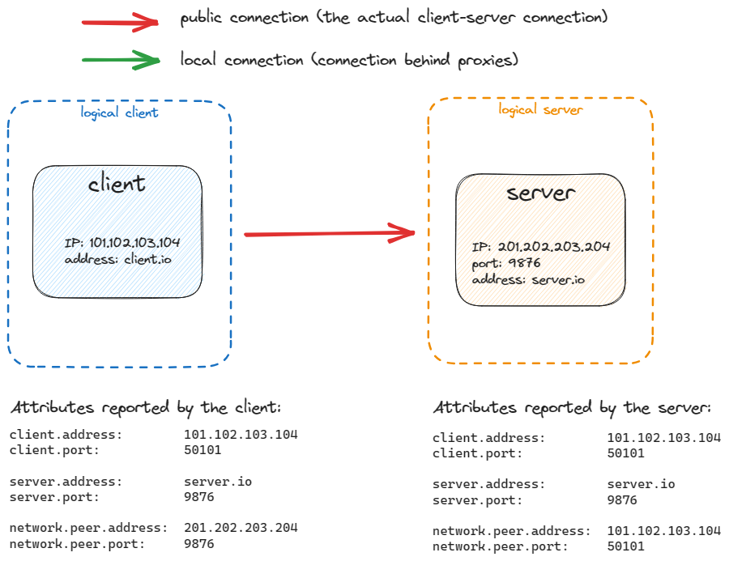
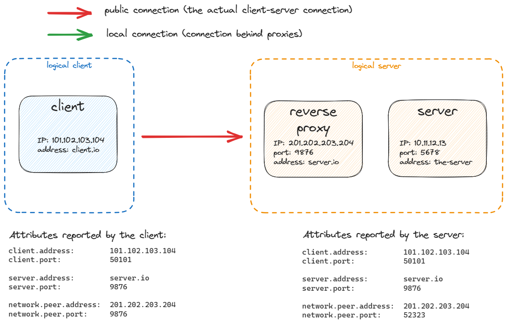
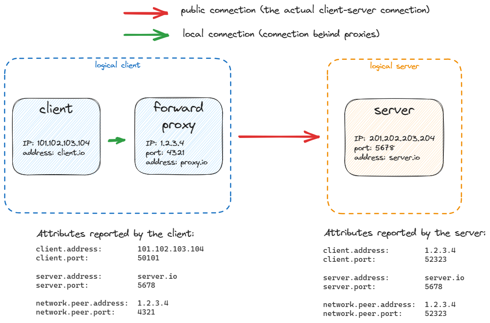

<!--- Hugo front matter used to generate the website version of this page:
linkTitle: Choosing network address and port attributes
--->

# Choosing network address and port attributes

**Status**: [Development][DocumentStatus]

Attributing an address to a communication is harder than it first appears, because the same
exchange looks different depending on where it is observed:

- At a communicating **endpoint**, a process sees its own socket and the socket of whatever it is
  directly connected to - which may be the other party, or an intermediary.
- At an **intermediary** such as a proxy, load balancer, or NAT gateway, addresses are frequently
  rewritten, so the addresses on the inbound side differ from those on the outbound side.
- At a **pass-through observer** such as a switch or router interface, a network tap, or a flow
  exporter, there may be no socket at all - only the addresses carried in the packets crossing
  that point.

Because of this, no single address/port pair can answer every question. The address of the
_logical_ service a client intended to reach, the address _actually observed on the wire_ at a
given point, and the address of the _directly connected_ node can all differ - especially when
intermediaries are involved. OpenTelemetry therefore defines several address/port pairs, each
answering a distinct question, and more than one pair MAY apply to the same telemetry. The sections
below explain how to pick the right one(s); the [Attribute reference](#attribute-reference) lists
the attributes in each family.

<!-- START doctoc -->

- [Address and port attributes](#address-and-port-attributes)
- [Why these pairs are not interchangeable](#why-these-pairs-are-not-interchangeable)
- [How they coexist](#how-they-coexist)
  - [Client/server examples using `network.peer.*`](#clientserver-examples-using-networkpeer)
    - [Simple client/server example](#simple-clientserver-example)
    - [Client/server example with reverse proxy](#clientserver-example-with-reverse-proxy)
    - [Client/server example with forward proxy](#clientserver-example-with-forward-proxy)
- [Decision guide](#decision-guide)
- [Flow and packet telemetry](#flow-and-packet-telemetry)
- [Attribute reference](#attribute-reference)
  - [Server](#server)
  - [Client](#client)
  - [Source](#source)
  - [Destination](#destination)
  - [Network peer](#network-peer)
  - [Network local](#network-local)

<!-- END doctoc -->

## Address and port attributes

OpenTelemetry defines three pairs of address/port attributes for the two sides of a network
interaction. They answer different questions and are not synonyms; more than one pair MAY apply
to the same telemetry.

| Attribute pair | Question answered | Layer | Address form | Typical source |
| --- | --- | --- | --- | --- |
| [`client.*`](/docs/registry/attributes/client.md) / [`server.*`](/docs/registry/attributes/server.md) | Who initiated vs. accepted the connection? (protocol roles) | Application (L7) | Logical / de-proxied when available (e.g. `X-Forwarded-For`, `Forwarded`, PROXY protocol) | Protocol or instrumentation library |
| [`source.*`](/docs/registry/attributes/source.md) / [`destination.*`](/docs/registry/attributes/destination.md) | Who sent vs. received this exchange? (direction) | Flow / packet (L4), or any exchange with no clear client/server role | As observed at the point of instrumentation | The 5-tuple seen on the wire or socket at the meter |
| [`network.local.*`](/docs/registry/attributes/network.md) / [`network.peer.*`](/docs/registry/attributes/network.md) | Which end is mine vs. the directly connected peer? (vantage) | Direct connection / socket | Physical socket endpoints | `getsockname` / `getpeername` |

The pairs map roughly onto observation layers:

```text
   L7  Application / protocol roles                client / server
       (HTTP, gRPC, DB wire protocols, …)          (+ network.local/peer = concrete socket node)
       symmetric peers, no clear roles             source / destination
       (gossip, BitTorrent, blockchain, WebRTC)
   ─────────────────────────────────────────────────────────────────────────────────────────────────
   L4  Transport flow / packet direction           source / destination
       (NetFlow, IPFIX, eBPF flows, pcap)          (same family at endpoint or mid-path)
   ─────────────────────────────────────────────────────────────────────────────────────────────────
   L3  Network routing / forwarding                (not covered by these pairs today)
   L2  Link / neighbor discovery                   (not covered by these pairs today)
```

## Why these pairs are not interchangeable

Each pair answers a different question, and only some pin down _which_ address to record:

```text
   ROLE (who initiated?)                              [client / server]
     client ●───────────────────────────────────────────● server

   DIRECTION (who sent THIS exchange?)                [source / destination]
     source ●───────────────────────────────────────────● destination

   VANTAGE (my end vs directly wired other)           [network.local / network.peer]
     local  ●───────────────────────────────────────────● peer
```

| Pair | What the label means | Which address is recorded |
| --- | --- | --- |
| `client` / `server` | who initiated vs. accepted | Logical / de-proxied |
| `source` / `destination` | who sent vs. received this exchange | As observed at the observation point |
| `network.local` / `network.peer` | this end vs. the directly connected other | Physical (`getsockname` / `getpeername`) |

`network.peer` is not simply `source` or `destination`: on an endpoint the vantage is fixed while
the direction flips per exchange:

```text
   transmit :  local → source        peer  → destination
   receive  :  peer  → source        local → destination
```

Mid-path observers (routers, taps) often have no local socket at all, so `network.local` /
`network.peer` do not apply, while `source` / `destination` remain well-defined from packet headers.

## How they coexist

At L7, logical role and concrete adjacency are independent dimensions. Emitting both is correct,
not redundant: emit `server.address` (logical) and `network.peer.address` (concrete node) when they
differ.

```text
   External client → reverse proxy / LB → app → DB cluster (this query → node B)

   ┌──────────┐      ┌────────────┐      ┌──────────┐      ┌─────────────────────┐
   │  CLIENT  │─────>│ PROXY / LB │─────>│   APP    │─────>│  db.example.com     │
   │203.0.113 │      │  10.0.0.9  │      │10.0.0.20 │      │  ┌ A ┐ ┌ B ┐ ┌ C ┐  │
   └──────────┘      └────────────┘      └──────────┘      │  │.7 │ │.8 │ │.9 │  │
                                                           └─────────────────────┘

   On the APP's outbound DB client span:
     server.address        = db.example.com   ← logical destination
     network.peer.address  = 10.0.0.8         ← concrete node B
     network.local.address = 10.0.0.20        ← app's socket

   On the APP's inbound HTTP server span:
     client.address        = 203.0.113.x      ← logical client
     server.address        = api.example.com
     network.peer.address  = 10.0.0.9         ← concrete: the proxy's IP
     network.local.address = 10.0.0.20        ← app's accepting socket

   If the same path is also observed as L4 flows (eBPF / NetFlow):
     source / destination  = as-observed 5-tuple at that metering point
     (may be proxy, node, or post-NAT addresses — not the same as L7 client/server)
```

Which logical role maps to the concrete socket depends on the span's perspective: logical
identity and physical adjacency are recorded from whichever side emits the telemetry.

| Span perspective | Remote endpoint (logical vs. concrete) | Local endpoint (logical vs. concrete) |
| --- | --- | --- |
| Client span | `server.*` vs. `network.peer.*` | `client.*` vs. `network.local.*` |
| Server span | `client.*` vs. `network.peer.*` | `server.*` vs. `network.local.*` |

On a client span, `server.address` answers "who did I intend to talk to?" while
`network.peer.address` answers "which specific box did this connection land on?". On a server span
the roles invert: `network.peer.address` is the directly connected client or proxy, while
`client.address` is the logical (de-proxied) client. Folding the concrete peer into the logical
role, in either direction, would lose node-level diagnosis under load balancers, connection
pools, and replicas. See the [`network.*` registry](/docs/registry/attributes/network.md) for
socket-level details.

### Client/server examples using `network.peer.*`

The following examples show how the logical role (`server.*` / `client.*`) and the concrete socket
(`network.peer.*`) differ across proxy topologies. `network.local.*` attributes are not shown since
they are typically Opt-In.

#### Simple client/server example



#### Client/server example with reverse proxy



#### Client/server example with forward proxy



## Decision guide

```text
   What are you instrumenting?
   │
   ├─ L7 protocol / application API
   │   ├─ clear initiator and acceptor
   │   │     → client / server  (roles; logical / de-proxied)
   │   │     → also network.local / network.peer for the concrete socket
   │   └─ symmetric peers, no clear client/server role
   │         (gossip, BitTorrent, blockchain, WebRTC)
   │         → source / destination
   │
   ├─ L4 flow, packet, or mid-path metering (no / unknown app roles)
   │     → source / destination  (direction of this exchange, as observed)
   │       used consistently whether observed at an endpoint or mid-path
   │       (network.local / network.peer are for connection/socket-level telemetry,
   │        not a substitute encoding for a flow record's endpoints)
   │
   └─ L2 / L3 adjacency, routing, or neighbor discovery
         → not covered by these pairs today
```

| If you know… | Prefer |
| --- | --- |
| Protocol initiator / acceptor (L7) | `client` / `server` |
| Packet or flow direction (L4) | `source` / `destination` |
| Symmetric peers with no clear client/server role | `source` / `destination` |
| Concrete socket endpoint (L4/L7; also BGP TCP) | `network.local` / `network.peer` |
| Logical service name _and_ concrete node | `server.*` **and** `network.peer.*` together |

The `client` / `server` roles come from protocol or connection semantics - who initiated the
connection and who accepted it - which at L7 is almost always known. In the rare case where the
initiator cannot be determined, a best-effort heuristic MAY be used as a last resort, for example
treating the well-known / lower port as the server and the ephemeral / higher port as the client.
Such a heuristic is best-effort only and can be wrong (ephemeral port ranges vary by platform, both
ends may use registered ports, and peer-to-peer protocols have no roles), so fall back to
`source` / `destination` when it would not be reliable.

## Flow and packet telemetry

Flow and packet telemetry uses `source` / `destination` for the direction of each exchange, recorded
as observed at the metering point, so the same flow is represented the same way regardless of vantage
(endpoint host IPFIX/eBPF, or mid-path router/switch NetFlow/IPFIX). `network.local` / `network.peer`
are not an alternative encoding for a flow's endpoints; they describe the concrete socket of a
connection-oriented interaction (for example a `client` / `server` span or a BGP TCP session).

Because they are recorded as observed, `source` / `destination` hold whatever address and port are
present where the flow is metered; they are never resolved to a logical identity behind an
intermediary. The same flow can therefore carry different values at different observation points -
for example a mid-path router or switch sees the addresses on the wire at that hop (before or after
translation, depending on where it sits relative to a NAT or load balancer), while a host may see
its own address or a peer's. Use `client.*` / `server.*` when you need the logical, de-proxied
identity instead.

> [!NOTE]
> `source` / `destination` require more than the absence of a client/server role: each record must
> have a well-defined direction, identifying who sent and who received _that_ exchange. This holds for
> a single packet, a unidirectional flow, or one peer-to-peer message, but not for a bidirectional
> aggregate (for example a flow record summing both directions), which has no single sender. Split such
> telemetry into per-direction records, or adopt a stable orientation (for example keying `source` to
> the initiator); a standard orientation convention is out of scope here and a work in progress (see
> [opentelemetry-ebpf-instrumentation#1659](https://github.com/open-telemetry/opentelemetry-ebpf-instrumentation/issues/1659)
> and [#3828](https://github.com/open-telemetry/semantic-conventions/pull/3828)). Likewise,
> identifying _which_ observation point a record came from is out of scope for this guide and will be
> addressed by the flow semantic conventions. For broadcast and multicast, `destination.*` is the
> group or broadcast address on the packet, not each host that received a copy; for anycast it is the
> VIP, not the replica's unique address. Naming those receivers is out of scope here (see
> [#4121](https://github.com/open-telemetry/semantic-conventions/issues/4121)).

## Attribute reference

The address and port attribute families are summarized below. Full definitions live in the registry:
[`client`](/docs/registry/attributes/client.md), [`server`](/docs/registry/attributes/server.md),
[`source`](/docs/registry/attributes/source.md),
[`destination`](/docs/registry/attributes/destination.md), and
[`network`](/docs/registry/attributes/network.md).

### Server

<!-- semconv server -->
<!-- NOTE: THIS TEXT IS AUTOGENERATED. DO NOT EDIT BY HAND. -->
<!-- see templates/registry/markdown/snippet.md.j2 -->
<!-- prettier-ignore-start -->

**Status:** 

`server.*` attributes describe the server in a connection-based network interaction: the side that accepts the connection (the client is the side that initiates it). They identify the logical server the client intended to reach, which - behind proxies or load balancers - can differ from the concrete socket endpoint.

Use them for interactions with a clear initiator and acceptor. This covers common TCP interactions, connection-oriented UDP such as QUIC (HTTP/3), and request/response protocols such as DNS and SNMP polling. It does not cover peer-to-peer communication where the protocol or API exposes no clear notion of client and server (even over TCP).

**Attributes:**

| Key | Stability | [Requirement Level](https://opentelemetry.io/docs/specs/semconv/general/attribute-requirement-level/) | Value Type | Description | Example Values |
| --- | --- | --- | --- | --- | --- |
| [`server.address`](/docs/registry/attributes/server.md) |  | `Recommended` | string | Server domain name if available without reverse DNS lookup; otherwise, IP address or UNIX domain socket name. [1] | `example.com`; `10.1.2.80`; `/tmp/my.sock` |
| [`server.port`](/docs/registry/attributes/server.md) |  | `Recommended` | int | Server port number. [2] | `80`; `8080`; `443` |

**[1] `server.address`:** On the client side, `server.address` is the remote service name; on the server side, it is the local service name as seen externally by clients. These normally match - for example, for the URL `https://example.com/foo` it is `"example.com"` on both sides. When a client reaches the server through an intermediary such as a proxy, `server.address` SHOULD represent the server behind the intermediary, if available.

For IP-based communication, prefer a DNS hostname of the service. Instrumentation is often given the address as a URL, connection string, or hostname, so `server.address` SHOULD be set to the known hostname available to it, which may be a DNS name or an IP address (for example `"127.0.0.1"` for `https://127.0.0.1/foo`). If only an IP address is available, populate `server.address` with it; a reverse DNS lookup SHOULD NOT be used to obtain a name.

If `network.transport` is `"pipe"`, use the absolute path to the file representing it; for an anonymous pipe with no such file, set `server.address` to an empty string to distinguish it from an unknown or uninstrumented value.

For a UNIX domain socket, `server.address` is the remote endpoint address on the client side and the local endpoint address on the server side.

**[2] `server.port`:** When observed from the client side, and when communicating through an intermediary, `server.port` SHOULD represent the server port behind any intermediaries, for example proxies, if it's available.

<!-- prettier-ignore-end -->
<!-- END AUTOGENERATED TEXT -->
<!-- endsemconv -->

### Client

<!-- semconv client -->
<!-- NOTE: THIS TEXT IS AUTOGENERATED. DO NOT EDIT BY HAND. -->
<!-- see templates/registry/markdown/snippet.md.j2 -->
<!-- prettier-ignore-start -->

**Status:** 

`client.*` attributes describe the client in a connection-based network interaction: the side that initiates the connection (the server is the side that accepts it). They identify the logical client, which - behind proxies or load balancers - can differ from the concrete socket endpoint and is typically recovered from headers such as `X-Forwarded-For`.

Use them for interactions with a clear initiator and acceptor. This covers common TCP interactions, connection-oriented UDP such as QUIC (HTTP/3), and request/response protocols such as DNS and SNMP polling. It does not cover peer-to-peer communication where the protocol or API exposes no clear notion of client and server (even over TCP).

**Attributes:**

| Key | Stability | [Requirement Level](https://opentelemetry.io/docs/specs/semconv/general/attribute-requirement-level/) | Value Type | Description | Example Values |
| --- | --- | --- | --- | --- | --- |
| [`client.address`](/docs/registry/attributes/client.md) |  | `Recommended` | string | Client address - domain name if available without reverse DNS lookup; otherwise, IP address or UNIX domain socket name. [1] | `client.example.com`; `10.1.2.80`; `/tmp/my.sock` |
| [`client.port`](/docs/registry/attributes/client.md) |  | `Recommended` | int | Client port number. [2] | `65123` |

**[1] `client.address`:** When observed from the server side, and when communicating through an intermediary, `client.address` SHOULD represent the client address behind any intermediaries, for example proxies, if it's available.

**[2] `client.port`:** When observed from the server side, and when communicating through an intermediary, `client.port` SHOULD represent the client port behind any intermediaries, for example proxies, if it's available.

<!-- prettier-ignore-end -->
<!-- END AUTOGENERATED TEXT -->
<!-- endsemconv -->

### Source

<!-- semconv source -->
<!-- NOTE: THIS TEXT IS AUTOGENERATED. DO NOT EDIT BY HAND. -->
<!-- see templates/registry/markdown/snippet.md.j2 -->
<!-- prettier-ignore-start -->

**Status:** 

`source.*` attributes describe the sender of a network exchange or packet, recorded as observed at the point of instrumentation rather than resolved to an identity behind intermediaries such as proxies.

Use them when there is no client/server relationship between the two sides, or when that relationship is unknown - for example, packet-level telemetry and peer-to-peer protocols.

**Attributes:**

| Key | Stability | [Requirement Level](https://opentelemetry.io/docs/specs/semconv/general/attribute-requirement-level/) | Value Type | Description | Example Values |
| --- | --- | --- | --- | --- | --- |
| [`source.address`](/docs/registry/attributes/source.md) |  | `Recommended` | string | Source address as observed at the point of instrumentation - typically an IP address, or a UNIX domain socket name; a domain name only when the sender was addressed by name (for example a peer-to-peer node dialed by hostname), never obtained via reverse DNS lookup. [1] | `10.1.2.80`; `source.example.com`; `/tmp/my.sock` |
| [`source.port`](/docs/registry/attributes/source.md) |  | `Recommended` | int | Source port number | `3389`; `2888` |

**[1] `source.address`:** `source.address` SHOULD be the sender address as observed at the point of instrumentation, for example the source of the packet, flow, or exchange seen on the wire or socket. It SHOULD NOT be resolved to an address behind intermediaries such as proxies or load balancers, and reverse DNS lookup SHOULD NOT be used to obtain a domain name.

<!-- prettier-ignore-end -->
<!-- END AUTOGENERATED TEXT -->
<!-- endsemconv -->

### Destination

<!-- semconv destination -->
<!-- NOTE: THIS TEXT IS AUTOGENERATED. DO NOT EDIT BY HAND. -->
<!-- see templates/registry/markdown/snippet.md.j2 -->
<!-- prettier-ignore-start -->

**Status:** 

`destination.*` attributes describe the receiver of a network exchange or packet, recorded as observed at the point of instrumentation rather than resolved to an identity behind intermediaries such as proxies.

Use them when there is no client/server relationship between the two sides, or when that relationship is unknown - for example, packet-level telemetry and peer-to-peer protocols.

**Attributes:**

| Key | Stability | [Requirement Level](https://opentelemetry.io/docs/specs/semconv/general/attribute-requirement-level/) | Value Type | Description | Example Values |
| --- | --- | --- | --- | --- | --- |
| [`destination.address`](/docs/registry/attributes/destination.md) |  | `Recommended` | string | Destination address as observed at the point of instrumentation - typically an IP address, or a UNIX domain socket name; a domain name only when the receiver was addressed by name (for example a peer-to-peer node dialed by hostname), never obtained via reverse DNS lookup. [1] | `10.1.2.80`; `destination.example.com`; `/tmp/my.sock` |
| [`destination.port`](/docs/registry/attributes/destination.md) |  | `Recommended` | int | Destination port number | `3389`; `2888` |

**[1] `destination.address`:** `destination.address` SHOULD be the receiver address as observed at the point of instrumentation, for example the destination of the packet, flow, or exchange seen on the wire or socket. It SHOULD NOT be resolved to an address behind intermediaries such as proxies or load balancers, and reverse DNS lookup SHOULD NOT be used to obtain a domain name.

<!-- prettier-ignore-end -->
<!-- END AUTOGENERATED TEXT -->
<!-- endsemconv -->

### Network peer

<!-- semconv network.peer -->
<!-- NOTE: THIS TEXT IS AUTOGENERATED. DO NOT EDIT BY HAND. -->
<!-- see templates/registry/markdown/snippet.md.j2 -->
<!-- prettier-ignore-start -->

**Status:** 

These attributes identify the network peer that is directly connected to the local endpoint.

> [!NOTE]
> Specific structures and methods to obtain socket-level attributes are mentioned here only as examples.
> Instrumentations would usually use the socket API provided by their environment or socket implementations.

When connecting using `connect(2)` ([Linux or other POSIX systems](https://man7.org/linux/man-pages/man2/connect.2.html) /
[Windows](https://docs.microsoft.com/windows/win32/api/winsock2/nf-winsock2-connect)) with the `AF_INET` address family,
`network.peer.address` and `network.peer.port` represent the `sin_addr` and `sin_port` fields of the `sockaddr_in` structure.

`network.peer.address` and `network.peer.port` can be obtained by calling `getpeername` ([Linux or other POSIX systems](https://man7.org/linux/man-pages/man2/getpeername.2.html) /
[Windows](https://docs.microsoft.com/windows/win32/api/winsock2/nf-winsock2-getpeername)).

**Attributes:**

| Key | Stability | [Requirement Level](https://opentelemetry.io/docs/specs/semconv/general/attribute-requirement-level/) | Value Type | Description | Example Values |
| --- | --- | --- | --- | --- | --- |
| [`network.peer.address`](/docs/registry/attributes/network.md) |  | `Recommended` | string | Peer address of the network connection - IP address or UNIX domain socket name. [1] | `10.1.2.80`; `/tmp/my.sock` |
| [`network.peer.port`](/docs/registry/attributes/network.md) |  | `Recommended` | int | Peer port number of the network connection. | `65123` |

**[1] `network.peer.address`:** This SHOULD be an IP address, UNIX domain socket name, or other address specific to the network type.

<!-- prettier-ignore-end -->
<!-- END AUTOGENERATED TEXT -->
<!-- endsemconv -->

### Network local

<!-- semconv network.local -->
<!-- NOTE: THIS TEXT IS AUTOGENERATED. DO NOT EDIT BY HAND. -->
<!-- see templates/registry/markdown/snippet.md.j2 -->
<!-- prettier-ignore-start -->

**Status:** 

These attributes identify the local endpoint of a network connection.

> [!NOTE]
> Specific structures and methods to obtain socket-level attributes are mentioned here only as examples.
> Instrumentations would usually use the socket API provided by their environment or socket implementations.

When binding using `bind(2)` ([Linux or other POSIX systems](https://man7.org/linux/man-pages/man2/bind.2.html) /
[Windows](https://docs.microsoft.com/windows/win32/api/winsock2/nf-winsock2-bind)) with the `AF_INET` address family,
`network.local.address` and `network.local.port` represent the `sin_addr` and `sin_port` fields of the `sockaddr_in` structure.

`network.local.address` and `network.local.port` can be obtained by calling `getsockname` ([Linux or other POSIX systems](https://man7.org/linux/man-pages/man2/getsockname.2.html) /
[Windows](https://docs.microsoft.com/windows/win32/api/winsock2/nf-winsock2-getsockname)).

**Attributes:**

| Key | Stability | [Requirement Level](https://opentelemetry.io/docs/specs/semconv/general/attribute-requirement-level/) | Value Type | Description | Example Values |
| --- | --- | --- | --- | --- | --- |
| [`network.local.address`](/docs/registry/attributes/network.md) |  | `Recommended` | string | Local address of the network connection - IP address or UNIX domain socket name. [1] | `10.1.2.80`; `/tmp/my.sock` |
| [`network.local.port`](/docs/registry/attributes/network.md) |  | `Recommended` | int | Local port number of the network connection. | `65123` |

**[1] `network.local.address`:** This SHOULD be an IP address, UNIX domain socket name, or other address specific to the network type.

<!-- prettier-ignore-end -->
<!-- END AUTOGENERATED TEXT -->
<!-- endsemconv -->

[DocumentStatus]: https://opentelemetry.io/docs/specs/otel/document-status/
