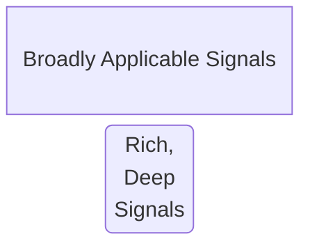

# T-shaped Signals

Semantic Conventions approaches observability with a T-Shaped mindset. This
splits signals into two types of a "T" shape:

This matches an 80-20 rule, where 80% of users (or use-cases) can leverage the
boardly applicable signals and 20% of users (or use-cases) will dive deep into
a problem with deep signals.

## Broadly Applicable Signals

These are conventions meant to provide a baseline observability experience
across a domain. An example includes HTTP semantic conventions that allow
general purpose dashboarding, alerting and diagnostics for HTTP
(micro-)services. These signals should provide "horizontal" coverage for
observability.

Examples include:

- Golden Signals / RED metrics (Saturation, Rate, Error, Duration)
- High Level Spans
- Error logs, Crash reports
- Request/Response logs

## Rich, Deep Signals

These are conventions meant to provide deep understanding of a specific
system, library, module, application or service. These are used to diagnose
issues specific to that system.

Examples include:

- Linux slab memory usage
- Specific database signals, e.g MySQL index usage
- Language-specific Garbage Collection metrics (JVM, Go, .NET, etc.)

## Recommendations

While defining semantic conventions can be a balance between geneating
broadly applicable signals and defining deep at the same time, it is recommended
to start with the *broad* use cases and signals for a particular domain, and
strive to provide the right level of abstraction first, before going deep.
