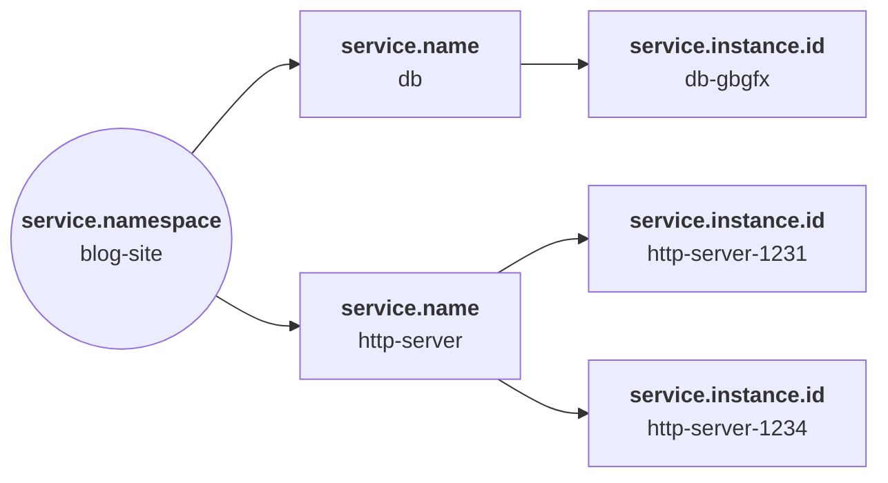

<!--- Hugo front matter used to generate the website version of this page:
linkTitle: Service
--->

# Service semantic conventions

Service is a logical component of an application that produces telemetry
data (events, metrics, spans, etc.).

In modern, distributed, application architectures:

- A `service.namespace` is an entire system of components designed for
  end-users or other applications to leverage.
- A `service` is one of the logical, distinct components that make up the
  application, e.g. running as a bundle of the instances that run the same
  container image for load balancing.
- A `service.instance` is a distinct instance of a service component, e.g. a
  specific kubernetes container that is part of a kubernetes deployment which
  offers a service.

For example, suppose we have a Blog site that consists of a database
and an HTTP server which uses the database:

Here, we can see the HTTP server has two instances that may use a load-balancer
between them. Additionally, there's a single database instance.

## Service

<!-- semconv entity.service -->
<!-- NOTE: THIS TEXT IS AUTOGENERATED. DO NOT EDIT BY HAND. -->
<!-- see templates/registry/markdown/snippet.md.j2 -->
<!-- prettier-ignore-start -->

**Status:** 

**type:** `service`

**Description:** A logical unit of an application or system that performs a specific function.

**Attributes:**

| Role | Key | Stability | [Requirement Level](https://opentelemetry.io/docs/specs/semconv/general/attribute-requirement-level/) | Value Type | Description | Example Values |
| --- | --- | --- | --- | --- | --- | --- |
| Identity | [`service.name`](/docs/registry/attributes/service.md) |  | `Required` | string | Logical name of the service. [1] | `shoppingcart` |
| Description | [`service.version`](/docs/registry/attributes/service.md) |  | `Recommended` | string | The version string of the service component. The format is not defined by these conventions. | `2.0.0`; `a01dbef8a` |

**[1] `service.name`:** MUST be the same for all instances of horizontally scaled services. If the value was not specified, SDKs MUST fallback to `unknown_service:` concatenated with [`process.executable.name`](process.md), e.g. `unknown_service:bash`. If `process.executable.name` is not available, the value MUST be set to `unknown_service`.
<!-- prettier-ignore-end -->
<!-- END AUTOGENERATED TEXT -->
<!-- endsemconv -->

## Service Instance

<!-- semconv entity.service.instance -->
<!-- NOTE: THIS TEXT IS AUTOGENERATED. DO NOT EDIT BY HAND. -->
<!-- see templates/registry/markdown/snippet.md.j2 -->
<!-- prettier-ignore-start -->

**Status:** 

**type:** `service.instance`

**Description:** A unique instance of a logical service.

**Attributes:**

| Role | Key | Stability | [Requirement Level](https://opentelemetry.io/docs/specs/semconv/general/attribute-requirement-level/) | Value Type | Description | Example Values |
| --- | --- | --- | --- | --- | --- | --- |
| Identity | [`service.instance.id`](/docs/registry/attributes/service.md) |  | `Required` | string | The string ID of the service instance. [1] | `627cc493-f310-47de-96bd-71410b7dec09` |

**[1] `service.instance.id`:** MUST be unique for each instance of the same `service.namespace,service.name` pair (in other words
`service.namespace,service.name,service.instance.id` triplet MUST be globally unique). The ID helps to
distinguish instances of the same service that exist at the same time (e.g. instances of a horizontally scaled
service).

Implementations, such as SDKs, are recommended to generate a random Version 1 or Version 4 [RFC
4122](https://www.ietf.org/rfc/rfc4122.txt) UUID, but are free to use an inherent unique ID as the source of
this value if stability is desirable. In that case, the ID SHOULD be used as source of a UUID Version 5 and
SHOULD use the following UUID as the namespace: `4d63009a-8d0f-11ee-aad7-4c796ed8e320`.

UUIDs are typically recommended, as only an opaque value for the purposes of identifying a service instance is
needed. Similar to what can be seen in the man page for the
[`/etc/machine-id`](https://www.freedesktop.org/software/systemd/man/latest/machine-id.html) file, the underlying
data, such as pod name and namespace should be treated as confidential, being the user's choice to expose it
or not via another resource attribute.

For applications running behind an application server (like unicorn), we do not recommend using one identifier
for all processes participating in the application. Instead, it's recommended each division (e.g. a worker
thread in unicorn) to have its own instance.id.

It's not recommended for a Collector to set `service.instance.id` if it can't unambiguously determine the
service instance that is generating that telemetry. For instance, creating an UUID based on `pod.name` will
likely be wrong, as the Collector might not know from which container within that pod the telemetry originated.
However, Collectors can set the `service.instance.id` if they can unambiguously determine the service instance
for that telemetry. This is typically the case for scraping receivers, as they know the target address and
port.
<!-- prettier-ignore-end -->
<!-- END AUTOGENERATED TEXT -->
<!-- endsemconv -->

## Service Namespace

<!-- semconv entity.service.namespace -->
<!-- NOTE: THIS TEXT IS AUTOGENERATED. DO NOT EDIT BY HAND. -->
<!-- see templates/registry/markdown/snippet.md.j2 -->
<!-- prettier-ignore-start -->

**Status:** 

**type:** `service.namespace`

**Description:** Groups related services that compose a system or application under a common namespace.

**Attributes:**

| Role | Key | Stability | [Requirement Level](https://opentelemetry.io/docs/specs/semconv/general/attribute-requirement-level/) | Value Type | Description | Example Values |
| --- | --- | --- | --- | --- | --- | --- |
| Identity | [`service.namespace`](/docs/registry/attributes/service.md) |  | `Required` | string | A namespace for `service.name`. [1] | `Shop` |

**[1] `service.namespace`:** A string value having a meaning that helps to distinguish a group of services, for example the team name that owns a group of services. `service.name` is expected to be unique within the same namespace. If `service.namespace` is not specified in the Resource then `service.name` is expected to be unique for all services that have no explicit namespace defined (so the empty/unspecified namespace is simply one more valid namespace). Zero-length namespace string is assumed equal to unspecified namespace.
<!-- prettier-ignore-end -->
<!-- END AUTOGENERATED TEXT -->
<!-- endsemconv -->
