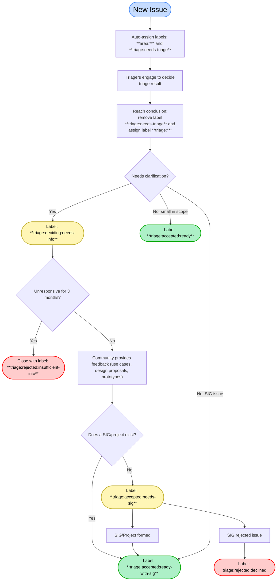
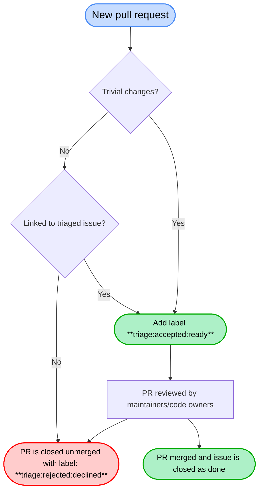

# Issue and PR Triage Management

This document outlines the triage process for the Semantic Conventions project,
including role definitions and the labels used throughout the workflow.

## Roles

- **Author**:
  The person who has opened the issue or pull request.

- **Collaborator**:
  The person or people responsible for performing the work related to the issue
  or pull request. They may or may not be the same as the Author. Collaborators
  interact with the Reviewer to receive feedback on the changes.

- **Reviewer**:
  The person whose approval is required to merge the pull request. Reviewers may
  include general Semantic Conventions approvers, maintainers, or code owners.

- **Triager**:
  The person responsible for applying the triage process and labels as outlined
  below. Triagers work closely with the Author to analyze the issue or pull
  request and provide relevant details, information, or guidance to aid in its
  resolution.

## Issue Triage

Triagers apply the workflow and labels defined below to indicate the current
stage of an issue in the triage process. Labels are grouped into three main
categories: `deciding`, `accepted`, and `rejected`. Each category contains
specific sub-labels that provide additional context

### Labels

#### `triage:deciding:*`

These labels are applied to issues when it is not yet clear if the project will
address them.

- `triage:deciding:needs-info`:  Indicates that the issue lacks sufficient
  information for the project to accept it. The issue remains open to allow the
  Author to add the requested details.

#### `triage:rejected:*`

Rejected issues describe problems that cannot or will not be addressed by the
project in their current form.

- `triage:rejected:declined`
- `triage:rejected:duplicate`
- `triage:rejected:insufficient-info`
- `triage:rejected:out-of-scope`

#### `triage:accepted:*`

These labels are applied to issues that describe a problem within the project's
scope. Acceptance of an issue does not guarantee that the suggested solution
will be implemented

- `triage:accepted:ready` - The issue is ready to be implemented. It is either
  small in scope or uncontroversial enough to proceed without requiring a SIG.

- `triage:accepted:ready-with-sig` - The issue is ready to be implemented
  and has an active SIG for the relevant area.

- `triage:accepted:needs-sig` - The issue is ready to be implemented, but a
  new SIG must first be formed.
  Pull requests for such issues will be automatically closed.

## Pull Request Triage

In general, pull requests should always be linked to an issue with the
`triage:accepted:ready*` label. This ensures that pull requests requiring review
have already been discussed and are known to reviewers or code owners.

Exceptions to this rule apply only to "trivial" pull requests, which include the
following:

- Pull requests originating from SIGs.
- Pull requests generated by automation (e.g., Renovate).
- Pull requests containing trivial changes (e.g., typos, styling-only updates,
  tooling improvements).

All pull requests that do not meet these requirements will be automatically
rejected with the label `triage:rejected:declined`.

