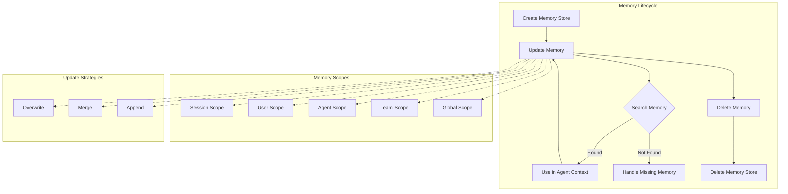
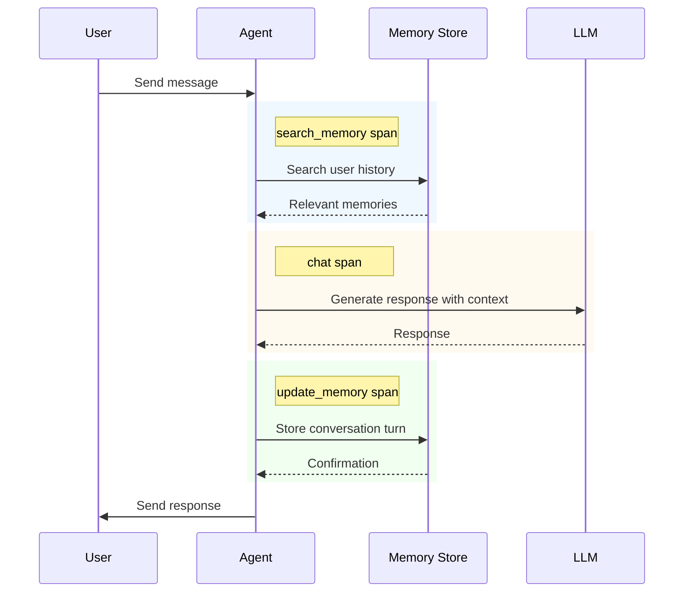
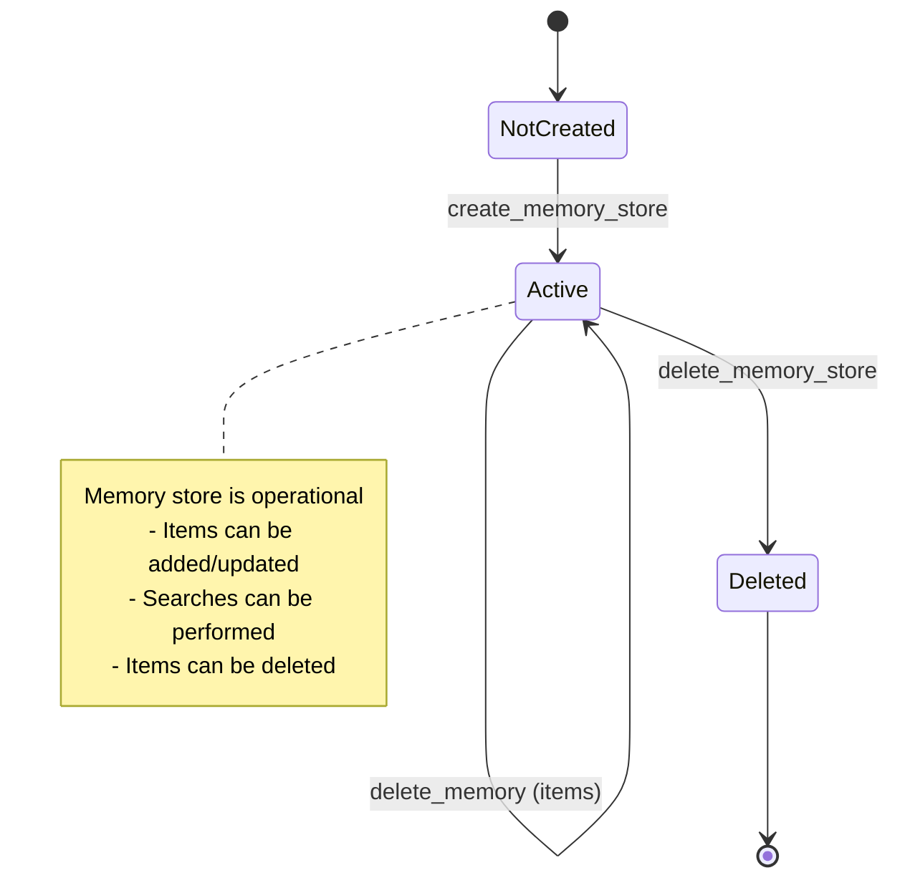
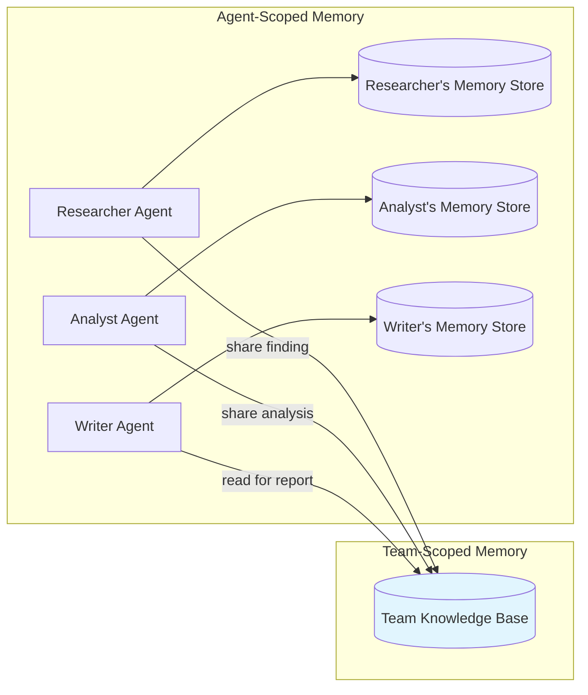
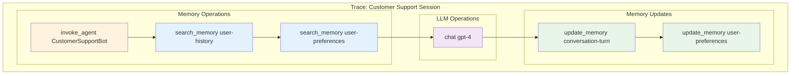
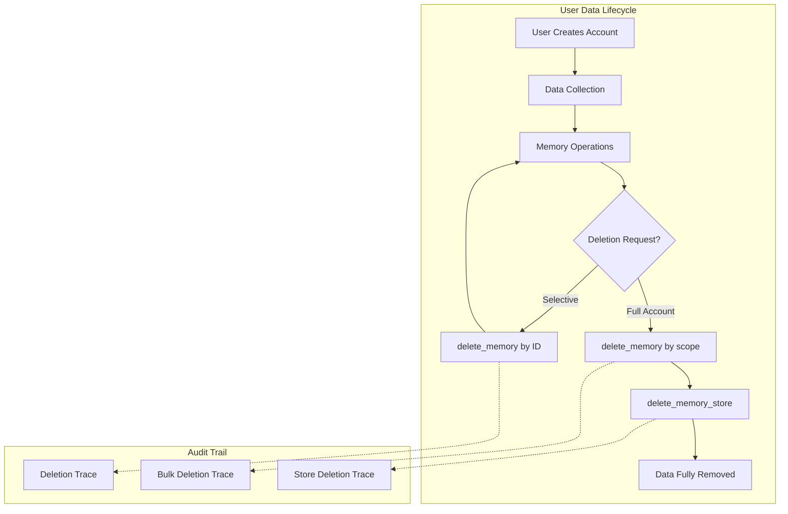
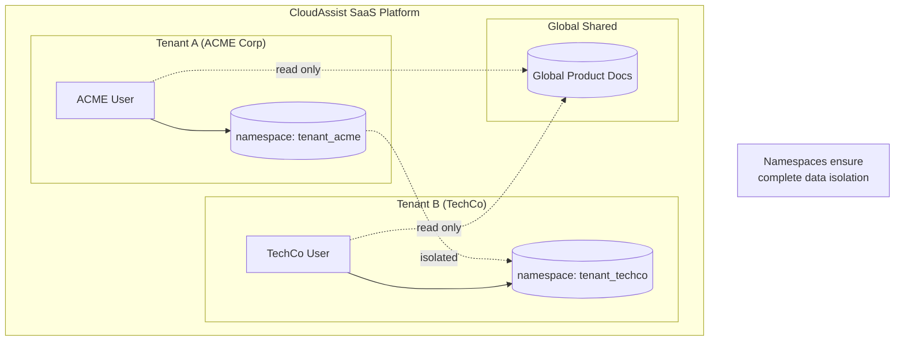

# GenAI Memory Semantic Conventions - Story Prototypes

This directory contains prototype implementations demonstrating the OpenTelemetry GenAI Memory semantic conventions through practical, real-world scenarios.

## Overview

Each story demonstrates specific memory operations and attributes, showcasing why memory observability matters for AI agents.

| Story | Domain | Primary Spans | Key Attributes |
|-------|--------|---------------|----------------|
| [Story 1: Customer Support Agent](./story1_customer_support/) | Customer Service | invoke_agent, chat, create_store, search, update, delete | session scope, expiration, conversation_id |
| [Story 2: Shopping Assistant](./story2_shopping_assistant/) | E-commerce | invoke_agent, chat, create_store, update, search, delete | user scope, importance, merge strategy |
| [Story 3: Multi-Agent Research](./story3_multi_agent_research/) | Research | create_agent, invoke_agent, execute_tool, chat, create_store, update, search | agent/team scope, append strategy |
| [Story 4: Multi-Tenant SaaS](./story4_multi_tenant_saas/) | Enterprise | invoke_agent, create_store, update, search, delete_store | namespace, global scope |
| [Story 5: Compliance Audit](./story5_compliance_audit/) | Observability | invoke_agent, chat, search, update, events | audit trail, debugging |
| [Story 6: GDPR Lifecycle](./story6_gdpr_lifecycle/) | Privacy | delete, delete_store | cascading deletes |

## LangChain Examples

Stories 1-3 include `langchain.py` files that show how LangChain memory classes map to our semantic conventions:

| Story | LangChain Class | Key Mapping |
|-------|-----------------|-------------|
| Story 1 | `ConversationBufferMemory` | scope: session, type: short_term |
| Story 1 | `VectorStoreRetrieverMemory` | scope: user, type: long_term, similarity_threshold |
| Story 2 | `EntityMemory` | scope: user, importance scoring |
| Story 2 | `ConversationSummaryMemory` | strategy: merge |
| Story 3 | Shared VectorStore | scope: team, agent attribution |

Run a LangChain example:
```bash
python scenarios/story1_customer_support/python/langchain.py
```

## Quick Start

```bash
cd prototype/memory
python3 -m venv .venv
source .venv/bin/activate
python3 -m pip install -r requirements-appinsights.txt

# Configure credentials (git-ignored)
cp scenarios/.env.sample scenarios/.env.local

# Run a specific story
python3 scenarios/story1_customer_support/python/main.py

# Run stories + export to App Insights + launch the viewer UI
python3 scenarios/run_and_view.py

# Opt-in (SENSITIVE): include input/output messages, queries, and memory content
python3 scenarios/run_and_view.py --capture-content
```

## Architecture Diagrams

### Memory Operations Flowchart



### Agent Memory Sequence Diagram



### Memory Store State Diagram



### Multi-Agent Memory Sharing



### Memory Observability Trace Hierarchy



### GDPR Data Lifecycle



### Multi-Tenant Namespace Isolation



## Memory Operations Coverage

### 5 Memory Spans

| Operation | Description | When to Use |
|-----------|-------------|-------------|
| `create_memory_store` | Initialize a memory store | Tenant onboarding, session start |
| `search_memory` | Query/retrieve memories | Context retrieval, preference lookup |
| `update_memory` | Create or update (upsert) | Store conversation, learn preferences |
| `delete_memory` | Delete items | GDPR deletion, session cleanup |
| `delete_memory_store` | Delete/deprovision store | Tenant offboarding, cleanup |

### Key Attributes

| Attribute | Type | Stories |
|-----------|------|---------|
| `gen_ai.memory.store.id` | string | All |
| `gen_ai.memory.store.name` | string | All |
| `gen_ai.memory.id` | string | 1, 2, 3, 5, 6 |
| `gen_ai.memory.type` | string | All |
| `gen_ai.memory.scope` | enum | 1, 2, 3, 4, 6 |
| `gen_ai.memory.namespace` | string | 3, 4 |
| `gen_ai.memory.query` | string | 1, 2, 3, 4, 5 (opt-in) |
| `gen_ai.memory.content` | any | 2 (opt-in) |
| `gen_ai.memory.importance` | double | 2 |
| `gen_ai.memory.expiration_date` | string | 1 |
| `gen_ai.memory.update.strategy` | enum | 2, 3 |
| `gen_ai.memory.search.result.count` | int | 1, 2, 3, 4, 5 |
| `gen_ai.memory.search.similarity.threshold` | double | 1, 2 |

### Context Attributes

| Attribute | Description | Stories |
|-----------|-------------|---------|
| `gen_ai.agent.id` | Agent performing operation | 3, 5 |
| `gen_ai.conversation.id` | Current conversation | 1, 5 |

## Environment Configuration

Copy the environment template and configure your credentials:

```bash
cp prototype/memory/scenarios/.env.sample prototype/memory/scenarios/.env.local
# Edit `.env.local` (never commit it)
```

## Run + View (Azure App Insights)

This repo includes a viewer for the memory stories backed by Azure Application Insights:

```bash
python3 prototype/memory/scenarios/run_and_view.py
```

Notes:
- `run_and_view.py` loads `prototype/memory/scenarios/.env.local` by default; override with `--env-file`.
- Content capture is opt-in; rerun with `--capture-content` to include `gen_ai.*messages`.

## Running with Trace Visualization

### OTLP Export (Optional)

```bash
# Export spans to an OTLP collector (configure your own collector endpoint)
export GENAI_MEMORY_EXPORTERS=otlp
export OTEL_EXPORTER_OTLP_ENDPOINT=http://localhost:4317
python3 prototype/memory/scenarios/story1_customer_support/python/main.py
```

### Expected Trace Output

Each story produces traces following this pattern:

```
invoke_agent "AgentName" (total duration)
├── gen_ai.operation.name: "invoke_agent"
├── gen_ai.agent.name: "AgentName"
│
├── create_memory_store "store-name" (latency)
│   ├── gen_ai.operation.name: "create_memory_store"
│   ├── gen_ai.memory.scope: "session"
│   └── gen_ai.memory.type: "short_term"
│
├── search_memory "store-name" (latency)
│   ├── gen_ai.operation.name: "search_memory"
│   ├── gen_ai.memory.store.name: "store-name"
│   ├── gen_ai.memory.type: "long_term"
│   └── gen_ai.memory.search.result.count: 3
│
├── chat "model-name" (latency)
│   ├── gen_ai.operation.name: "chat"
│   └── gen_ai.usage.input_tokens: 150
│
└── update_memory "store-name" (latency)
    ├── gen_ai.operation.name: "update_memory"
    ├── gen_ai.memory.type: "short_term"
    └── gen_ai.memory.id: "mem_xyz789"
```

## References

- [Prototype Story Plan](../../prototype_story.plan.md)
- [OpenTelemetry Semantic Conventions](https://opentelemetry.io/docs/specs/semconv/)
- [GenAI Semantic Conventions](https://opentelemetry.io/docs/specs/semconv/gen-ai/)
