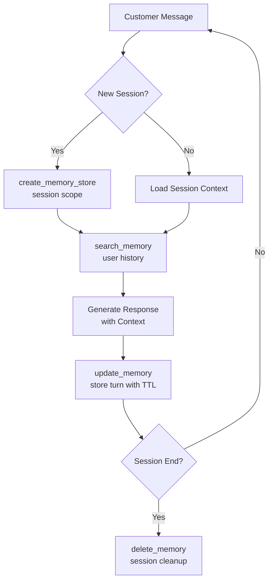
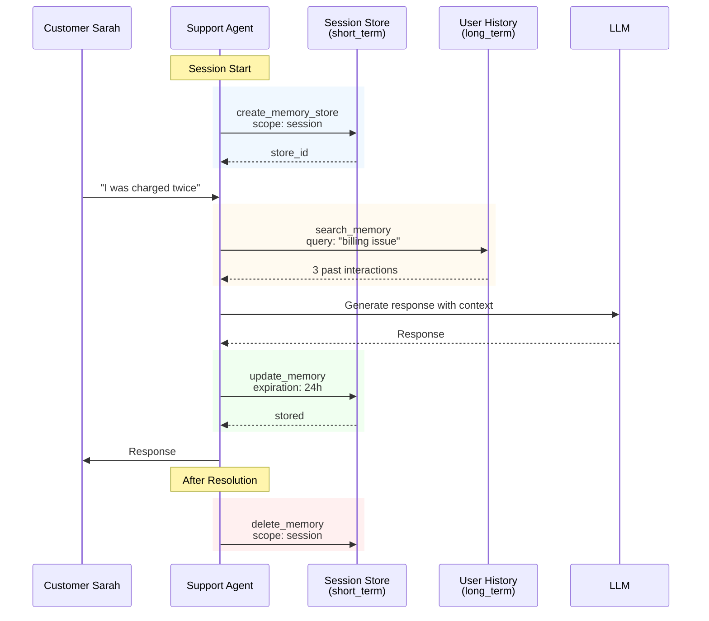
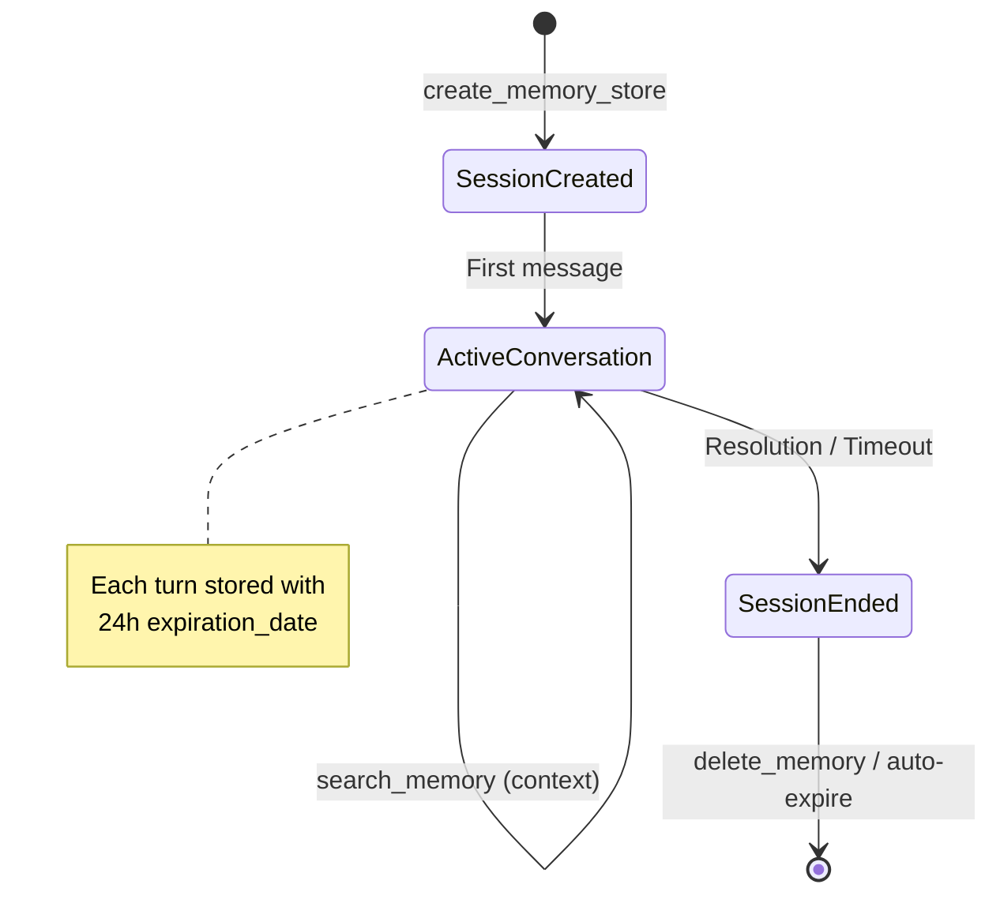

# Story 1: Customer Support Agent

A customer support agent that maintains conversation context within a session while retrieving relevant information from past interactions.

## Narrative

**Context**: TechCorp runs a 24/7 customer support service powered by AI agents. Each customer interaction starts a new support session that may span multiple messages over several hours.

**User Journey**: Sarah contacts TechCorp support about a billing issue. She explains that she was charged twice for her monthly subscription. The support agent:

1. Creates a session-scoped memory store for this conversation
2. Searches Sarah's past interactions and finds a similar billing issue from 3 months ago
3. Stores each conversation turn with a 24-hour expiration
4. Resolves the issue and cleans up session memory

## Why Memory Observability Matters

- **Debugging**: If the agent fails to recall earlier parts of the conversation, engineers can trace memory searches to identify retrieval failures
- **Performance**: Monitor search latency to ensure quick context retrieval
- **Compliance**: Audit trail of what customer data was accessed during the session

## Architecture

### Session Memory Flow



### Sequence Diagram



### Memory State Diagram



## Technical Breakdown

### Spans Generated

| Step | Operation | Key Attributes |
|------|-----------|----------------|
| 1 | `create_memory_store` | scope=session, type=short_term |
| 2 | `search_memory` | type=long_term, similarity_threshold=0.7, result_count=3 |
| 3 | `chat` | model=gpt-4 |
| 4 | `update_memory` | type=short_term, expiration_date |
| 5 | `search_memory` | type=short_term (session context) |
| 6 | `update_memory` | turn 2 |
| 7 | `delete_memory` | scope=session |

### Attribute Coverage

| Attribute | Value | Purpose |
|-----------|-------|---------|
| `gen_ai.memory.scope` | `session` | Isolate conversation context |
| `gen_ai.memory.type` | `short_term` | Session memory tier |
| `gen_ai.memory.type` | `long_term` | User history tier |
| `gen_ai.memory.expiration_date` | ISO 8601 (now + 24h) | Auto-cleanup |
| `gen_ai.memory.search.similarity.threshold` | `0.7` | Relevance filter |
| `gen_ai.conversation.id` | `conv_session_xxx` | Link all operations |

### Sample Trace Output (Query Capture Enabled)

Note: `gen_ai.memory.query` is opt-in due to potential sensitivity. It is only captured when `GENAI_MEMORY_CAPTURE_CONTENT=true`.

```json
{
  "name": "search_memory user-history",
  "kind": "SpanKind.CLIENT",
  "attributes": {
    "gen_ai.operation.name": "search_memory",
    "gen_ai.provider.name": "pinecone",
    "gen_ai.memory.store.id": "store_user_sarah_123_history",
    "gen_ai.memory.store.name": "user-history",
    "gen_ai.memory.query": "billing issue duplicate charge",
    "gen_ai.memory.type": "long_term",
    "gen_ai.memory.search.similarity.threshold": 0.7,
    "gen_ai.memory.search.result.count": 3,
    "gen_ai.conversation.id": "conv_session_abc123"
  }
}
```

## Running the Scenario

```bash
# Activate virtual environment
source ../../../.venv/bin/activate

# Run the scenario
python python/main.py

# With OTLP export
GENAI_MEMORY_USE_OTLP=true python python/main.py

# With query/content capture (debugging only)
GENAI_MEMORY_CAPTURE_CONTENT=true python python/main.py
```

## Expected Output

```
======================================================================
  Story 1: Customer Support Agent
======================================================================

Scenario: Sarah contacts TechCorp support about a billing issue...

Session Info:
  User ID: user_sarah_123
  Session ID: session_abc123
  Conversation ID: conv_session_abc123

======================================================================
  Step 1: Create Session Memory Store
======================================================================

  [create_memory_store]
    gen_ai.operation.name: create_memory_store
    gen_ai.memory.scope: session
    gen_ai.memory.type: short_term
    ...

======================================================================
  Step 2: Search User History
======================================================================

  [search_memory (user history)]
    gen_ai.memory.search.result.count: 3
    gen_ai.memory.search.similarity.threshold: 0.7
    ...
```

## Debugging Scenarios

### Why did the agent "forget" earlier context?

Check the trace for `search_memory` on session store:
1. Is `result_count` = 0? The similarity threshold may be too high
2. Is the `conversation_id` correct? Wrong ID means wrong session
3. Check expiration - did the memory auto-expire?

### Why are responses slow?

Check span durations:
1. `search_memory` on user history - may need index optimization
2. Multiple searches adding latency - consider caching

## Related Stories

- [Story 5: Compliance Audit](../story5_compliance_audit/) - How to audit memory access
- [Story 6: GDPR Lifecycle](../story6_gdpr_lifecycle/) - User data deletion
