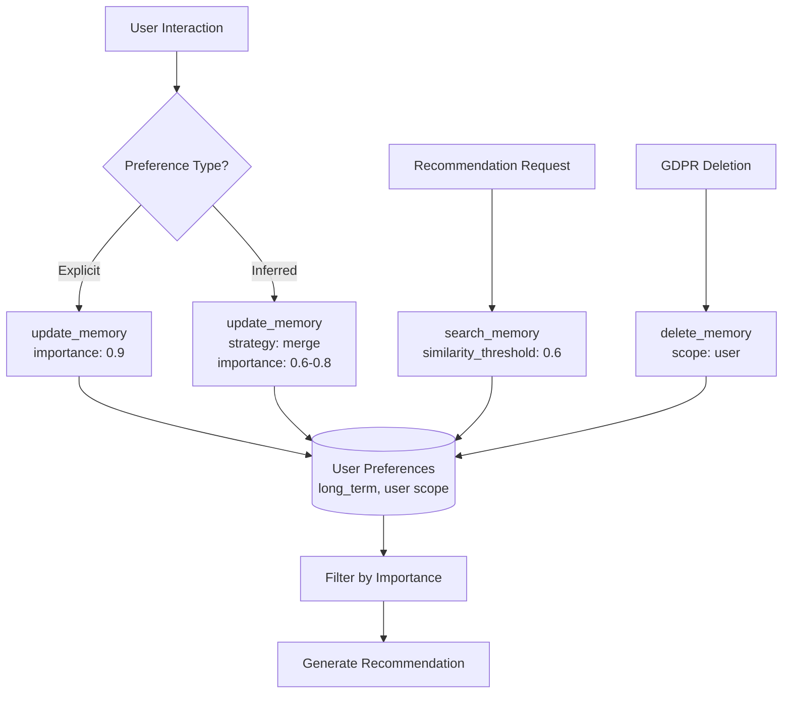
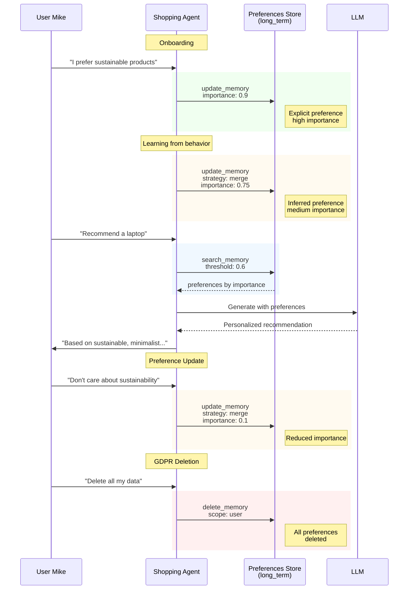

# Story 2: Personal Shopping Assistant

A shopping assistant that learns user preferences over time, ranks memories by importance, and handles GDPR data deletion.

## Narrative

**Context**: ShopSmart is an AI-powered shopping assistant that learns user preferences over time. Unlike session-based memory, these preferences persist across all interactions, building a rich profile that improves recommendations.

**User Journey**: Mike is a new ShopSmart user. Over several weeks:

1. **Onboarding**: Mike mentions he prefers sustainable products (explicit, importance: 0.9)
2. **Learning**: Browsing reveals he likes minimalist designs (inferred, importance: 0.75)
3. **Shopping**: When asking for laptop recommendations, the assistant uses his preferences
4. **Update**: Mike says "I no longer care about sustainability" - preference importance reduced
5. **GDPR**: Mike exercises his right to deletion - all preference data removed

## Why Memory Observability Matters

- **Personalization Quality**: Track which preferences influenced recommendations
- **Learning Verification**: Ensure preference updates are properly merged
- **Privacy Compliance**: Full audit trail for GDPR data access and deletion

## Architecture

### Preference Learning Flow



### Preference Lifecycle Sequence



### Importance Scoring State

```mermaid
stateDiagram-v2
    [*] --> NotLearned

    NotLearned --> HighImportance: Explicit preference<br/>(user stated)
    NotLearned --> MediumImportance: Inferred preference<br/>(from behavior)

    HighImportance --> MediumImportance: Reduced importance<br/>(user feedback)
    MediumImportance --> HighImportance: Confirmed preference<br/>(explicit)
    MediumImportance --> LowImportance: Negative feedback

    HighImportance --> Deleted: GDPR request
    MediumImportance --> Deleted: GDPR request
    LowImportance --> Deleted: GDPR request

    Deleted --> [*]

    note right of HighImportance: importance: 0.8-1.0
    note right of MediumImportance: importance: 0.5-0.8
    note right of LowImportance: importance: 0.0-0.5
```

## Technical Breakdown

### Spans Generated

| Step | Operation | Key Attributes |
|------|-----------|----------------|
| 1 | `create_memory_store` | scope=user, type=long_term |
| 2 | `update_memory` | importance=0.9, type=long_term |
| 3 | `update_memory` | strategy=merge, importance=0.75 |
| 4 | `search_memory` | similarity_threshold=0.6, result_count=5 |
| 5 | `chat` | model=gpt-4 |
| 6 | `update_memory` | strategy=merge, importance=0.1 |
| 7 | `delete_memory` | scope=user (GDPR) |

### Attribute Coverage

| Attribute | Value | Purpose |
|-----------|-------|---------|
| `gen_ai.memory.scope` | `user` | Store scope and bulk deletion |
| `gen_ai.memory.type` | `long_term` | Persistent preferences |
| `gen_ai.memory.importance` | `0.0-1.0` | Preference ranking |
| `gen_ai.memory.update.strategy` | `merge` | Combine with existing |
| `gen_ai.memory.content` | JSON (opt-in) | Preference details |
| `gen_ai.memory.search.similarity.threshold` | `0.6` | Relevance filter |

### Sample Trace Output (with content capture)

```json
{
  "name": "update_memory user-preferences",
  "kind": "SpanKind.CLIENT",
  "attributes": {
    "gen_ai.operation.name": "update_memory",
    "gen_ai.provider.name": "pinecone",
    "gen_ai.memory.store.id": "store_user_mike_456_prefs",
    "gen_ai.memory.store.name": "user-preferences",
    "gen_ai.memory.id": "pref_abc123def456",
    "gen_ai.memory.type": "long_term",
    "gen_ai.memory.update.strategy": "merge",
    "gen_ai.memory.importance": 0.75,
    "gen_ai.memory.content": "{\"preference\": \"minimalist_design\", \"source\": \"behavior\"}"
  }
}
```

## Running the Scenario

```bash
# Activate virtual environment
source ../../../.venv/bin/activate

# Run the scenario
python python/main.py

# With query/content capture (shows preference content in traces)
GENAI_MEMORY_CAPTURE_CONTENT=true python python/main.py

# With OTLP export
GENAI_MEMORY_USE_OTLP=true python python/main.py
```

## Expected Output

```
======================================================================
  Story 2: Personal Shopping Assistant
======================================================================

Scenario: Mike is a ShopSmart user...

======================================================================
  Step 1: Create Preferences Memory Store
======================================================================

  [create_memory_store (user preferences)]
    gen_ai.memory.scope: user
    gen_ai.memory.type: long_term
    ...

======================================================================
  Step 2: Store Initial Preference (Explicit)
======================================================================

  Mike: 'I prefer to buy sustainable products'

  [update_memory (explicit preference)]
    gen_ai.memory.importance: 0.9
    ...

======================================================================
  Step 3: Learn Preference from Behavior
======================================================================

  [Analyzing browsing behavior...]
  Inferred: Mike prefers minimalist designs

  [update_memory (merge inferred preference)]
    gen_ai.memory.update.strategy: merge
    gen_ai.memory.importance: 0.75
    ...
```

## Privacy Considerations

### Content Capture (Opt-In)

By default, `gen_ai.memory.content` is NOT captured:
- Protects user preference data from appearing in traces
- Enable only for debugging: `GENAI_MEMORY_CAPTURE_CONTENT=true`

### GDPR Compliance

The `delete_memory` operation with `scope=user`:
- Deletes ALL memories for the user
- Creates audit trace for compliance verification
- No memory IDs needed - scope-based bulk deletion

## Related Stories

- [Story 1: Customer Support](../story1_customer_support/) - Session-scoped memory
- [Story 6: GDPR Lifecycle](../story6_gdpr_lifecycle/) - Complete data deletion flow
