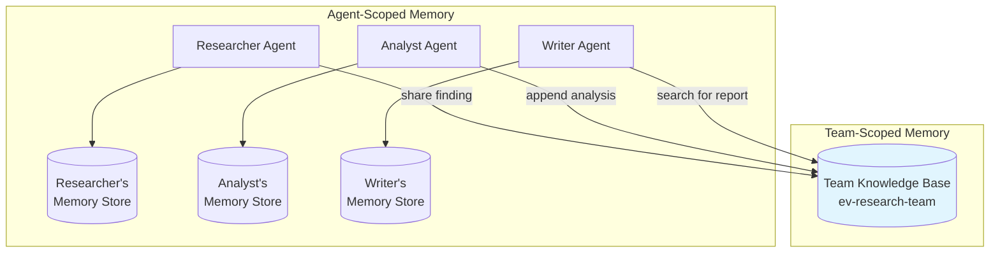
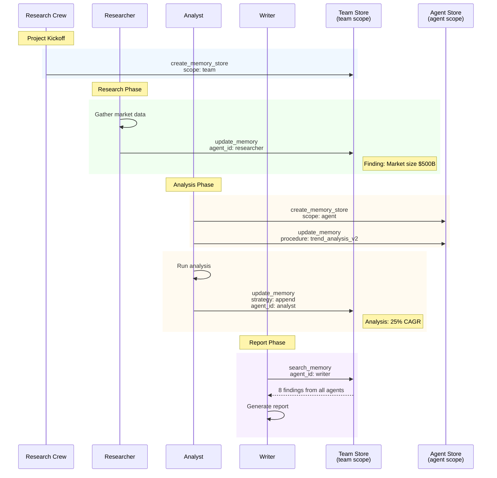
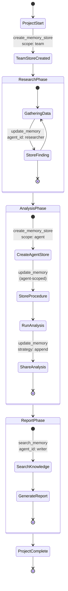

# Story 3: Multi-Agent Research Crew

A team of specialized AI agents collaborating on market research, demonstrating team-scoped and agent-scoped memory sharing patterns.

## Narrative

**Context**: ResearchCo uses a team of specialized AI agents to conduct market research. The team includes a Researcher (gathers data), an Analyst (interprets data), and a Writer (produces reports). They need both shared team knowledge and agent-specific procedural knowledge.

**User Journey**: ResearchCo receives a request to analyze the electric vehicle market:

1. **Team Setup**: A shared team knowledge base is created for this project
2. **Researcher Works**: Gathers market data and stores findings in team knowledge
3. **Analyst Learns**: Develops analysis methodology, stores in agent-specific memory
4. **Knowledge Sharing**: Analyst appends analysis results to team knowledge
5. **Collaboration**: Writer searches team knowledge to access all findings

## Why Memory Observability Matters

- **Collaboration Debugging**: Trace knowledge flow between agents
- **Attribution**: Identify which agent contributed what knowledge via `gen_ai.agent.id`
- **Optimization**: Monitor team knowledge base growth and search efficiency

## Architecture

### Memory Scope Architecture



### Agent Collaboration Sequence



### Knowledge Flow State Diagram



## Technical Breakdown

### Spans Generated

| Step | Agent | Operation | Key Attributes |
|------|-------|-----------|----------------|
| 1 | Crew | `create_memory_store` | scope=team, namespace=project_id |
| 2 | Researcher | `update_memory` | agent_id=researcher |
| 3 | Researcher | `update_memory` | agent_id=researcher |
| 4 | Analyst | `create_memory_store` | scope=agent |
| 5 | Analyst | `update_memory` | type=long_term, agent_id=analyst |
| 6 | Analyst | `update_memory` | strategy=append, agent_id=analyst |
| 7 | Writer | `search_memory` | result_count=8, agent_id=writer |

### Attribute Coverage

| Attribute | Value | Purpose |
|-----------|-------|---------|
| `gen_ai.memory.scope` | `team` | Shared knowledge base |
| `gen_ai.memory.scope` | `agent` | Private procedural memory |
| `gen_ai.memory.type` | `long_term` | Persistent knowledge |
| `gen_ai.memory.update.strategy` | `append` | Add without overwriting |
| `gen_ai.memory.namespace` | `ev_research_2025` | Project isolation |
| `gen_ai.agent.id` | `researcher_agent`, etc. | Attribution |

### Sample Trace Output

```json
{
  "name": "update_memory ev-research-team",
  "kind": "SpanKind.CLIENT",
  "parent_id": "invoke_agent analyst_agent",
  "attributes": {
    "gen_ai.operation.name": "update_memory",
    "gen_ai.provider.name": "milvus",
    "gen_ai.memory.store.id": "store_team_ev_research_2025",
    "gen_ai.memory.store.name": "ev-research-team",
    "gen_ai.memory.id": "analysis_abc123def456",
    "gen_ai.memory.type": "long_term",
    "gen_ai.memory.update.strategy": "append",
    "gen_ai.memory.namespace": "ev_research_2025",
    "gen_ai.agent.id": "analyst_agent"
  }
}
```

## Running the Scenario

```bash
# Activate virtual environment
source ../../../.venv/bin/activate

# Run the scenario
python python/main.py

# With OTLP export
GENAI_MEMORY_USE_OTLP=true python python/main.py

# With query/content capture
GENAI_MEMORY_CAPTURE_CONTENT=true python python/main.py
```

## Expected Output

```
======================================================================
  Story 3: Multi-Agent Research Crew
======================================================================

Scenario: ResearchCo receives a request to analyze the EV market...

======================================================================
  Step 1: Create Team Knowledge Base
======================================================================

  [create_memory_store (team)]
    gen_ai.memory.scope: team
    gen_ai.memory.namespace: ev_research_2025
    ...

======================================================================
  Step 2: Researcher Gathers Data
======================================================================

  [update_memory (researcher finding)]
    gen_ai.agent.id: researcher_agent
    ...

  Researcher stored: 'EV market size reached $500B in 2024'
```

## Multi-Agent Patterns

### Team vs Agent Scope

| Scope | Use Case | Example |
|-------|----------|---------|
| `team` | Shared findings, collaboration | Market research findings |
| `agent` | Private procedures, learned methods | Analysis methodology |

### Update Strategies

| Strategy | Use Case |
|----------|----------|
| `append` | Add new findings to team knowledge |
| `merge` | Combine analysis with existing data |
| `overwrite` | Replace outdated information |

### Attribution Tracking

The `gen_ai.agent.id` attribute enables:
- **Knowledge Attribution**: Who contributed what
- **Debugging**: Which agent's contribution caused issues
- **Analytics**: Agent contribution metrics

## Related Stories

- [Story 4: Multi-Tenant SaaS](../story4_multi_tenant_saas/) - Namespace isolation
- [Story 5: Compliance Audit](../story5_compliance_audit/) - Tracing agent operations
