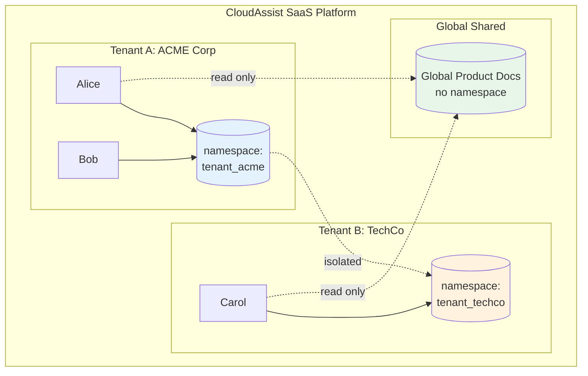
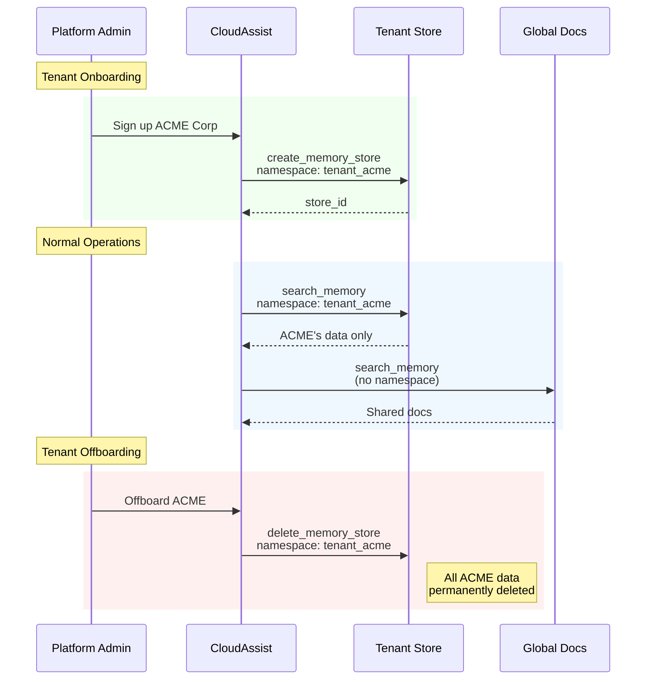
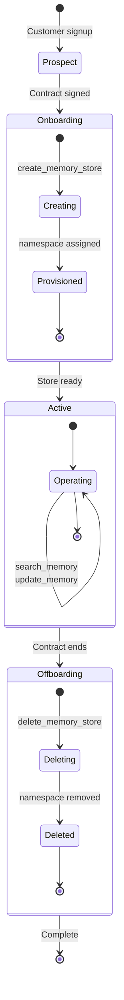

# Story 4: Enterprise Multi-Tenant SaaS

An enterprise SaaS platform demonstrating tenant data isolation via namespaces and store lifecycle management.

## Narrative

**Context**: CloudAssist is a B2B SaaS platform that provides AI assistants to enterprise customers. Each customer (tenant) has isolated data, but all tenants share access to CloudAssist's global product documentation.

**User Journey**:

1. **Tenant Onboarding**: ACME Corp signs up, CloudAssist creates a namespaced store
2. **Data Isolation**: ACME employees use the assistant; all data stored in ACME namespace
3. **Global Knowledge**: ACME employees can search global product docs shared across tenants
4. **Tenant Offboarding**: When ACME's contract ends, their entire namespace is deleted

## Why Memory Observability Matters

- **Isolation Verification**: Ensure tenant data never leaks across namespaces
- **Lifecycle Management**: Track store creation/deletion for capacity planning
- **SLA Monitoring**: Measure search latency per tenant

## Architecture

### Namespace Isolation



### Tenant Lifecycle Sequence



### Store Lifecycle State Diagram



## Technical Breakdown

### Spans Generated

| Step | Operation | Key Attributes |
|------|-----------|----------------|
| 1 | `create_memory_store` | namespace=tenant_acme, scope=global |
| 2 | `update_memory` | namespace=tenant_acme |
| 3 | `search_memory` | namespace=tenant_acme (tenant-scoped) |
| 4 | `search_memory` | (no namespace - global) |
| 5 | `search_memory` | namespace=tenant_techco (isolation demo) |
| 6 | `delete_memory_store` | namespace=tenant_acme |

### Attribute Coverage

| Attribute | Value | Purpose |
|-----------|-------|---------|
| `gen_ai.memory.namespace` | `tenant_acme` | Data isolation |
| `gen_ai.memory.scope` | `global` | Store visibility |
| `gen_ai.memory.store.id` | `store_tenant_acme` | Store identification |
| `gen_ai.memory.store.name` | `tenant-store` | Human-readable name |
| `gen_ai.memory.search.result.count` | varies | Isolation verification |

### Sample Trace Output

```json
{
  "name": "create_memory_store tenant-store",
  "kind": "SpanKind.CLIENT",
  "attributes": {
    "gen_ai.operation.name": "create_memory_store",
    "gen_ai.provider.name": "pinecone",
    "gen_ai.memory.store.name": "tenant-store",
    "gen_ai.memory.store.id": "store_tenant_acme",
    "gen_ai.memory.scope": "global",
    "gen_ai.memory.type": "long_term",
    "gen_ai.memory.namespace": "tenant_acme"
  }
}
```

## Running the Scenario

```bash
# Activate virtual environment
source ../../../.venv/bin/activate

# Run the scenario
python python/main.py

# With OTLP export
GENAI_MEMORY_USE_OTLP=true python python/main.py
```

## Expected Output

```
======================================================================
  Story 4: Enterprise Multi-Tenant SaaS
======================================================================

Scenario: CloudAssist provides AI assistants to enterprise customers...

======================================================================
  Step 1: Tenant Onboarding
======================================================================

  ACME Corp signs up for CloudAssist

  [create_memory_store (tenant)]
    gen_ai.memory.namespace: tenant_acme
    ...

======================================================================
  Step 3: Tenant-Scoped Search
======================================================================

  Alice searches for Q4 projections

  [search_memory (tenant-scoped)]
    gen_ai.memory.namespace: tenant_acme
    gen_ai.memory.search.result.count: 12
    ...

  Found 12 results (all from ACME's namespace)
  Other tenants' data is completely isolated
```

## Isolation Patterns

### Namespace Strategy

| Pattern | Use Case | Example |
|---------|----------|---------|
| Per-tenant namespace | Customer isolation | `tenant_acme` |
| Per-user namespace | User-level isolation | `user_alice_acme` |
| Per-project namespace | Project isolation | `project_q4_2024` |
| No namespace | Shared/global data | Product documentation |

### Verifying Isolation

Use `search.result.count` to verify isolation:
- Same query, different namespaces should return different counts
- Results should only contain data from the querying tenant's namespace

### Store Lifecycle Best Practices

1. **Onboarding**: Create store with namespace before first user access
2. **Operations**: Always include namespace in tenant operations
3. **Offboarding**: Delete entire store to ensure complete cleanup
4. **Audit**: Track all lifecycle events for compliance

## Related Stories

- [Story 3: Multi-Agent Research](../story3_multi_agent_research/) - Team/agent namespaces
- [Story 6: GDPR Lifecycle](../story6_gdpr_lifecycle/) - Complete data deletion
