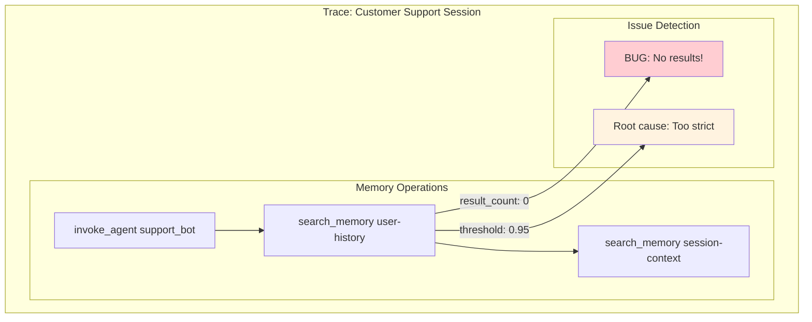
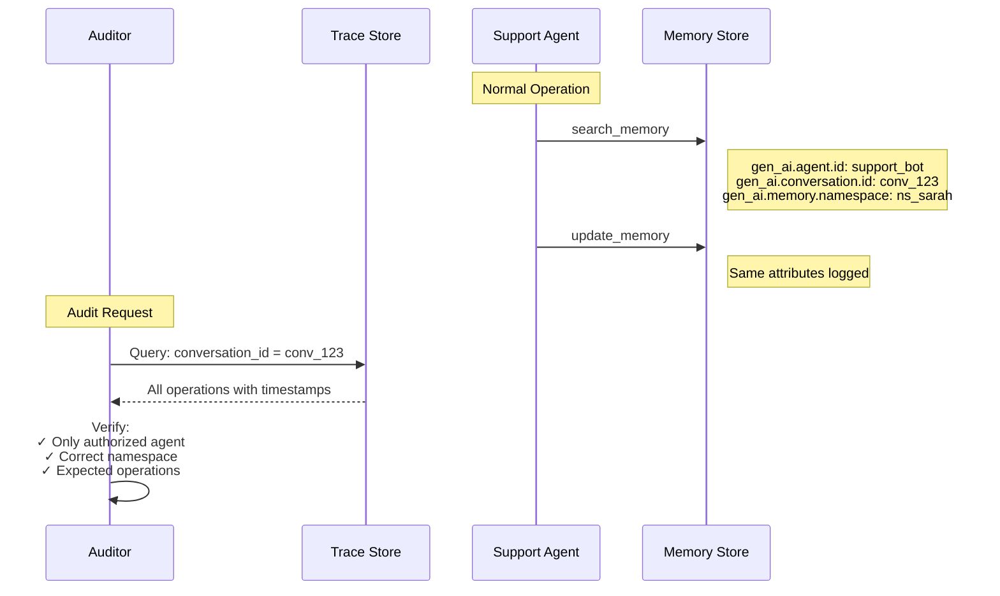
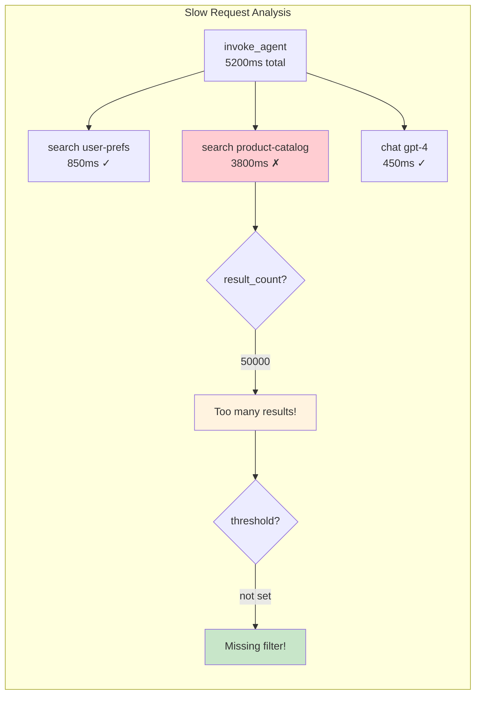

# Story 5: Compliance Audit & Debugging

Demonstrates WHY memory observability matters through three real-world debugging and compliance scenarios.

## Narrative

**Context**: This story demonstrates the practical value of memory operation tracing through scenarios that engineers and compliance officers actually face.

### Scenario A: Debugging Incorrect Agent Response

**Problem**: A customer reports that the support agent "forgot" information they provided earlier in the conversation.

**Investigation**: Trace analysis reveals `search_memory` returned 0 results because `similarity.threshold` was set too high (0.95), filtering out relevant memories that scored 0.7-0.85.

### Scenario B: Compliance Audit

**Requirement**: Auditor needs to verify that user Sarah's data was only accessed by authorized agents during her support session.

**Verification**: Query traces by `conversation.id` and `namespace` to get a complete audit trail of all memory access.

### Scenario C: Performance Debugging

**Problem**: Users report slow responses from the shopping assistant.

**Investigation**: Trace timing reveals `search_memory` on product catalog took 3.8s due to returning 50,000 results without `similarity.threshold` filtering.

## Why Memory Observability Matters

| Scenario | Problem | Solution |
|----------|---------|----------|
| A | Agent "forgot" context | Check `result_count` and `similarity_threshold` |
| B | Compliance verification | Query by `conversation_id`, `namespace`, `agent_id` |
| C | Slow responses | Analyze span durations, check `result_count` |

## Architecture

### Debugging Trace Hierarchy



### Audit Trail Flow



### Performance Analysis



## Technical Breakdown

### Key Debugging Attributes

| Attribute | Type | Debugging Use |
|-----------|------|---------------|
| `gen_ai.memory.search.result.count` | int | Detect 0 results or excessive results |
| `gen_ai.memory.search.similarity.threshold` | double | Verify filter configuration |
| `gen_ai.conversation.id` | string | Link operations in a session |
| `gen_ai.agent.id` | string | Attribute operations to agents |
| `gen_ai.memory.namespace` | string | Verify data access scope |
| `error.type` | string | Categorize failures |
| span duration | timing | Performance analysis |

### Scenario A Trace Analysis

```json
{
  "name": "search_memory conversation-history",
  "duration_ms": 45,
  "attributes": {
    "gen_ai.operation.name": "search_memory",
    "gen_ai.memory.search.result.count": 0,
    "gen_ai.memory.search.similarity.threshold": 0.95,
    "gen_ai.conversation.id": "conv_xyz789"
  },
  "analysis": {
    "issue": "No results returned",
    "root_cause": "similarity_threshold too high (0.95)",
    "fix": "Lower threshold to 0.7"
  }
}
```

### Scenario B Audit Query

```sql
-- Pseudo-SQL for trace querying
SELECT
  timestamp,
  operation_name,
  agent_id,
  memory_store_id,
  namespace,
  result_count
FROM traces
WHERE conversation_id = 'conv_audit_12345'
  AND namespace = 'ns_user_sarah_123'
ORDER BY timestamp;
```

### Scenario C Performance Analysis

```
Trace Timeline:
|-------- 5200ms total --------|
|-- 850ms --|-------- 3800ms --------|-- 450ms --|
  user-prefs    product-catalog (SLOW!)     LLM

Root Cause:
- product-catalog search: result_count = 50000
- No similarity_threshold set
- Processing 50K results added 3+ seconds

Fix:
- Add similarity_threshold: 0.8
- Add limit: 100
- Result: 200ms instead of 3800ms
```

## Running the Scenario

```bash
# Activate virtual environment
source ../../../.venv/bin/activate

# Run the scenario
python python/main.py

# With query/content capture (debugging only)
GENAI_MEMORY_CAPTURE_CONTENT=true python python/main.py

# With OTLP export
GENAI_MEMORY_USE_OTLP=true python python/main.py
```

## Expected Output

```
======================================================================
  Story 5: Compliance Audit & Debugging
======================================================================

This story demonstrates WHY memory observability matters...

======================================================================
  Scenario A: Debugging Incorrect Agent Response
======================================================================

Problem: A customer reports that the support agent "forgot" information...

  [BUG] search_memory with threshold=0.95 (too high)

  Trace reveals the issue:
  --------------------------------------------------
  invoke_agent support_bot
  └── search_memory conversation-history
      ├── gen_ai.memory.search.result.count: 0  ← BUG: No results!
      └── gen_ai.memory.search.similarity.threshold: 0.95  ← Too high!

Root Cause Analysis:
  - search_memory returned 0 results
  - similarity.threshold was set to 0.95 (extremely strict)
  - Relevant memories exist but scored 0.7-0.85 (filtered out)

Fix: Lower similarity_threshold to 0.7
```

## Best Practices

### For Debugging

1. **Always set `search.result.count`**: Helps detect empty or excessive results
2. **Log `similarity.threshold`**: Makes filter configuration visible
3. **Use `conversation.id`**: Links all operations for session debugging
4. **Check span durations**: Identifies performance bottlenecks

### For Compliance

1. **Set `agent.id` on all operations**: Enables access attribution
2. **Use `namespace` consistently**: Verifies data scope
3. **Keep `conversation.id` stable**: Links session operations
4. **Export to durable trace store**: Enables historical audits

### For Performance

1. **Monitor `search.result.count`**: Large counts indicate missing filters
2. **Track span durations**: Identifies slow operations
3. **Review `similarity.threshold`**: Too low = slow, too high = no results
4. **Use appropriate indexes**: Reduces search latency

## Related Stories

- [Story 1: Customer Support](../story1_customer_support/) - Session debugging
- [Story 6: GDPR Lifecycle](../story6_gdpr_lifecycle/) - Deletion auditing
