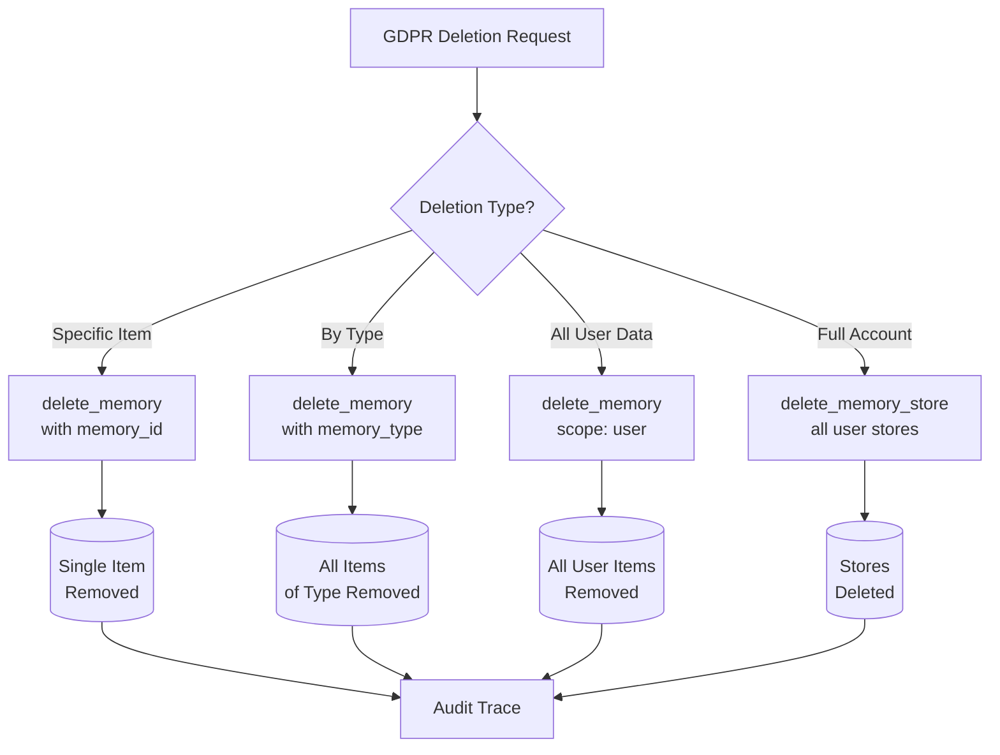
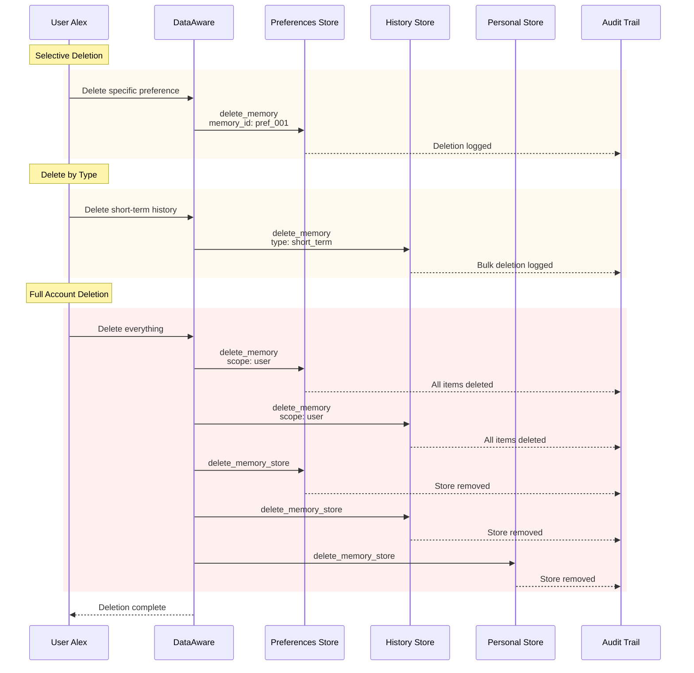
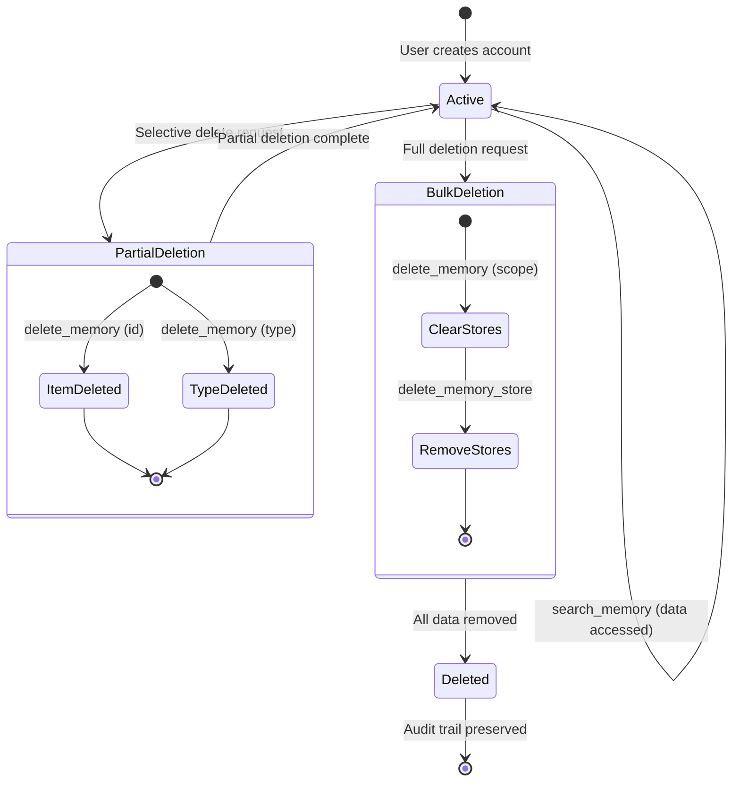

# Story 6: User Data Lifecycle (Privacy/GDPR)

Complete GDPR "right to be forgotten" compliance demonstration, from selective deletion to full data removal.

## Narrative

**Context**: DataAware is an AI service that takes privacy seriously. They implement full GDPR compliance, including the "right to be forgotten." This story walks through the complete data lifecycle from storage to deletion.

**User Journey**: Alex is a DataAware user who exercises various deletion rights:

1. **Selective Deletion**: Delete a specific embarrassing preference
2. **Delete by Type**: Remove all short-term conversation history
3. **Bulk Deletion**: Delete all preferences data
4. **Full Removal**: Delete entire user account and all stores

## Why Memory Observability Matters

- **Deletion Verification**: Prove that data was actually deleted
- **Audit Trail**: Maintain records of deletion requests and completions
- **Cascading Deletes**: Track all stores/items affected by a deletion request

## Architecture

### Deletion Hierarchy



### GDPR Deletion Sequence



### Data Lifecycle State



## Technical Breakdown

### Deletion Operations

| Operation | Use Case | Key Attributes |
|-----------|----------|----------------|
| `delete_memory` + `memory_id` | Delete specific item | scope, memory_id |
| `delete_memory` + `memory_type` | Delete by type | scope, memory_type |
| `delete_memory` (scope only) | Bulk delete all items | scope |
| `delete_memory_store` | Remove entire store | store_id, store_name |

### Spans Generated

| Phase | Operation | Key Attributes |
|-------|-----------|----------------|
| 1 | `delete_memory` | memory_id=pref_embarrassing_001, scope=user |
| 2 | `delete_memory` | memory_type=short_term, scope=user |
| 3 | `delete_memory` | scope=user (bulk) |
| 4 | `delete_memory` | scope=user (history store) |
| 5 | `delete_memory_store` | store_id (preferences) |
| 6 | `delete_memory_store` | store_id (history) |
| 7 | `delete_memory_store` | store_id (personal) |

### Cascading Deletion Trace

```json
{
  "trace_id": "gdpr_delete_alex_123",
  "name": "gdpr_deletion_request",
  "attributes": {
    "user.id": "user_alex_789",
    "deletion.type": "full_account",
    "gdpr.request_id": "gdpr_abc123"
  },
  "spans": [
    {
      "name": "delete_memory user-preferences",
      "attributes": {
        "gen_ai.operation.name": "delete_memory",
        "gen_ai.memory.store.id": "store_user_alex_789_prefs",
        "gen_ai.memory.id": "pref_embarrassing_001",
        "gen_ai.memory.scope": "user"
      }
    },
    {
      "name": "delete_memory conversation-history",
      "attributes": {
        "gen_ai.operation.name": "delete_memory",
        "gen_ai.memory.store.id": "store_user_alex_789_history",
        "gen_ai.memory.type": "short_term",
        "gen_ai.memory.scope": "user"
      }
    },
    {
      "name": "delete_memory_store user-preferences",
      "attributes": {
        "gen_ai.operation.name": "delete_memory_store",
        "gen_ai.memory.store.id": "store_user_alex_789_prefs"
      }
    }
  ]
}
```

## Running the Scenario

```bash
# Activate virtual environment
source ../../../.venv/bin/activate

# Run the scenario
python python/main.py

# With OTLP export for audit storage
GENAI_MEMORY_USE_OTLP=true python python/main.py
```

## Expected Output

```
======================================================================
  Story 6: User Data Lifecycle (Privacy/GDPR)
======================================================================

Scenario: DataAware is an AI service that takes privacy seriously...

======================================================================
  Phase 1: Selective Memory Deletion
======================================================================

  Alex: 'Delete my embarrassing preference about cat videos'

  [delete_memory (specific item)]
    gen_ai.operation.name: delete_memory
    gen_ai.memory.id: pref_embarrassing_001
    gen_ai.memory.scope: user

======================================================================
  Phase 5: Delete Memory Stores (Complete Removal)
======================================================================

  [delete_memory_store (preferences)]
    gen_ai.memory.store.id: store_user_alex_789_prefs
    ...

  Deleted stores:
    ✓ store_user_alex_789_prefs
    ✓ store_user_alex_789_history
    ✓ store_user_alex_789_personal

  User Alex's data completely removed from system
```

## GDPR Compliance Features

### Deletion Types

| Type | Attribute Pattern | Result |
|------|-------------------|--------|
| Selective | `scope` + `memory_id` | Single item deleted |
| By Type | `scope` + `memory_type` | All items of type deleted |
| Bulk | `scope` only | All items deleted |
| Complete | `delete_memory_store` | Store removed |

### Audit Trail Requirements

For GDPR compliance, traces should include:

1. **Request Identification**: `gdpr.request_id`
2. **User Identification**: `user.id`
3. **Deletion Scope**: `gen_ai.memory.scope`
4. **Affected Items**: `gen_ai.memory.id` (when specific)
5. **Affected Stores**: `gen_ai.memory.store.id`
6. **Timestamp**: Automatic via span timing

### Compliance Report Generation

```python
def generate_deletion_report(trace_id: str) -> dict:
    """Generate GDPR compliance report from trace."""
    return {
        "trace_id": trace_id,
        "user_id": "user_alex_789",
        "deletion_requests": [
            {"type": "specific", "memory_id": "pref_001"},
            {"type": "bulk", "scope": "user"},
        ],
        "stores_deleted": [
            "store_user_alex_789_prefs",
            "store_user_alex_789_history",
            "store_user_alex_789_personal"
        ],
        "completion_time": "2025-01-07T12:00:00Z",
        "verified": True
    }
```

## Related Stories

- [Story 2: Shopping Assistant](../story2_shopping_assistant/) - User scope deletion
- [Story 4: Multi-Tenant SaaS](../story4_multi_tenant_saas/) - Tenant offboarding
- [Story 5: Compliance Audit](../story5_compliance_audit/) - Audit trail verification
