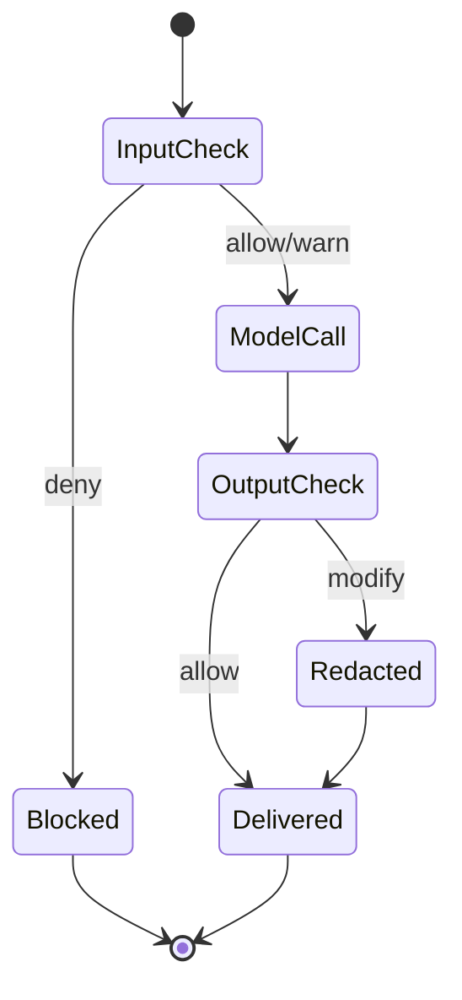
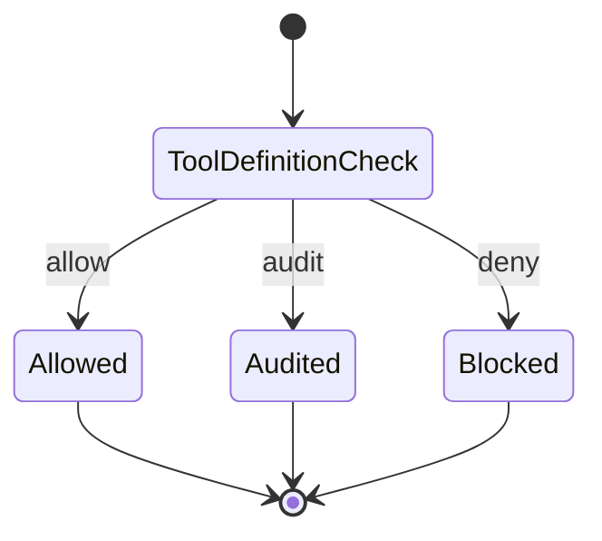
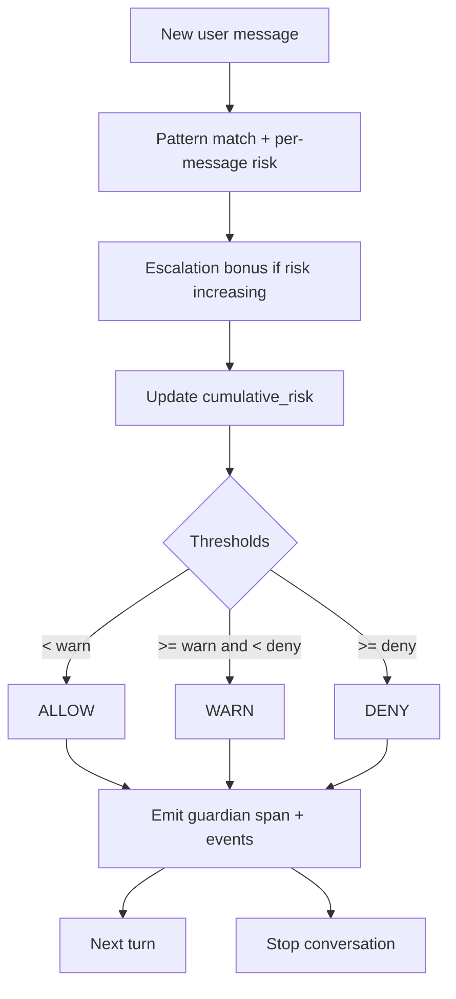
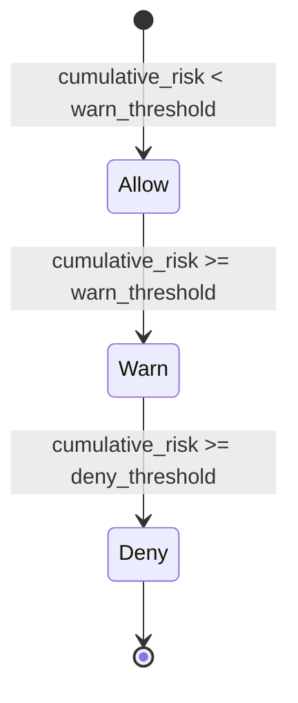

# Story Scenarios (`prototype/stories`)

Runnable story scenarios that correspond to a subset of `prototype_story.plan.md`.
Each scenario emits `apply_guardrail` spans + `gen_ai.security.finding` events and is designed to be easy to explore in trace backends.

## Quickstart

From the repo root:

```bash
cd prototype

# Install deps (AppInsights/Laminar/Langfuse/Console)
python3 -m venv .venv-appinsights
source .venv-appinsights/bin/activate
pip install -r requirements-appinsights.txt

# Credentials (optional)
cp .env.example .env.local

# Run
python stories/story_runner.py --list
python stories/story_runner.py --story 5 --exporters console
python stories/story_runner.py --all --exporters appinsights
```

For Traceloop, use the separate Traceloop venv (to avoid OTel version conflicts):

```bash
cd prototype
python3 -m venv .venv
source .venv/bin/activate
pip install -r requirements-traceloop.txt
python stories/story_runner.py --story 10 --exporters traceloop
```

## Environment variables

- Prefer copying `prototype/.env.example` → `prototype/.env.local`.
- `stories/story_runner.py` will also load `prototype/stories/.env.local` if present.

Required per-backend:
- App Insights: `APPLICATIONINSIGHTS_CONNECTION_STRING`
- Laminar: `LMNR_PROJECT_API_KEY`
- Langfuse: `LANGFUSE_PUBLIC_KEY`, `LANGFUSE_SECRET_KEY`, `LANGFUSE_BASE_URL`
- Traceloop: `TRACELOOP_API_KEY`

Optional demo knobs:
- `OTEL_DEMO_CAPTURE_GUARDIAN_CONTENT=true` to opt-in to `gen_ai.security.content.*.value` capture (off by default).

## Mermaid diagrams

### Runner flow (flowchart)

```mermaid
flowchart TD
  A[stories/story_runner.py CLI] --> B[Load .env.local (stories or prototype)]
  B --> C[configure_tracing via otel_bootstrap.py]
  C --> D[Patch GuardianTracer -> global TracerProvider]
  D --> E{Which stories?}
  E -->|--story| F[Import story module + run]
  E -->|--all| G[Iterate STORY_REGISTRY]
  F --> H[Emit spans + finding events]
  G --> H
  H --> I[force_flush]
  I --> J[Backends: AppInsights / Laminar / Langfuse / Traceloop / Console]
```

### Story 5 (multi-tenant) flow + state

```mermaid
flowchart TD
  A[Request: tenant_id + user_input] --> B[chat shared_model span]
  B --> C[apply_guardrail Tenant Input Policy]
  C -->|allow/warn| D[LLM call (simulated)]
  C -->|deny| Z[Stop]
  D --> E[apply_guardrail Tenant Output Policy]
  E -->|allow| F[Return response]
  E -->|modify| G[Redact PII] --> F
```



### Story 7 (multi-agent) flow + tool validation state

```mermaid
flowchart TD
  A[create_agent] --> B[apply_guardrail Tool Schema Validator\n(target=tool_definition)]
  B -->|allow/audit| C[Agent created]
  B -->|deny| X[Agent creation blocked]

  C --> D[invoke_agent Coordinator]
  D --> E[apply_guardrail Agent Delegation Guard\n(target=tool_call)]
  E -->|deny| Y[Stop]
  E -->|warn/allow| F[apply_guardrail Inter-Agent Message Guard\n(target=message)]
  F -->|deny| Y
  F -->|allow| G[invoke_agent Target Agent]
  G --> H[execute_tool]
  H --> I[apply_guardrail Agent Tool Guard\n(target=tool_call)]
  I -->|deny| Y
  I -->|allow| J[Complete]
```



### Story 10 (progressive jailbreak) scoring + decision state





